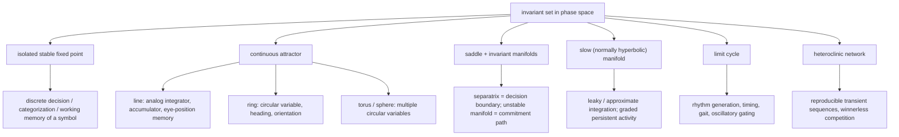
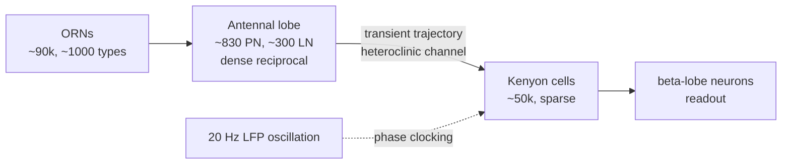
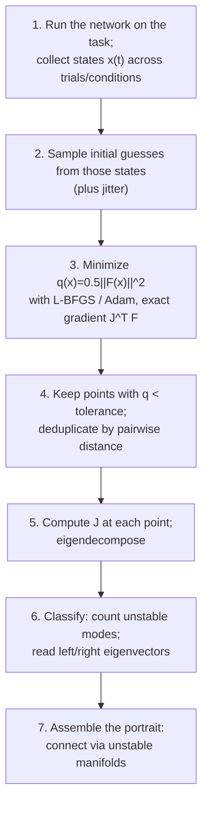

# Unit 01 — Dynamical Systems as the Lingua Franca
{: .no_toc }

> **The conversion in one line:** a circuit's differential equations → a phase portrait whose invariant sets *are* the computational primitives.

## Contents
{: .no_toc .text-delta }

1. TOC
{:toc}

---

## Orientation

There is a reason the circuits→algorithms literature converged on dynamical systems rather than, say, Boolean logic or Bayesian graphical models. It is not that neurons are especially "dynamical." It is that dynamical systems theory supplies the one thing the conversion requires: a well-defined *equivalence relation* on implementations. Two circuits with different neuron counts, different synaptic weights, different biophysics, and different single-cell tuning are the same algorithm when their flows are topologically conjugate — when there is a homeomorphism carrying trajectories of one onto trajectories of the other, preserving time's arrow. Marr's levels stop being a philosophical taxonomy and become a quotient map. The algorithmic level is $\mathcal{M} / \sim$, where $\mathcal{M}$ is the space of implementations and $\sim$ is conjugacy (or, more honestly, conjugacy restricted to the attracting sets the system actually visits).

That reframing has teeth. It tells you which features of a circuit are *load-bearing* and which are decoration. Eigenvalues are decoration; the *sign* of their real parts is load-bearing. The exact location of a saddle is decoration; the topology of its stable manifold — which is to say, the decision boundary — is load-bearing. Synaptic weights are wildly degenerate across networks trained on the same task; the count and type of fixed points are not. This is the empirical content of the "universality" results: independently trained RNNs of different architectures converge on the same phase portrait while sharing essentially nothing at the weight level. The phase portrait is the algorithm.

By the end of this unit you should be able to (i) look at a rate equation and predict, before simulating, what computational primitives it can host; (ii) run the Sussillo–Barak fixed-point-finding procedure on a trained network or a fitted model and read an algorithm off the resulting eigenspectra; (iii) tell the difference — mechanistically and experimentally — between a system that computes by settling and one that computes by *not* settling, which is the distinction that decides how you should think about the locust antennal lobe; and (iv) recognize when a proposed circuit mechanism is structurally unstable, and therefore a claim about biology that carries a debt the modeler has not paid.

---

## 1. The phase portrait as the primary object

Write the circuit as an autonomous ODE on $\mathbb{R}^N$:

$$\dot{x} = F(x; \theta, u), \qquad x \in \mathbb{R}^N,$$

with $\theta$ the parameters (synaptic weights, time constants, neuromodulator levels) and $u$ the inputs. The canonical firing-rate form is

$$\tau \dot{x} = -x + W\phi(x) + B u,$$

where $x_i$ is a synaptic-current-like variable, $\phi$ a monotone saturating nonlinearity, and $W$ the recurrent weight matrix. Nothing below depends on this specific form; it is just the workhorse.

The **flow** $\Phi^t: \mathbb{R}^N \to \mathbb{R}^N$ maps an initial condition to its state at time $t$. The **phase portrait** is the partition of state space into orbits, together with the invariant sets they accumulate on. The objects that matter:

- **Fixed points** $x^*$ with $F(x^*) = 0$.
- **Periodic orbits** (limit cycles).
- **Invariant manifolds**: the stable manifold $W^s(x^*) = \{x : \Phi^t x \to x^*, t\to+\infty\}$ and unstable manifold $W^u(x^*)$ (same with $t \to -\infty$).
- **Connecting orbits**: heteroclinic ($W^u(p) \cap W^s(q) \neq \emptyset$, $p\neq q$) and homoclinic ($p=q$).
- **Attractors and their basins**.

The reason this is the right primary object, rather than the trajectory you happened to record, is that trajectories are a function of initial conditions and inputs — they are *data*. The phase portrait is the *generator* of all possible data. When you fit an RNN to neural recordings and then go looking for fixed points, you are converting data back into a generator. That is the whole game.

**Topological conjugacy.** Two flows $\Phi^t$ on $M$ and $\Psi^t$ on $N$ are topologically conjugate if there is a homeomorphism $h: M \to N$ with $h \circ \Phi^t = \Psi^t \circ h$ for all $t$. Conjugate systems have the same number of fixed points, of the same stability types, with basins related by $h$, and the same connection graph. They may differ in every quantitative respect. *That mismatch is exactly the abstraction gap between implementation and algorithm.* A course on climbing Marr's ladder is, technically, a course on computing conjugacy classes from noisy partial observations of $F$.

---

## 2. Fixed points and linearization

Near $x^*$, set $x = x^* + \delta$:

$$\dot{\delta} = J\delta + \tfrac{1}{2}D^2F(x^*)[\delta,\delta] + O(\|\delta\|^3), \qquad J_{ij} = \frac{\partial F_i}{\partial x_j}\bigg|_{x^*}.$$

For the rate model, $J = \frac{1}{\tau}\left(-I + W\,\mathrm{diag}[\phi'(x^*)]\right)$. Two things follow immediately and are worth internalizing: the *effective* connectivity that governs local dynamics is the weight matrix gain-modulated by the local slope of the nonlinearity, $W\Phi'$; and because $\Phi' = \mathrm{diag}[\phi'(x^*)]$ depends on the operating point, *the same circuit has different linearizations in different regimes*. Neuromodulation, adaptation, and input-driven changes in mean drive are all, from this vantage, ways of moving $J$ around — and hence ways of switching algorithms without touching a synapse.

**Hartman–Grobman.** If $J$ is hyperbolic (no eigenvalue with zero real part), the flow near $x^*$ is topologically conjugate to $\dot\delta = J\delta$ on a neighborhood. So for hyperbolic fixed points the eigenspectrum determines the local conjugacy class outright: the invariants are $(n_s, n_u, n_c) = (\#\{\mathrm{Re}\lambda<0\}, \#\{\mathrm{Re}\lambda>0\}, 0)$. Everything else — rates, oscillation frequencies, eigenvector geometry — is quantitative dressing that matters for *fit* but not for *classification*.

Which is precisely why the interesting neural cases are the non-hyperbolic ones. Line attractors, ring attractors, and bifurcation points all have $\mathrm{Re}\,\lambda = 0$ modes. Hartman–Grobman is silent there; you need the center manifold theorem and normal forms (§5). The computationally interesting neural dynamics live exactly where the easy theorem stops applying. This is not a coincidence — a system with only hyperbolic fixed points can only categorize; to hold an analog value or to keep time you need neutrality.

**Discrete time.** For an RNN update $x_{t+1} = h(x_t)$ define $F(x) = h(x) - x$. Fixed points are the same object; stability is governed by the eigenvalues of $\partial h/\partial x$ relative to the unit circle rather than the imaginary axis. Everything below translates with $\lambda \mapsto e^{\lambda \Delta t}$, "zero real part" $\mapsto$ "modulus one."

**Eigenvector geometry: read-in and read-out.** Write $J = \sum_a \lambda_a\, r_a l_a^\top$ with biorthogonal left/right eigenvectors, $l_a^\top r_b = \delta_{ab}$. Then the linearized response to input is

$$\delta(t) = \sum_a e^{\lambda_a t}\,(l_a^\top \delta_0)\, r_a \;+\; \sum_a \int_0^t e^{\lambda_a (t-s)}\, \big(l_a^\top B u(s)\big)\, r_a\, ds.$$

Read this carefully, because it is the single most useful formula in the reverse-engineering toolkit. The **left** eigenvector $l_a$ is the *selection vector* for mode $a$: it says which input directions the mode listens to. The **right** eigenvector $r_a$ is the *activity pattern* the mode expresses. A mode with $\lambda_a \approx 0$ integrates $l_a^\top B u(s)$ and stores it along $r_a$. When we get to Mante et al. in Unit 02, "context-dependent selection" will turn out to mean *the left eigenvector of the slow mode rotates with context while the right eigenvector does not*. Gating, implemented as geometry.

Note that $l_a$ and $r_a$ coincide only if $J$ is normal. Cortical connectivity is emphatically not normal, and the gap between $l$ and $r$ is where transient amplification lives (§4.3, Exercise 8).

---

## 3. A taxonomy of computational primitives

Here is the dictionary. It is worth memorizing, because the craft of this course is largely the craft of recognizing which entry you are looking at.



### 3.1 Stable fixed points: categorization

A hyperbolic sink is a discrete memory or a completed decision. The computational content is not the fixed point but its **basin**: the map (initial condition + input history) $\mapsto$ (which sink) is a classifier. Hopfield networks are the pure case; two-alternative decision circuits built from mutual inhibition are the working case. The number of accessible sinks bounds the cardinality of the output alphabet.

Diagnostic signature: activity that settles and stays, with trial-to-trial variability that collapses over time (contracting dynamics squeeze noise), and a discontinuous dependence of the endpoint on inputs near the separatrix.

### 3.2 Saddles and separatrices: decision boundaries

For a two-attractor system, the boundary between basins is $W^s(\text{saddle})$, a codimension-1 invariant manifold. This is the geometric object corresponding to "the decision boundary." Three consequences, all testable:

1. **Critical slowing.** Near the saddle, $\|\dot x\|$ is small; ambiguous stimuli produce long, slow, variable trajectories. Reaction-time distributions inherit a long tail with logarithmic divergence: from $\dot\delta = \lambda_u \delta$ with $\delta_0$ the (noise-set) distance off the stable manifold, escape time is $T \approx \lambda_u^{-1}\ln(\Theta/|\delta_0|)$, so $T$ grows like $\ln(1/|\delta_0|)$ and, for $\delta_0$ approximately Gaussian, $T$ has an exponentially-tailed distribution.
2. **Variance geometry.** Trial-to-trial variance is maximal along $W^u$ and minimal along $W^s$ — the system amplifies noise in exactly one direction. Recording enough trials, you can *see* the unstable manifold in the covariance structure.
3. **Perturbation asymmetry.** A pulse along $W^u$ near the saddle changes the outcome; the same-magnitude pulse along $W^s$ does nothing. This is the cleanest causal test of "you have found the decision boundary."

### 3.3 Line attractors: analog memory and integration

A **line attractor** is a one-dimensional continuum of fixed points, attracting transversally and neutral along its length. It is the canonical implementation of an analog integrator: input pushes the state along the line; when input stops, the state stays. The oculomotor velocity-to-position integrator is the textbook instance (Seung 1996); parametric working memory is another.

We derive the tuning condition in §4 because it deserves its own section: it is the single best worked example of how a computational requirement (neutral stability) translates into a knife-edge algebraic condition (an eigenvalue at exactly 1) and hence into a biological problem (fine-tuning).

### 3.4 Ring attractors: circular variables

If the manifold of fixed points is a circle, the stored variable is an angle. The classical construction (Ben-Yishai et al. 1995; Zhang 1996; Skaggs et al. 1995) uses translation-invariant connectivity on a ring, $W_{ij} = J_0 + J_1\cos(\theta_i-\theta_j)$, so that the system has an exact $SO(2)$ symmetry. Above a critical $J_1$ the homogeneous state loses stability to the $\cos\theta$ Fourier mode and a bump forms; the symmetry guarantees a whole circle of bumps, i.e. the neutral direction is *forced by symmetry rather than tuned*.

This is a genuinely important structural point and it recurs throughout the course: **symmetry converts fine-tuning into genericity.** A continuum of fixed points is non-generic in the space of all vector fields, but perfectly generic in the space of $SO(2)$-equivariant vector fields. The biological question then becomes not "how is the eigenvalue tuned?" but "how is the symmetry enforced?" — and in the *Drosophila* central complex, the answer is anatomical: the E-PG/P-EN ring is a physically ring-shaped circuit with translation-invariant projections (Kim et al. 2017; Green et al. 2017; Turner-Evans et al. 2017).

Higher-genus versions: the torus $T^2$ for grid cells (Gardner et al. 2022), the sphere or $SO(3)$ for 3D heading.

### 3.5 Slow manifolds: approximate integration

Real integrators are leaky. The honest object is a **normally hyperbolic invariant manifold** (NHIM) $\mathcal{M}$: attraction transverse to $\mathcal{M}$ is fast (rate $\lambda_\perp$), flow along $\mathcal{M}$ is slow (rate $\epsilon \ll |\lambda_\perp|$). The dynamics separate:

$$\dot{s} = \epsilon\, g(s) \quad \text{(along } \mathcal{M}), \qquad \dot{z} = \lambda_\perp z + \dots \quad \text{(transverse)}.$$

Fenichel's theorem says something beautiful and, for our purposes, decisive: **a NHIM persists under small perturbation of the vector field, but the dynamics on it need not.** So if you perturb a line attractor, the *manifold* survives — you still see a one-dimensional curve of slow activity, still recover a 1-D latent in your PCA — but the *neutrality* does not: the continuum of fixed points shatters into isolated fixed points and slow drift between them. This is the sharpest statement of why line attractors are geometrically robust and functionally fragile, and why "we found a 1-D manifold" is much weaker evidence than "we found an integrator."

### 3.6 Limit cycles: rhythm and timing

An isolated periodic orbit. Computationally: clocks, CPGs, gait, and — importantly for sensory systems — oscillatory reference frames against which spike phase can code (locust AL 20 Hz LFP oscillation, hippocampal theta phase precession). Born generically from a **Hopf bifurcation** (a complex-conjugate pair crossing the imaginary axis) or from a **SNIC** (saddle-node on an invariant circle), and the two are distinguishable experimentally: Hopf gives fixed frequency with amplitude growing as $\sqrt{\mu}$; SNIC gives fixed amplitude with frequency growing as $\sqrt{\mu}$, i.e. arbitrarily long periods near onset. That is the type-II/type-I excitability dichotomy, and it is a genuine algorithmic difference: a SNIC oscillator can encode input strength as *rate* across an unbounded range; a Hopf oscillator cannot.

### 3.7 Heteroclinic channels: reproducible transients

This is the entry that matters most for the olfaction thread, and §6 is devoted to it. The short version: a sequence of saddles $S_1 \to S_2 \to \cdots \to S_K$ connected by heteroclinic orbits, each saddle having exactly one unstable direction pointing at the next. The system spends a long time near each saddle (because approach is exponential) and transits quickly between them. The observable is a *reproducible sequence of metastable states* — not a fixed point, not a cycle, but a structured transient. The computation is performed by the trajectory itself, not by where it ends up.

---

## 4. Why a line attractor needs an eigenvalue at exactly 1

### 4.1 The linear derivation

Take the linear rate network

$$\tau \dot{x} = -x + Wx + Bu.$$

Then $\dot x = A x + \frac{1}{\tau}Bu$ with $A = (W - I)/\tau$. If $W$ has eigenvalue $\lambda_a$ with right/left eigenvectors $m_a, n_a$ ($n_a^\top m_b = \delta_{ab}$), then $A$ has eigenvalue $(\lambda_a - 1)/\tau$ with the same eigenvectors. Projecting, $\kappa_a := n_a^\top x$ obeys

$$\tau\dot{\kappa}_a = -(1-\lambda_a)\kappa_a + n_a^\top B u.$$

So mode $a$ is a leaky integrator with effective time constant

$$\boxed{\;\tau_a^{\text{eff}} = \frac{\tau}{1-\lambda_a}\;}$$

Three regimes: $\lambda_a < 1$ gives a leak; $\lambda_a > 1$ gives instability; and $\lambda_a = 1$ *exactly* gives $\tau\dot\kappa_a = n_a^\top Bu$, i.e.

$$\kappa_a(t) = \kappa_a(0) + \frac{1}{\tau}\int_0^t n_a^\top B u(s)\,ds.$$

A perfect integrator, with the memory stored along $m_a$ and the input selected by $n_a$. The condition for the *existence* of the line attractor is that $\lambda_a = 1$ on the nose, with $\mathrm{Re}\,\lambda_b < 1$ for all other modes so that everything transverse decays. One real eigenvalue pinned to a single point of the complex plane: **codimension one**. The set of $W$ that support a perfect integrator is a measure-zero hypersurface in weight space.

### 4.2 The cost of being off the surface

Perturb: $W \to W + \varepsilon\Delta$. First-order perturbation theory for a simple eigenvalue gives

$$\delta\lambda_a = \varepsilon\,\frac{n_a^\top \Delta\, m_a}{n_a^\top m_a}.$$

(Derivation: write $(W+\varepsilon\Delta)(m_a + \varepsilon m^{(1)}) = (\lambda_a + \varepsilon\delta\lambda_a)(m_a + \varepsilon m^{(1)})$, collect $O(\varepsilon)$, left-multiply by $n_a^\top$; the $m^{(1)}$ terms cancel because $n_a^\top(W - \lambda_a I) = 0$.)

Hence the memory decays (or explodes) with

$$\tau^{\text{eff}}_a = \frac{\tau}{1 - \lambda_a} = -\frac{\tau}{\delta\lambda_a} = -\frac{\tau}{\varepsilon}\cdot\frac{n_a^\top m_a}{n_a^\top \Delta m_a}.$$

Now put numbers on it. A neural time constant $\tau \approx 20$ ms; the oculomotor integrator holds eye position for tens of seconds, say $\tau^{\text{eff}} \gtrsim 20$ s. Then

$$|\delta\lambda| \lesssim \frac{\tau}{\tau^{\text{eff}}} = \frac{0.02}{20} = 10^{-3}.$$

**The recurrent gain must be tuned to one part in a thousand.** That is the fine-tuning problem, and it is not a modeler's fussiness: it is a hard constraint on any biological implementation, since synapses turnover, gain drifts with neuromodulator state, and cells die.

Two refinements that matter.

*Scaling with $N$.* If $\Delta$ has i.i.d. entries of variance $1/N$ and $m,n$ are unit-norm, then $\mathrm{Var}(n^\top\Delta m) = \sum_{ij} n_i^2 m_j^2/N = 1/N$, so $|\delta\lambda| \sim \varepsilon/\sqrt{N}$ when $n^\top m = O(1)$. Large networks are *more* robust to unstructured synaptic noise, by $\sqrt{N}$. This is a real and underappreciated point: distributed integrators average away i.i.d. perturbations. It does *not* help against systematic perturbations (a global gain change), where $n^\top \Delta m = O(1)$ regardless of $N$.

*Non-normality.* The denominator $n_a^\top m_a$ is the reciprocal of the eigenvalue condition number. For strongly non-normal $W$ — near-defective, as random asymmetric matrices tend to be — $n_a^\top m_a$ can be tiny, and the sensitivity blows up correspondingly. A "robust because large" integrator built on a non-normal $W$ can be far more fragile than the $\sqrt{N}$ estimate suggests.

### 4.3 The nonlinear statement, and what actually persists

In a nonlinear network the line attractor is a curve $\gamma$ with $F|_\gamma = 0$. Differentiating along the curve, $J(\gamma(s))\gamma'(s) = 0$: the Jacobian automatically has a zero eigenvalue with eigenvector tangent to $\gamma$. So the tuning is not "per point"; it is the demand that the zero set of $F$ contain a curve rather than isolated points, which is a codimension-$(N-1)$ condition on the map $F: \mathbb{R}^N \to \mathbb{R}^N$ and hence non-generic.

Under perturbation, by Fenichel, the *manifold* persists as a NHIM; the flow on it becomes $\dot s = \epsilon g(s)$. Generic $g$ has isolated zeros, so the continuum degrades into: a few isolated fixed points sitting on a 1-D slow manifold, with drift between them. If $g$ has no zeros, you get uniform drift (systematic leak); if it has many, you get a "sticky" quasi-continuum. Every experimentally reported line attractor is really one of these.

**Engineering fixes, and what each buys.**

| Mechanism | Idea | Reference |
|---|---|---|
| Negative feedback / error correction | Use a slow feedback signal to correct gain online, converting tuning into a control problem | Seung, Lee, Reis & Tank (2000) |
| Bistable units | Replace neutral stability with many discrete stable states; a staircase approximates a continuum, robust to $O(1)$ perturbation but with quantization error | Koulakov, Raghavachari, Kepecs & Lisman (2002); Goldman et al. (2003) |
| Short-term synaptic facilitation | Slow synaptic variable supplies the near-zero eigenvalue from *cellular* time constants rather than from network gain | Mongillo, Barak & Tsodyks (2008) |
| Feedforward / non-normal transients | Nilpotent (Schur-triangular) $W$: all eigenvalues zero, no tuning at all, yet activity persists for $\sim N\tau$ because $e^{Wt}$ is polynomial | Goldman (2009) |

The last one is conceptually the most interesting and is Exercise 8. It breaks the naive inference "long timescale $\Rightarrow$ eigenvalue near 1." A purely feedforward chain has *every* eigenvalue at zero and still integrates for $N$ time constants. If you find slow dynamics in data and go looking for a tuned eigenvalue, you may be looking for the wrong thing.

---

## 5. Bifurcations and normal forms: the mechanism of algorithmic change

A bifurcation is a parameter value at which the phase portrait changes conjugacy class. Since the phase portrait is the algorithm, **a bifurcation is a change of algorithm.** Neuromodulation, attention, task context, and learning are all, formally, motion in parameter space; the question "does this modulation change the computation or just its gain?" is the question "did we cross a bifurcation?"

The center manifold theorem is what makes this tractable. At a bifurcation, the spectrum splits into $n_c$ critical modes (zero real part) and the rest (strictly stable, say). There is a local invariant $n_c$-dimensional center manifold $W^c$, tangent to the critical eigenspace, to which the dynamics is attracted at rate $|\mathrm{Re}\lambda_{\text{stable}}|$. All the interesting dynamics reduces to a flow on $W^c$ — and $n_c$ is almost always 1 or 2. A 10,000-neuron circuit undergoing a Hopf bifurcation is, near onset, a two-dimensional system. **Dimensionality reduction is not a data-analysis convenience here; it is a theorem.**

Then a further coordinate change (near-identity, polynomial) removes all non-resonant terms, leaving the **normal form**. The codimension-1 catalogue:

| Bifurcation | Normal form | Computational reading |
|---|---|---|
| Saddle-node | $\dot s = \mu + s^2$ | Birth/death of a discrete state; "ghost" gives slow ramp for $\mu \lesssim 0$ |
| Transcritical | $\dot s = \mu s - s^2$ | Exchange of stability; ubiquitous in Lotka–Volterra-type competition |
| Pitchfork (sym.) | $\dot s = \mu s - s^3$ | Onset of categorization: one state becomes two |
| Hopf | $\dot z = (\mu + i\omega)z - c|z|^2 z$ | Onset of rhythm; supercritical $\Rightarrow$ amplitude $\propto\sqrt{\mu}$ |
| SNIC | $\dot\theta = \mu - \cos\theta$ | Integrator $\to$ oscillator; period $\propto \mu^{-1/2}$ near onset |
| Homoclinic | — | Limit cycle destroyed by collision with a saddle; period $\propto \ln(1/\mu)$ |

Three payoffs worth stating explicitly.

**(a) The ghost of a saddle-node is a timer.** With $\dot s = \mu + s^2$, $\mu > 0$ small, the passage time through the bottleneck is
$$T = \int_{-\infty}^{\infty}\frac{ds}{\mu + s^2} = \frac{\pi}{\sqrt{\mu}}.$$
So a system just past a saddle-node produces long, tunable, reproducible delays. This is one of the two natural ways to build a neural timer (the other is a slow manifold), and it predicts a specific $\mu^{-1/2}$ scaling that is experimentally checkable.

**(b) Normal forms are the algorithmic content.** Any circuit undergoing a supercritical pitchfork is, near onset, *the same algorithm* — a symmetric two-way categorizer with $\sqrt{\mu}$ separation between the alternatives. The biophysics enters only through the map from biological parameters to $(\mu, c)$. This is the cleanest instance of the course thesis: the normal form is the equivalence class; the circuit is a representative.

**(c) Unfoldings tell you what to perturb.** The unfolding of the pitchfork, $\dot s = \mu s - s^3 + h$, shows that any symmetry-breaking bias $h$ converts the pitchfork into a saddle-node plus a continuous branch. A "categorical" circuit with a slight bias has a fundamentally different response profile near threshold. If you want to test whether a decision circuit is really at a pitchfork, look at the $h$-dependence of the hysteresis loop width: it should close as $h^{2/3}$.

---

## 6. Heteroclinic channels and winnerless competition

### 6.1 The problem this solves

Attractor computation has an awkward feature: to compute, you must settle, and settling takes time and destroys information about the stimulus's history. The locust antennal lobe does not settle. Odor presentation drives projection-neuron populations along a *reproducible, stimulus-specific trajectory* lasting on the order of a second; the state at any given time is a reliable function of (odor, time since onset), but the system does not converge to an odor-specific fixed point during the stimulus — and the trajectory's *speed* is lowest at times when discriminability is highest. Mazor & Laurent (2005) made this quantitative: decoding accuracy for odor identity is maximal during the transient, at the moments of *slowest* trajectory speed, and degrades in the fixed-point-like period at the end of a long stimulus. The dynamics is the code.

The dynamical object that does this is the heteroclinic channel.

### 6.2 Construction: generalized Lotka–Volterra and the winnerless competition principle

Rabinovich and colleagues (2001) proposed the following for the AL. Let $a_i \geq 0$ be the activity of PN group $i$, with

$$\tau \dot{a}_i = a_i\Big(\sigma_i(S) - \sum_{j} \rho_{ij}\, a_j\Big) + \eta_i(t), \qquad \rho_{ii} = 1,$$

where $S$ indexes the stimulus, $\sigma_i(S)$ is the stimulus-dependent growth rate, $\rho_{ij}$ is the (crucially **asymmetric**) inhibitory competition matrix supplied by the local interneurons, and $\eta$ is small noise. This is generalized Lotka–Volterra. Note the structure that does all the work: each hyperplane $\{a_i = 0\}$ is invariant, because $\dot a_i \propto a_i$. That is what makes heteroclinic connections generic here (§ Spotlight).

Symmetric $\rho$ gives a Lyapunov function and hence "winner-take-all": the system settles on the strongest competitor. **Asymmetric $\rho$ removes the Lyapunov function**, and the system can instead cycle through partial winners without any of them winning — *winnerless competition*. The trajectory is a sequence of saddle visits, each saddle being a state in which one group (or a small set) dominates.

### 6.3 The May–Leonard core, worked

Strip to three groups with cyclic structure (May & Leonard 1975):

$$\dot a_1 = a_1(1 - a_1 - \alpha a_2 - \beta a_3), \quad \dot a_2 = a_2(1 - a_2 - \alpha a_3 - \beta a_1), \quad \dot a_3 = a_3(1 - a_3 - \alpha a_1 - \beta a_2).$$

Single-species fixed points: $e_1 = (1,0,0)$ and cyclic images. Linearize at $e_1$. Writing $a = e_1 + \delta$, the Jacobian is upper-triangular in the ordering $(\delta_1,\delta_2,\delta_3)$,

$$J(e_1) = \begin{pmatrix} -1 & -\alpha & -\beta \\ 0 & 1-\beta & 0 \\ 0 & 0 & 1-\alpha\end{pmatrix},$$

with eigenvalues $-1$ (along its own axis $a_1$), $1-\beta$ (along $a_2$), and $1-\alpha$ (along $a_3$).

Take $\alpha < 1 < \beta$. Then $e_1$ is a saddle: stable along $a_1$ and along $a_2$ ($1-\beta<0$), unstable along $a_3$ ($1-\alpha>0$). Species 1 is invaded by species 3, which is invaded by 2, which is invaded by 1. The unstable manifold of $e_1$ within the invariant plane $\{a_2=0\}$ runs to $e_3$: a heteroclinic connection. Cyclically, $e_1\to e_3 \to e_2 \to e_1$ is a **heteroclinic cycle** — rock-paper-scissors. (Do the same computation at $e_2$ and $e_3$ to confirm the orientation; it is easy to get backwards, and getting it backwards inverts every prediction about sequence order.)

**When is the cycle attracting?** Define the **saddle value** at each vertex,

$$\nu = \frac{|\lambda^{s}|}{\lambda^{u}} = \frac{\beta - 1}{1 - \alpha},$$

the ratio of the leading contracting rate (transverse to the cycle) to the expanding rate. A trajectory passing near a saddle at transverse distance $z$ leaves at distance $\sim z^{\nu}$ (Exercise 5). Around the whole cycle the distance maps as $z \mapsto C z^{\nu_1\nu_2\nu_3}$; for the symmetric case $z \mapsto Cz^{\nu^3}$. The cycle is asymptotically stable iff $\prod_k \nu_k > 1$, here

$$\left(\frac{\beta-1}{1-\alpha}\right)^3 > 1 \iff \beta - 1 > 1 - \alpha \iff \alpha + \beta > 2,$$

which is exactly May and Leonard's classical condition. Below it, the cycle repels and the interior coexistence fixed point attracts.

**This is the whole theory of the channel in one inequality.** $\nu > 1$ means "contraction toward the sequence beats expansion along it" — trajectories starting near the sequence are funneled *onto* it. The set of trajectories in a tube around the connections is the **stable heteroclinic channel**: reproducible, noise-robust, and dissipative. The sequence of states is an attractor even though no state in it is.

### 6.4 Noise sets the clock

Deterministically, a trajectory approaching a saddle takes infinite time. With noise of amplitude $\eta$, it approaches only to distance $\sim\eta$ before being kicked out along $W^u$, and the residence time near saddle $k$ is

$$T_k \simeq \frac{1}{\lambda_k^u}\ln\frac{1}{\eta}.$$

This is a strong, distinctive, falsifiable prediction: **dwell times scale logarithmically in the inverse noise amplitude and inversely with the local unstable eigenvalue.** A limit cycle's period does not depend on noise this way; a driven feedforward chain's dwell times are set by the drive, not by the noise. The log-dependence is weak, which is a *feature*: it means the sequence timing is reproducible across a wide range of noise levels — a property you want in a sensory code and would struggle to get from a mechanism whose timing depended linearly on a noisy quantity.

The residence times also depend on $\sigma_i(S)$ through the eigenvalues, which is how stimulus identity and intensity modulate both *which* channel is entered and *how fast* it is traversed.

### 6.5 The locust link, stated carefully



The claim on the table is: *odor identity is encoded by which heteroclinic channel the AL enters, and the downstream readout (Kenyon cells) samples the channel's instantaneous state.* Several structural facts line up with this.

- The AL has dense reciprocal PN–LN connectivity with GABAergic inhibition — the substrate for an asymmetric competition matrix $\rho$.
- PN population trajectories are reproducible across trials, odor-specific, and long relative to $\tau_{\text{membrane}}$ — the hallmark of a channel rather than of independent single-cell dynamics.
- Decoding is best *during* the transient, and the trajectory's speed is non-uniform, decelerating near the metastable states — the saddle-visit signature.
- KCs are high-threshold coincidence detectors sampling small numbers of PNs within an oscillation cycle (Jortner, Farivar & Laurent 2007; Perez-Orive et al. 2002): they implement precisely the "read out the instantaneous state, not the endpoint" operation that a channel code requires.

**The algorithmic conversion.** From implementation ($\sim$800 PNs with messy reciprocal inhibition) to algorithm: *the AL maps an odor onto a reproducible path in a low-dimensional state space; identity is the choice of path; the readout is a sequence of instantaneous high-dimensional snapshots, each taken within one oscillation cycle.* That is a genuinely different algorithm from "the AL is an attractor network that denoises an input pattern," and it makes different predictions: about the value of long stimuli (they should *degrade* discriminability once the transient ends — observed), about the effect of stimulus offset (an off-transient, i.e. a *second* channel — observed), about mixtures (channel selection should be competitive and history-dependent — Broome, Jayaraman & Laurent 2006 on odor sequences), and about noise dependence of timing (logarithmic — largely untested, and a fine thesis project).

**Where to keep your skepticism.** A heteroclinic channel and a slowly-relaxing high-dimensional linear transient with non-normal amplification can look extremely similar in trial-averaged PN data. Both give reproducible, odor-specific, non-settling trajectories. Distinguishing them requires the properties that are *nonlinear and topological*: the existence of discrete metastable dwell states with switching (not smooth flow), the log-in-noise dwell scaling, and the response to perturbation delivered at a switch point versus mid-dwell. Exercise 7 asks you to design that experiment. This is the sharp end of the craft: two dynamical hypotheses, both consistent with the summary statistics everyone reports, separated only by measurements nobody has made yet.

---

## 7. Opening the black box: the Sussillo–Barak procedure

You have a network — trained, or fitted to data — and you want its phase portrait. Sussillo & Barak (2013) turned this into a numerical algorithm, and it has become the field's default reverse-engineering method.

### 7.1 The objective

Define the speed-squared functional

$$q(x) = \tfrac{1}{2}\|F(x)\|^2, \qquad F(x) = \begin{cases}\frac{1}{\tau}\left(-x + W\phi(x) + Bu\right) & \text{(continuous)}\\ h(x) - x & \text{(discrete RNN)}\end{cases}$$

with the input $u$ held at a fixed value of interest (typically zero, or a task-relevant constant — this matters: you are computing the phase portrait *of the autonomous system at that input*, and different inputs give different portraits). Fixed points are exactly the global minima with $q = 0$. Then:

$$\nabla q = J^\top F, \qquad \nabla^2 q = J^\top J + \sum_k F_k \nabla^2 F_k.$$

At a true fixed point $F=0$, so $\nabla^2 q = J^\top J \succeq 0$: fixed points are always minima of $q$, *regardless of their stability*. This is the key trick. Gradient descent on $q$ finds saddles and sources as happily as sinks — which ordinary forward simulation cannot do, and which is essential, since the saddles are the decision boundaries.

### 7.2 Slow points

Local minima with $q$ small but nonzero are **slow points**. They are not artifacts; they are the interesting part. Two things generate them:

1. **Ghosts.** Just past a saddle-node bifurcation there is no fixed point, but there is a region of near-zero speed that functions as one on the timescale of the task. The system computes "as if" the fixed point existed.
2. **Slow manifolds.** A line attractor that has degraded (§4.3) yields a continuum of slow points; the finder returns a cloud of them strung along a curve. A cloud of slow points with a one-dimensional geometry and a single near-zero eigenvalue at each is the fingerprint of an approximate integrator.

Beware the critical points of $q$ where $F \neq 0$ but $J^\top F = 0$, i.e. $F$ lies in $\ker J^\top = (\mathrm{im}\, J)^\perp$. These exist and are usually *saddles of $q$*, not minima. Optimizers can stall there. Always check the Hessian of $q$, or at minimum verify that the returned point survives a small random perturbation followed by re-optimization.

### 7.3 The algorithm



Details that make the difference between this working and not:

- **Sample guesses from the trajectory distribution.** Fixed points relevant to the computation are near states the network actually visits. Uniform sampling of $\mathbb{R}^N$ finds nothing useful.
- **Use the exact gradient** $\nabla q = J^\top F$; for the standard rate model $J = \frac{1}{\tau}(-I + W\,\mathrm{diag}\,\phi'(x))$, cheap to form. Autodiff also works and is what `FixedPointFinder` (Golub & Sussillo 2018) does.
- **Deduplicate** with a distance threshold; optimizers from nearby seeds land on the same point.
- **Tolerance is a modeling choice, not a numerical one.** "Slow" means slow *relative to the task timescale*. Report $q$ in units of $(\text{state change per task epoch})^2$, not raw.
- **Trace the unstable manifolds**: from each saddle, integrate forward from $x^* \pm \epsilon r_u$ for each unstable right eigenvector $r_u$. This is what turns a list of points into a phase portrait — the connection graph is the algorithm.

### 7.4 Reading the eigenspectrum

At each recovered point, linearize and classify:

| Spectrum (continuous time) | Object | Computation |
|---|---|---|
| all $\mathrm{Re}\lambda < 0$ | sink | discrete memory / completed decision |
| exactly one $\mathrm{Re}\lambda > 0$ | index-1 saddle | decision boundary; $W^s$ is the separatrix |
| one $\lambda \approx 0$, rest stable | point on a line attractor / slow manifold | analog memory, integration |
| two $\lambda \approx 0$ (complex pair, $\mathrm{Re}\approx 0$) | ring attractor / near-Hopf | circular variable / incipient rhythm |
| several $\mathrm{Re}\lambda > 0$ | high-index saddle | typically a "junction" organizing multiple routes |
| chain of index-1 saddles with $W^u(S_k)\to S_{k+1}$ | heteroclinic channel | sequence generation |

And then the read-in/read-out reading of §2: the left eigenvector of the near-zero mode tells you *what the memory listens to*; the right eigenvector tells you *how it is written into population activity*. When a trained network solves a context-dependent task, you will find that the left eigenvector rotates with context — which is Unit 02's punchline, discovered with Unit 01's tool.

One caution about scope. This procedure characterizes the *autonomous* dynamics at fixed input. Many tasks are solved by input-driven dynamics where no autonomous fixed point is ever approached. The honest generalization is to compute the portrait as a function of $u$ and watch the fixed points move, appear, and annihilate — i.e. to compute a bifurcation diagram in input space. That is usually where the algorithm actually lives.

---

## Mathematical structure spotlight

> **Genericity is relative to the space you perturb within.**
>
> The recurring technical motif of this unit is that "structurally unstable" is not an absolute property. A continuum of fixed points is non-generic among all smooth vector fields on $\mathbb{R}^N$ — perturb and it shatters. But among $SO(2)$-equivariant vector fields it is generic: a group orbit of a fixed point is a fixed-point set, forced by symmetry, not tuned. Likewise, heteroclinic *cycles* are non-generic in general (the intersection $W^u(p)\cap W^s(q)$ is a transversality condition that fails under perturbation when $\dim W^u + \dim W^s < N + 1$) — yet in Lotka–Volterra systems they are robust, because the coordinate hyperplanes $\{a_i = 0\}$ are *invariant*, so a connection lying inside such a hyperplane is a connection between a source and a sink *within that lower-dimensional invariant subspace*, where the transversality condition is easily met. The invariant subspace does for heteroclinic cycles exactly what the symmetry group does for continuous attractors.
>
> The unifying statement: let $\mathcal{V}$ be the space of vector fields compatible with the circuit's structural constraints (symmetries, non-negativity, invariant subspaces, sign constraints from Dale's law, sparsity). Genericity should always be assessed in $\mathcal{V}$, not in $C^\infty(\mathbb{R}^N,\mathbb{R}^N)$. This converts a purely mathematical question into a biological one — *what constraints does the anatomy impose?* — and it is one of the highest-yield questions you can ask about any circuit. When someone objects that your model is fine-tuned, the correct response is not to shrug; it is to exhibit the constraint set $\mathcal{V}$ within which it is generic, and then to defend that constraint set anatomically.
>
> Related objects that will recur: the Grassmannian of invariant subspaces (Unit 02), normal hyperbolicity and Fenichel theory, equivariant bifurcation theory, and the classification of codimension-1 and -2 bifurcations. See [`../structures/README.md`](../structures/README.md) for the running index of mathematical structures this course leans on.

---

## What this buys you as an algorithmist

Concretely, the conversions this unit unlocks:

1. **Weights $\to$ primitives.** Given $W$ and an operating point, compute $J = -I + W\Phi'$ and read off which primitives the circuit can host from the spectrum's relation to the critical line. Eigenvalue near 1: memory. Complex pair crossing: rhythm. Nothing near: a feedforward filter with a settling transient.
2. **Trained network $\to$ algorithm.** Run the fixed-point finder, classify, trace unstable manifolds, produce the connection graph. That graph is the algorithm, and it is comparable across networks with incomparable weights.
3. **Neural recordings $\to$ candidate mechanism.** From trial-to-trial variance geometry (Unit 02's machinery) infer unstable directions; from response-time distributions infer saddle proximity; from dwell-time statistics infer whether you are looking at a channel ($\log 1/\eta$) or a cycle (noise-independent) or driven dynamics (stimulus-locked).
4. **Robustness audit.** Any claimed continuous attractor comes with a debt: what pins the neutral direction? Symmetry, feedback correction, cellular bistability, or nothing? "Nothing" is a prediction of drift, and drift is measurable.
5. **Modulation $\to$ algorithm switching.** Identify the parameters that move the system across bifurcation boundaries. This converts "dopamine increases gain" into "dopamine moves the circuit across a pitchfork at $g=g_c$, converting graded integration into binary categorization" — a statement with content.
6. **A principled null.** Before claiming a fancy primitive, check whether a non-normal linear transient reproduces the data. It very often does, and this is the most common way circuits→algorithms papers overclaim.

---

## Reading

### Core

- David Sussillo & Omri Barak (2013), "Opening the Black Box: Low-Dimensional Dynamics in High-Dimensional Recurrent Neural Networks," *Neural Computation* 25(3):626–649.
- H. Sebastian Seung (1996), "How the brain keeps the eyes still," *Proceedings of the National Academy of Sciences* 93(23):13339–13344.
- Mikhail I. Rabinovich, Alexander Volkovskii, Pablo Lecanda, Ramón Huerta, Henry D. I. Abarbanel & Gilles Laurent (2001), "Dynamical Encoding by Networks of Competing Neuron Groups: Winnerless Competition," *Physical Review Letters* 87(6):068102.
- Ofer Mazor & Gilles Laurent (2005), "Transient Dynamics versus Fixed Points in Odor Representations by Locust Antennal Lobe Projection Neurons," *Neuron* 48(4):661–673.
- Eugene M. Izhikevich (2007), *Dynamical Systems in Neuroscience: The Geometry of Excitability and Bursting*, MIT Press. (Chapters 3–6 for bifurcations of neural models; the best bridge from biophysics to normal forms.)
- Steven H. Strogatz (2015), *Nonlinear Dynamics and Chaos*, 2nd ed., Westview Press. (You will not need it, but its bifurcation chapters are the standard shared vocabulary.)

### Deeper

- John Guckenheimer & Philip Holmes (1983), *Nonlinear Oscillations, Dynamical Systems, and Bifurcations of Vector Fields*, Springer. (Center manifolds, normal forms, invariant manifolds — the reference.)
- Yuri A. Kuznetsov (2004), *Elements of Applied Bifurcation Theory*, 3rd ed., Springer.
- Christopher K. R. T. Jones (1995), "Geometric Singular Perturbation Theory," in *Dynamical Systems*, Lecture Notes in Mathematics 1609, Springer. (Fenichel theory, done properly.)
- Martin Krupa & Ian Melbourne (1995), "Asymptotic stability of heteroclinic cycles in systems with symmetry," *Ergodic Theory and Dynamical Systems* 15(1):121–147.
- Robert M. May & Warren J. Leonard (1975), "Nonlinear Aspects of Competition Between Three Species," *SIAM Journal on Applied Mathematics* 29(2):243–253.
- Valentin S. Afraimovich, Mikhail I. Rabinovich & Pablo Varona (2004), "Heteroclinic contours in neural ensembles and the winnerless competition principle," *International Journal of Bifurcation and Chaos* 14(4):1195–1208.
- Mikhail I. Rabinovich, Ramón Huerta, Pablo Varona & Valentin S. Afraimovich (2008), "Transient Cognitive Dynamics, Metastability, and Decision Making," *PLoS Computational Biology* 4(5):e1000072.
- Mark S. Goldman (2009), "Memory without Feedback in a Neural Network," *Neuron* 61(4):621–634.
- Mark S. Goldman, Joseph H. Levine, Guy Major, David W. Tank & H. Sebastian Seung (2003), "Robust Persistent Neural Activity in a Model Integrator with Multiple Hysteretic Dendrites per Neuron," *Cerebral Cortex* 13(11):1185–1195.
- Alexei A. Koulakov, Sridhar Raghavachari, Adam Kepecs & John E. Lisman (2002), "Model for a robust neural integrator," *Nature Neuroscience* 5(8):775–782.
- H. Sebastian Seung, Daniel D. Lee, Ben Y. Reis & David W. Tank (2000), "Stability of the Memory of Eye Position in a Recurrent Network of Conductance-Based Model Neurons," *Neuron* 26(1):259–271.
- Gianluigi Mongillo, Omri Barak & Misha Tsodyks (2008), "Synaptic Theory of Working Memory," *Science* 319(5869):1543–1546.
- Niru Maheswaranathan, Alex Williams, Matthew Golub, Surya Ganguli & David Sussillo (2019), "Universality and individuality in neural dynamics across large populations of recurrent networks," *Advances in Neural Information Processing Systems* 32.
- Matthew D. Golub & David Sussillo (2018), "FixedPointFinder: A Tensorflow toolbox for identifying and characterizing fixed points in recurrent neural networks," *Journal of Open Source Software* 3(31):1003.

### Historical

- Rafael Ben-Yishai, R. Lev Bar-Or & Haim Sompolinsky (1995), "Theory of orientation tuning in visual cortex," *PNAS* 92(9):3844–3848.
- Kechen Zhang (1996), "Representation of Spatial Orientation by the Intrinsic Dynamics of the Head-Direction Cell Ensemble: A Theory," *Journal of Neuroscience* 16(6):2112–2126.
- William E. Skaggs, James J. Knierim, Hemant S. Kudrimoti & Bruce L. McNaughton (1995), "A Model of the Neural Basis of the Rat's Sense of Direction," *Advances in Neural Information Processing Systems* 7:173–180.
- Stephen C. Cannon, David A. Robinson & Shihab Shamma (1983), "A proposed neural network for the integrator of the oculomotor system," *Biological Cybernetics* 49(2):127–136.
- John J. Hopfield (1982), "Neural networks and physical systems with emergent collective computational abilities," *PNAS* 79(8):2554–2558.
- Haim Sompolinsky, Andrea Crisanti & Hans-Jurgen Sommers (1988), "Chaos in Random Neural Networks," *Physical Review Letters* 61(3):259–262.
- Gilles Laurent, Mark Stopfer, Rainer W. Friedrich, Misha I. Rabinovich, Alexander Volkovskii & Henry D. I. Abarbanel (2001), "Odor Encoding as an Active, Dynamical Process: Experiments, Computation, and Theory," *Annual Review of Neuroscience* 24:263–297.
- Javier Perez-Orive, Ofer Mazor, Glenn C. Turner, Stijn Cassenaer, Rachel I. Wilson & Gilles Laurent (2002), "Oscillations and Sparsening of Odor Representations in the Mushroom Body," *Science* 297(5580):359–365.
- Ron Jortner, S. Sarah Farivar & Gilles Laurent (2007), "A Simple Connectivity Scheme for Sparse Coding in an Olfactory System," *Journal of Neuroscience* 27(7):1659–1669.
- Bede M. Broome, Vivek Jayaraman & Gilles Laurent (2006), "Encoding and Decoding of Overlapping Odor Sequences," *Neuron* 51(4):467–482.
- Sung Soo Kim, Hervé Rouault, Shaul Druckmann & Vivek Jayaraman (2017), "Ring attractor dynamics in the *Drosophila* central brain," *Science* 356(6340):849–853.

---

## Exercises
**1. (★★) The tuning bill.** For $\tau\dot x = -x + Wx + Bu$ with $W$'s leading eigenvalue $\lambda_1$ perturbed by $W\to W+\varepsilon\Delta$: (a) derive $\delta\lambda_1$ from scratch; (b) suppose $\Delta_{ij}$ are i.i.d. with mean zero and variance $1/N$, and $m_1,n_1$ are unit-norm with $n_1^\top m_1 = c$. Give the distribution of $\delta\lambda_1$ and hence of the memory time constant. (c) How large must $N$ be for a network with per-synapse relative noise $\varepsilon = 0.05$ and $c = 1$ to hold a memory for 20 s with $\tau = 20$ ms in 68% of realizations? (d) Redo (c) for $c = 0.05$ (strongly non-normal) and comment.

<details markdown="1"><summary>Solution</summary>

**(a)** Let $Wm = \lambda m$, $n^\top W = \lambda n^\top$, $n^\top m = c \ne 0$. Posit $(W+\varepsilon\Delta)(m+\varepsilon m^{(1)}+\cdots) = (\lambda+\varepsilon\lambda^{(1)}+\cdots)(m+\varepsilon m^{(1)}+\cdots)$. Order $\varepsilon^0$ is the unperturbed problem. Order $\varepsilon^1$:
$$W m^{(1)} + \Delta m = \lambda m^{(1)} + \lambda^{(1)} m \;\Longrightarrow\; (W-\lambda I)m^{(1)} = \lambda^{(1)}m - \Delta m.$$
Left-multiply by $n^\top$; since $n^\top(W-\lambda I) = 0$, the left side vanishes, giving $0 = \lambda^{(1)}c - n^\top\Delta m$, so
$$\delta\lambda = \varepsilon\lambda^{(1)} = \varepsilon\,\frac{n^\top\Delta m}{n^\top m}.$$

**(b)** $n^\top \Delta m = \sum_{ij} n_i m_j \Delta_{ij}$ is a sum of $N^2$ independent zero-mean terms with $\mathrm{Var} = \sum_{ij}n_i^2m_j^2\cdot\frac1N = \frac1N\|n\|^2\|m\|^2 = \frac{1}{N}$. By CLT, $n^\top\Delta m \approx \mathcal{N}(0, 1/N)$, so
$$\delta\lambda \sim \mathcal{N}\!\left(0, \frac{\varepsilon^2}{c^2 N}\right), \qquad \tau^{\text{eff}} = -\frac{\tau}{\delta\lambda}.$$
$\tau^{\text{eff}}$ is (minus) the reciprocal of a Gaussian — heavy-tailed, and with a sign that is positive (decay) or negative (runaway instability) with probability $1/2$ each. This is important: unstructured perturbation of a line attractor makes it unstable half the time. Real integrators must therefore have a stabilizing mechanism, not merely small perturbations.

**(c)** Require $|\delta\lambda| \le \tau/\tau^{\text{eff}} = 10^{-3}$ with probability $\approx 0.68$, i.e. one standard deviation: $\varepsilon/(c\sqrt N) \le 10^{-3}$. With $\varepsilon = 0.05$, $c=1$: $\sqrt N \ge 50$, so $N \ge 2500$. Comfortably biological — the $\sqrt N$ averaging is a real and powerful robustness mechanism against i.i.d. synaptic noise. (Note it does nothing about *correlated* perturbations: a 1% global gain change gives $\delta\lambda \approx 0.01$ irrespective of $N$, and a $\tau^{\text{eff}}$ of 2 s.)

**(d)** With $c = 0.05$: $\sqrt N \ge 10^{-3\,-1}\cdot\varepsilon/c$… explicitly, $\sqrt{N} \ge \varepsilon/(c\cdot 10^{-3}) = 0.05/(0.05\times10^{-3}) = 1000$, so $N \ge 10^6$. Non-normality costs you a factor $c^{-2}$ in the required network size. The moral: the *condition number* of the memory eigenvalue, not the network size, is the right robustness statistic. A large network built from a strongly non-normal $W$ is not automatically robust, and $c = n^\top m$ is directly computable from any model you are handed. Always compute it.

</details>

**2. (★) Mutual inhibition becomes a categorizer.** Consider $\tau\dot x_i = -x_i + \phi(I - w x_j)$, $\phi = \tanh$, $(i,j) \in \{(1,2),(2,1)\}$, $w>0$, $I$ fixed. Find the symmetric fixed point condition, linearize, identify the symmetric and antisymmetric eigenmodes and their eigenvalues, and locate the pitchfork. Show that the bifurcation is supercritical for $\phi=\tanh$ and $I=0$.

<details markdown="1"><summary>Solution</summary>

Fixed points satisfy $x_1 = \phi(I - wx_2)$, $x_2 = \phi(I - wx_1)$. The symmetric solution $x_1=x_2=x^*$ solves $x^* = \phi(I - wx^*)$, which for monotone bounded $\phi$ has a unique root. Jacobian:
$$J = \frac{1}{\tau}\begin{pmatrix}-1 & -w\phi' \\ -w\phi' & -1\end{pmatrix}, \qquad \phi' = \phi'(I - wx^*).$$
This is symmetric-circulant on two elements, so eigenvectors are $v_+ = (1,1)/\sqrt2$ (symmetric) and $v_-=(1,-1)/\sqrt2$ (antisymmetric), with
$$\lambda_\pm = \frac{-1 \mp w\phi'}{\tau}.$$
$\lambda_+ < 0$ always (for $w,\phi'>0$): the symmetric mode is stable. $\lambda_- = (-1 + w\phi')/\tau$ crosses zero at
$$\boxed{w\,\phi'(I - wx^*) = 1.}$$
For $I=0$, $\phi=\tanh$: $x^*=0$, $\phi'(0)=1$, so $w_c = 1$. Because the system has the $\mathbb{Z}_2$ symmetry $x_1\leftrightarrow x_2$, the bifurcation of the antisymmetric mode is a pitchfork, not a transcritical.

Criticality: put $s = (x_1-x_2)/2$, $\sigma = (x_1+x_2)/2$. On the center manifold at $I=0$, $\sigma = O(s^2)$ and by the $s\to-s$ symmetry $\sigma$ is even in $s$ while $\dot s$ is odd, so $\tau\dot s = -s + \frac{1}{2}[\phi(-w(\sigma - s)) - \phi(-w(\sigma+s))]$. Expanding $\phi(u)=u-u^3/3+O(u^5)$ and using $\sigma=O(s^2)$:
$$\tau\dot s = (w-1)s - \frac{w^3}{3}s^3 + O(s^5).$$
The cubic coefficient is negative, so the pitchfork is **supercritical**: for $w$ just above 1 two stable states appear at $s^* = \pm\sqrt{3(w-1)}/w^{3/2}$, separated by $\propto\sqrt{w-w_c}$. The circuit continuously transitions from "reports the average" to "reports a category," and the transition point is set by the product of inhibition strength and single-neuron gain — meaning a neuromodulator that changes gain alone can flip the algorithm.

</details>

**3. (★★) Fixed-point finding on a chaotic RNN.** Implement the Sussillo–Barak procedure in numpy/scipy for $\tau\dot x = -x + W\phi(x)$, $\phi=\tanh$, $W_{ij}\sim\mathcal{N}(0,g^2/N)$, $N=200$. For $g = 0.8$ and $g=1.8$: sample initial conditions from a long simulation, minimize $q$, deduplicate, and histogram $\log_{10} q$ and the number of unstable eigenvalues per recovered point. Predict the qualitative difference *before* you run it, then check.

<details markdown="1"><summary>Solution</summary>

```python
import numpy as np
from scipy.optimize import minimize

def make(N=200, g=1.8, seed=0):
    rng = np.random.default_rng(seed)
    return rng.normal(0, g/np.sqrt(N), (N, N))

def F(x, W):                      # tau = 1
    return -x + W @ np.tanh(x)

def J(x, W):
    return -np.eye(len(x)) + W * (1 - np.tanh(x)**2)[None, :]

def q_and_grad(x, W):
    f = F(x, W)
    return 0.5 * f @ f, J(x, W).T @ f

def simulate(W, T=400.0, dt=0.05, seed=1):
    rng = np.random.default_rng(seed)
    x = rng.normal(0, 1, W.shape[0]); traj = []
    for _ in range(int(T/dt)):
        x = x + dt * F(x, W)
        traj.append(x.copy())
    return np.array(traj[len(traj)//2:])      # discard transient

def find_points(W, traj, n_seeds=300, jitter=0.5, tol=1e-8, seed=2):
    rng = np.random.default_rng(seed)
    idx = rng.integers(0, len(traj), n_seeds)
    out = []
    for i in idx:
        x0 = traj[i] + jitter * rng.normal(0, 1, W.shape[0])
        r = minimize(q_and_grad, x0, args=(W,), jac=True,
                     method='L-BFGS-B',
                     options=dict(maxiter=5000, ftol=1e-20, gtol=1e-14))
        if r.fun < tol:
            out.append(r.x)
    # deduplicate
    uniq = []
    for p in out:
        if all(np.linalg.norm(p - u) > 1e-3 for u in uniq):
            uniq.append(p)
    return np.array(uniq)

for g in (0.8, 1.8):
    W = make(g=g)
    tr = simulate(W)
    P = find_points(W, tr)
    print(f"g={g}: {len(P)} distinct points")
    for p in P[:10]:
        ev = np.linalg.eigvals(J(p, W))
        print("   ||x||=%.3f  n_unstable=%d  max Re lambda=%.3f"
              % (np.linalg.norm(p), (ev.real > 0).sum(), ev.real.max()))
```

**Prediction and result.** For $g = 0.8$ the network is in the quiescent regime: $x=0$ is the unique fixed point and it is globally stable (the spectrum of $-I + gW$ lies in a disc of radius $g<1$ centered at $-1$). The finder returns a single point, at the origin, with zero unstable eigenvalues. For $g = 1.8$ the origin is unstable ($\max\mathrm{Re}\,\lambda \approx g-1 = 0.8$) and the dynamics is chaotic; the finder returns *many* distinct points — an exponentially large number in $N$, of which you sample a few dozen — essentially all of them saddles with a handful of unstable directions, and none of them ever visited. This is Sussillo & Barak's observation that chaotic activity is organized by a dense skeleton of unstable fixed points, and it is the reason "we found fixed points" is not by itself evidence of attractor computation: the interesting statement is always about which points are *near the trajectory* and what their stability *indices* are.

A worthwhile add-on: repeat with a network trained on a task and observe that the recovered points collapse onto a small, structured, low-dimensional set. That contrast — unstructured skeleton vs. structured skeleton — is the fingerprint of computation.

</details>

**4. (★★) The ghost as a timer.** For $\dot s = \mu + s^2$ with $\mu>0$, derive the passage time $T(\mu)$ exactly. Then for the SNIC normal form $\dot\theta = \mu - \cos\theta$ with $\mu\gtrsim 1$, compute the period exactly and verify the $(\mu-1)^{-1/2}$ scaling at onset. What experimental signature distinguishes a SNIC-based timer from a slow-manifold-based timer?

<details markdown="1"><summary>Solution</summary>

**Saddle-node ghost.** $\dot s = \mu + s^2$. Separate: $dt = ds/(\mu+s^2)$, so
$$T = \int_{-\infty}^{\infty}\frac{ds}{\mu+s^2} = \frac{1}{\sqrt\mu}\Big[\arctan\frac{s}{\sqrt\mu}\Big]_{-\infty}^{\infty} = \frac{\pi}{\sqrt\mu}.$$
(For finite limits $\pm S$, $T = \frac{2}{\sqrt\mu}\arctan(S/\sqrt\mu) \to \pi/\sqrt\mu$ as $S\to\infty$; the bottleneck dominates.)

**SNIC.** $\dot\theta = \mu - \cos\theta$ with $\mu>1$. Period
$$T = \int_0^{2\pi}\frac{d\theta}{\mu-\cos\theta} = \frac{2\pi}{\sqrt{\mu^2-1}},$$
using the standard result $\int_0^{2\pi}(a - b\cos\theta)^{-1}d\theta = 2\pi/\sqrt{a^2-b^2}$ for $a>|b|$. As $\mu\to1^+$, $\mu^2-1 = (\mu-1)(\mu+1)\approx 2(\mu-1)$, so
$$T \approx \frac{2\pi}{\sqrt{2(\mu-1)}} = \pi\sqrt{2}\,(\mu-1)^{-1/2}.$$
Arbitrarily long periods, arbitrarily low firing rates — type-I excitability.

**Distinguishing signature.** A SNIC timer's interval scales as $(\mu-\mu_c)^{-1/2}$ in the control parameter and, critically, its *variance* is dominated by the bottleneck: with noise $D$, the passage time distribution acquires a width $\sim D/\mu^{3/2}$ and the CV *increases* sharply as $\mu\to\mu_c$. A slow-manifold timer has $T \propto 1/\epsilon$ (linear, not square-root, in the inverse of the control parameter) and, being a sum of many small independent steps along the manifold, has CV that *decreases* as $\sqrt{1/T}$. So: measure interval mean and CV as you vary the controlling input, and plot $\log(\text{CV})$ against $\log(\text{mean})$. Slope $+1/2$-ish with divergent CV near onset $\Rightarrow$ bottleneck; slope $-1/2$ $\Rightarrow$ accumulation. This is the same logic that distinguishes diffusion-to-bound from bottleneck models of interval timing.

</details>

**5. (★★) Saddle values and the shape of a channel.** (a) For a planar saddle $\dot u = \lambda_u u$, $\dot z = -\lambda_s z$, show that a trajectory entering at $(u_0, z_0) = (\epsilon, z_0)$ and exiting at $u = U$ exits at $z_{\text{out}} = z_0 (\epsilon/U)^{\nu}$ with $\nu = \lambda_s/\lambda_u$, and derive the transit time. (b) Use this to derive May–Leonard's stability condition $\alpha+\beta>2$. (c) Simulate the May–Leonard system with additive noise $\eta$ and verify $T_{\text{dwell}} \propto \ln(1/\eta)$ across three decades of $\eta$.

<details markdown="1"><summary>Solution</summary>

**(a)** From $\dot u = \lambda_u u$: $u(t) = \epsilon e^{\lambda_u t}$, so the exit time at $u=U$ is $T = \frac{1}{\lambda_u}\ln(U/\epsilon)$. From $\dot z = -\lambda_s z$: $z(T) = z_0 e^{-\lambda_s T} = z_0\exp\!\big[-\tfrac{\lambda_s}{\lambda_u}\ln\tfrac{U}{\epsilon}\big] = z_0\left(\frac{\epsilon}{U}\right)^{\nu}$, $\nu=\lambda_s/\lambda_u$. Since $\epsilon/U<1$, larger $\nu$ means stronger transverse contraction per passage.

**(b)** Compose the local maps around the three vertices of the May–Leonard cycle with the (bounded, $O(1)$-distortion) global connection maps. The transverse coordinate obeys $z \mapsto C\, z^{\nu_1\nu_2\nu_3}$ for a constant $C$. Iterating, $\ln z_{k+1} = (\prod\nu)\ln z_k + \ln C$, which converges to $-\infty$ (i.e. onto the cycle) iff $\prod_k \nu_k > 1$. In the symmetric May–Leonard system all three vertices have $\lambda^u = 1-\alpha$ and leading $\lambda^s = \beta - 1$ (the third eigenvalue, $-1$, is along the invariant axis and does not govern approach to the cycle from the interior), so $\nu = (\beta-1)/(1-\alpha)$ and
$$\nu^3 > 1 \iff \beta - 1 > 1-\alpha \iff \alpha+\beta > 2.$$

**(c)**
```python
import numpy as np
def ml_step(a, alpha, beta, dt, eta, rng):
    A = np.array([[1, alpha, beta], [beta, 1, alpha], [alpha, beta, 1]])
    da = a * (1 - A @ a)
    a = a + dt*da + np.sqrt(dt)*eta*rng.normal(size=3)
    return np.clip(a, 1e-12, None)

def mean_dwell(eta, alpha=0.6, beta=1.8, T=6000.0, dt=1e-3, seed=0):
    rng = np.random.default_rng(seed)
    a = np.array([0.6, 0.3, 0.1]); winners = []
    for _ in range(int(T/dt)):
        a = ml_step(a, alpha, beta, dt, eta, rng)
        winners.append(np.argmax(a))
    w = np.array(winners); sw = np.flatnonzero(np.diff(w)) 
    return np.mean(np.diff(sw))*dt

for eta in [1e-3, 1e-4, 1e-5, 1e-6]:
    print(eta, mean_dwell(eta))
```
Expected: dwell times increase by an approximately constant increment per decade of $\eta$ — a straight line when plotted against $\ln(1/\eta)$ — with slope $\approx 1/\lambda^u = 1/(1-\alpha) = 2.5$ per natural log unit (so $\approx 5.8$ per decade). Sanity-check the slope against the measured $\lambda^u$ rather than trusting the fit blindly; discretization error at small $\eta$ will eventually contaminate the estimate, and $dt$-induced numerical noise sets a floor on the effective $\eta$.

The physical reading: **noise sets the clock, but only logarithmically**, so the sequence timing is robust across orders of magnitude of noise — exactly the property a stimulus-identity code needs.

</details>

**6. (★★) Building an olfactory channel.** Construct a 9-group winnerless-competition network $\tau\dot a_i = a_i(\sigma_i(S) - \sum_j\rho_{ij}a_j)$ with $\rho$ asymmetric and stimulus-dependent $\sigma$. Arrange two different odors to enter two different channels through the same 9 states. Then build a "Kenyon cell" layer: $K$ units each reading a random set of 6 groups with a high threshold, and quantify odor discriminability from the KC layer as a function of time since onset. Reproduce the qualitative Mazor–Laurent result: discriminability peaks during the transient.

<details markdown="1"><summary>Solution</summary>

```python
import numpy as np

def build_rho(M=9, seed=0, alpha=0.6, beta=1.8, jitter=0.15):
    rng = np.random.default_rng(seed)
    R = np.eye(M)
    perm = rng.permutation(M)                 # a cyclic ordering
    for k in range(M):
        i, j = perm[k], perm[(k+1) % M]
        R[i, j] = alpha                       # i is invaded by j
        R[j, i] = beta
    R += jitter*rng.random((M, M)); np.fill_diagonal(R, 1.0)
    return R, perm

def run(R, sigma, T=6.0, dt=1e-3, eta=1e-5, seed=1, a0=None):
    rng = np.random.default_rng(seed); M = len(sigma)
    a = rng.random(M)*0.1 if a0 is None else a0.copy()
    out = []
    for _ in range(int(T/dt)):
        a = a + dt*(a*(sigma - R @ a)) + np.sqrt(dt)*eta*rng.normal(size=M)
        a = np.clip(a, 1e-12, None); out.append(a.copy())
    return np.array(out)

M = 9
R, perm = build_rho(M)
rng = np.random.default_rng(7)
sigmaA = 1.0 + 0.35*rng.normal(size=M)        # odor A
sigmaB = 1.0 + 0.35*rng.normal(size=M)        # odor B

# KC layer: K units, each reading 6 random PN groups, high threshold
K, C = 2000, 6
idx = rng.integers(0, M, (K, C))
wts = rng.random((K, C))

def kc(A, theta=0.62):
    drive = (A[:, idx] * wts[None]).sum(-1) / wts.sum(-1)[None]
    return (drive > theta*drive.max()).astype(float)      # sparse binary

def discriminability(nA, nB, dt=1e-3, win=0.05):
    """Hamming distance between KC codes for A and B, per time bin."""
    w = int(win/dt)
    dA = kc(nA).reshape(-1, 1, K)[::w, 0]
    dB = kc(nB).reshape(-1, 1, K)[::w, 0]
    return np.abs(dA - dB).sum(1) / K
```

Run `run(R, sigmaA, ...)` and `run(R, sigmaB, ...)` from the same initial condition. Expected behaviour:

- Both odors drive the population through sequences of near-axis states — one group dominant at a time — but the *order* and the *dwell times* differ, because $\sigma_i(S)$ changes the local $\lambda^u_i = \sigma_i - \sum_j\rho_{ij}a_j^*$ at each saddle. With $M=9$ and a jittered cyclic $\rho$, different $\sigma$ vectors select genuinely different sub-cycles.
- KC activity is sparse and time-varying; the Hamming distance between the two odors' KC codes is large early (during the transient, while the trajectories are in different parts of the channel) and *shrinks* late if both odors settle toward the same region — the Mazor–Laurent effect.
- Plot the AL trajectory speed $\|\dot a\|$ alongside discriminability. You should see discriminability peaking during the *low-speed* epochs, when the population lingers near a saddle: those are the moments when the state is both distinctive and stable long enough for a coincidence detector to register it.

The conceptual payoff: the KC layer is not decoding "the odor" from an endpoint; it is *time-slicing* a trajectory. Two things the system gets for free — speed (no need to wait for convergence) and capacity (the number of distinguishable sequences through $M$ states vastly exceeds the number of stable states $M$).

</details>

**7. (★★★, research taste) Falsifying winnerless competition.** You have a locust preparation with simultaneous recordings from ~100 PNs, optogenetic control over a subset of LNs, and the ability to deliver precisely timed odor pulses. Design a set of experiments that would distinguish the heteroclinic-channel account of AL dynamics from each of: (a) a stimulus-driven feedforward chain with no recurrent competition; (b) a noise-perturbed stable limit cycle; (c) a non-normal linear transient (a "hidden feedforward" network in Goldman's sense) with adaptation. For each alternative, state the prediction that differs and the statistic you would compute.

<details markdown="1"><summary>Solution</summary>

A good answer identifies, for each alternative, a *qualitative* signature rather than a parameter fit — the whole point of the conjugacy framework is that quantitative fits are underdetermined.

**(a) vs. a stimulus-driven feedforward chain.** The chain's timing is inherited from the input; the channel's timing is intrinsic and set by eigenvalues and noise. **Test 1 — truncation.** Deliver a 300 ms odor pulse instead of a 2 s one. A feedforward chain driven by the input stops (or decays) when the input stops. A heteroclinic channel, once entered, continues along the sequence autonomously after offset (until the odor-off transient perturbs it). Compute the fraction of the post-offset trajectory that remains on the odor-specific path, relative to a shuffle. **Test 2 — LN suppression.** Silencing LNs removes the competition matrix $\rho$. In the channel account this destroys the sequence outright and should collapse the trajectory to a winner-take-all or a fixed point. In a feedforward account it changes gain but preserves sequence order. Report the change in sequence *order* statistics (Kendall's $\tau$ between the pre- and post-manipulation ordering of PN peak times) versus the change in *amplitude*.

**(b) vs. a noise-perturbed limit cycle.** Both give reproducible sequences; the distinction is in the *speed profile and its noise dependence*. **Test 1 — dwell-time vs. noise.** A limit cycle has a period set by the vector field, essentially independent of small noise; a heteroclinic channel has $T \propto \lambda_u^{-1}\ln(1/\eta)$. Manipulate effective noise (e.g. by varying odor concentration near threshold, or by a weak randomly-fluctuating optogenetic drive to LNs) and test for a logarithmic dependence of state dwell time on noise amplitude. **Test 2 — trial-to-trial phase diffusion.** A limit cycle has a neutral phase direction: trial-to-trial variability accumulates as a random walk *along* the cycle, so the cross-trial variance of phase grows linearly in time throughout. A channel has variability that is *reset* at each saddle: variance grows during a dwell and is then partially compressed by the transverse contraction $\nu>1$ at the next saddle. Plot cross-trial variance of the projection onto the trajectory tangent versus time and look for sawtooth structure. **Test 3 — perturbation timing.** A pulse delivered mid-dwell should have far larger effect than one delivered mid-transit (because near the saddle, the unstable direction amplifies), and the effect should be direction-specific (along $W^u$). On a limit cycle the phase-response curve is smooth and does not show this alternation.

**(c) vs. a non-normal linear transient.** This is the hardest and most important alternative, because it reproduces reproducible odor-specific non-settling trajectories with *no nonlinearity at all*. The distinguishing property is **discreteness of the metastable states**. A linear transient produces smooth, continuously-flowing trajectories with no dwell structure; a channel produces piecewise-constant-ish dwelling with fast switches. **Test 1 — hidden Markov / change-point analysis on single trials.** Fit an HMM to single-trial population activity and compare the evidence for a discrete-state model against a continuous linear-Gaussian state-space model of the same effective dimensionality; the key statistic is whether transition times are sharp relative to dwell durations *on single trials* (trial averaging smears switches into ramps and will not discriminate). **Test 2 — superposition.** A linear system obeys superposition exactly: the response to a mixture equals the sum of responses to components. A competitive nonlinear system does not, and specifically shows *winner-suppression*: adding a second odor should not merely add a trajectory but should divert the state into a third channel. Quantify the residual of the best linear superposition prediction for binary mixtures as a function of component concentrations. **Test 3 — amplitude invariance.** Rescaling the input scales a linear transient exactly (same shape, scaled amplitude, same timing). A channel's timing changes with input amplitude via $\sigma_i(S)$ while its *path* is largely invariant — the trajectory speeds up but does not change shape. Concentration-invariance of path with concentration-dependence of speed is a fairly specific channel signature and is, notably, consistent with existing reports of concentration-invariant odor identity coding.

A strong answer also notes the failure mode: all of these tests have low power on trial-averaged data, and several are confounded by the 20 Hz oscillation, which imposes its own periodicity on PN activity independent of the slow trajectory. Any analysis must first separate the fast oscillatory component (phase-locked, common across odors) from the slow trajectory (odor-specific) — otherwise the limit-cycle alternative wins trivially and vacuously.

</details>

**8. (★★) Integration without an eigenvalue.** Let $W$ be strictly lower-triangular with $W_{i+1,i} = w$ and all other entries zero, and consider $\tau\dot x = -x + Wx + Be_1 u(t)$. (a) Compute the spectrum of $W$ and of $-I+W$. (b) Compute $e^{(-I+W)t/\tau}$ in closed form. (c) For a brief input pulse at $t=0$ into unit 1, find $x_N(t)$ and show the network holds a signature of the pulse for a time $\sim N\tau$ despite having no eigenvalue near the critical line. (d) What is the price paid, relative to a true line attractor?

<details markdown="1"><summary>Solution</summary>

**(a)** $W$ is nilpotent: $W^N = 0$, and its characteristic polynomial is $\lambda^N$, so $\mathrm{spec}(W)=\{0\}$ with algebraic multiplicity $N$ and geometric multiplicity 1 (a single Jordan block). Hence $\mathrm{spec}(-I+W) = \{-1\}$, $N$-fold. Every mode is maximally leaky by the eigenvalue criterion.

**(b)** $-I$ and $W$ commute, so
$$e^{(-I+W)t/\tau} = e^{-t/\tau}e^{Wt/\tau} = e^{-t/\tau}\sum_{k=0}^{N-1}\frac{1}{k!}\left(\frac{t}{\tau}\right)^k W^k,$$
and $(W^k)_{ij} = w^k\delta_{i,j+k}$, so
$$\big(e^{(-I+W)t/\tau}\big)_{ij} = e^{-t/\tau}\frac{(wt/\tau)^{\,i-j}}{(i-j)!}\quad\text{for } i\ge j,\ \ 0 \text{ otherwise.}$$

**(c)** With $x(0) = e_1$ (unit impulse into unit 1),
$$x_N(t) = e^{-t/\tau}\frac{(wt/\tau)^{N-1}}{(N-1)!}.$$
This is a Gamma/Erlang-shaped kernel. Differentiating $\ln x_N = -t/\tau + (N-1)\ln t + \text{const}$ gives $-1/\tau + (N-1)/t = 0$, so the peak sits at $t^* = (N-1)\tau$, independent of $w$. The memory of the pulse persists, and indeed *peaks*, at time $\sim N\tau$, with width $\sim \sqrt{N}\tau$ (the Erlang standard deviation). No eigenvalue is anywhere near the critical line; the persistence comes entirely from the Jordan structure, i.e. from non-normality. The mechanism is a *sequence*, not a *state*.

Note also the amplitude: $\max_t x_N = e^{-(N-1)}\frac{(w(N-1))^{N-1}}{(N-1)!}\approx \frac{w^{N-1}}{\sqrt{2\pi(N-1)}}$ by Stirling. For $w=1$ the amplitude decays only as $N^{-1/2}$ — so the mechanism is not merely a curiosity; it can carry usable signal.

**(d)** The price: (i) the memory is *transient*, not persistent — the signature decays after $\sim N\tau$, so you buy time linearly in $N$ rather than getting it for free; (ii) the stored quantity is not an arbitrary analog value that can be updated by further input in a path-independent way — you cannot integrate a continuing input stream indefinitely; (iii) the code is *time-varying* (which unit carries the signal changes with elapsed time), so a downstream reader must be time-dependent or must read the whole population; (iv) the "hidden feedforward" structure is only visible in the Schur basis, not the eigenbasis, which is why analyses that look only at eigenvalues will miss it entirely.

The payoff, though, is enormous: **no tuning at all.** Any $w$ works; changing $w$ changes the amplitude and mildly the shape, not the qualitative behaviour. Compare to §4: robustness has been bought by giving up neutrality. Goldman's point is that a large fraction of what we call "persistent activity" could be this, and the two hypotheses are distinguished by whether the *identity* of the active population changes over the delay — which is directly measurable and, in several systems, is observed.

</details>

**9. (★) Where linearization dies.** Explain precisely why Hartman–Grobman fails to classify a point on a line attractor, and state what replaces it. Then exhibit two systems in $\mathbb{R}^2$ with the *same* Jacobian at the origin ($\lambda = \{0, -1\}$) but non-conjugate local phase portraits.

<details markdown="1"><summary>Solution</summary>

Hartman–Grobman requires hyperbolicity: no eigenvalue with zero real part. A point on a line attractor has $\lambda=0$ with eigenvector tangent to the attractor, so the hypothesis fails. Substantively, not just technically: the zero eigenvalue means the linearized flow is *neutral* along that direction, and the true nonlinear behaviour along it is determined entirely by the higher-order terms that linearization discards. Two systems can share a linearization and behave completely differently.

What replaces it: the **center manifold theorem**. There exists a locally invariant manifold $W^c$ tangent to the center eigenspace, of dimension equal to the number of zero-real-part eigenvalues, and the flow is locally topologically conjugate to (flow on $W^c$) $\times$ (linear hyperbolic flow on $E^s\oplus E^u$) — the **shift theorem**. So classification reduces to determining the flow on $W^c$, which requires the nonlinear reduction (and then, usually, normal form theory).

**Two systems, same Jacobian, non-conjugate.** Take
$$\text{(A)}\quad \dot u = 0,\ \ \dot z = -z \qquad\text{vs.}\qquad \text{(B)}\quad \dot u = -u^3,\ \ \dot z = -z.$$
Both have $J(0) = \mathrm{diag}(0,-1)$. In (A) the entire $u$-axis is a line of fixed points; in (B) the origin is the *unique* fixed point in a neighborhood and it is asymptotically stable (nonlinearly). Any conjugacy would have to map a set of fixed points onto a set of fixed points and hence a one-dimensional continuum onto a single point — impossible for a homeomorphism. A third: $\dot u = +u^3$ gives a unique unstable-along-$u$ origin, again non-conjugate to both.

This is not a pathological corner. It is the entire content of the claim that line attractors are fragile: (A) is the ideal integrator, (B) is what you generically get after perturbation, and they are not the same algorithm — one holds a value forever, one relaxes to a default. Linearization cannot tell them apart, so any inference from measured eigenvalues alone to "this is an integrator" is unsound. You need the nonlinear flow, which is exactly why you run a fixed-point finder over the whole visited region rather than linearizing at one point.

</details>
