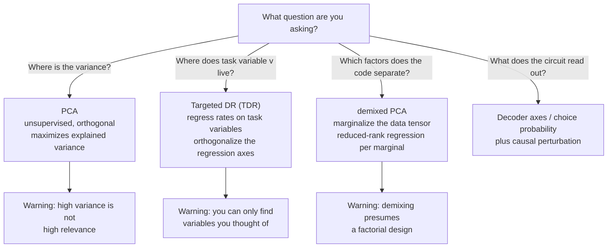
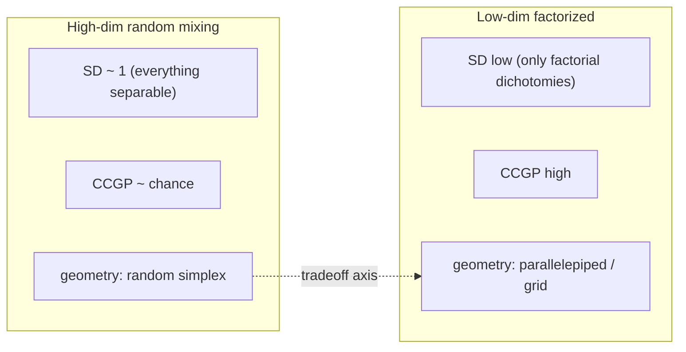

# Unit 02 — The Linear Algebra of Populations

> **The conversion in one line:** $N$ spike trains → a low-dimensional latent geometry whose *shape* is the algorithm's data structure.

## Orientation

Unit 01 gave you a vocabulary for dynamics but quietly assumed you already knew what the state was. In practice you never do. You have $N$ noisy, subsampled, biased-toward-large-cells spike trains, and the state variable the circuit is actually computing with is some unknown function of them. The bridge from recordings to phase portraits is a geometric one: find the low-dimensional set the population activity lives on, find the coordinates on it that the circuit actually uses, and only then ask what flows along them.

The temptation is to treat this as a data-compression problem — run PCA, keep 90% of the variance, call the result "the manifold." Resist it. Dimensionality reduction is not a preprocessing step; it is a *hypothesis about the algorithm*, and different methods encode different hypotheses. PCA hypothesizes that the computationally relevant directions are the high-variance ones (frequently false — the choice signal in parietal cortex is small compared to the movement signal that follows it). Targeted dimensionality reduction hypothesizes that you already know the task variables. Demixed PCA hypothesizes that the code factorizes across experimental factors. Low-rank RNN theory hypothesizes that the latent dimensionality is a property of the *connectivity*, not just the activity. Each one, applied honestly, is a falsifiable claim.

By the end you should be able to: compute and interpret a spectrum's effective dimension without pretending a threshold is principled; derive, from scratch, how a rank-one perturbation of a random connectivity matrix generates a one-dimensional latent dynamic, and know what the mean-field self-consistency condition is buying you; explain why the *same* population can be low-dimensional and high-dimensional depending on the task you probe it with; and — the deepest idea here — articulate the geometric tradeoff between separability and generalization, which turns out to be the organizing principle behind the antennal-lobe-to-mushroom-body transformation as much as behind prefrontal cortex.

---

## 1. The neural state space, and the sin of averaging

Let $r_i(t, c, \ell)$ be the (smoothed) rate of neuron $i$ at time $t$ on trial $\ell$ of condition $c$. The **state** at $(t,c,\ell)$ is the vector $r(t,c,\ell) \in \mathbb{R}^N$; the **trajectory** is its path in time. Three objects get confused constantly and should not be:

- the **single-trial trajectory** $r(\cdot, c, \ell)$ — what the circuit actually did;
- the **condition-averaged trajectory** $\bar r(\cdot, c) = \mathbb{E}_\ell[r(\cdot,c,\ell)]$ — what most papers plot;
- the **latent trajectory** $z(\cdot,c,\ell) \in \mathbb{R}^K$, $K\ll N$ — what you hope the circuit is computing with.

**When averaging is right.** If the dynamics is deterministic given the condition and trials are aligned to a common clock, then $\bar r = r$ up to noise, and averaging is pure gain. This is close to true in, say, motor cortex during a well-practised reach with a clean go cue.

**When averaging is a lie.** Two failure modes, both routine.

*Timing jitter.* If single trials execute the same trajectory with a random time offset $\delta_\ell$, the average is the trajectory convolved with the offset distribution. A sharp state transition becomes a smooth ramp. You will fit a slow manifold to what is actually a fast switch — an error of dynamical *class*, not of parameters.

*Latent bimodality.* The canonical case: Latimer et al. (2015) showed that LIP responses during decision-making, which average into a beautiful ramp, are better described on single trials as a discrete step at a random time. Ramping and stepping are different algorithms — evidence accumulation versus a change-of-mind detector — and they are indistinguishable after averaging. This is the same point as timing jitter but with a sharper moral: **the trial average is a statistic of the ensemble of trajectories, not a member of it.** The mean of a bimodal distribution can lie in a region of state space the system never occupies.

**A discipline.** Before believing anything about trajectory geometry, ask: (i) does the structure survive on single trials, or only after averaging? (ii) does it survive a null model that preserves the "uninteresting" statistics? The second question is Elsayed & Cunningham's (2017) contribution and it should be reflexive by now: rotational dynamics, sequential activation, and low dimensionality all appear in surrogate data that preserves only the marginal covariances across time, neurons, and conditions. If your effect is present in the surrogates, your effect is a consequence of the marginals, not of the dynamics.

**Recovering single trials.** GPFA (Yu et al. 2009) posits Gaussian-process latents with a linear-Gaussian observation model; LFADS (Pandarinath et al. 2018) posits an RNN generator and infers the initial condition and inputs per trial. Both are worth understanding as *hypotheses about the generative structure* rather than smoothers: LFADS in particular is a commitment to the claim that single-trial variability is dominated by initial-condition and input variability rather than by dynamical noise, which is testable and sometimes false.

---

## 2. Dimensionality: reading a spectrum

Let $C = \mathrm{Cov}(r) \in \mathbb{R}^{N\times N}$ with eigenvalues $\lambda_1\ge\lambda_2\ge\cdots\ge\lambda_N \ge 0$. Everyone wants a single number. The bad answer is "the number of PCs needed to explain 90% of variance," which is a threshold masquerading as a measurement — it depends discontinuously on the data and on a choice nobody can defend.

The good answer is the **participation ratio**:

$$\mathrm{PR} \;=\; \frac{\left(\sum_i \lambda_i\right)^2}{\sum_i \lambda_i^2} \;=\; \frac{(\mathrm{tr}\,C)^2}{\mathrm{tr}(C^2)} \;=\; \frac{1}{\sum_i p_i^2}, \qquad p_i := \frac{\lambda_i}{\sum_j\lambda_j}.$$

Why this and not something else? Several independent reasons converge.

**(i) It is the effective number of a probability distribution.** The normalized spectrum $p$ is a probability distribution over directions — "how variance is allocated." $\mathrm{PR} = 1/\sum p_i^2 = \exp(H_2(p))$ where $H_2$ is the Rényi entropy of order 2. It is the *inverse Simpson index* from ecology (effective number of species), the *effective sample size* from importance sampling ($1/\sum w_i^2$), and the *inverse participation ratio* from Anderson localization (where it counts the number of sites a wavefunction occupies). Whenever you need "how many things are effectively contributing," this is the answer that the rest of science has independently arrived at.

**(ii) It has the right limits.** If $k$ eigenvalues are equal and the rest zero, $\mathrm{PR}=k$ exactly. If one eigenvalue dominates, $\mathrm{PR}\to1$. It is invariant to overall scaling of $C$ (as any dimensionality measure must be) and is continuous in the spectrum, unlike any threshold rule.

**(iii) It is a genuine first-moment summary — and you should know what it discards.** $\mathrm{PR}$ depends only on $\mathrm{tr}\,C$ and $\mathrm{tr}\,C^2$, i.e. on the first two moments of the spectral measure $\mu = \frac1N\sum\delta_{\lambda_i}$. That is a virtue: those are the two moments you can estimate reliably from limited trials, since $\mathrm{tr}\,C = \sum_i \mathrm{Var}(r_i)$ needs no cross-neuron statistics at all and $\mathrm{tr}\,C^2 = \|C\|_F^2$ is a smooth quadratic functional. Higher-order spectral functionals (e.g. $\log\det$, or eigenvalue counts) require estimating the tail of the spectrum, which is exactly where sampling noise dominates. $\mathrm{PR}$ is the most informative dimensionality summary that is also robustly estimable, and that is the real argument for it.

It is *not* a substitute for looking at the spectrum. Two very different spectra can share a PR. Report PR, but plot $\lambda_i$ on log-log axes as well — the shape carries information PR cannot.

**Power-law spectra.** Take $\lambda_i \propto i^{-\alpha}$. Then for $N\to\infty$ and $\alpha>1$,

$$\mathrm{PR} \to \frac{\zeta(\alpha)^2}{\zeta(2\alpha)},$$

a *finite* number independent of $N$: $\alpha=2$ gives $\mathrm{PR}=2.50$ exactly; $\alpha=1.5$ gives $\approx5.68$; $\alpha=1.1$ gives $\approx75$. Since $\zeta(\alpha) = (\alpha-1)^{-1} + \gamma + O(\alpha-1)$ as $\alpha\to1^+$, $\mathrm{PR}\approx 6[(\alpha-1)^{-1}+\gamma]^2/\pi^2$ — the effective dimension diverges quadratically as the exponent approaches 1. At exactly $\alpha=1$, $\mathrm{PR}\approx(\ln N + \gamma)^2/\zeta(2)$, growing without bound but only logarithmically. For $\alpha<1$ the PR grows as a power of $N$ (Exercise 1).

Be warned that the convergence to the $N\to\infty$ limit is glacial when $\alpha$ is near 1: the tail of $\sum i^{-\alpha}$ decays like $N^{1-\alpha}$, so at $\alpha=1.1$ and $N=10^4$ the actual PR is about 29, not 75. Any dimensionality comparison across datasets with different $N$ is meaningless in this regime. So the *entire* qualitative character of a population code — bounded versus unbounded dimensionality as you record more neurons — is controlled by whether the spectral exponent sits above or below 1.

This is why Stringer et al. (2019) matters so much. Recording $\sim10^4$ mouse V1 neurons responding to thousands of natural images, they found $\lambda_n \propto n^{-\alpha}$ with $\alpha$ slightly *greater* than 1, and gave the theoretical reason: if the population response is a smooth (differentiable) map from a $d$-dimensional stimulus manifold into $\mathbb{R}^N$, then necessarily $\alpha > 1 + 2/d$. As $d$ grows this bound approaches 1 from above. Cortex sits just above the bound: **the code is as high-dimensional as it can be while remaining differentiable.** That is a real design principle, stated geometrically, and it immediately raises the olfactory question — what is $\alpha$ for a Kenyon-cell population responding to a large panel of odors, and is the mushroom body also at the smoothness edge, or does it deliberately violate smoothness to maximize separability? (See §8; the answer is not obvious and I do not think it is known.)

**Sampling.** All of this is about the *true* covariance. Estimated from $T$ samples with $N$ neurons, the eigenvalue spectrum is smeared by Marchenko–Pastur effects with the smearing controlled by $N/T$, and PR is biased — generally *upward* when noise is added (noise is isotropic and isotropy is maximally high-dimensional; Exercise 2), and downward-biased in other regimes. Cross-validated estimators exist; use them, and at minimum check the PR of shuffled data.

---

## 3. Manifolds: what the word should mean

"Neural manifold" is used for three different things and the ambiguity is corrosive.

1. **A linear subspace.** "Activity is confined to a 10-dimensional subspace." This is what PCA gives you. It is a claim about the *embedding* dimension.
2. **A nonlinear submanifold.** Activity lies on a curved $k$-dimensional surface embedded in $\mathbb{R}^N$; the *intrinsic* dimension is $k$ but the linear embedding dimension may be much larger. A ring in $\mathbb{R}^N$ has intrinsic dimension 1 and needs at least 2 linear dimensions — and if the tuning curves are non-sinusoidal, many more.
3. **An invariant manifold of the dynamics** (Unit 01 §3.5). This is the only one of the three with mechanistic content, and it is *not* implied by the other two. Data lying on a ring does not mean the circuit has a ring attractor; it might mean the stimulus set was a ring and tuning is smooth.

The distinction between (2) and (3) is where the craft lives. What converts "the data lie on a ring" into "the circuit implements a ring attractor" is evidence that the ring persists *without the stimulus that parameterizes it*.

**Chaudhuri et al. (2019)** is the exemplar, and the design is worth studying closely. Taking population recordings from mouse anterodorsal thalamic nucleus (head-direction cells), they discarded the behavioural labels entirely and asked what topology the *unlabeled* population activity occupies. Applying unsupervised manifold-discovery to binned population vectors, they recovered a one-dimensional ring — and only then checked, post hoc, that position on the recovered ring correlated with actual head direction during waking. The decisive step: the *same* ring topology, with the same neuron-to-ring-position assignment, was present during REM and non-REM sleep, when there is no head-direction input at all, and the internal state moved smoothly around the ring (fast, during REM, in a way that resembles simulated head turns). A ring inherited from a ring-shaped stimulus set cannot do that. The manifold is intrinsic — object (3), not object (2).

**Gardner et al. (2022)** did the analogous thing for grid cells, using persistent cohomology to establish that MEC module activity occupies a *torus* $T^2$, again persisting during sleep. The mathematical tool here — persistent homology, tracking Betti numbers $\beta_0,\beta_1,\beta_2$ across a filtration of the point cloud — is the right one, because Betti numbers are exactly topological invariants: they are properties of the conjugacy class, not of the coordinates. This is Unit 01's philosophy in data-analysis form.

**A caution.** Persistent homology on neural data is delicate: it is sensitive to sampling density, to the metric you choose (Euclidean on rates? cosine? Poisson deviance?), and to preprocessing (a bad smoothing kernel can manufacture or destroy a hole). The published successes all involve heavy preprocessing and careful null models. Read the supplements.

---

## 4. Reduction with a purpose: PCA, TDR, dPCA



**PCA.** Maximize $\mathrm{tr}(U^\top C U)$ over orthonormal $U\in\mathbb{R}^{N\times K}$; the solution is the top-$K$ eigenvectors. Fast, canonical, assumption-light — and blind to what you care about. The choice signal in a decision circuit is typically an order of magnitude smaller than the stimulus-drive signal, and PCA will happily bury it in PC 9.

**Targeted dimensionality reduction (Mante et al. 2013).** Regress each neuron's $z$-scored response on the task variables, separately at each time:

$$r_i(t,k) = \beta_{i,1}(t)\,s^{\text{mot}}(k) + \beta_{i,2}(t)\,s^{\text{col}}(k) + \beta_{i,3}(t)\,s^{\text{ch}}(k) + \beta_{i,4}(t)\,s^{\text{ctx}}(k) + \varepsilon_i(t,k),$$

where $k$ indexes trials and $s^{\bullet}(k)$ are the (standardized) task variables. This yields, for each variable $v$ and time $t$, a **regression vector** $\beta_v(t)\in\mathbb{R}^N$: the direction in state space along which that variable is linearly encoded. Then:

1. Denoise by projecting onto the top-$D$ PCA subspace: $\tilde\beta_v(t) = UU^\top\beta_v(t)$.
2. Pick the time of maximal norm: $\beta_v^{\max} = \tilde\beta_v(t_v^*)$, $t_v^*=\arg\max_t\|\tilde\beta_v(t)\|$.
3. **Orthogonalize**: QR-decompose $B=[\beta^{\max}_1,\dots,\beta^{\max}_4] = QR$ and use the columns of $Q$ as task axes.

Step 3 is not cosmetic. The raw regression vectors are correlated (mixed selectivity guarantees it), and projections onto non-orthogonal axes cannot be read as independent quantities — you will see "motion signal" that is really leaked choice signal. Orthogonalization makes the projections interpretable at the cost of making the axes depend on the ordering in the QR, which you must report.

**Demixed PCA (Kobak et al. 2016).** Suppose the design is factorial: stimulus $\times$ decision $\times$ time. Decompose the data tensor into marginalizations $X_\phi$ (stimulus-only, decision-only, interaction, time-only, …) by iterated averaging and subtraction, and then find, for each marginalization, a *low-rank linear encoder/decoder pair*:

$$\min_{F_\phi, D_\phi}\;\sum_\phi\;\big\|X_\phi - F_\phi D_\phi X\big\|_F^2,$$

with $D_\phi\in\mathbb{R}^{K_\phi\times N}$ the decoder (what you project onto) and $F_\phi\in\mathbb{R}^{N\times K_\phi}$ the encoder. Each subproblem is reduced-rank regression, solvable in closed form via the SVD of $X_\phi X^\top(XX^\top + \mu I)^{-1}$. The key departures from PCA: the components are *labeled* by which experimental factor they capture, and the decoder axes need not be orthogonal — which is the right choice, because the true coding directions for different variables are generally not orthogonal, and forcing orthogonality distorts them.

**The epistemic point, stated once and then assumed.** A "neural manifold" is not method-independent. PCA's manifold is the high-variance one; TDR's is the task-variable one; dPCA's is the factor-aligned one; the *dynamically relevant* one is whichever the downstream circuit actually reads. These coincide only by luck. If you are going to make a claim about the algorithm, the load-bearing evidence is causal — perturb along a putative axis and see whether behaviour changes — not variance-explained.

---

## 5. Mante et al. (2013): selection as geometry

The task: a monkey views a random-dot stimulus with both a motion signal and a colour signal, and a context cue says which to report. This is the cleanest possible instantiation of *flexible input selection*, and the naive circuit hypothesis is multiplicative gating: the irrelevant input is turned off at the input stage.

The finding, obtained via TDR on PFC populations, was that **both** motion and colour are robustly represented in PFC in **both** contexts, with similar magnitude. Nothing is gated off. Yet only the relevant variable is integrated: the projection onto the "integration" axis accumulates the relevant evidence and not the irrelevant evidence.

The mechanistic account came from training an RNN on the same task and running Unit 01's fixed-point finder on it. The result: the trained network contains, in each context, an approximate **line attractor** — a set of slow points strung along a curve, each with one near-zero eigenvalue. Recall the linearized decomposition from Unit 01 §2:

$$\dot\delta = J\delta + Bu, \qquad \delta(t)\supset \Big(\int_0^t l_0^\top B u(s)\,ds\Big)\,r_0 \quad\text{for the mode with }\lambda_0\approx0.$$

The **left** eigenvector $l_0$ of the slow mode is the *selection vector*: it determines which input directions get integrated. And the answer to how context works is that **$l_0$ rotates with context while $r_0$ does not.** The motion input arrives along a fixed direction $Bu_{\text{mot}}$ in both contexts; in the motion context $l_0$ has a large overlap with it and in the colour context it does not. The irrelevant input still enters the network, still produces $O(1)$ activity, and still shows up in TDR — it simply lands in directions that the slow mode does not listen to, and therefore decays.

Three reasons this is a landmark for the circuits→algorithms craft.

1. **It dissolves an apparent paradox in the data.** "Both variables are represented but only one is used" sounds incoherent until you have the left/right eigenvector distinction, at which point it is the obvious prediction.
2. **It relocates the mechanism.** Gating is not implemented at the input; it is implemented by the *geometry of the recurrent dynamics*. Nothing multiplies anything. This is a genuinely non-obvious algorithm that no one would have written down from first principles.
3. **It is a template.** Fit or train a dynamical model $\to$ find the slow points $\to$ linearize $\to$ inspect left eigenvectors for selection and right eigenvectors for the readout. That four-step recipe is now standard practice, and it came from combining Unit 01's tool with Unit 02's geometry.

Worth noting the honest caveat: the RNN is a *model* of the mechanism, licensed by the fact that it reproduces the population geometry, not a measurement of it. The line attractor was found in the network, not in PFC. Testing it in the brain requires either perturbation along $l_0$ (predicted to shift the integrator) versus along an orthogonal direction (predicted to do nothing), or single-trial evidence for slow drift along $r_0$.

---

## 6. Low-rank RNNs: making dimensionality a property of connectivity

Everything above treats low dimensionality as an empirical fact about activity. Mastrogiuseppe & Ostojic (2018) made it a *derivable consequence of connectivity*, which is the version you can reason with.

### 6.1 The model and the exact reduction

Take $N$ units with

$$\tau\dot x_i = -x_i + \sum_j J_{ij}\,\phi(x_j) + I_i, \qquad J = g\chi + \frac{1}{N}\,m n^\top,$$

where $\chi_{ij}\sim\mathcal{N}(0,1/N)$ i.i.d. (so $g\chi$ has spectral radius $g$ — the Girko circular law, and $g=1$ is the Sompolinsky–Crisanti–Sommers transition to chaos), and $m,n\in\mathbb{R}^N$ are the rank-one structure. Substituting:

$$\tau\dot x = -x + g\chi\,\phi(x) + m\,\underbrace{\frac{n^\top\phi(x)}{N}}_{=:\;\kappa} + I.$$

This is exact and it is already the whole story. **The entire influence of the structured connectivity on the dynamics is through the single scalar $\kappa = \langle n\,\phi(x)\rangle$**, which feeds back along the fixed direction $m$. A rank-one connectivity generates a one-dimensional latent variable — not approximately, not after PCA, but algebraically. The population state decomposes as

$$x_i = \kappa\, m_i + I_i + \delta_i,$$

with $\delta$ the contribution of the random part. Rank $R$ gives $R$ latents $\kappa_a = \langle n_a\phi(x)\rangle$ driving along $m_a$; the "low-dimensional latent dynamics" everyone extracts with PCA is, in this class of models, exactly the rank of the structured connectivity.

### 6.2 Mean-field self-consistency

To close the loop we need $\kappa$, which requires knowing the distribution of $x$ across the population. Take $(m_i, n_i, I_i)$ drawn i.i.d. from a zero-mean joint Gaussian with covariances $\sigma_{mn}, \sigma_{mI}, \sigma_{nI}, \sigma_m^2, \sigma_I^2$. In the stationary mean-field (DMFT) treatment, the random part contributes a Gaussian $\delta_i$ with variance

$$\Delta_0 = g^2\big\langle \phi(x)^2\big\rangle,$$

independent of $(m_i,n_i,I_i)$, so $x_i$ is Gaussian across the population with total variance

$$\Delta = \kappa^2\sigma_m^2 + \sigma_I^2 + 2\kappa\sigma_{mI} + \Delta_0.$$

Now compute $\kappa$. Since $(n_i, x_i)$ are jointly Gaussian, **Stein's lemma** gives $\mathbb{E}[n\,\phi(x)] = \mathrm{Cov}(n,x)\,\mathbb{E}[\phi'(x)]$, and $\mathrm{Cov}(n,x) = \mathrm{Cov}(n,\;\kappa m + I + \delta) = \kappa\sigma_{mn} + \sigma_{nI}$. Therefore

$$\boxed{\;\kappa = \big(\kappa\,\sigma_{mn} + \sigma_{nI}\big)\,\big\langle\phi'\big\rangle_\Delta\;}, \qquad \big\langle\phi'\big\rangle_\Delta := \mathbb{E}_{z\sim\mathcal{N}(0,\Delta)}\big[\phi'(z)\big].$$

Two regimes, and both are illuminating.

**No input overlap ($\sigma_{nI}=0$).** Then $\kappa\big(1 - \sigma_{mn}\langle\phi'\rangle_\Delta\big) = 0$. Either $\kappa=0$ (the trivial solution) or

$$\sigma_{mn}\,\langle\phi'\rangle_{\Delta(\kappa)} = 1.$$

For $\phi=\tanh$, $\langle\phi'\rangle_\Delta$ is a decreasing function of $\Delta$ with $\langle\phi'\rangle_0 = 1$, and $\Delta$ increases with $\kappa^2$. So a nonzero solution exists iff $\sigma_{mn}\langle\phi'\rangle_{\Delta_0} > 1$, and when it does, it comes in a $\pm\kappa$ pair (since $\Delta$ depends on $\kappa$ only through $\kappa^2$ when $\sigma_{mI}=0$). **This is a pitchfork bifurcation in the overlap $\sigma_{mn}$**, and the resulting bistability is a two-state memory whose "attractor states" are $\pm\kappa^*m$ — an emergent discrete memory, derived from three scalar statistics of the connectivity.

**With input overlap ($\sigma_{nI}\ne0$).** Solve:

$$\kappa = \frac{\sigma_{nI}\,\langle\phi'\rangle_\Delta}{1 - \sigma_{mn}\,\langle\phi'\rangle_\Delta}.$$

Look at that denominator. It is *exactly* the line-attractor gain factor $1/(1-\lambda)$ from Unit 01 §4.1, with the effective loop gain $\lambda_{\text{eff}} = \sigma_{mn}\langle\phi'\rangle_\Delta$. As $\lambda_{\text{eff}}\to1^-$ the response to input diverges and the latent's relaxation time goes to infinity: you are approaching a line attractor. The fine-tuning problem reappears in exactly the same algebraic place, now expressed in terms of a *statistical* property of the connectivity (the $m$–$n$ overlap) rather than an eigenvalue of a specific matrix. That is progress: it says the tuned quantity is a low-dimensional summary statistic that homeostatic mechanisms could plausibly regulate.

Note also the self-limiting structure: $\langle\phi'\rangle_\Delta$ *decreases* as $\Delta$ grows, and $\Delta$ grows with both $\kappa$ and $g$. Chaotic fluctuations from the random part act as a gain control on the structured computation. Increasing $g$ can *destroy* a memory state by suppressing $\langle\phi'\rangle$ below the threshold — a nontrivial and testable interaction between "noise" and "computation" that falls straight out of the self-consistency.

(Two honesty flags. First, this is the static approximation; the full DMFT tracks the autocorrelation $\Delta(t,t')$ and yields the chaotic phase properly. Second, the Gaussian assumption on $(m,n,I)$ is a modeling choice, and §6.4 is about what happens when you drop it.)

### 6.3 Rank two, and what higher rank buys

With $J = \frac1N\sum_{a=1}^R m_a n_a^\top$ the same argument gives $R$ latents with

$$\kappa_a = \langle\phi'\rangle_\Delta \sum_b \sigma_{n_a m_b}\,\kappa_b, \qquad \text{i.e.}\quad \kappa = \langle\phi'\rangle_\Delta\, S\kappa, \quad S_{ab}=\sigma_{n_am_b}.$$

The structure of $S$ determines the primitive:

- $S$ with a real eigenvalue crossing $1/\langle\phi'\rangle$: pitchfork $\Rightarrow$ bistability (rank 1 suffices).
- $S=sI$ in a 2-plane: the self-consistency depends only on $\|\kappa\|$, so the solution set is a **circle** — a ring attractor, with the neutral direction forced by the rotational symmetry of $S$ (Unit 01's spotlight, again).
- $S$ with a complex pair crossing the appropriate boundary: Hopf $\Rightarrow$ **limit cycle** in the $(\kappa_1,\kappa_2)$ plane.

So rank 2 already gives you circular variables and oscillations. This is the dictionary of Unit 01 §3 rederived from connectivity statistics — the two units are describing the same objects from opposite ends.

### 6.4 Dubreuil et al. (2022): rank, population structure, and task complexity

Dubreuil, Valente, Beiran, Mastrogiuseppe & Ostojic asked the natural follow-up: given a task, what rank does a network need, and what else does it need? Two findings that should reshape how you read dimensionality results.

**Rank tracks the number of latent variables the task requires**, not the number of task conditions or the complexity of the stimulus. A network trained on a task and then *truncated* to low rank retains performance down to a task-specific rank, and that rank corresponds to the number of collective variables the algorithm needs (e.g. one accumulator plus one context variable). This makes "dimensionality" a claim about the algorithm rather than about the data — precisely the conversion this course is about.

**Rank is not enough; population structure matters.** If $(m_a, n_a, I)$ are drawn from a *single* Gaussian, the class of achievable input–output mappings is limited. Many tasks can be solved by increasing rank within this "random population structure" class. But *flexible* input–output mappings — context-dependent gating of the Mante et al. kind — require a **non-Gaussian, multi-population structure**: the loading vectors must be drawn from a mixture of Gaussians, i.e. there must be genuinely distinct cell classes with distinct joint statistics of $(m,n,I)$. Mechanistically, the multiple populations allow context input to differentially modulate the gains $\langle\phi'\rangle$ of different subpopulations, and hence to reshape the effective $S$ matrix — gain-controlled modulation of the collective dynamics.

That is a strikingly concrete bridge between the two dominant traditions in systems neuroscience — "sort neurons into cell types" and "extract low-dimensional collective dynamics" — and the result is that they are not competitors but *complementary axes*: rank sets how many collective variables you have, population structure sets how flexibly they can be recombined. For anyone working on an invertebrate circuit with genetically identifiable cell classes, this is an unusually actionable theory: the cell types are not incidental to the low-dimensional dynamics; they are what makes the dynamics reconfigurable.

---

## 7. What limits measured dimensionality (Gao & Ganguli)

A deflationary and essential result. Gao et al. (2017) asked: why do we keep finding that population activity is low-dimensional? Three candidate answers — the brain is genuinely low-dimensional; we do not record enough neurons; or **our tasks are too simple**.

The argument runs through random projections. If the true population activity lies on a smooth manifold parameterized by the task (time, stimulus, condition), that manifold has a complexity — Gao et al. call it the *neural task complexity* (NTC) — roughly the volume of task-parameter space measured in units of the autocorrelation scale of neural tuning along each parameter. Recording $M$ neurons is (to a first approximation, given heterogeneous tuning) a random projection of that manifold into $\mathbb{R}^M$. Johnson–Lindenstrauss-type results then say: **once $M \gtrsim \mathrm{NTC}$, the geometry of the recovered manifold matches the true one**, up to logarithmic factors — regardless of how many neurons there really are.

Consequences you should carry around permanently:

- Measured dimensionality is bounded by task complexity. A task with three conditions and a one-second trial *cannot* reveal a 50-dimensional code, no matter how many neurons you record. Reporting "the code is 6-dimensional" without reporting the NTC of your task is close to meaningless.
- Conversely, the standard worry ("we only recorded 0.01% of the neurons") is often *not* the binding constraint. If $M\gg\mathrm{NTC}$, you have enough.
- The prescription is to design tasks with high NTC — many conditions, rich parameterization, naturalistic stimulus variation — which is exactly what Stringer et al. did (thousands of natural images), and exactly why they found high dimensionality where earlier work found low.

For olfaction this is unusually pointed. Odor space is high-dimensional and combinatorially vast; a panel of 8 monomolecular odorants has tiny NTC, and any dimensionality estimate from such a panel measures the panel, not the antennal lobe. The field's dimensionality claims should be re-derived under a large, structured odor panel with mixtures — and the predicted result is that measured dimensionality will rise substantially.

(The Gao et al. paper is, as of writing, a widely cited preprint rather than a journal article; cite it as such.)

---

## 8. Shattering, abstraction, and the geometry of the tradeoff

Now the deepest idea in the unit. Two things you want from a representation are in tension, and the tension is *geometric*.

### 8.1 Separability: Cover's theorem and shattering dimensionality

Suppose you have $K$ experimental conditions, each giving a mean population vector in $\mathbb{R}^N$. A **dichotomy** is a partition of the $K$ conditions into two labeled groups; there are $2^{K-1}$ of them, or $\frac12\binom{K}{K/2}$ **balanced** ones (35 for $K=8$). The **shattering dimensionality (SD)** is the fraction of balanced dichotomies that a linear decoder can separate (in practice: mean cross-validated decoding accuracy over all balanced dichotomies).

Cover (1965) tells you what to expect from random high-dimensional embeddings. The number of linearly separable dichotomies of $P$ points in general position in $\mathbb{R}^N$ (through the origin) is

$$C(P,N) = 2\sum_{k=0}^{N-1}\binom{P-1}{k},$$

which follows from the recursion $C(P+1,N)=C(P,N)+C(P,N-1)$ (adding a point either preserves a separating hyperplane's validity or forces it into the $(N-1)$-dimensional subspace containing the new point). At $P=2N$,

$$C(2N,N)=2\sum_{k=0}^{N-1}\binom{2N-1}{k} = 2\cdot\tfrac12 2^{2N-1} = 2^{2N-1} = \tfrac12\,2^{P},$$

using the symmetry of the binomial row. So exactly half of all dichotomies are separable at $P=2N$, and the fraction transitions sharply from $\approx1$ to $\approx0$ around $P=2N$. **Random mixed selectivity in high dimensions makes everything decodable** — this is Rigotti et al.'s (2013) point about mixed selectivity in PFC, and it is the operating principle of the mushroom body, the cerebellar granule layer, and every random-feature machine learning method.

### 8.2 Abstraction: CCGP and parallelism

But total separability is a poor representation in one crucial respect: it does not generalize. Suppose conditions are generated by two binary latent factors, $(\text{stimulus},\text{context})$, plus a third. A representation that scatters the $K$ conditions randomly in $\mathbb{R}^N$ separates every dichotomy — including nonsensical ones — but a decoder trained on stimulus in context A carries no information about stimulus in context B, because the coding direction for stimulus is different in each context. There is no such thing as "the stimulus direction."

The measure for this is **cross-condition generalization performance (CCGP)**: train a linear decoder for a dichotomy on a *subset* of conditions and test on *held-out* conditions from the same dichotomy, averaging over splits. High CCGP means the variable is coded in an **abstract format** — the same direction works everywhere.

The geometric correlate: a variable is abstract when the vector separating the two values of that variable is *the same regardless of the other variables* — i.e. the conditions form a (approximate) parallelepiped, a **factorized** or **rectangular** geometry. **Parallelism score (PS)** operationalizes this: for a dichotomy, pair conditions across the split, compute the coding vectors for each pair, take the average cosine similarity, and maximize over pairings.



### 8.3 The tradeoff, and the empirical resolution

The two extremes are:

| | Random high-D mixing | Factorized low-D |
|---|---|---|
| Geometry | $K$ points in general position | $K$ points on a grid / parallelepiped |
| Embedding dim | $\sim K-1$ | $\sim$ number of factors |
| SD | $\approx1$ | low ($\approx$ only the factorial dichotomies) |
| CCGP | chance | high |
| Good for | learning arbitrary new mappings fast | transferring knowledge to new situations |

They are in genuine tension: a parallelepiped is a very special, low-dimensional configuration, and low-dimensional configurations cannot shatter. Yet **Bernardi et al. (2020)** found that populations in monkey hippocampus, dorsolateral PFC, and anterior cingulate show *both* — high CCGP and PS for the task-relevant variables (well above what a factorized-and-nothing-else model would allow you to also have) *and* high shattering dimensionality overall, above what a purely abstract geometry could support. The representation is a compromise: a low-dimensional abstract skeleton (the parallelepiped of the task's latent factors) *plus* additional high-dimensional structure occupying directions orthogonal to it. You get generalization along the abstract axes and separability in the residual dimensions, because the two live in different subspaces.

That resolution — *stack an abstract low-dimensional geometry and a high-dimensional random one in orthogonal subspaces* — is the single most useful representational design principle I know of, and once you have it you will see it everywhere.

### 8.4 The olfactory instantiation

Here is why this matters for the reader's own system. The antennal-lobe → mushroom-body transformation is the tradeoff realized *across circuit stages* rather than within one population:

- The **AL** is a small, structured, recurrently connected population (~830 PNs in locust) whose transformation is decorrelating and normalizing, and whose representation is comparatively low-dimensional and *structured*: concentration and identity are partially separated, similar odors have similar trajectories, and the geometry supports generalization across concentration. This is the abstract end.
- The **mushroom body** expands ~50,000-fold into a sparse, high-threshold, randomly connected Kenyon-cell population. Jortner, Farivar & Laurent (2007) showed that locust KCs each sample a large random subset of PNs with a high threshold — the canonical random expansion. Litwin-Kumar, Harris, Axel, Sompolinsky & Abbott (2017) derived the optimal number of PN inputs per KC by *maximizing dimensionality* of the KC representation subject to noise, obtaining values close to the measured ones in both fly and (approximately) mouse. This is the shattering end.

So: the AL builds an abstract, generalizing, low-dimensional format; the MB projects it into a high-dimensional format where arbitrary odor–valence associations are linearly learnable in one synaptic layer. The circuit does not choose between generalization and separability — it *sequences* them. And the sequencing has an obvious functional logic: you want the learnable dimensions to be built on top of a code that has already been made invariant to nuisance variables (concentration, background, adaptation state), because otherwise the high-dimensional layer will shatter along nuisance directions too.

Concrete questions this framing makes askable, none of which I think are settled:

1. What are SD and CCGP for AL PN populations versus KC populations, measured over the same odor panel with concentration and mixture as the abstracted variables? The prediction is a crossover: CCGP high in AL and lower in KC, SD low in AL and near-ceiling in KC.
2. Is the AL's abstract geometry *dynamic*? In a heteroclinic-channel code (Unit 01 §6) the "coding direction" changes over the course of a trial. Abstraction may then hold in a time-warped sense — parallel *trajectories* rather than parallel vectors. That is a genuinely new measurement, and it needs a definition of CCGP for trajectories.
3. Does learning (appetitive conditioning) reshape KC→MBON weights in a way that is predicted by the shattering geometry, i.e. is learning speed for a given odor dichotomy predicted by its decodability in KC space?

---

## Mathematical structure spotlight

> **The spectrum as a measure, and the Rényi family of effective dimensions.**
>
> The normalized eigenvalue spectrum $p_i = \lambda_i/\sum\lambda_j$ is a probability distribution, and every "dimensionality" you have ever seen is a functional of it. The natural family is the exponentiated Rényi entropy,
> $$D_q(p) = \exp\big(H_q(p)\big) = \Big(\sum_i p_i^{\,q}\Big)^{1/(1-q)},$$
> with $D_0 = $ number of nonzero eigenvalues (rank), $D_1 = \exp(-\sum p_i\ln p_i)$ (the "entropy dimension," and the one you would use if you cared about coding capacity), $D_2 = \mathrm{PR}$, and $D_\infty = 1/p_1$. $D_q$ is non-increasing in $q$: higher $q$ weights the top of the spectrum more heavily. Reporting the whole curve $q\mapsto D_q$ is strictly more informative than reporting any single number and costs nothing; its *shape* diagnoses the spectral form (flat for a uniform spectrum, steeply decreasing for a power law).
>
> This is the same construction as the Rényi dimension spectrum in multifractal analysis, the Hill numbers in ecology, and the participation ratios in localization theory. That it keeps being rediscovered is a hint that it is the canonical answer to "how many effective degrees of freedom," and the reason is a representation theorem: $D_q$ are the only functionals that are continuous, symmetric, scale-invariant, and satisfy the "effective number" property $D_q(\text{uniform on }k) = k$ together with a replication/composition axiom.
>
> A second structure worth naming: the objects TDR, dPCA, and low-rank RNN theory all produce are points on **Grassmannians** $\mathrm{Gr}(K,N)$ — $K$-dimensional subspaces of $\mathbb{R}^N$ — and the right way to compare two analyses, two animals, or two models is with a metric on the Grassmannian (principal angles, chordal distance), not by comparing basis vectors, which are gauge. Any time you find yourself matching PC 3 in one animal to PC 3 in another, stop and compute subspace angles instead.
>
> See [`../structures/README.md`](../structures/README.md) for the running index.

---

## What this buys you as an algorithmist

1. **Spectra $\to$ effective dimension, honestly.** Report $\mathrm{PR}$ (and ideally the $D_q$ curve) with a shuffle control, alongside the log-log spectrum, and never a variance threshold. Know whether $\alpha\gtrless1$, because that decides whether dimensionality saturates.
2. **Connectivity statistics $\to$ latent dimensionality.** Given a structured connectivity, the rank of the structure *is* the latent dimensionality, exactly. This converts "we found 3 PCs" into the testable claim "the structured connectivity has rank 3," and gives you the self-consistency machinery to predict what those 3 latents do.
3. **Activity geometry $\to$ mechanism, with the right null.** A ring in the data becomes a ring attractor only when it survives the removal of the stimulus that parameterizes it. That is a specific experiment (sleep, darkness, stimulus-free epochs), and Chaudhuri et al. is the template.
4. **Representation $\to$ readout capability.** SD and CCGP together tell you what a downstream linear reader can and cannot do, and they can be computed from any dataset with a factorial condition structure. This is the most direct link from measured geometry to algorithmic claim in the whole course.
5. **Task design $\to$ measurable dimensionality.** Gao & Ganguli lets you compute, in advance, whether your planned experiment could possibly reveal the dimensionality you are hoping to measure. Do this before collecting data, not after.
6. **Selection as geometry.** The left-eigenvector reading of Mante et al. turns "attention gates the input" into a falsifiable geometric statement about which perturbation directions should and should not shift a decision.

---

## Reading

### Core

- Valerio Mante, David Sussillo, Krishna V. Shenoy & William T. Newsome (2013), "Context-dependent computation by recurrent dynamics in prefrontal cortex," *Nature* 503(7474):78–84.
- Francesca Mastrogiuseppe & Srdjan Ostojic (2018), "Linking Connectivity, Dynamics, and Computations in Low-Rank Recurrent Neural Networks," *Neuron* 99(3):609–623.
- Alexis Dubreuil, Adrian Valente, Manuel Beiran, Francesca Mastrogiuseppe & Srdjan Ostojic (2022), "The role of population structure in computations through neural dynamics," *Nature Neuroscience* 25(6):783–794.
- Rishidev Chaudhuri, Berk Gerçek, Biraj Pandey, Adrien Peyrache & Ila Fiete (2019), "The intrinsic attractor manifold and population dynamics of a canonical cognitive circuit across waking and sleep," *Nature Neuroscience* 22(9):1512–1520.
- Silvia Bernardi, Marcus K. Benna, Mattia Rigotti, Jérôme Munuera, Stefano Fusi & C. Daniel Salzman (2020), "The Geometry of Abstraction in the Hippocampus and Prefrontal Cortex," *Cell* 183(4):954–967.
- Dmitry Kobak, Wieland Brendel, Christos Constantinidis, Claudia E. Feierstein, Adam Kepecs, Zachary F. Mainen, Xue-Lian Qi, Ranulfo Romo, Naoshige Uchida & Christian K. Machens (2016), "Demixed principal component analysis of neural population data," *eLife* 5:e10989.
- John P. Cunningham & Byron M. Yu (2014), "Dimensionality reduction for large-scale neural recordings," *Nature Neuroscience* 17(11):1500–1509.

### Deeper

- Peiran Gao, Eric Trautmann, Byron Yu, Gopal Santhanam, Stephen Ryu, Krishna Shenoy & Surya Ganguli (2017), "A theory of multineuronal dimensionality, dynamics and measurement," *bioRxiv* 214262. (Preprint; cite as such.)
- Peiran Gao & Surya Ganguli (2015), "On simplicity and complexity in the brave new world of large-scale neuroscience," *Current Opinion in Neurobiology* 32:148–155.
- Carsen Stringer, Marius Pachitariu, Nicholas Steinmetz, Matteo Carandini & Kenneth D. Harris (2019), "High-dimensional geometry of population responses in visual cortex," *Nature* 571(7765):361–365.
- Mattia Rigotti, Omri Barak, Melissa R. Warden, Xiao-Jing Wang, Nathaniel D. Daw, Earl K. Miller & Stefano Fusi (2013), "The importance of mixed selectivity in complex cognitive tasks," *Nature* 497(7451):585–590.
- Stefano Fusi, Earl K. Miller & Mattia Rigotti (2016), "Why neurons mix: high dimensionality for higher cognition," *Current Opinion in Neurobiology* 37:66–74.
- Ashok Litwin-Kumar, Kameron Decker Harris, Richard Axel, Haim Sompolinsky & L. F. Abbott (2017), "Optimal Degrees of Synaptic Connectivity," *Neuron* 93(5):1153–1164.
- Richard J. Gardner, Erik Hermansen, Marius Pachitariu, Yoram Burak, Nils A. Baas, Benjamin A. Dunn, May-Britt Moser & Edvard I. Moser (2022), "Toroidal topology of population activity in grid cells," *Nature* 602(7895):123–128.
- Manuel Beiran, Alexis Dubreuil, Adrian Valente, Francesca Mastrogiuseppe & Srdjan Ostojic (2021), "Shaping Dynamics With Multiple Populations in Low-Rank Recurrent Networks," *Neural Computation* 33(6):1572–1615.
- Gamaleldin F. Elsayed & John P. Cunningham (2017), "Structure in neural population recordings: an expected byproduct of simpler phenomena?" *Nature Neuroscience* 20(9):1310–1318.
- Chethan Pandarinath, Daniel J. O'Shea, Jasmine Collins, Rafal Jozefowicz, Sergey D. Stavisky, Jonathan C. Kao, Eric M. Trautmann, Matthew T. Kaufman, Stephen I. Ryu, Leigh R. Hochberg, Jaimie M. Henderson, Krishna V. Shenoy, L. F. Abbott & David Sussillo (2018), "Inferring single-trial neural population dynamics using sequential auto-encoders," *Nature Methods* 15(10):805–815.
- Kenneth W. Latimer, Jacob L. Yates, Miriam L. R. Meister, Alexander C. Huk & Jonathan W. Pillow (2015), "Single-trial spike trains in parietal cortex reveal discrete steps during decision-making," *Science* 349(6244):184–187.
- Mehrdad Jazayeri & Srdjan Ostojic (2021), "Interpreting neural computations by examining intrinsic and embedding dimensionality of neural activity," *Current Opinion in Neurobiology* 70:113–120.
- Saurabh Vyas, Matthew D. Golub, David Sussillo & Krishna V. Shenoy (2020), "Computation Through Neural Population Dynamics," *Annual Review of Neuroscience* 43:249–275.

### Historical

- Thomas M. Cover (1965), "Geometrical and Statistical Properties of Systems of Linear Inequalities with Applications in Pattern Recognition," *IEEE Transactions on Electronic Computers* EC-14(3):326–334.
- Haim Sompolinsky, Andrea Crisanti & Hans-Jurgen Sommers (1988), "Chaos in Random Neural Networks," *Physical Review Letters* 61(3):259–262.
- Byron M. Yu, John P. Cunningham, Gopal Santhanam, Stephen I. Ryu, Krishna V. Shenoy & Maneesh Sahani (2009), "Gaussian-Process Factor Analysis for Low-Dimensional Single-Trial Analysis of Neural Population Activity," *Journal of Neurophysiology* 102(1):614–635.
- Mark M. Churchland, John P. Cunningham, Matthew T. Kaufman, Justin D. Foster, Paul Nuyujukian, Stephen I. Ryu & Krishna V. Shenoy (2012), "Neural population dynamics during reaching," *Nature* 487(7405):51–56.
- Ron Jortner, S. Sarah Farivar & Gilles Laurent (2007), "A Simple Connectivity Scheme for Sparse Coding in an Olfactory System," *Journal of Neuroscience* 27(7):1659–1669.
- L. F. Abbott, Kanaka Rajan & Haim Sompolinsky (2011), "Interactions between intrinsic and stimulus-evoked activity in recurrent neural networks," in *The Dynamic Brain: An Exploration of Neuronal Variability and Its Functional Significance*, Oxford University Press. (An early clear use of the participation ratio as a neural dimensionality measure.)

---

## Exercises
**1. (★) Participation ratio of a power law.** For $\lambda_i = i^{-\alpha}$, $i=1..N$: (a) derive $\mathrm{PR}_\infty = \zeta(\alpha)^2/\zeta(2\alpha)$ for $\alpha>1$ and give its behaviour as $\alpha\to1^+$ and $\alpha\to\infty$; (b) find the $N$-scaling for $\alpha=1$, $1/2<\alpha<1$, and $\alpha<1/2$; (c) verify numerically and plot $\mathrm{PR}$ against $\alpha$ for $N=10^4$.

<details markdown="1"><summary>Solution</summary>

**(a)** $\sum_{i=1}^\infty i^{-\alpha} = \zeta(\alpha)$ and $\sum i^{-2\alpha} = \zeta(2\alpha)$, both convergent for $\alpha>1$ (the second needs only $\alpha>1/2$). Hence $\mathrm{PR}_\infty = \zeta(\alpha)^2/\zeta(2\alpha)$.

As $\alpha\to1^+$: $\zeta(\alpha) = \frac{1}{\alpha-1} + \gamma + O(\alpha-1)$ while $\zeta(2\alpha)\to\zeta(2)=\pi^2/6$. So
$$\mathrm{PR}\approx\frac{6}{\pi^2(\alpha-1)^2}\approx\frac{0.608}{(\alpha-1)^2},$$
diverging quadratically. As $\alpha\to\infty$ both zetas $\to1$ (dominated by $i=1$), so $\mathrm{PR}\to1$: all variance in the first mode. Check: $\alpha=2 \Rightarrow (\pi^2/6)^2/(\pi^4/90) = (\pi^4/36)(90/\pi^4) = 2.5$ exactly. A satisfying closed form.

**(b)** For $\alpha=1$: $\sum_1^N i^{-1} = \ln N + \gamma + o(1)$, $\sum i^{-2}\to\zeta(2)$. So $\mathrm{PR}\approx(\ln N+\gamma)^2/\zeta(2) = 6(\ln N+\gamma)^2/\pi^2$ — unbounded but only logarithmically. (At $N=10^4$ this predicts 58.2; the exact sum gives 58.24. The $\gamma$ matters.) For $1/2<\alpha<1$: numerator $\big(\frac{N^{1-\alpha}}{1-\alpha}\big)^2$, denominator $\to\zeta(2\alpha)$, so $\mathrm{PR}\sim \frac{N^{2-2\alpha}}{(1-\alpha)^2\zeta(2\alpha)}$ — a power of $N$ with exponent between 0 and 1. (The prefactor is poor at moderate $N$ because $\zeta(\alpha)$ is large and negative in this range and contributes a sizeable subleading correction; the *exponent* is what to trust.) For $\alpha<1/2$: both sums are dominated by the upper limit, $\mathrm{PR}\sim\frac{(1-2\alpha)}{(1-\alpha)^2}N$ — linear in $N$, i.e. extensive dimensionality. At $\alpha=0.3$, $N=10^4$ this predicts $8163$ against an exact $8310$. At $\alpha=0$ (flat spectrum) the prefactor is 1 and $\mathrm{PR}=N$ exactly, as it must be.

**(c)**
```python
import numpy as np
from scipy.special import zeta
N = 10_000; i = np.arange(1, N+1)
for a in [0.3, 0.5, 0.8, 1.0, 1.1, 1.5, 2.0, 3.0]:
    lam = i**(-a); pr = lam.sum()**2 / (lam**2).sum()
    inf = zeta(a)**2/zeta(2*a) if a > 1 else np.nan
    print(f"alpha={a:4.1f}  PR(N)={pr:10.2f}   PR(inf)={inf:8.2f}")
```
Expected output (exact, at $N=10^4$): $\alpha=0.3\to8310$, $0.5\to4028$, $0.8\to322$, $1.0\to58.2$, $1.1\to29.3$, $1.5\to5.59$, $2.0\to2.50$, $3.0\to1.42$. For $\alpha\ge1.5$ the finite-$N$ value has essentially reached the asymptote ($5.68$, $2.50$, $1.42$). For $\alpha=1.1$ it is nowhere near it — 29.3 against 75.2 — because the tail of $\sum i^{-1.1}$ decays as $N^{-0.1}$ and you would need $N\sim10^{20}$ to converge. For $\alpha\le1$ it grows without bound.

The practical lesson: **for $\alpha$ near 1, PR estimates depend strongly on how many neurons you recorded**, and comparing PR across datasets with different $N$ is meaningless unless you also report $\alpha$. Since $\alpha$ near 1 is precisely the regime Stringer et al. found in cortex, this is not a corner case — it is the normal case, and much of the literature's cross-study PR comparison is therefore uninterpretable.

</details>

**2. (★★) The isotropic-noise bias.** Let $C = S + \sigma^2 I$ where $S$ is the "signal" covariance with eigenvalues $s_i$, $i \le N$. (a) Derive $\mathrm{PR}(C)$ in terms of $\mathrm{tr}\,S$, $\mathrm{tr}\,S^2$, $N$, $\sigma^2$. (b) For $S$ of rank $r$ with equal eigenvalues, express $\mathrm{PR}$ in terms of $r$, $N$, and the signal fraction $f = \mathrm{tr}\,S/(\mathrm{tr}\,S + N\sigma^2)$, and sketch it. (c) You measure $\mathrm{PR}=12$ from 200 neurons with an estimated per-neuron SNR of 1. What is your best guess for the signal PR, and how confident should you be?

<details markdown="1"><summary>Solution</summary>

**(a)** $\mathrm{tr}\,C = \mathrm{tr}\,S + N\sigma^2$; $\mathrm{tr}\,C^2 = \sum(s_i+\sigma^2)^2 = \mathrm{tr}\,S^2 + 2\sigma^2\mathrm{tr}\,S + N\sigma^4$. Hence
$$\mathrm{PR}(C) = \frac{(\mathrm{tr}\,S + N\sigma^2)^2}{\mathrm{tr}\,S^2 + 2\sigma^2\,\mathrm{tr}\,S + N\sigma^4}.$$
Sanity checks: $\sigma\to0$ recovers $\mathrm{PR}(S)$; $\sigma\to\infty$ gives $N^2\sigma^4/(N\sigma^4)=N$. Noise always pushes PR toward $N$.

**(b)** With $S$ of rank $r$, eigenvalues all $s$: $\mathrm{tr}\,S = rs$, $\mathrm{tr}\,S^2 = rs^2 = (\mathrm{tr}\,S)^2/r$. Let $T = rs$ and $f = T/(T+N\sigma^2)$, so $N\sigma^2 = T(1-f)/f$ and $\sigma^2 = T(1-f)/(fN)$. Substituting,
$$\mathrm{PR} = \frac{(T/f)^2}{\frac{T^2}{r} + \frac{2T^2(1-f)}{fN} + \frac{T^2(1-f)^2}{f^2N}} = \frac{1}{\frac{f^2}{r} + \frac{2f(1-f)}{N} + \frac{(1-f)^2}{N}}.$$
Read the three terms: signal-only ($f^2/r$), cross ($2f(1-f)/N$), noise-only ($(1-f)^2/N$). At $f=1$, $\mathrm{PR}=r$. At $f=0$, $\mathrm{PR}=N$. In between it interpolates, and the interpolation is *fast* when $r\ll N$: even $f=0.5$ with $r=5$, $N=200$ gives $\mathrm{PR}= 1/(0.25/5 + 0.5/200 + 0.25/200) = 1/(0.05+0.00375) = 18.6$, nearly four times the true value.

**(c)** Per-neuron SNR of 1 means $f\approx0.5$. Solve $12 = 1/(0.25/r + 0.00375)$ for $r$: $1/12 = 0.0833 = 0.25/r + 0.00375 \Rightarrow 0.25/r = 0.0796 \Rightarrow r \approx 3.1$. So the signal PR is around 3, not 12 — a factor of four. Confidence: **low**, and asymmetrically so. The estimate is highly sensitive to $f$ (which you know poorly), the equal-eigenvalue assumption is wrong (real signal spectra are graded, which raises the inferred $r$), and the noise is not isotropic in real data (shared noise reduces the inflation, and shared noise is ubiquitous). The correct practice is not to invert this formula but to estimate PR by **cross-validation across trials** — compute $\mathrm{tr}\,C$ and $\mathrm{tr}\,C^2$ from independent trial splits so that the isotropic noise contributes zero in expectation to the cross-covariance. Report both the raw and cross-validated PR; the gap is itself informative.

</details>

**3. (★★) TDR, and why orthogonalization matters.** Simulate $N=300$ neurons whose responses are $r_i = a_i\,s_1 + b_i\,s_2 + \eta_i$ with $(a_i,b_i)$ correlated across neurons ($\rho=0.7$). (a) Recover $\beta_1,\beta_2$ by regression; measure the angle between them. (b) Project the data onto raw versus QR-orthogonalized axes and compare the apparent dependence of the "$s_1$ axis" projection on $s_2$. (c) Show that the ordering in the QR changes the answer, and propose a defensible convention.

<details markdown="1"><summary>Solution</summary>

```python
import numpy as np
N, M = 300, 4000
rng = np.random.default_rng(0)
rho = 0.7
L = np.linalg.cholesky([[1, rho], [rho, 1]])
ab = rng.normal(size=(N, 2)) @ L.T                     # correlated loadings
s = rng.normal(size=(M, 2))                            # task variables
R = s @ ab.T + 0.5*rng.normal(size=(M, N))             # trials x neurons

X = np.c_[s, np.ones(M)]
B = np.linalg.lstsq(X, R, rcond=None)[0][:2]           # 2 x N regression vectors
b1, b2 = B[0]/np.linalg.norm(B[0]), B[1]/np.linalg.norm(B[1])
print("angle:", np.degrees(np.arccos(abs(b1 @ b2))))   # ~45 deg for rho=0.7

Q, _ = np.linalg.qr(np.c_[b1, b2])                     # orthogonalized axes
p_raw = R @ b1
p_orth = R @ Q[:, 0]
for name, p in [("raw", p_raw), ("orth", p_orth)]:
    c = np.linalg.lstsq(X, p, rcond=None)[0]
    print(name, "coef on s1, s2 =", c[:2])
```

**(a)** With loading correlation $\rho=0.7$ the regression vectors have $\cos\angle \approx \rho$ (exactly, in the large-$N$ noiseless limit, since $\beta_v \propto$ the loading vector and the empirical inner product of the loading vectors converges to $\rho$). So $\angle\approx45.6^\circ$ — far from orthogonal.

**(b)** Projecting onto raw $\beta_1$ gives a signal that depends on $s_2$ with coefficient $\approx\rho$ times the $s_2$ gain: a "motion axis" that carries 70% of the colour signal. After QR the first axis is unchanged (QR keeps the first column's direction) but the *second* becomes the component of $\beta_2$ orthogonal to $\beta_1$; projections onto it are free of $s_1$ by construction. So orthogonalization purifies the later axes at the expense of privileging the first.

**(c)** Reordering changes which axis is privileged, and hence changes both projections. Defensible conventions, in rough order of preference: (i) order by *a priori* causal/temporal precedence — put the variable that is presented first, or that is causally upstream, first, since its axis is the one you least want contaminated; (ii) report all orderings and show the conclusion is invariant; (iii) abandon orthogonalization and instead use a joint decoder that estimates all variables simultaneously (e.g. multivariate linear decoding with the full inverse covariance), which handles the correlation properly without an arbitrary ordering; (iv) report the principal angles between the raw regression subspaces, which is ordering-free. The deepest fix is (iii): the reason to orthogonalize at all is that we insist on reading off scalar projections one at a time, and that insistence is the actual problem.

</details>

**4. (★★★) The rank-one self-consistency, end to end.** For $\phi=\tanh$, $J = g\chi + mn^\top/N$ with $(m,n)$ zero-mean joint Gaussian, $\sigma_m=\sigma_n=1$, correlation $\sigma_{mn}$, no input: (a) write $\langle\phi'\rangle_\Delta$ as a one-dimensional Gaussian integral and evaluate it numerically; (b) solve the self-consistency for $\kappa$ as a function of $\sigma_{mn}$ at $g=0.5$ and $g=1.2$, and locate the pitchfork; (c) simulate $N=3000$ and compare the measured $\kappa=\langle n\phi(x)\rangle$ to theory; (d) explain the direction in which increasing $g$ moves the bifurcation, and why.

<details markdown="1"><summary>Solution</summary>

**(a)** For $\phi=\tanh$, $\phi'(z)=1-\tanh^2 z$, so
$$\langle\phi'\rangle_\Delta = \int \frac{dz}{\sqrt{2\pi\Delta}}e^{-z^2/2\Delta}\big(1-\tanh^2 z\big) = 1 - \int Dz\,\tanh^2(\sqrt\Delta z),$$
with $Dz$ the standard Gaussian measure. Monotonically decreasing in $\Delta$, equal to 1 at $\Delta=0$, $\to0$ as $\Delta\to\infty$ (like $\sqrt{2/(\pi\Delta)}$ for large $\Delta$).

**(b,c)**
```python
import numpy as np
from numpy.polynomial.hermite_e import hermegauss

z, w = hermegauss(200); w = w/w.sum()                  # standard normal quadrature
phi_p = lambda D: np.sum(w*(1-np.tanh(np.sqrt(D)*z)**2))
phi_2 = lambda D: np.sum(w*np.tanh(np.sqrt(D)*z)**2)

def solve_kappa(smn, g, k0=1.0, iters=4000, lr=0.05):
    k, D0 = k0, 0.5
    for _ in range(iters):
        D = k**2 + D0                                   # sigma_m = 1, no input
        D0 = (1-lr)*D0 + lr*(g**2 * phi_2(D))           # Delta_0 = g^2 <phi^2>
        k  = (1-lr)*k  + lr*(smn * k * phi_p(D))
    return k, D0

for g in (0.5, 1.2):
    for smn in np.arange(1.0, 3.01, 0.25):
        k, _ = solve_kappa(smn, g)
        print(f"g={g}  sigma_mn={smn:.2f}  kappa={k:.4f}")
```
The bifurcation is where $\sigma_{mn}\langle\phi'\rangle_{\Delta_0}=1$ with $\Delta_0$ the $\kappa=0$ solution of $\Delta_0=g^2\langle\phi^2\rangle_{\Delta_0}$. At $g=0.5$ the trivial solution has $\Delta_0=0$ (since $\Delta_0 = g^2\langle\phi^2\rangle_{\Delta_0} \le g^2\Delta_0$ has only $\Delta_0=0$ for $g<1$), so $\langle\phi'\rangle=1$ and the pitchfork sits at $\sigma_{mn}^c=1$. At $g=1.2$ the network already has chaotic fluctuations with $\Delta_0>0$, so $\langle\phi'\rangle_{\Delta_0}<1$ and $\sigma_{mn}^c = 1/\langle\phi'\rangle_{\Delta_0} > 1$.

**A note on parameterization before you simulate.** With $\sigma_m=\sigma_n=1$ the overlap $\sigma_{mn}$ *is* a correlation coefficient and cannot exceed 1, so the pitchfork at $\sigma_{mn}^c=1$ is only marginally reachable. Let $\sigma_n$ be free instead: draw $m_i\sim\mathcal{N}(0,1)$ and set $n_i = \sigma_{mn}m_i + \sqrt{\sigma_n^2-\sigma_{mn}^2}\,\xi_i$ with $\xi_i\sim\mathcal{N}(0,1)$ and $\sigma_n>\sigma_{mn}$. Then:

```python
N, g, smn, sn, tau, dt = 3000, 0.5, 2.0, 3.0, 1.0, 0.05
rng = np.random.default_rng(1)
chi = rng.normal(0, 1/np.sqrt(N), (N, N))
m = rng.normal(size=N)
n = smn*m + np.sqrt(sn**2 - smn**2)*rng.normal(size=N)
x = 0.3*m + 0.01*rng.normal(size=N)
for _ in range(4000):
    r = np.tanh(x)
    x += dt/tau * (-x + g*(chi @ r) + m*(n @ r)/N)
print("kappa (simulated) =", (n @ np.tanh(x))/N)
print("kappa (mean field) =", solve_kappa(smn, g)[0])
```

Expect agreement to $O(1/\sqrt N)$ — a few percent at $N=3000$ — with the largest discrepancies near the bifurcation, where finite-size fluctuations smooth the pitchfork. Note that the mean-field solver above must be run with the matching $\sigma_m,\sigma_n$ (i.e. $\Delta = \sigma_m^2\kappa^2 + \Delta_0$ and the Stein coefficient $\sigma_{mn}$), not the unit-variance version.

**(d)** Increasing $g$ pushes the bifurcation to *larger* $\sigma_{mn}$. Mechanism: larger $g$ means larger $\Delta_0$, hence broader distribution of $x$ across the population, hence more units sitting in the saturated part of $\tanh$, hence smaller mean gain $\langle\phi'\rangle$. The structured loop gain is $\sigma_{mn}\langle\phi'\rangle$, so the loop is weakened. **Chaos acts as an automatic gain control on structured computation** — the random and structured parts of the connectivity are not independent contributions but interact multiplicatively through the shared operating point. This is the single most useful qualitative insight from the mean-field treatment, and it makes a prediction: manipulations that increase network-wide variability should raise the threshold for attractor formation, not merely add noise to an existing attractor.

</details>

**5. (★★) Rank two makes a ring.** With $J=\frac1N(m_1n_1^\top+m_2n_2^\top)$ and $\sigma_{n_am_b}=s\,\delta_{ab}$, $\sigma_{m_1m_2}=0$: (a) derive the reduced self-consistency for $(\kappa_1,\kappa_2)$ and show the solution set is a circle; (b) identify the symmetry responsible and connect it to Unit 01's spotlight; (c) what perturbation of the connectivity statistics breaks the ring into isolated fixed points, and how many do you get?

<details markdown="1"><summary>Solution</summary>

**(a)** With $S_{ab}=s\delta_{ab}$ and no input, the self-consistency is $\kappa_a = s\,\langle\phi'\rangle_\Delta\,\kappa_a$ for $a=1,2$, and (with $\sigma_{m_1}=\sigma_{m_2}=1$, $\sigma_{m_1m_2}=0$) $\Delta = \kappa_1^2+\kappa_2^2+\Delta_0$ depends on $\kappa$ only through $\|\kappa\|^2$. So either $\kappa=0$, or
$$s\,\langle\phi'\rangle_{\|\kappa\|^2+\Delta_0} = 1,$$
which fixes $\|\kappa\| = \kappa^*$ but says nothing about the angle. The solution set is the circle $\|\kappa\|=\kappa^*$: a ring attractor in the two-dimensional latent space, with the physical activity being $x_i = \kappa^*(\cos\psi\,m_{1i} + \sin\psi\,m_{2i}) + \delta_i$ — a bump-like pattern that rotates in the $(m_1,m_2)$ plane as $\psi$ varies.

**(b)** The responsible symmetry is $O(2)$ acting simultaneously on $(\kappa_1,\kappa_2)$ and on $(m_1,m_2)$, $(n_1,n_2)$: because the connectivity statistics $S=sI$ and the covariance of $(m_1,m_2)$ are both isotropic, the *ensemble* of networks is rotation-invariant in that plane, and the mean-field equations inherit the symmetry exactly. This is Unit 01's spotlight verbatim: the continuum is generic within the symmetric class. What is new and useful here is that the symmetry is a property of *low-order statistics* of the connectivity, so it is something a developmental or homeostatic process could plausibly enforce without specifying individual synapses.

**(c)** Any perturbation that breaks the $O(2)$ symmetry of $S$ or of the $m$-covariance. Concretely, take $S=\mathrm{diag}(s_1,s_2)$ with $s_1\ne s_2$: now $\kappa_a(1-s_a\langle\phi'\rangle)=0$ must hold for each $a$ separately, so a nonzero solution requires $\kappa_2=0$ and $s_1\langle\phi'\rangle=1$ (if $s_1>s_2$), giving $\pm\kappa^*$ along the $m_1$ axis: **two** isolated fixed points (plus the origin). The ring collapses to a $\mathbb{Z}_2$ pair aligned with the larger overlap. More generally, adding a small anisotropy $\epsilon$ produces, at leading order, a slow drift $\dot\psi = -\epsilon\, c\sin2\psi$ around the ring with four fixed points (two stable, two unstable) at $\psi=0,\pi/2,\pi,3\pi/2$ — the standard $\mathbb{Z}_2$-symmetric unfolding of a circle of equilibria, and, in the head-direction context, precisely the mechanism by which anisotropic connectivity produces preferred directions and systematic drift toward them.

</details>

**6. (★★) Cover's theorem.** (a) Prove the recursion $C(P+1,N)=C(P,N)+C(P,N-1)$ and solve it to get $C(P,N)=2\sum_{k=0}^{N-1}\binom{P-1}{k}$. (b) Show the fraction separable is exactly $1/2$ at $P=2N$. (c) For $K=8$ conditions and $N$ neurons with i.i.d. Gaussian responses, at what $N$ does the expected shattering dimensionality first exceed 0.95? Check numerically with a linear SVM.

<details markdown="1"><summary>Solution</summary>

**(a)** Consider $P$ points in general position in $\mathbb{R}^N$, and add a point $x_{P+1}$. Each of the $C(P,N)$ separable dichotomies of the first $P$ points extends to at least one dichotomy of $P+1$ points (assign $x_{P+1}$ to whichever side the existing hyperplane puts it on). It extends to *two* exactly when there is a separating hyperplane passing through $x_{P+1}$ — because then the hyperplane can be tilted infinitesimally either way. Hyperplanes through $x_{P+1}$ that separate the first $P$ points correspond bijectively to separating hyperplanes of the projections of those $P$ points onto the $(N-1)$-dimensional subspace orthogonal-complementary to $x_{P+1}$, of which there are $C(P,N-1)$. Hence
$$C(P+1,N) = C(P,N) + C(P,N-1).$$
With $C(1,N)=2$ and $C(P,1)=2$, the solution is $C(P,N)=2\sum_{k=0}^{N-1}\binom{P-1}{k}$: verify by Pascal's rule, since $\sum_{k=0}^{N-1}\binom{P}{k} = \sum_{k=0}^{N-1}\binom{P-1}{k} + \sum_{k=0}^{N-2}\binom{P-1}{k}$, which is exactly the recursion.

**(b)** At $P=2N$: $C = 2\sum_{k=0}^{N-1}\binom{2N-1}{k}$. Row $2N-1$ of Pascal's triangle has $2N$ entries, symmetric under $k\mapsto 2N-1-k$, and the first $N$ of them are exactly half the total: $\sum_{k=0}^{N-1}\binom{2N-1}{k} = \frac12 2^{2N-1}$. So $C = 2^{2N-1} = \frac12 2^{2N} = \frac12 2^P$. Exactly half.

**(c)** With $K=8$ conditions, $P=8$, the fraction separable is $C(8,N)/2^8$. Compute: $N=4 \Rightarrow C = 2(\binom70+\binom71+\binom72+\binom73) = 2(1+7+21+35)=128$, fraction $0.5$. $N=5 \Rightarrow +2\binom74=70 \Rightarrow C=198$, fraction $0.773$. $N=6 \Rightarrow +2\binom75=42 \Rightarrow 240$, $0.938$. $N=7 \Rightarrow +2\binom76=14\Rightarrow 254$, $0.992$. So $N=7$ is the first to exceed 0.95, and $N=8$ gives 1. Note $C(P,N)=2^P$ for $N\ge P$, as it must. Numerically with an SVM you will find the same crossover for noiseless data, but with trial noise the effective threshold shifts up substantially — which is why measured shattering dimensionality is a statement about the code *and* the noise, and must always be compared against a matched-noise null.

</details>

**7. (★★) Building the tradeoff by hand.** Generate three binary latent variables giving $K=8$ conditions. Construct (a) a purely factorized code $\mu_c = \sum_v x_v(c)\,u_v$ with orthonormal $u_v$; (b) a purely random code $\mu_c = $ i.i.d. Gaussian in $\mathbb{R}^N$; (c) a mixture $\mu_c = \sum_v x_v(c)u_v + \epsilon\,g_c$ with $g_c$ random and orthogonal to $\mathrm{span}(u_v)$. Compute SD, CCGP, and PS for all three as a function of $\epsilon$, with added trial noise. Reproduce the tradeoff curve, and find the $\epsilon$ that maximizes $\min(\mathrm{SD},\mathrm{CCGP})$.

<details markdown="1"><summary>Solution</summary>

```python
import numpy as np, itertools
from sklearn.svm import LinearSVC

def build(N=200, eps=0.0, ntr=60, noise=1.0, seed=0):
    rng = np.random.default_rng(seed)
    U = np.linalg.qr(rng.normal(size=(N, 3)))[0]              # abstract axes
    cond = np.array(list(itertools.product([-1, 1], repeat=3)))
    G = rng.normal(size=(8, N)); G -= G @ U @ U.T             # orthogonal residual
    G /= np.linalg.norm(G, axis=1, keepdims=True)
    mu = cond @ U.T + eps*G
    X = np.repeat(mu, ntr, 0) + noise*rng.normal(size=(8*ntr, N))
    y = np.repeat(np.arange(8), ntr)
    return X, y, cond

def balanced_dichotomies():
    out = []
    for s in itertools.combinations(range(8), 4):
        if 0 in s: out.append(set(s))
    return out                                                # 35 of them

def sd_ccgp(X, y, dich):
    sds, ccs = [], []
    for D in dich:
        lab = np.isin(y, list(D)).astype(int)
        # SD: cross-validated over trials
        tr = np.arange(len(y)) % 2 == 0
        sds.append(LinearSVC(C=1, dual='auto').fit(X[tr], lab[tr]).score(X[~tr], lab[~tr]))
        # CCGP: hold out one condition per side
        acc = []
        for a in D:
            for b in set(range(8)) - D:
                m = ~np.isin(y, [a, b])
                clf = LinearSVC(C=1, dual='auto').fit(X[m], lab[m])
                acc.append(clf.score(X[~m], lab[~m]))
        ccs.append(np.mean(acc))
    return np.mean(sds), np.mean(ccs)
```

**Expected results.** For $\epsilon=0$ (pure factorized) the eight condition means sit at the vertices of a cube inside a 3-dimensional subspace, so only the dichotomies that a hyperplane can cut off in $\mathbb{R}^3$ are decodable. Enumerating (worth doing — it takes ten lines of brute force, and the answer is not obvious): **exactly 7 of the 35 balanced dichotomies are linearly separable** — the 3 single-factor splits and the 4 "majority-vote" splits with sign patterns $(\pm,\pm,\pm)$ — while all XOR-type dichotomies are not. So SD as a *fraction separable* is $7/35=0.2$, and SD as *mean cross-validated accuracy* lands around $0.6$–$0.65$ once the 28 non-separable dichotomies contribute near-chance. CCGP, meanwhile, is high (near the single-dichotomy ceiling) for the three factorial dichotomies. For $\epsilon$ large (random code): SD $\to1$ (all 35 decodable, since $N\gg K$ puts the points in general position and Cover's bound is nowhere near binding), CCGP $\to$ chance. Intermediate $\epsilon$ interpolates, and the $\min(\mathrm{SD},\mathrm{CCGP})$ is maximized at an $\epsilon$ comparable to the abstract signal magnitude — the residual has to be big enough to lift the non-factorial dichotomies above noise but small enough that it does not dominate the coding directions and destroy parallelism.

The essential structural insight the exercise is designed to deliver: **because the random component is placed in the orthogonal complement of the abstract subspace, the two properties are not in strict competition** — you pay only through the noise budget, not through geometry. The apparent tradeoff becomes severe only when dimensionality is tightly limited (small $N$, or few neurons read out by the downstream target) or when the noise is large. That is exactly the regime the brain is in, and it is why Bernardi et al.'s finding of *both* is interesting rather than trivial. Extend the exercise by capping $N$ at 8 and watching the tradeoff become genuinely hard.

</details>

**8. (★★) Recovering a ring without labels.** Generate $N=150$ neurons with von Mises tuning to a latent angle $\theta$, sample a trajectory of $\theta$ that is a random walk, add Poisson noise. Without using $\theta$: recover a circular coordinate (e.g. from the top two nontrivial eigenvectors of a graph Laplacian on the point cloud, or Isomap plus `arctan2`), and compare to the true $\theta$ up to rotation and reflection. Then break the ring — make tuning depend on a second variable — and show how the recovery degrades. What did Chaudhuri et al. have to do that this exercise does not?

<details markdown="1"><summary>Solution</summary>

```python
import numpy as np
from scipy.sparse.csgraph import laplacian
N, T = 150, 20000
rng = np.random.default_rng(0)
pref = np.linspace(0, 2*np.pi, N, endpoint=False)
theta = np.cumsum(rng.normal(0, 0.05, T)) % (2*np.pi)          # random walk
rate = 6*np.exp(3*(np.cos(theta[:, None] - pref[None]) - 1)) + 0.2
spk = rng.poisson(rate)
# smooth in time, then subsample points
K = np.exp(-np.arange(-30, 31)**2/(2*10.0**2)); K /= K.sum()
S = np.apply_along_axis(lambda v: np.convolve(v, K, 'same'), 0, spk.astype(float))
P = S[::20]; P = P/np.linalg.norm(P, axis=1, keepdims=True)
# graph Laplacian eigenmaps
D2 = ((P[:, None]-P[None])**2).sum(-1)
sig = np.median(np.sort(D2, 1)[:, 10])
W = np.exp(-D2/sig); np.fill_diagonal(W, 0)
L = laplacian(W, normed=True)
ev, V = np.linalg.eigh(L)
psi = np.arctan2(V[:, 2], V[:, 1])                              # circular coordinate
tru = theta[::20]
# compare up to rotation/reflection
for sgn in (1, -1):
    d = np.angle(np.exp(1j*(sgn*psi - tru)))
    print(sgn, "circ-sd:", np.std(np.angle(np.exp(1j*(d - np.median(d))))))
```

**Expected result.** The two lowest nontrivial Laplacian eigenvectors of a point cloud sampled from a ring are (up to rotation) $\cos\psi$ and $\sin\psi$ — this is the discrete analogue of the fact that the first two nontrivial eigenfunctions of the Laplace–Beltrami operator on $S^1$ are exactly those. So `arctan2` on them recovers the latent angle up to a global rotation and a reflection, with circular standard deviation of a few degrees at these firing rates. If you instead plot the top two PCs you will *also* see a ring, but a distorted one, because the linear embedding of a von Mises tuning curve family contains all Fourier harmonics — the Laplacian version is uniformizing and the PCA version is not.

Breaking the ring: make the tuning amplitude depend on a second latent variable (say, angular velocity, as real head-direction cells do). The point cloud becomes a cylinder or an annulus; the first two nontrivial eigenvectors may then correspond to the *other* variable, or mix, and the recovered $\psi$ degrades badly. Diagnosing this requires looking at the eigenvalue gaps — a clean ring gives a doubly-degenerate second eigenvalue — which is a poor man's version of the persistent-homology check.

**What Chaudhuri et al. had to do that this does not.** (i) Handle real spike counts with heterogeneous rates, missing/unstable units, and non-uniform sampling of the latent — the random walk here samples the ring uniformly, which is the easy case; real head direction is strongly non-uniform and the manifold-learning step must not be fooled into shrinking undersampled regions. (ii) Establish *topology* rather than fitting a ring — you must show a ring is right rather than assuming it, which means comparing against alternative topologies and running null models. (iii) Match the recovered coordinate across brain states (wake vs. REM vs. non-REM) using the same neuron-to-ring-position assignment, so that the sleep result is a statement about the *same* manifold rather than a coincidentally circular structure. (iv) Show that the internal state *moves* along the ring in sleep with a velocity structure resembling waking head turns. Point (iii) is the one that converts a geometry claim into a mechanism claim, and it is the part that is hardest to do and easiest to skip.

</details>

**9. (★★★, research taste) Abstraction geometry for a dynamic code.** CCGP and parallelism score are defined for static condition means. The locust AL's code is a trajectory. Propose a definition of "abstract format" for trajectory codes — one that would let you say "odor identity is represented abstractly with respect to concentration" — and specify the analysis you would run on simultaneous PN recordings across an odor $\times$ concentration $\times$ mixture panel. What are the failure modes of your definition, and what would a negative result mean?

<details markdown="1"><summary>Solution</summary>

A good answer builds the definition in stages and is explicit about what each stage assumes.

**Stage 1 — the naive lift.** Apply CCGP time-bin by time-bin: at each $t$, treat the population state as a condition mean and compute CCGP$(t)$ for the dichotomy "odor A vs. odor B" generalizing across concentration. This is well-defined and easy, and it is the right first thing to plot. Its weakness is that it presumes trajectories for different concentrations are *time-aligned*, which for a channel code they are not: concentration modulates $\sigma_i$ and hence the traversal speed (Unit 01 §6.4). A code that is perfectly abstract but time-warped will show low CCGP at every bin.

**Stage 2 — time-warped abstraction.** Define abstraction with respect to a *reparameterization group*. For each condition $c=(\text{odor},\text{conc})$ let $x_c(t)$ be the mean trajectory. Say odor is coded abstractly with respect to concentration if there exist monotone warps $\tau_c$ such that the warped trajectories satisfy a parallelism condition: for all $s$, the displacement $x_{(\text{A},k)}(\tau_{(\text{A},k)}(s)) - x_{(\text{B},k)}(\tau_{(\text{B},k)}(s))$ is approximately independent of the concentration $k$. That is: **parallel trajectory bundles after time warping.** Operationally, fit warps by dynamic time warping (or, better, by a low-parameter monotone warp, to avoid the DTW-fits-anything problem), then compute a trajectory parallelism score as the average cosine similarity of the displacement fields, and a trajectory-CCGP by training a *time-varying* linear decoder on a subset of concentrations and testing on held-out ones after warping.

**Stage 3 — the null models, which are the actual work.** Three are mandatory. (i) A warp-only null: shuffle odor labels but keep warps, to establish that the parallelism is not manufactured by the warping. (ii) A rate-marginal null in the Elsayed–Cunningham style, preserving per-neuron temporal profiles and per-condition marginals. (iii) A trivially-abstract null in which concentration acts as pure gain, $x_{(\text{o},k)}(t) = g_k x_{(\text{o},1)}(t)$ — because pure multiplicative gain produces parallel displacements *by construction* and would make the analysis vacuous. Distinguishing genuine abstraction from gain modulation is the crux, and the way to do it is to require that the warped displacement field be invariant in *both* direction and magnitude, and to test whether a decoder trained at one concentration transfers *without* rescaling.

**The experiment.** Simultaneous PN recordings (or volumetric imaging) across a panel with at least 8–12 odors $\times$ 4–5 concentrations $\times$ a set of binary mixtures, enough trials for single-trial estimates. Compute: trajectory-CCGP and trajectory-PS for (a) identity abstracted over concentration, (b) identity abstracted over mixture background, (c) concentration abstracted over identity. Then repeat in KC populations recorded in the same preparation. Prediction: PN populations show high trajectory-CCGP for (a) and (b) with modest shattering; KC populations show the reverse.

**Failure modes to state honestly.** The warping step has enormous flexibility and can manufacture parallelism — this must be controlled by restricting the warp family and by null (i). The definition is only as good as the alignment of trial-averaged trajectories, so timing jitter reintroduces §1's problem at the level of the whole analysis; single-trial latent inference is close to mandatory. And "displacement independent of concentration" is a coordinate-dependent statement unless you fix a metric on state space; with heterogeneous firing rates the natural metric is not Euclidean, and the conclusion can flip between raw-rate, z-scored, and variance-stabilized (square-root) coordinates. Report all three.

**What a negative result would mean.** If PN populations show *low* trajectory-CCGP for identity-over-concentration, the interesting inference is not "the AL fails to abstract" but "the abstraction is not implemented at the AL, and must be either downstream (in the KC threshold nonlinearity, which is a plausible normalizer) or absent, with concentration-invariance achieved behaviourally by other means." That is a substantive fork, and the fact that a negative result is informative in that way is the mark of a well-posed analysis — which is the real point of the exercise.

</details>
