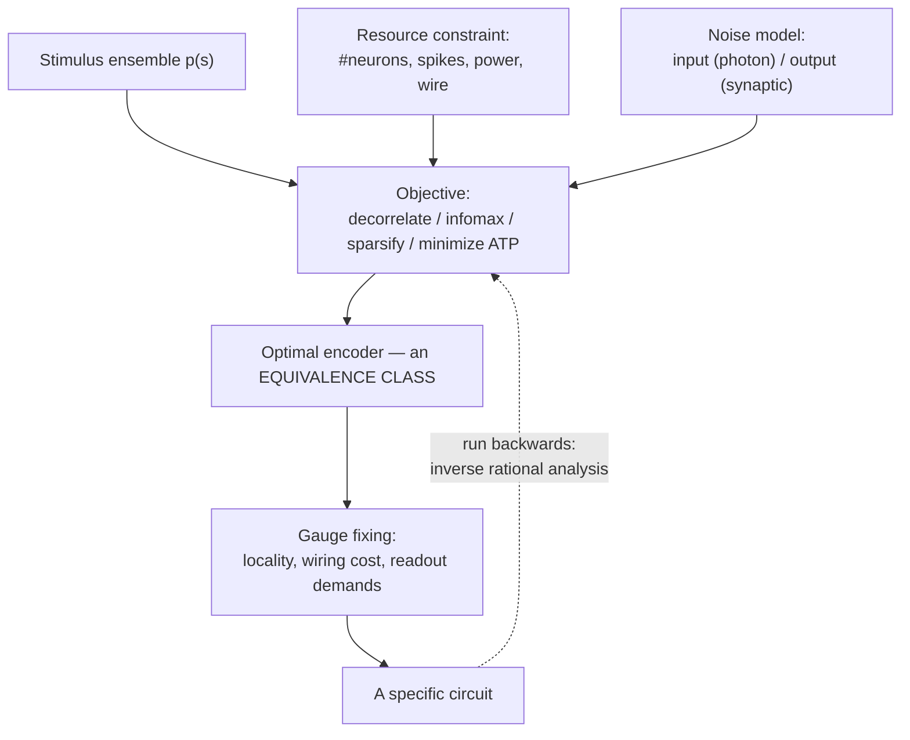

# Unit 03 — Efficient coding: deriving circuits from principles (and running the derivation backwards)

> **The conversion in one line:** *(stimulus ensemble statistics + a scarce resource + a noise model) → a receptive field* — and, run backwards, *a measured receptive field → the objective it is optimal for, if any.*

## Orientation

Every other tool in this course is descriptive: you measure a circuit, you fit a model, you ask what the model computes. Efficient coding is the one **normative** tool — it lets you compute what the circuit *should* look like before you record from it. When it works, the payoff is enormous, because a successful normative derivation does not just predict the data, it explains *why the data had to come out that way*. That is the difference between a curve fit and a physical law.

The reason to put this unit early is that efficient coding is the cleanest possible illustration of the course thesis. A normative principle never picks out a single circuit. It picks out a **level set of the objective** — an equivalence class of implementations, all of which are equally optimal. Atick and Redlich's retinal derivation, which we will do in full, determines the *amplitude* of the optimal filter at every spatial frequency and says absolutely nothing about its phase. Every all-pass filter you compose with the optimum is also optimal. The center-surround receptive field is one gauge choice out of a continuous infinity; something else in the biology — dendritic locality, wiring cost, the need for a spatially compact readout — picks the representative. Once you see this, the ladder from implementation to algorithm becomes concrete: **the algorithm is what survives the quotient by the gauge group.**

There is a second, less flattering reason to teach efficient coding carefully, which is that it is the single most over-claimed framework in systems neuroscience. Given freedom to choose the objective, the constraint, the stimulus ensemble, and the noise model, you have four knobs, and four knobs will fit a barn door. The last section of this unit is about what makes a normative claim falsifiable, and it is not optional reading. The discipline is this: a normative model earns its keep when it predicts a *relation* — how the circuit changes when the world changes — with no refitting. Atick and Redlich's prediction that the retinal surround weakens in the dark is worth more than a hundred papers showing that some learned basis "resembles" some receptive field.

---

## 1. Two ancestors, and four objectives that are not the same objective

### 1.1 Attneave and Barlow

Attneave (1954) noticed something almost embarrassingly simple: images are enormously redundant. If you know a pixel, you can guess its neighbour. He ran the experiment where subjects reconstruct an image by guessing pixel values in raster order, measured the guessing entropy, and concluded that the visual system must be exploiting this. His famous sleeping-cat figure — the cat drawn only through the points of maximum curvature of its outline, still perfectly recognizable — is the whole thesis in a picture: **information lives where prediction fails.**

Barlow (1961) turned this into a research programme. His *redundancy reduction hypothesis*: the goal of early sensory processing is to recode the input into a representation whose components are statistically independent, because (i) independence makes the subsequent job of detecting "suspicious coincidences" tractable, and (ii) an independent code is the compressed code. Barlow was careful, and later (2001) explicitly walked back the strongest reading: the goal is not to *discard* redundancy — redundancy is what makes learning possible — but to *represent it explicitly*, so that departures from it become detectable.

### 1.2 Four objectives, pairwise inequivalent

The literature slides between these constantly. They are different.

**(D) Decorrelation.** Find $W$ such that $\operatorname{Cov}(Wx)=I$. This is a *second-order* criterion, and it is massively underdetermined: if $\Sigma = \operatorname{Cov}(x)$, then $W$ whitens iff $W\Sigma W^{\mathsf T}=I$ iff
$$W = R\,\Sigma^{-1/2},\qquad R\in O(n).$$
So the solution set is a coset of the orthogonal group — $n(n-1)/2$ free parameters. PCA-whitening ($R = U^{\mathsf T}$, eigenvectors), ZCA-whitening ($R=I$, the symmetric root, which yields center-surround-like kernels), and any Gabor-like rotation of these are *all* exactly equally decorrelating.

**(I) Information maximization.** Maximize $I(y;x)$ or $I(y;s)$. For deterministic invertible maps and no output noise this is vacuous ($I$ is invariant). It only bites when there is a noise floor or a capacity constraint. Under the standard Gaussian channel with a power constraint it produces *water-filling*, which we will see is whitening-with-a-cutoff — so in the Gaussian world infomax and decorrelation nearly coincide. **In the non-Gaussian world they come apart completely**, which is the entire content of ICA.

**(S) Sparseness.** Minimize $\sum_i S(a_i)$ for concave-in-$a^2$ $S$, at fixed reconstruction error. This is a *higher-order* criterion. Crucially it can *increase* pairwise correlation: an overcomplete sparse dictionary necessarily has correlated atoms. Sparseness and decorrelation are not merely different, they are sometimes in tension.

**(M) Metabolic cost.** Minimize spikes, or ATP, per bit. Levy & Baxter (1996) and Balasubramanian, Kimber & Berry (2001) show this yields an *optimal sparseness level* — a specific firing probability, not "as sparse as possible" — because the cost per spike trades against the bits per spike. Attwell & Laughlin (2001) supplied the actual energy budget that makes the constraint quantitative.

Here is the organizing statement, which I want you to carry through the rest of the unit:

> **Second-order objectives fix the singular values of the encoding map. Higher-order objectives fix the gauge.**

Decorrelation says $W = R\Sigma^{-1/2}$ and stops. Sparseness, or independence, or any criterion sensitive to moments beyond second, is exactly what chooses $R$. This is why Gaussian-world derivations (retina, LGN) predict *spectra* and non-Gaussian-world derivations (V1) predict *shapes*.

### 1.3 The one-neuron warm-up: Laughlin's histogram equalization

Before the hard case, the easy one, because it is the template. A single neuron maps contrast $s$ to a graded response $y=g(s)$ with $g$ monotone and bounded, $y\in[0,y_{\max}]$. Response noise is small and roughly uniform in $y$. Which $g$ maximizes $I(y;s)$?

With small additive output noise of fixed magnitude, $I(y;s)= H(y) - H(\text{noise})$, and $H(\text{noise})$ is $g$-independent. So maximize $H(y)$ subject to $y\in[0,y_{\max}]$: the maximum-entropy distribution on an interval is uniform. Therefore $p_y(y)=1/y_{\max}$, and since $p_y(y) = p_s(s)/g'(s)$,
$$g'(s) = y_{\max}\,p_s(s)\quad\Longrightarrow\quad \boxed{g(s) = y_{\max}\int_{-\infty}^{s} p_s(t)\,dt = y_{\max}\,\mathrm{CDF}(s).}$$
The optimal transfer function is the cumulative distribution of the stimulus. Laughlin (1981) measured the contrast-response function of blowfly large monopolar cells and, separately, the contrast distribution of the fly's woodland habitat, and the CDF of the latter fell on top of the former. No free parameters. This is the gold standard: two independent measurements, one prediction, zero fitting.

Notice already the gauge issue in miniature. Entropy is invariant under any measure-preserving rearrangement of $[0,y_{\max}]$; monotonicity is an extra assumption smuggled in from "the readout must be simple." Hold that thought.

---

## 2. The flagship: Atick & Redlich's retina

This is the cleanest derivation of a circuit from a principle in all of neuroscience, and it deserves to be done properly rather than gestured at.

### 2.1 Setup

Natural images are, to a good approximation, translation-invariant in their second-order statistics: $\langle s(\mathbf x)s(\mathbf x')\rangle$ depends only on $\mathbf x-\mathbf x'$. **This is the load-bearing assumption of the whole derivation**, because translation invariance means the covariance operator is diagonalized by the Fourier basis. The stimulus is characterized entirely by its power spectrum, and empirically (Field 1987; Ruderman & Bialek 1994)
$$S(f)\;\propto\; f^{-2}$$
in two dimensions, over roughly two decades — the signature of scale invariance in a world made of edges and occlusion boundaries.

The photoreceptor array delivers $x(f) = s(f) + n(f)$, with input (photon/transduction) noise of flat spectrum $\langle|n|^2\rangle=N$. The ganglion cell computes $y(f) = K(f)\,x(f) + n_o(f)$, where $n_o$ is white output noise of power $N_o$ representing synaptic and spike-generation noise. The scarce resource is output dynamic range / metabolic cost, which we take proportional to output power:
$$P \;=\; \int df\; |K(f)|^2\big(S(f)+N\big).$$

### 2.2 The variational problem

Per spatial frequency this is an independent Gaussian channel, so the information rate is
$$I \;=\; \tfrac12\int df\;\log\!\left(1+\frac{|K|^2 S}{|K|^2 N + N_o}\right).$$
Write $g(f)\equiv |K(f)|^2\ge 0$ and maximize $I-\lambda P$ pointwise in $f$:
$$\mathcal L(g) \;=\; \tfrac12\log\!\big(g(S+N)+N_o\big) - \tfrac12\log\!\big(gN+N_o\big) - \lambda g (S+N).$$
Differentiate, writing $A\equiv S+N$:
$$\frac{\partial\mathcal L}{\partial g} = \frac12\left[\frac{A}{gA+N_o}-\frac{N}{gN+N_o}\right]-\lambda A = \frac12\,\frac{N_o(A-N)}{(gA+N_o)(gN+N_o)}-\lambda A .$$
Since $A-N=S$, the stationarity condition is remarkably clean:
$$(gA+N_o)(gN+N_o) \;=\; \frac{N_o\,S}{2\lambda A}.$$
This is a quadratic in $g$: $\;ANg^2 + N_o(A+N)g + N_o^2 - \frac{N_oS}{2\lambda A}=0$. Its discriminant simplifies beautifully,
$$N_o^2(A+N)^2 - 4AN\Big(N_o^2-\tfrac{N_oS}{2\lambda A}\Big) = N_o^2\underbrace{\big[(A+N)^2-4AN\big]}_{(A-N)^2=S^2} + \frac{2N_oSN}{\lambda} = N_o^2S^2+\frac{2N_oSN}{\lambda},$$
so the positive root is

$$\boxed{\;|K(f)|^2 \;=\; \left[\frac{N_o}{2N\,(S+N)}\left( S\sqrt{1+\frac{2N}{\lambda N_o S}} \;-\; S - 2N\right)\right]^{+}\;}$$

with $[\cdot]^+=\max(\cdot,0)$, since $g\ge0$. Everything about the retina we are going to claim follows from this single expression.

### 2.3 Reading the formula

**High SNR ($N\to 0$, low spatial frequency).** Expand the square root: $\sqrt{1+\epsilon}\approx 1+\epsilon/2-\epsilon^2/8$ with $\epsilon = 2N/(\lambda N_o S)$. The bracket becomes $\frac{N}{\lambda N_o}-2N-\frac{N^2}{2\lambda^2N_o^2S}+O(N^3)$, and
$$|K(f)|^2 \;\longrightarrow\; \frac{1}{2\lambda S(f)} - \frac{N_o}{S(f)}\;\;\propto\;\;\frac{1}{S(f)}.$$
**This is whitening.** With $S\propto f^{-2}$ we get $|K(f)|\propto f$: a *differentiator*, a high-pass filter, amplifying exactly in inverse proportion to how much the world supplies. The output power spectrum $|K|^2S$ is flat, which is precisely decorrelation: a flat spectrum means a delta-function autocorrelation.

**Low SNR ($S\to0$, high spatial frequency).** Now $2N/(\lambda N_oS)\gg1$ and $S\sqrt{\cdot}\approx\sqrt{2NS/(\lambda N_o)}$, which vanishes like $\sqrt S$ while the subtracted $2N$ does not. The bracket goes negative and $|K|^2=0$: **the filter cuts off.** We did not put the cutoff in by hand; the theory produced it. Solving $g>0$ exactly (square both sides of $S\sqrt{1+2N/\lambda N_oS} > S+2N$):
$$S^2+\frac{2NS}{\lambda N_o} > S^2+4NS+4N^2 \quad\Longleftrightarrow\quad \frac{S(f)}{N} \;>\; \frac{2\lambda N_o}{1-2\lambda N_o}\;\equiv\;\Theta.$$
Transmit a frequency **iff its signal-to-noise ratio exceeds a threshold $\Theta$ set by the product of the metabolic price $\lambda$ and the output noise $N_o$.** This is water-filling, in its natural habitat.

So the optimal amplitude spectrum is: rising like $f$ at low frequencies (whitening), peaking, then falling and terminating at the SNR cutoff. **Band-pass.** Atick & Redlich (1992) showed that the predicted contrast sensitivity function overlies the measured human CSF across its whole range.

### 2.4 From spectrum to receptive field — and the gauge problem

We have $|K(f)|$. We do not have $K(f)$. Any
$$K'(f) = e^{i\theta(f)}K(f)$$
has identical $|K'|$, hence identical information rate *and* identical power, hence is exactly as optimal. The objective is blind to phase. In the multidimensional statement: if $W$ is optimal then so is $RW$ for every orthogonal $R$ — the same $O(n)$ coset we met in §1.2.

Choosing $\theta\equiv0$ makes $K$ real and even, so $k(\mathbf x)$ is a real, radially symmetric, band-pass kernel: positive at the origin, negative in an annulus, decaying. A **center-surround receptive field**. Concretely, if you approximate the optimum by a difference of Gaussians in the frequency domain,
$$K(f) = e^{-f^2/2\sigma_c^2}-\beta\,e^{-f^2/2\sigma_s^2},\qquad \sigma_s<\sigma_c,$$
then $k(x)\propto \sigma_c^2 e^{-\sigma_c^2x^2/2}-\beta\sigma_s^2e^{-\sigma_s^2x^2/2}$ — the Rodieck DoG, the standard phenomenological description of ganglion cell receptive fields since 1965, here falling out as *one gauge representative* of an equivalence class of optimal filters.

Why does biology pick this one? Not because information theory says so. Because of things the objective never mentioned: dendrites are spatially local, wiring is expensive, and a zero-phase kernel is the unique choice that is simultaneously compact and symmetric. **The principle gives you the algorithm; the substrate gives you the implementation.** Everything in this course lives in that gap.

### 2.5 The prediction that makes it science: light level

Now the payoff. Dim the lights. Photon noise is Poisson, so with mean luminance $\bar L$, noise power $N\propto\bar L$ while signal power (fixed contrast) $\propto \bar L^2$. Hence
$$\mathrm{SNR}(f)=S(f)/N \;\propto\; \bar L .$$
Lowering $\bar L$ scales the whole SNR curve down. Three consequences read directly off the boxed formula, **with no refitting of any parameter**:

1. The cutoff frequency, where $S(f)/N=\Theta$, moves to *lower* $f$: acuity drops.
2. The whitening regime (where $N\ll S$) shrinks toward $f=0$, and more of the passband sits in the Wiener/low-pass regime.
3. Because the low-frequency rise is what produced the inhibitory surround, the surround *weakens*: as $\bar L\to0$ the optimal kernel loses its negative annulus and becomes a pure low-pass, purely excitatory blob.

All three are observed. Ganglion cell surrounds weaken and receptive field centers enlarge under dark adaptation; the human CSF loses its low-frequency attenuation at scotopic luminance (van Nes & Bouman 1967), turning from band-pass into low-pass. This is a *relation between two regimes predicted by one theory*, which is worth incomparably more than a fit.

The same logic applies to temporal frequency (Dong & Atick 1995 for LGN), to color (the derivation predicts that the optimal chromatic filters are the principal axes of the cone covariance, i.e. luminance and two opponent channels, and that the opponent channels should be *low-pass* spatially because chromatic SNR is worse), and to contrast adaptation (Smirnakis et al. 1997: change the contrast of the stimulus ensemble, and the retina rescales its filter — the ensemble is a variable of the theory, so this is a prediction, not an accommodation).

---

## 3. Infomax, Linsker, and the road to ICA

### 3.1 Linsker

Linsker (1988) showed that a layered network of linear units with Hebbian learning and saturating weights spontaneously develops center-surround and then orientation-selective units from *random* input — the structure comes from the correlational structure induced by the network's own architecture, not the stimulus. He then articulated the **infomax principle** (Linsker 1988, 1989): each layer should maximize the Shannon information it transmits about the layer below, subject to constraints.

For a linear map $y=Wx+n_o$ with Gaussian $x\sim\mathcal N(0,\Sigma)$ and $n_o\sim\mathcal N(0,\sigma^2I)$,
$$I(y;x)=\tfrac12\log\det\!\left(I+\tfrac{1}{\sigma^2}W\Sigma W^{\mathsf T}\right),$$
and maximizing under $\|W\|_F^2\le c$ recovers, depending on the noise level, either the leading principal subspace (high noise: put all your power on the strongest components) or water-filling toward a whitened output (low noise). **Note that these are opposite behaviours** — PCA amplifies strong components, whitening attenuates them — and which one you get depends entirely on where the noise sits. Any claim of the form "the brain does infomax, therefore whitening" is missing a noise model.

### 3.2 Bell & Sejnowski, and why infomax becomes ICA

Bell & Sejnowski (1995) made the move that mattered: put a *nonlinearity* in, and maximize the entropy of the output rather than mutual information with a noise model. Let
$$u = Wx,\qquad y_i = \phi(u_i),$$
with $\phi$ a monotone squashing function. For a deterministic invertible map, the change of variables gives $p_y(y)=p_x(x)/|\det J|$, $J=\partial y/\partial x$, hence
$$H(y) = H(x) + \mathbb E\big[\log|\det J|\big].$$
$H(x)$ is fixed, and $J = \operatorname{diag}(\phi'(u))\,W$, so
$$\max_W H(y) \;\Longleftrightarrow\; \max_W \Big\{ \log|\det W| + \sum_i \mathbb E\big[\log\phi'(u_i)\big]\Big\}.$$
Gradient: $\partial_W \log|\det W| = W^{-\mathsf T}$, and $\partial_W\mathbb E[\log\phi'(u_i)] = \mathbb E[\hat y\,x^{\mathsf T}]$ with $\hat y_i \equiv \frac{d}{du}\log\phi'(u_i)=\phi''/\phi'$. So
$$\Delta W \;\propto\; W^{-\mathsf T} + \hat y\,x^{\mathsf T},$$
and multiplying on the right by $W^{\mathsf T}W$ (Amari's natural gradient, which is the Riemannian gradient for the Fisher metric on $GL(n)$) removes the matrix inverse:
$$\Delta W \;\propto\; \big(I + \hat y\,u^{\mathsf T}\big)W .$$
This is local-ish and biologically suggestive: a Hebbian term between a nonlinear function of the output and the output, plus a decorrelating anti-Hebbian term.

**The equivalence to maximum-likelihood ICA.** Suppose the true generative model is $x=As$ with independent sources $s_i\sim p_s$. The log-likelihood of $W=A^{-1}$ given data is
$$\ell(W) = \log|\det W| + \sum_i \mathbb E\big[\log p_s(u_i)\big].$$
Compare with the infomax objective. They are **identical** provided
$$\phi'(u) = p_s(u),\quad\text{i.e.}\quad \phi = \mathrm{CDF~of~}p_s .$$
So: *infomax with a squashing nonlinearity equals maximum-likelihood ICA when the nonlinearity is the cumulative distribution of the assumed source density* (Cardoso 1997). Note that this is Laughlin's histogram-equalization result again, now appearing as the condition under which two apparently different principles coincide. That is not a coincidence — it is the same statement that the entropy-maximizing transfer function is the CDF.

The moral, restated: infomax on a *linear Gaussian* problem determines only second-order structure and leaves $R\in O(n)$ free. Adding the nonlinearity makes the objective sensitive to higher moments, which **fixes the gauge**, and the gauge it picks is the one that makes the outputs independent rather than merely uncorrelated. Run on natural image patches, ICA returns oriented, localized, band-pass filters (Bell & Sejnowski 1997; van Hateren & van der Schaaf 1998) — Gabors.

---

## 4. Olshausen & Field: deriving V1

### 4.1 The objective

Olshausen & Field (1996) posed it as a dictionary-learning problem. An image patch $I(\mathbf x)$ is generated as a linear combination of basis functions $\phi_i$ with coefficients $a_i$, and the coefficients are *sparse*:
$$E(\{a\},\{\phi\}) = \underbrace{\Big\|I - \sum_i a_i\phi_i\Big\|^2}_{\text{fidelity}} \;+\; \lambda\sum_i S\!\left(\frac{a_i}{\sigma}\right),\qquad S(a)\in\{\,|a|,\;\log(1+a^2),\;-e^{-a^2}\,\}.$$
Read it as a negative log posterior: Gaussian likelihood $p(I|a)\propto e^{-\|I-\Phi a\|^2/2\sigma_n^2}$ times a factorial heavy-tailed prior $p(a)\propto \prod_i e^{-\lambda S(a_i)}$. Minimizing $E$ over $a$ is MAP inference; minimizing the expected minimum over $\Phi$ is (approximate) maximum likelihood learning of the generative model.

### 4.2 Inference is a recurrent circuit

$$\frac{\partial E}{\partial a_i} = -2\Big\langle \phi_i, I-\Phi a\Big\rangle + \frac{\lambda}{\sigma}S'\!\left(\frac{a_i}{\sigma}\right)$$
so gradient descent gives
$$\tau\dot a_i \;=\; \underbrace{b_i}_{\phi_i^{\mathsf T}I} \;-\; \underbrace{\sum_{j\ne i} C_{ij}a_j}_{\text{lateral inhibition}} \;-\; C_{ii}a_i \;-\; \frac{\lambda}{2\sigma}S'\!\left(\frac{a_i}{\sigma}\right),\qquad C_{ij}=\phi_i^{\mathsf T}\phi_j .$$
Three things to notice. (i) The feedforward drive $b_i=\phi_i^{\mathsf T}I$ is a *filtering* operation — the neuron's "receptive field" as an experimenter would measure it is $\phi_i$, the same object as the generative basis function, only because we chose gradient descent. (ii) The recurrent connectivity is the **Gram matrix of the dictionary**: neurons with overlapping basis functions inhibit each other. This is a hard, testable structural prediction — lateral inhibition strength should track receptive-field overlap. (iii) The prior contributes a pointwise nonlinearity; for $S=|a|$ it is a soft-threshold, and the whole thing becomes Rozell et al.'s (2008) Locally Competitive Algorithm, a thresholding recurrent network provably converging to the LASSO solution.

Learning is then Hebbian on the residual: $\Delta\phi_i\propto \langle a_i\,(I-\Phi a)\rangle$ — presynaptic residual error times postsynaptic activity.

### 4.3 The epistemological point

Run this on whitened natural image patches and the learned $\phi_i$ are **localized, oriented, band-pass** — Gabor-like, tiling position, orientation and scale. Nobody put orientation into the objective. Nobody put locality into the objective. The objective contains only "reconstruct" and "use few coefficients," plus the statistics of photographs.

This must be distinguished sharply from the vast literature that *fits* Gabors to measured receptive fields. Fitting establishes that a two-dimensional Gaussian-windowed sinusoid is a compact description of V1 simple cells. Olshausen & Field establish something categorically stronger: that **if you needed a sparse code for natural images, you would have to invent V1.** The receptive field is not a fact about cortex to be catalogued; it is a consequence of a fact about the world plus a fact about what cortex is for.

Be equally clear about the limits. The claim is falsifiable at the level of the *joint distribution* of receptive field parameters, and there it does not fully succeed: Ringach (2002) measured the distribution of simple-cell receptive fields in macaque V1 in the $(n_x,n_y)$ plane of subfield counts, and the sparse-coding basis occupies a region that only partially overlaps the data — the model produces too many high-frequency, many-lobed filters and too few blob-like ones. That is exactly the right kind of failure to have: quantitative, specific, and pointing at a missing ingredient (overcompleteness ratio, noise, the choice of $S$, non-negativity, ON/OFF segregation).

### 4.4 Sparseness in vivo

Vinje & Gallant (2000) recorded V1 neurons in awake macaque while simulating natural viewing with eye-movement-driven natural movies, and varied the size of the stimulated aperture. As stimulation extended beyond the classical receptive field into the non-classical surround, responses became **sparser** (higher kurtosis, lower lifetime activity fraction) and **less correlated** across neurons. This is the in-vivo counterpart of both Barlow (decorrelation) and Olshausen & Field (sparseness), and it locates the mechanism in extra-classical surround interactions — which is exactly what §5 is about.

Simoncelli & Olshausen (2001) remains the best single review of the whole natural-image-statistics-to-neural-representation programme, and is the reading to give someone who wants the landscape in one sitting.

---

## 5. Divisive normalization as redundancy reduction between neurons

Whitening removes second-order dependency. ICA removes as much higher-order dependency as a linear map can. What is left?

Schwartz & Simoncelli (2001) answered: after linear filtering with oriented band-pass filters, the *joint* statistics of natural images retain a striking dependency — the conditional histogram of one filter response given a neighbouring one is a "bowtie": zero correlation, but the *variance* of one grows with the magnitude of the other. Formally, natural images are well described by a **Gaussian scale mixture** (GSM):
$$\mathbf L = \sqrt{v}\;\mathbf u,\qquad \mathbf u\sim\mathcal N(0,\Sigma),\quad v>0 \text{ a scalar "local contrast" with prior }p(v).$$
Marginally, $\mathbf L$ is heavy-tailed and its components are dependent. Conditionally on $v$, they are jointly Gaussian.

The redundancy-reducing transform is therefore obvious once you see the structure: **divide out the hidden scale.** If you could observe $v$, then $\mathbf L/\sqrt v = \mathbf u$ is Gaussian with fixed covariance, and a further linear whitening makes it i.i.d. Since you cannot observe $v$, estimate it from the neighbourhood:
$$\hat v \;\approx\; \frac{1}{n}\sum_j w_j L_j^2 \quad\Longrightarrow\quad R_i \;=\; \frac{L_i^2}{\sigma^2 + \sum_j w_{ij}L_j^2}.$$
That is divisive normalization, exactly as written down phenomenologically by Heeger for cortical gain control. Schwartz & Simoncelli fit the $w_{ij}$ from natural image statistics alone and predicted the pattern of surround suppression measured physiologically — including its dependence on the relative orientation and spatial frequency of center and surround.

So normalization is not a mechanism looking for a purpose. It is **the correct inference step for a GSM world**, and simultaneously the redundancy-reduction step that linear methods cannot perform. Carandini & Heeger (2012) argue that it is a canonical computation appearing in essentially every sensory system and many non-sensory ones. Keep it in mind when we get to olfaction, where you will meet it again in a very different circuit.

---

## 6. Ganguli & Simoncelli: how many neurons should point where?

Efficient coding so far has been about *filters*. This is efficient coding about *tuning curve allocation*, and it is the most elegant piece of information geometry in the field.

### 6.1 Setup: a warped homogeneous population

Let the stimulus be a scalar $s$ with prior $p(s)$ (orientation, frequency, speed, direction — anything with an ordered one-dimensional structure). We have $N$ neurons. Parametrize the population by two smooth functions:

- a **density** $d(s)\ge0$, neurons per unit stimulus, with $\int d(s)\,ds = N$;
- a **gain** $g(s)\ge0$, the amplitude of the tuning curves near $s$.

Define the warping $F(s) = \frac1N\int_{-\infty}^s d(t)\,dt$, a monotone map onto $[0,1]$, and place tuning curves at unit spacing in the warped coordinate:
$$h_n(s) \;=\; g(s)\,\phi\big(N F(s) - n\big),\qquad n=1,\dots,N,$$
with $\phi$ a fixed bump of unit integral. This is the general "smoothly inhomogeneous population": $d$ says where neurons are dense, $g$ says how hard they fire.

Two useful facts. First, total population activity at stimulus $s$ is
$$\sum_n h_n(s) = g(s)\sum_n \phi\big(NF(s)-n\big)\;\approx\; g(s)\int\phi(u)\,du = g(s),$$
by Poisson summation when $\phi$ is broad relative to the unit spacing. So **the gain, not the density, is the spike budget.** Second — the main computation:

### 6.2 Fisher information of the warped population

Assume independent Poisson spiking over a window $T$, so
$$J(s) = T\sum_n \frac{h_n'(s)^2}{h_n(s)}.$$
Differentiate, using $NF'(s)=d(s)$:
$$h_n'(s) = g'(s)\,\phi(u_n) + g(s)\,d(s)\,\phi'(u_n),\qquad u_n = NF(s)-n .$$
Then
$$\frac{h_n'^2}{h_n} = \frac{\big[g'\phi(u_n)+g\,d\,\phi'(u_n)\big]^2}{g\,\phi(u_n)} .$$
In the dense limit replace $\sum_n\to\int du$ (again Poisson summation; the spacing is $1$ in $u$):
$$J(s) = T\int du\;\frac{\big[g'\phi+g d\phi'\big]^2}{g\phi} = T\left[\frac{g'^2}{g}\underbrace{\int\phi}_{=1} + 2g'd\underbrace{\int\phi'}_{=0} + g\,d^2\underbrace{\int\frac{\phi'^2}{\phi}}_{\equiv\,c}\right].$$
The cross-term dies because $\phi$ decays. If the gain varies slowly on the scale of a tuning width — which is the whole point of calling this a *smoothly* inhomogeneous population — the first term is negligible, and we have the key result:

$$\boxed{\;J(s)\;\approx\;c\,T\,g(s)\,d(s)^2,\qquad c=\int \frac{\phi'(u)^2}{\phi(u)}\,du = 4\int\Big(\tfrac{d}{du}\sqrt{\phi}\Big)^2du\;}$$

The constant $c$ is the translation Fisher information of the tuning-curve *shape*; it is the only way the shape enters. Fisher information is linear in gain (spikes) and **quadratic in density** (neurons). That asymmetry is itself a result: neurons are a better buy than spikes, at the margin.

### 6.3 The allocation problem

Fix $g$ constant and optimize $d$ under $\int d = N$. Using the asymptotic (Cramér–Rao / van Trees) relation between Fisher information and discriminability, the local discrimination threshold is
$$\delta(s)\;\propto\; J(s)^{-1/2}\;\propto\; d(s)^{-1}.$$
Now choose a loss. Take the family $L_\alpha = \int p(s)\,\delta(s)^\alpha\,ds$ and minimize subject to the neuron budget. With $\delta\propto 1/d$,
$$\frac{\partial}{\partial d}\Big[p(s)\,d^{-\alpha} + \mu\, d\Big]=0 \;\Longrightarrow\; -\alpha\,p\,d^{-\alpha-1}+\mu = 0 \;\Longrightarrow\; \boxed{\;d(s)\;\propto\;p(s)^{\frac{1}{\alpha+1}}\;}$$

Read off the special cases:

| Loss | $\alpha$ | Optimal density | Classical name |
|---|---|---|---|
| Mean squared error | $2$ | $d\propto p^{1/3}$ | Bennett/Panter–Dite quantizer |
| Mean absolute error | $1$ | $d\propto p^{1/2}$ | |
| Mutual information | $\to 0$ | $d\propto p$ | histogram equalization |

The infomax case deserves its own derivation because the limit is delicate. Asymptotically,
$$I(s;\mathbf r)\;\approx\; H(s) - \tfrac12\,\mathbb E_p\!\left[\log\frac{2\pi e}{J(s)}\right] = \text{const} + \tfrac12\int p(s)\log J(s)\,ds,$$
so maximize $\int p\log d$ subject to $\int d = N$: stationarity gives $p(s)/d(s)=\mu$, i.e.
$$\boxed{\;d(s)\;\propto\;p(s)\;}$$
**Allocate neurons in proportion to probability.** And then $F(s)$, the warping, is literally the CDF of the prior. Laughlin's single neuron, promoted to a population.

### 6.4 The information-geometric reading

This is where it becomes beautiful. Fisher information is a **Riemannian metric** on the one-dimensional stimulus manifold: $ds_{\mathrm{Fisher}} = \sqrt{J(s)}\,ds$ is arc length measured in units of discriminability. (In higher dimensions, $g_{ij}(s)=J_{ij}(s)$, and the geodesic distance is the natural "how many just-noticeable differences apart" metric; the Fisher–Rao metric is, by Chentsov's theorem, the unique metric on statistical manifolds invariant under sufficient statistics — the reason it is *the* right notion of distance in a coding problem rather than *a* notion.) The total number of distinguishable stimuli is then, up to constants, the Fisher volume $\int\sqrt{J(s)}\,ds$, which is exactly the normalizer of the **Jeffreys prior**.

Now substitute the infomax solution $d\propto p$: since $\sqrt{J}\propto d$,
$$\sqrt{J(s)}\,ds \;\propto\; p(s)\,ds = dP(s).$$
**The optimal code is the one that makes Fisher arc length equal to probability mass.** Equal-probability intervals become equal-discriminability intervals. Equivalently: in the coordinate $\tilde s = F(s)$, the metric is flat and the prior is uniform — the code straightens out the geometry of the world. Equivalently again: the Jeffreys prior of the resulting encoder *is* the true prior, a self-consistency condition. This is the same object that appears in the reference-prior construction in Bayesian statistics and in the minimum-description-length asymptotics of Clarke & Barron; it is not an analogy, it is the same theorem wearing a lab coat.

### 6.5 Predictions

- **Discrimination thresholds:** $\delta(s)\propto 1/p(s)$ under infomax. Test: measure environmental statistics of orientation (cardinal-dominated in carpentered and natural scenes) and measure orientation discrimination. Girshick, Landy & Simoncelli (2011) did exactly this and found both the threshold pattern and, more impressively, the *bias* pattern predicted by combining efficient coding with Bayesian decoding.
- **"Anti-Bayesian" biases:** naive Bayes says percepts are attracted to the prior peak. Wei & Stocker (2015) showed that an efficient encoder followed by a Bayesian decoder produces *repulsion* from the prior peak, and derived a lawful relation between the bias and the derivative of the discrimination threshold — a parameter-free link between two independently measurable psychophysical functions. This is the model of what a good normative prediction looks like.
- **Population heterogeneity:** the theory predicts that tuning widths, densities and amplitudes should all covary with $p(s)$ in a specific coupled way, not independently. Homogeneous populations are the *suboptimal* case.

---

## 7. Olfaction: where the derivations break, and what breaks them

Everything above leaned on one thing: **the stimulus space had a metric, and usually a group acting on it.** Translation invariance handed us the Fourier basis for free. Scale invariance handed us the $1/f^2$ spectrum. Orientation is a circle with a natural distance. Ganguli–Simoncelli needs an ordered $s$ so that "density of tuning curves" means something.

Odor space has none of this — or rather, and more precisely, it has no metric *handed to you by a symmetry of the physics*. Two molecules differing by one carbon can smell entirely different; two structurally unrelated molecules can be indistinguishable. There is no natural topography and no translation group, so there is nothing to diagonalize the covariance and nothing to define "nearby stimuli" a priori.

This is not the same as saying odor space is structureless. There are serious proposals for what its geometry actually is — most interestingly that it is approximately *hyperbolic*, because odorant statistics are generated by tree-like biochemical pathways and trees embed into hyperbolic space with almost no distortion (see [`../structures/README.md`](../structures/README.md), the hyperbolic-odour-space entry). But a metric you must *discover empirically* plays a completely different role in a derivation than a metric *given by a symmetry group*: the former is a hypothesis to be tested, the latter is a free lunch. Efficient coding in vision ate that lunch.

### 7.1 What is missing

Consequences of losing the symmetry, in order of severity:

1. **No symmetry-provided eigenbasis.** The covariance of receptor activations is not diagonalized by anything you know a priori. Whitening is still definable — the antennal lobe or bulb could implement $R\Sigma^{-1/2}$ — but you must *learn* $\Sigma$ from experience rather than inherit it from physics. This raises the biological cost of efficient coding from "wire up a Mexican hat" to "estimate an $M\times M$ covariance and invert it," and it predicts that olfactory decorrelation should be experience-dependent in a way that retinal center-surround is not.
2. **No power spectrum, hence no Atick–Redlich.** The entire $S(f)$ machinery presupposes stationarity in a continuous index. There is no odor analogue of spatial frequency. The best you can do is spectral analysis of the *receptor covariance matrix*, which is a fact about receptor–ligand chemistry rather than about the world.
3. **Tuning-curve allocation is ill-posed.** $d(s)\propto p(s)$ requires "neurons per unit $s$." In a combinatorial space you would need the prior over *subsets* and a notion of local neighbourhood, and the natural replacement is a statement about **how many receptors of each type**, given the distribution of odor mixtures — which is a compressed-sensing question, not a differential-geometry question.
4. **The natural stimulus is intermittent and turbulent.** Odor plumes are filamentous; concentration time series are heavy-tailed, bursty, and dominated by blank intervals (Celani, Villermaux & Vergassola 2014). The relevant prior is over *temporal* structure and over *sparse mixtures*, not over a static image ensemble. That is why olfactory efficient-coding arguments keep turning into arguments about timing.

What you lose, in one sentence: **you lose the ability to compute the optimal code in closed form, and with it the ability to make parameter-free predictions of the Atick–Redlich kind.** What you gain is that the remaining structure — sparsity — is exactly the structure that compressed sensing was built for.

### 7.2 Decorrelation and normalization in olfactory circuits, empirically

- **Zebrafish olfactory bulb.** Friedrich & Laurent (2001) showed that mitral cell population responses to chemically similar odors start out highly correlated and *decorrelate over a few hundred milliseconds* through slow patterning driven by interneuron circuitry. Redundancy reduction unfolding in time rather than being computed instantaneously by a fixed filter — a genuinely different algorithmic style than the retina's.
- **Drosophila antennal lobe.** Olsen & Wilson (2008) identified presynaptic lateral inhibition mediating gain control across glomeruli; Olsen, Bhandawat & Wilson (2010) showed the projection neuron transformation is quantitatively a **divisive normalization** by total antennal lobe activity. Same equation as §5, different molecules, different purpose-in-the-large: here it produces concentration-invariance and expands the dynamic range of the population code.
- **Locust mushroom body.** Perez-Orive et al. (2002) showed that the projection-neuron code (dense, oscillatory, distributed) is transformed into an extremely sparse Kenyon cell code, and that the sparsification depends on (i) the oscillatory cycle acting as an integration window enforcing coincidence detection and (ii) feedback inhibition. Papadopoulou et al. (2011) identified the giant GABAergic neuron (GGN) implementing normalization-for-sparseness explicitly: a single wide-field interneuron summing KC activity and dividing it back out. That is a **one-neuron implementation of the denominator in the normalization equation**, which is about as clean a circuit-to-algorithm mapping as exists anywhere. And Stopfer et al. (1997) showed that abolishing the oscillatory synchrony — without changing firing rates — impairs *fine* odor discrimination, which is the behavioural evidence that the temporal structure is carrying coding load.

### 7.3 The compressed-sensing framing

Model the world as: $N$ possible monomolecular odorants, of which only $k\ll N$ are present at any moment, at concentrations $\mathbf c\in\mathbb R_{\ge0}^N$ with $\|\mathbf c\|_0=k$. There are $M$ receptor types with affinity matrix $W\in\mathbb R^{M\times N}$, giving glomerular activation
$$\mathbf r = f(W\mathbf c) + \text{noise}.$$
For $M\ll N$ this is a badly underdetermined linear system — *unless* $\mathbf c$ is sparse, in which case the compressed-sensing theorems apply: with a suitably incoherent (e.g. random-ish, disordered) $W$, $\ell_1$ minimization recovers $\mathbf c$ exactly from
$$M \;\gtrsim\; C\,k\,\log(N/k)$$
measurements. Plug in the fly: $M\approx 50$ receptor types, $N\sim10^4$ volatiles, $C\approx2$, and you get $k\approx 3$ — the fly can in principle demix about three simultaneous odorants. Plug in the mouse: $M\approx10^3$, and $k$ climbs to order $10^2$. These numbers are suspiciously close to the psychophysical limits on how many components humans can resolve in a mixture, which is either a triumph or a coincidence, and honest people disagree.

The relevant strand of theory: Ganguli & Sompolinsky (2012) for the general neuroscience-facing treatment; Zwicker, Murugan & Brenner (2016) for optimizing the *receptor affinity distribution* against natural odor statistics; Krishnamurthy and colleagues on why **disorder** in receptor–ligand affinities is a feature (it is what makes $W$ incoherent, hence invertible on sparse vectors) rather than sloppy biology; and Dasgupta, Stevens & Navlakha (2017), who read the fly circuit — random expansive projection from 50 glomeruli to 2000 Kenyon cells, followed by winner-take-all — as a **locality-sensitive hashing** algorithm, and then showed it outperforms conventional LSH on standard machine-learning benchmarks. That last paper is worth studying as a methodological exemplar: it climbs from circuit to algorithm and then *tests the algorithm outside biology entirely*, which is the strongest possible evidence that you have extracted the right equivalence class.

Note the important structural point: this efficient-coding argument does not derive a *receptive field*. It derives a *statistical property of the ensemble of receptive fields* — that affinities should be broad, heterogeneous, and as close to incoherent as chemistry allows. That is the correct form for a normative claim in a space without a metric, and you should not be disappointed that it is weaker. It is weaker because the problem gives you less.

### 7.4 The primacy code

Koulakov, Rinberg and colleagues (Wilson, Serrano, Koulakov & Rinberg 2017) proposed a different and rather beautiful answer to the concentration-invariance problem: encode odor identity by **which glomeruli respond earliest**, i.e. by the identity of the first $p$ receptors to cross threshold after sniff onset. Since increasing concentration shifts all latencies earlier roughly monotonically without much reordering, the *rank order* of the earliest responders is approximately concentration-invariant, while the *set* of active glomeruli is not.

This is a lovely example of an algorithm that solves an efficient-coding problem using a resource — spike timing relative to a sniff-locked reference — that the standard rate-based framework does not even have a variable for. It also connects directly to the locust: if the oscillation provides the reference clock, "primacy within a cycle" and "phase of firing" are the same currency. Whether the mammalian olfactory system actually decodes primacy remains contested; the point for this course is the *form* of the hypothesis, not its truth value.

---

## 8. The honest critique: what makes a normative claim falsifiable

Efficient coding has four free choices — objective, constraint, ensemble, noise model — and I have been careful throughout to show you how much each one does. Change the noise model and infomax flips from PCA to whitening. Change $\alpha$ in the loss and the optimal tuning density goes from $p^{1/3}$ to $p$. Change $S(\cdot)$ and sparse coding gives you different Gabors. Chalk, Marre & Tkačik (2018) made this worry precise and rigorous: they exhibit a *single* objective family with one interpolating parameter whose optima sweep continuously from sparse coding through decorrelation to predictive coding. The frameworks that the field treats as competing hypotheses are points on a line.

So: when is a normative model doing work?

**1. It predicts a relation, not a datum.** "The optimal filter is band-pass" is nearly unfalsifiable. "The surround/center ratio must decrease as $\bar L^{-1}$ in this specific way, with the parameters already fixed by the photopic data" is a real prediction. The unit of falsifiable content is the *derivative of the prediction with respect to a manipulable variable of the world.*

**2. It predicts a distribution, not a mean.** Anyone can produce something Gabor-ish. Ringach's scatter plot of $(n_x,n_y)$ is a demanding target because it constrains the whole population. Similarly, Ganguli–Simoncelli constrains the coupling between density, width and gain, not any one of them.

**3. It survives an ensemble manipulation.** The stimulus ensemble is a *variable* of the theory, and it is under your control. Rear an animal in an altered statistical environment; adapt to a modified contrast or orientation distribution; and the theory must predict the resulting recoding with no new parameters. Smirnakis et al. (1997) is the template.

**4. It transfers.** A model fit on one species/area and evaluated on another has done something. Dasgupta et al. taking the fly algorithm to MNIST is an extreme and admirable version.

**5. Beware fitting the objective.** If you infer the objective *from* the data and then announce that the circuit optimizes it, you have performed inverse optimal control, not explanation. This can still be valuable — Młynarski, Hledík, Sokołowski & Tkačik (2021) lay out how to do the statistics properly, including how to compare a system's performance to the optimum with calibrated uncertainty, and how to place a system on the Pareto front of competing objectives rather than declaring one winner. **Running the derivation backwards is legitimate; pretending you ran it forwards is not.**

**6. Watch the gauge.** A large fraction of apparent successes are cases where the objective determines a spectrum and the author quietly imposes locality, symmetry or non-negativity to get from the equivalence class to the picture in the figure. That extra step is *doing real explanatory work and should be stated as an assumption.* Whenever you read an efficient-coding paper, ask: what group acts on the solution set, and what broke the symmetry?

That question is, in miniature, the entire subject of this course.

---

## Mathematical structure spotlight

**The whitening gauge group.** The set of whitening maps is the coset $O(n)\cdot\Sigma^{-1/2}$ — a principal homogeneous space for $O(n)$. Second-order objectives are constant on this orbit; the orbit *is* the algorithmic equivalence class, and every additional constraint (locality, sparsity, non-negativity, minimum wiring) is a partial section of the bundle. In the stationary/translation-invariant case the group is smaller and prettier: it is the group of all-pass filters $\{e^{i\theta(f)}\}$, an infinite-dimensional torus. This is the *invariant problem* in the taxonomy of [`../structures/README.md`](../structures/README.md): the objective determines a quantity only up to a group action, so the meaningful content of the theory is whatever is invariant under it.

**Fisher–Rao geometry.** $J(s)\,ds^2$ is a Riemannian metric on stimulus space; by Chentsov's theorem it is the *unique* (up to scale) metric invariant under sufficient statistics, which is why "discriminability" is a geometric rather than a conventional notion. Optimal coding is the statement that the encoder pulls back a flat metric under the CDF map, i.e. $\sqrt{J}\,ds \propto dP$. The Jeffreys prior $\propto\sqrt{J}$ becoming self-consistently equal to the true prior is the fixed point. This is the "wrong geometry" predicament of [`../structures/README.md`](../structures/README.md) in its benign form — here the right geometry is known in closed form; in olfaction it is not.

**Legendre duality lurking.** Water-filling, $\ell_1$ recovery, and the exponential-family manipulations of Unit 04 are all Fenchel-duality statements. The retinal solution is the KKT point of a concave program; the sparse-coding solution is the KKT point of a convex one; the primal/dual pair for olfactory demixing (Unit 04, §10) is the same machinery.

**Gaussian scale mixtures and the elliptical family.** $\mathbf L=\sqrt v\,\mathbf u$ is the simplest departure from Gaussianity that preserves the "no correlation" structure while creating higher-order dependence; the whole family of elliptically symmetric distributions behaves this way, and divisive normalization is the canonical sufficient-statistic computation for it.

**Poisson summation.** Used twice above (population sum $\approx$ integral; Fisher information of a warped array). It is what makes "dense population" arguments exact rather than hand-wavy, and it is the reason the tuning-curve *shape* enters only through the single scalar $c=\int\phi'^2/\phi$.

> See [`../structures/README.md`](../structures/README.md) for the running index of mathematical structures this course leans on.

---

## What this buys you as an algorithmist

1. **A generative recipe for hypotheses.** Given any circuit, you can now ask: what ensemble, objective, constraint and noise model would make this optimal? That is a search over a small, structured space, and it usually produces two or three candidates you can then discriminate experimentally.

2. **A principled account of why circuits differ across conditions.** Adaptation, state changes, light level, arousal — all of these are changes in the *arguments* of the optimization, and a normative model turns them into predictions rather than phenomena.

3. **The habit of asking what the objective does not determine.** The gauge group is the algorithmic equivalence class. Two circuits related by a gauge transformation implement the same algorithm; two circuits on different level sets do not. This is the operational definition of "same algorithm" that the rest of the course will use.

4. **Calibrated skepticism.** You will not be impressed by "our model learns Gabors" ever again, and you will know exactly which four questions to ask instead.

5. **A translation table for olfaction.** Metric-space methods (spectra, tuning densities) fail; combinatorial methods (sparsity, incoherence, rank order, hashing) work. Knowing *why* the first class fails tells you what a genuine olfactory efficient-coding theory has to supply: a prior over sparse mixtures, a temporal model of plume statistics, and a readout-defined loss.

---

## Reading

### Core
- Attneave, F. (1954). "Some informational aspects of visual perception." *Psychological Review* 61(3), 183–193.
- Barlow, H. B. (1961). "Possible principles underlying the transformation of sensory messages." In W. Rosenblith (ed.), *Sensory Communication*, MIT Press, 217–234.
- Laughlin, S. (1981). "A simple coding procedure enhances a neuron's information capacity." *Zeitschrift für Naturforschung C* 36(9–10), 910–912.
- Atick, J. J. & Redlich, A. N. (1990). "Towards a theory of early visual processing." *Neural Computation* 2(3), 308–320.
- Atick, J. J. & Redlich, A. N. (1992). "What does the retina know about natural scenes?" *Neural Computation* 4(2), 196–210.
- Olshausen, B. A. & Field, D. J. (1996). "Emergence of simple-cell receptive field properties by learning a sparse code for natural images." *Nature* 381, 607–609.
- Simoncelli, E. P. & Olshausen, B. A. (2001). "Natural image statistics and neural representation." *Annual Review of Neuroscience* 24, 1193–1216.
- Ganguli, D. & Simoncelli, E. P. (2014). "Efficient sensory encoding and Bayesian inference with heterogeneous neural populations." *Neural Computation* 26(10), 2103–2134.

### Deeper
- Bell, A. J. & Sejnowski, T. J. (1995). "An information-maximization approach to blind separation and blind deconvolution." *Neural Computation* 7(6), 1129–1159.
- Bell, A. J. & Sejnowski, T. J. (1997). "The 'independent components' of natural scenes are edge filters." *Vision Research* 37(23), 3327–3338.
- Cardoso, J.-F. (1997). "Infomax and maximum likelihood for blind source separation." *IEEE Signal Processing Letters* 4(4), 112–114.
- Olshausen, B. A. & Field, D. J. (1997). "Sparse coding with an overcomplete basis set: a strategy employed by V1?" *Vision Research* 37(23), 3311–3325.
- Schwartz, O. & Simoncelli, E. P. (2001). "Natural signal statistics and sensory gain control." *Nature Neuroscience* 4(8), 819–825.
- Rozell, C. J., Johnson, D. H., Baraniuk, R. G. & Olshausen, B. A. (2008). "Sparse coding via thresholding and local competition in neural circuits." *Neural Computation* 20(10), 2526–2563.
- Karklin, Y. & Simoncelli, E. P. (2011). "Efficient coding of natural images with a population of noisy linear-nonlinear neurons." *Advances in Neural Information Processing Systems* 24.
- Carandini, M. & Heeger, D. J. (2012). "Normalization as a canonical neural computation." *Nature Reviews Neuroscience* 13(1), 51–62.
- Ganguli, S. & Sompolinsky, H. (2012). "Compressed sensing, sparsity, and dimensionality in neuronal information processing and data analysis." *Annual Review of Neuroscience* 35, 485–508.
- Wei, X.-X. & Stocker, A. A. (2015). "A Bayesian observer model constrained by efficient coding can explain 'anti-Bayesian' percepts." *Nature Neuroscience* 18(10), 1509–1517.
- Chalk, M., Marre, O. & Tkačik, G. (2018). "Toward a unified theory of efficient, predictive, and sparse coding." *PNAS* 115(1), 186–191.
- Młynarski, W., Hledík, M., Sokołowski, T. R. & Tkačik, G. (2021). "Statistical analysis and optimality of neural systems." *Neuron* 109(8), 1227–1241.

**Olfaction**
- Stopfer, M., Bhagavan, S., Smith, B. H. & Laurent, G. (1997). "Impaired odour discrimination on desynchronization of odour-encoding neural assemblies." *Nature* 390, 70–74.
- Friedrich, R. W. & Laurent, G. (2001). "Dynamic optimization of odor representations by slow temporal patterning of mitral cell activity." *Science* 291(5505), 889–894.
- Perez-Orive, J., Mazor, O., Turner, G. C., Cassenaer, S., Wilson, R. I. & Laurent, G. (2002). "Oscillations and sparsening of odor representations in the mushroom body." *Science* 297(5580), 359–365.
- Olsen, S. R. & Wilson, R. I. (2008). "Lateral presynaptic inhibition mediates gain control in an olfactory circuit." *Nature* 452, 956–960.
- Olsen, S. R., Bhandawat, V. & Wilson, R. I. (2010). "Divisive normalization in olfactory population codes." *Neuron* 66(2), 287–299.
- Papadopoulou, M., Cassenaer, S., Nowotny, T. & Laurent, G. (2011). "Normalization for sparse encoding of odors by a wide-field interneuron." *Science* 332(6030), 721–725.
- Celani, A., Villermaux, E. & Vergassola, M. (2014). "Odor landscapes in turbulent environments." *Physical Review X* 4, 041015.
- Meister, M. (2015). "On the dimensionality of odor space." *eLife* 4, e07865.
- Zwicker, D., Murugan, A. & Brenner, M. P. (2016). "Receptor arrays optimized for natural odor statistics." *PNAS* 113(20), 5570–5575.
- Wilson, C. D., Serrano, G. O., Koulakov, A. A. & Rinberg, D. (2017). "A primacy code for odor identity." *Nature Communications* 8, 1477.
- Dasgupta, S., Stevens, C. F. & Navlakha, S. (2017). "A neural algorithm for a fundamental computing problem." *Science* 358(6364), 793–796.
- Krishnamurthy, K., Hermundstad, A. M., Mora, T., Walczak, A. M. & Balasubramanian, V. (2022). "Disorder and the neural representation of complex odors." *Frontiers in Computational Neuroscience* 16, 917786.
- Zhang, Y. & Sharpee, T. O. (2016). "A robust feedforward model of the olfactory system." *PLoS Computational Biology* 12(4), e1004850.

### Historical
- Shannon, C. E. (1948). "A mathematical theory of communication." *Bell System Technical Journal* 27, 379–423 & 623–656.
- Linsker, R. (1988). "Self-organization in a perceptual network." *Computer* 21(3), 105–117.
- van Nes, F. L. & Bouman, M. A. (1967). "Spatial modulation transfer in the human eye." *JOSA* 57(3), 401–406.
- Srinivasan, M. V., Laughlin, S. B. & Dubs, A. (1982). "Predictive coding: a fresh view of inhibition in the retina." *Proceedings of the Royal Society B* 216(1205), 427–459.
- Field, D. J. (1987). "Relations between the statistics of natural images and the response properties of cortical cells." *JOSA A* 4(12), 2379–2394.
- Ruderman, D. L. & Bialek, W. (1994). "Statistics of natural images: scaling in the woods." *Physical Review Letters* 73(6), 814–817.
- Dong, D. W. & Atick, J. J. (1995). "Temporal decorrelation: a theory of lagged and nonlagged responses in the lateral geniculate nucleus." *Network: Computation in Neural Systems* 6(2), 159–178.
- Levy, W. B. & Baxter, R. A. (1996). "Energy efficient neural codes." *Neural Computation* 8(3), 531–543.
- Smirnakis, S. M., Berry, M. J., Warland, D. K., Bialek, W. & Meister, M. (1997). "Adaptation of retinal processing to image contrast and spatial scale." *Nature* 386, 69–73.
- van Hateren, J. H. & van der Schaaf, A. (1998). "Independent component filters of natural images compared with simple cells in primary visual cortex." *Proceedings of the Royal Society B* 265(1394), 359–366.
- Vinje, W. E. & Gallant, J. L. (2000). "Sparse coding and decorrelation in primary visual cortex during natural vision." *Science* 287(5456), 1273–1276.
- Attwell, D. & Laughlin, S. B. (2001). "An energy budget for signaling in the grey matter of the brain." *Journal of Cerebral Blood Flow & Metabolism* 21(10), 1133–1145.
- Balasubramanian, V., Kimber, D. & Berry, M. J. (2001). "Metabolically efficient information processing." *Neural Computation* 13(4), 799–815.
- Barlow, H. B. (2001). "Redundancy reduction revisited." *Network: Computation in Neural Systems* 12(3), 241–253.
- Ringach, D. L. (2002). "Spatial structure and symmetry of simple-cell receptive fields in macaque primary visual cortex." *Journal of Neurophysiology* 88(1), 455–463.
- Girshick, A. R., Landy, M. S. & Simoncelli, E. P. (2011). "Cardinal rules: visual orientation perception reflects knowledge of environmental statistics." *Nature Neuroscience* 14(7), 926–932.

---

## Exercises
**E3.1 (★) The gauge group of whitening.**
Let $x\in\mathbb R^n$ with covariance $\Sigma\succ0$. Prove that $W$ satisfies $\operatorname{Cov}(Wx)=I$ iff $W=R\Sigma^{-1/2}$ for some $R\in O(n)$. Count the dimension of the solution set. Then show that the symmetric choice ($R=I$, "ZCA") is the unique whitening map minimizing $\mathbb E\|Wx-x\|^2$, and explain in one sentence why that makes it the "most center-surround-like" option.

Solution

$\operatorname{Cov}(Wx)=W\Sigma W^{\mathsf T}=I$. Let $A=W\Sigma^{1/2}$ (with $\Sigma^{1/2}$ the symmetric positive root). Then $AA^{\mathsf T}=I$, i.e. $A\in O(n)$, so $W=A\Sigma^{-1/2}$ with $A=R$ arbitrary orthogonal; conversely any such $W$ whitens. The solution set is a coset of $O(n)$, of dimension $n(n-1)/2$ (the dimension of the orthogonal group), embedded in the $n^2$-dimensional space of matrices — so whitening imposes $n(n+1)/2$ constraints, precisely the number of independent entries of a symmetric covariance.
For the ZCA claim: minimize $\mathbb E\|Wx-x\|^2 = \operatorname{tr}\big[(W-I)\Sigma(W-I)^{\mathsf T}\big]$ over $W=R\Sigma^{-1/2}$. Expanding, $\operatorname{tr}[W\Sigma W^{\mathsf T}] - 2\operatorname{tr}[W\Sigma]+\operatorname{tr}\Sigma = n - 2\operatorname{tr}[R\Sigma^{1/2}]+\operatorname{tr}\Sigma$, so we must maximize $\operatorname{tr}[R\Sigma^{1/2}]$ over $R\in O(n)$. By von Neumann's trace inequality (or the SVD of $\Sigma^{1/2}=U\Lambda^{1/2}U^{\mathsf T}$: $\operatorname{tr}[RU\Lambda^{1/2}U^{\mathsf T}]=\operatorname{tr}[U^{\mathsf T}RU\Lambda^{1/2}]\le\sum_i\lambda_i^{1/2}$ with equality iff $U^{\mathsf T}RU=I$), the maximum is at $R=I$. ZCA is the whitening map closest to the identity, hence the one that preserves the spatial layout of the input; a kernel that is "identity minus a smooth blur" is exactly a center-surround.

**E3.2 (★★) The Atick–Redlich optimum, exactly.**
Starting from $I-\lambda P$ as in §2.2, rederive the boxed expression for $|K(f)|^2$. Then (a) take the two limits carefully: the *signal-dominated* limit $N\to0$ at fixed $N_o$, and the *free-information* limit $N_o\to0$ at fixed $N,\lambda$. One of them gives whitening; the other gives something you should be able to explain in a sentence. Which is which, and why is it a common source of confusion to say "infomax implies whitening"? (b) show the cutoff condition $S/N>\Theta$ with $\Theta = 2\lambda N_o/(1-2\lambda N_o)$ and interpret the requirement $\lambda N_o<1/2$; (c) show that the optimum can be factored as $|K|^2 = \frac{1}{S+N}\cdot\Psi(S/N)$ for some function $\Psi$, i.e. "whiten the input, then apply an SNR-dependent taper," and identify $\Psi$.

Solution

The derivation is in §2.2; carry it out yourself and check the discriminant simplification $ (A+N)^2-4AN=(A-N)^2=S^2$.
(a) *Signal-dominated limit,* $N\to0$ at fixed $N_o$: expanding as in §2.3, $|K|^2\to \frac{1}{2\lambda S}-\frac{N_o}{S}\propto 1/S$. **Whitening.**
*Free-information limit,* $N_o\to0$ at fixed $N,\lambda$: now $\frac{2N}{\lambda N_oS}\to\infty$, so $S\sqrt{1+\cdot}\approx\sqrt{2NS/(\lambda N_o)}$ and
$$g\approx\frac{N_o}{2N(S+N)}\sqrt{\frac{2NS}{\lambda N_o}}=\frac{1}{S+N}\sqrt{\frac{N_oS}{2\lambda N}}\;\longrightarrow\;0 .$$
With no output noise, information costs nothing to transmit at arbitrarily small amplitude, so the power-constrained optimum spends nothing: the gain collapses while the *information* stays finite. The moral: **whitening is a property of the signal-dominated regime, not a consequence of infomax per se.** "Infomax implies whitening" is true only when there is a hard output-noise floor and the input SNR is high; flip either condition and you get either water-filling-onto-the-strongest-components (high input noise) or a degenerate answer (no output noise). Most confusion in the literature comes from quoting the conclusion without the two conditions.
(b) $g>0$ iff $S\sqrt{1+2N/(\lambda N_oS)}>S+2N$. Both sides positive, so square: $S^2+2NS/(\lambda N_o)>S^2+4NS+4N^2$, i.e. $2S/(\lambda N_o)>4S+4N$, i.e. $S\big(\tfrac{2}{\lambda N_o}-4\big)>4N$. This has a solution only if $\lambda N_o<1/2$; otherwise the marginal information gained per unit power never exceeds the price and the optimal filter is identically zero. Given $\lambda N_o<1/2$, divide: $S/N>\frac{4}{2/(\lambda N_o)-4}=\frac{2\lambda N_o}{1-2\lambda N_o}=\Theta$.
(c) Write $r=S/N$. Then
$$g=\frac{N_o}{2N(S+N)}\left(S\sqrt{1+\tfrac{2}{\lambda N_o r}}-S-2N\right)=\frac{1}{S+N}\cdot\frac{N_o}{2}\left(r\sqrt{1+\tfrac{2}{\lambda N_o r}}-r-2\right),$$
so $\Psi(r)=\frac{N_o}{2}\big(r\sqrt{1+2/(\lambda N_o r)}-r-2\big)^+$: a factor $1/(S+N)$ that whitens the *observed* input, times a taper $\Psi$ that is a monotone increasing function of local SNR alone, saturating at large $r$ (since $r\sqrt{1+\epsilon/r}\approx r+\tfrac{1}{2\lambda N_o}$, giving $\Psi\to \tfrac{1}{4\lambda}-N_o$) and hitting zero at $r=\Theta$. This is precisely "Wiener-then-whiten": the taper is a smoothed version of the Wiener gain $r/(1+r)$.

**E3.3 (★★, numerical) The surround dies in the dark.**
Take $S(f)=1/(f^2+f_0^2)$ on a 1-D frequency grid ($f_0$ a small regularizer), $N_o$ fixed, and $N = N_1/\bar L$ scaled so that $\mathrm{SNR}\propto\bar L$. For $\bar L\in\{1,10^{-1},10^{-2}\}$, compute $|K(f)|$, take the (zero-phase) inverse FFT, and plot $k(x)$. Quantify the surround by $\rho = -\big(\sum_{x\ne0}\min(k(x),0)\big)\big/\sum_x\max(k(x),0)$ and plot $\rho$ vs. $\bar L$. Then repeat with a *random* phase $\theta(f)$ and confirm that $I$ and $P$ are unchanged while $k(x)$ is unrecognizable. State in one sentence what the second part demonstrates about the epistemic status of "the theory predicts center-surround."

Solution

Numerical; the qualitative results to look for: (i) at $\bar L=1$ the kernel is a clear Mexican hat with $\rho\approx0.3$–$0.5$; at $\bar L=10^{-2}$ it is a single positive lobe with $\rho\approx0$; (ii) $\rho$ decreases monotonically with $\bar L$ decreasing, and the peak spatial frequency shifts down; (iii) the random-phase kernel has identical $\int|K|^2S$ and identical $\int\log(1+\mathrm{SNR})$, because both functionals depend only on $|K|$, yet looks like noise in space. **Conclusion to state:** the information-theoretic objective predicts the *amplitude spectrum* and nothing else; "center-surround" is produced by the additional, unstated assumption of zero phase, which is justified by locality/wiring arguments external to the theory. Any paper that presents center-surround as a prediction of infomax alone has smuggled in a gauge choice.

**E3.4 (★★) Histogram equalization is entropy maximization is ICA's nonlinearity.**
(a) Derive $g=\mathrm{CDF}$ for the single-neuron infomax problem, being explicit about where boundedness of the output is used.
(b) Show that if the noise is *output-referred with constant variance*, this is right, but if the noise is *input-referred* with constant variance, the optimal $g$ is instead $g'\propto p_s^{1/3}$. (Hint: with input noise $\sigma_s$, output noise entropy depends on $g'$.) Comment on why this matters for interpreting any measured transfer function.
(c) Connect (a) to the Bell–Sejnowski/ML-ICA equivalence condition $\phi'=p_s$.

Solution

(a) Deterministic monotone $g$ on bounded range: $I(y;s)=h(y)-h(y|s)$, and with additive output noise of fixed variance $\sigma_o^2$ independent of $y$, $h(y|s)=\tfrac12\log2\pi e\sigma_o^2$ is constant. Maximize $h(y)$ over densities on $[0,y_{\max}]$: uniform, $h=\log y_{\max}$. Since $y=g(s)$, $p_y(y)=p_s(s)/|g'(s)|$; setting $p_y=1/y_{\max}$ gives $g'=y_{\max}p_s$ and hence $g=y_{\max}\mathrm{CDF}$. Boundedness is what makes "uniform" the max-entropy answer; with an unbounded range and a variance constraint you would get Gaussian output instead, and $g=\Phi^{-1}\circ\mathrm{CDF}$.
(b) Input-referred noise: $s\to s+\eta$, $\eta\sim\mathcal N(0,\sigma_s^2)$ small, so the output noise standard deviation is $g'(s)\sigma_s$, i.e. *state-dependent*. Then $h(y|s)=\mathbb E_s\log\big(\sqrt{2\pi e}\,g'(s)\sigma_s\big)$, and
$$I \approx h(y)-\mathbb E_s\log g'(s) - \text{const} = -\!\int p_y\log p_y - \int p_s\log g' .$$
Substituting $p_y=p_s/g'$ and changing variables, $h(y) = h(s)+\int p_s\log g'$, so $I = h(s)+\int p_s\log g' - \int p_s\log g'$ — *identically constant*. Information alone cannot choose $g$ when noise is purely input-referred (as it should not: an invertible map preserves information). One must add the range constraint properly, e.g. maximize $I$ subject to $\int p_y \,y^2 \le$ const with a fixed output *quantization* step; the standard high-resolution-quantization treatment with a fixed number of output levels and input noise gives the Bennett result $g'\propto p_s^{1/3}$ for MSE. The lesson: **a measured transfer function cannot be interpreted normatively without committing to where the noise is**, and the two natural commitments give $\mathrm{CDF}$ versus $\int p^{1/3}$ — visibly different functions.
(c) In Bell–Sejnowski the objective is $\log|\det W|+\sum_i\mathbb E\log\phi'(u_i)$. If we regard each output unit as a Laughlin neuron, then $\phi$ maximizes that unit's entropy exactly when $\phi'=p_{u_i}$, i.e. $\phi=\mathrm{CDF}$ of the recovered source. So the ICA nonlinearity is the single-neuron histogram-equalizer, and the ML-ICA equivalence is the statement that "each unit histogram-equalizes its own source" plus "the linear map is volume-corrected" equals "maximize the likelihood of the independent-source model."

**E3.5 (★★★) Infomax equals maximum likelihood ICA.**
Prove the equivalence in full: state the generative model, write the log-likelihood per sample, write the Bell–Sejnowski entropy objective, and show they agree up to an additive constant exactly when $\phi=\int p_s$. Then derive the natural-gradient update $\Delta W\propto(I+\hat y u^{\mathsf T})W$ and show that its fixed points satisfy $\mathbb E[\hat y_iu_j]=-\delta_{ij}$. Interpret this last condition as a set of nonlinear decorrelation constraints and count them against the $n^2$ parameters of $W$.

Solution

Generative model: $x=As$, $s_i\stackrel{iid}\sim p_s$, $A$ invertible, $W=A^{-1}$, $u=Wx$. Then $p_x(x)=|\det W|\prod_ip_s(u_i)$ and the per-sample log-likelihood is $\ell=\log|\det W|+\sum_i\log p_s(u_i)$; its expectation under the data is $\log|\det W|+\sum_i\mathbb E\log p_s(u_i)$.
Bell–Sejnowski: $H(y)=H(x)+\mathbb E\log|\det J|$, $J=\operatorname{diag}(\phi'(u))W$, so $H(y)=H(x)+\log|\det W|+\sum_i\mathbb E\log\phi'(u_i)$. Since $H(x)$ is $W$-independent, $\arg\max_W H(y)=\arg\max_W\big[\log|\det W|+\sum_i\mathbb E\log\phi'(u_i)\big]$, which equals the likelihood objective iff $\log\phi'=\log p_s$, i.e. $\phi'=p_s$, $\phi=\mathrm{CDF}$. (Note also the identity $\mathbb E[H(y)] = H(x)-\mathrm{KL}\big[p_u\,\|\,\prod_ip_s\big]+\text{const}$, which shows directly that maximizing output entropy minimizes the KL between the true joint of the recovered signals and the assumed factorial model — infomax is a mutual-information-minimization in disguise, i.e. ICA.)
Gradient: $\partial_W\log|\det W|=W^{-\mathsf T}$; $\partial_{W_{ij}}\mathbb E\log\phi'(u_i)=\mathbb E[\hat y_ix_j]$ with $\hat y_i=\phi''(u_i)/\phi'(u_i)$. So $\Delta W\propto W^{-\mathsf T}+\hat yx^{\mathsf T}$. Right-multiplying by $W^{\mathsf T}W$ (a positive-definite metric factor, the natural gradient for the group $GL(n)$ with its right-invariant metric) gives $\Delta W\propto W+\hat yx^{\mathsf T}W^{\mathsf T}W = (I+\hat yu^{\mathsf T})W$ using $u=Wx$.
Fixed points: $\mathbb E[(I+\hat yu^{\mathsf T})]W=0$ and $W$ invertible, so $\mathbb E[\hat y_iu_j]=-\delta_{ij}$. Off-diagonal: $\mathbb E[\hat y_iu_j]=0$ for $i\ne j$ — $n(n-1)$ **nonlinear decorrelation** constraints (note they are not symmetric, so there are $n(n-1)$ of them, not $n(n-1)/2$). Diagonal: $\mathbb E[\hat y_iu_i]=-1$, $n$ scale-fixing constraints. Total $n^2$ constraints for $n^2$ parameters — the system is exactly determined, which is why ICA has isolated solutions (up to permutation and sign) whereas whitening has an $O(n)$ manifold of them. **This is the gauge-fixing statement made quantitative.**

**E3.6 (★★) Tuning-curve allocation.**
(a) Derive $J(s)=cTg(s)d(s)^2$ carefully, stating the two places Poisson summation is used and the condition under which the $g'^2/g$ term is negligible.
(b) Derive $d\propto p^{1/(1+\alpha)}$ for the loss family $L_\alpha=\int p\,\delta^\alpha$, and obtain $d\propto p$ as the $\alpha\to0$ limit by an independent route (maximize $\int p\log J$).
(c) Now allow the gain to vary as well, with a spike budget $\int p(s)g(s)\,ds = G$ *and* a neuron budget $\int d = N$. Find the jointly optimal $(d,g)$ under the infomax objective and comment on the relative "exchange rate" between neurons and spikes.

Solution

(a) $J(s)=T\sum_n h_n'^2/h_n$; substitute $h_n=g\phi(u_n)$, $u_n=NF(s)-n$, $h_n'=g'\phi+gd\phi'$ (chain rule with $NF'=d$). Poisson summation use #1: $\sum_n\varphi(NF(s)-n)\approx\int\varphi(u)du$ for any $\varphi$ that is smooth on the scale of the unit spacing — valid when the tuning width (in $u$) exceeds 1, i.e. when neighbouring tuning curves overlap. Applying it to $\varphi=\frac{(g'\phi+gd\phi')^2}{g\phi}$ gives the three integrals. Use #2 is the earlier claim $\sum_nh_n\approx g$. The cross term vanishes since $\int\phi'du=[\phi]_{-\infty}^\infty=0$. The $g'^2/g$ term is negligible relative to $gd^2c$ iff $(g'/g)^2\ll c\,d^2$, i.e. the fractional gain change per unit stimulus is small compared with the density — "gain varies slowly compared with tuning-curve spacing."
(b) $\delta\propto J^{-1/2}\propto d^{-1}$ at fixed $g$. Minimize $\int p\,d^{-\alpha}$ s.t. $\int d=N$: stationarity of $\int(pd^{-\alpha}+\mu d)$ gives $-\alpha p d^{-\alpha-1}+\mu=0$, so $d=(\alpha p/\mu)^{1/(\alpha+1)}\propto p^{1/(1+\alpha)}$, with $\mu$ set by $\int d=N$. Second-order condition holds since $d^{-\alpha}$ is convex in $d$ for $\alpha>0$.
Independent route for infomax: maximize $\tfrac12\int p\log J = \int p\log d + \text{const}$ s.t. $\int d=N$. Stationarity: $p/d=\mu\Rightarrow d=p/\mu\propto p$, and $\int d=N$ gives $\mu=1/N$, so $d(s)=Np(s)$ exactly. This agrees with the $\alpha\to0^+$ limit of part (b), since $\lim_{\alpha\to0^+}\frac{1}{1+\alpha}=1$ — reassuring, because the two routes are genuinely different arguments (one via Cramér–Rao and a power loss, one via the asymptotic mutual information).
(c) Infomax with both resources: maximize $\tfrac12\int p\log(cTgd^2)$ s.t. $\int d=N$, $\int pg=G$. Lagrangian $\int p\log g+2\int p\log d-\mu\int d-\nu\int pg$. Vary $d$: $2p/d=\mu\Rightarrow d\propto p$. Vary $g$: $p/g=\nu p\Rightarrow g=1/\nu$, **constant**. So under a spike budget weighted by the prior, the optimal gain is uniform and *all* the allocation happens through density. Exchange rate: $\partial I/\partial N = \mu/2\cdot$, versus $\partial I/\partial G=\nu/2$; using $\mu=2/N$ and $\nu = 1/g = 1/(G)$ (since $\int pg=g=G$), we get $\partial I/\partial\log N = 1$ nat per doubling-ish versus $\partial I/\partial \log G = 1/2$. **Doubling the number of neurons buys twice the information that doubling the spike rate does** — the direct consequence of $J\propto gd^2$. This is a testable prediction about how systems under different metabolic pressures should trade neurons against rates.

**E3.7 (★★) Divisive normalization as GSM inference.**
Let $\mathbf L=\sqrt v\,\mathbf u$, $\mathbf u\sim\mathcal N(0,\Sigma)$, $v$ with prior $p(v)$.
(a) Show $\operatorname{Cov}(\mathbf L)=\mathbb E[v]\Sigma$ but that $L_i$ and $L_j$ are *not* independent even when $\Sigma$ is diagonal, by computing $\operatorname{Cov}(L_i^2,L_j^2)$ and showing it is $\propto \operatorname{Var}(v)$.
(b) With $\Sigma=I$ and a Jeffreys-like scale prior $p(v)\propto1/v$, compute the posterior mean $\mathbb E[v\,|\,\mathbf L]$ and show that $L_i/\sqrt{\mathbb E[v|\mathbf L]}$ has the form of a divisive normalization with a semi-saturation constant arising from a proper prior.
(c) Explain why the normalization pool weights $w_{ij}$ should track the strength of statistical dependency between filters $i$ and $j$, and what physiological measurement would test this.

Solution

(a) $\operatorname{Cov}(\mathbf L)=\mathbb E[v]\,\Sigma$ by conditioning. With $\Sigma=I$: $\mathbb E[L_i^2L_j^2]=\mathbb E[v^2]\mathbb E[u_i^2]\mathbb E[u_j^2]=\mathbb E[v^2]$, while $\mathbb E[L_i^2]\mathbb E[L_j^2]=\mathbb E[v]^2$. So $\operatorname{Cov}(L_i^2,L_j^2)=\mathbb E[v^2]-\mathbb E[v]^2=\operatorname{Var}(v)>0$ whenever $v$ is genuinely random. Zero linear correlation ($\mathbb E[L_iL_j]=\mathbb E[v]\mathbb E[u_iu_j]=0$), positive squared correlation: the bowtie.
(b) With $\Sigma=I$ in $n$ dimensions, $p(\mathbf L|v)=(2\pi v)^{-n/2}e^{-\|\mathbf L\|^2/2v}$. With $p(v)\propto v^{-1}$,
$$p(v|\mathbf L)\propto v^{-n/2-1}e^{-\|L\|^2/2v},$$
an inverse-gamma with shape $n/2$ and scale $\|L\|^2/2$, whose mean is $\frac{\|L\|^2/2}{n/2-1}=\frac{\|L\|^2}{n-2}$ (for $n>2$). Hence
$$\frac{L_i}{\sqrt{\mathbb E[v|\mathbf L]}}=\frac{L_i\sqrt{n-2}}{\sqrt{\sum_jL_j^2}},$$
divisive normalization with pool $=$ all filters and no semi-saturation. Replacing the improper $1/v$ prior by e.g. an inverse-gamma prior with scale $\beta$ gives $\mathbb E[v|\mathbf L]=\frac{\|L\|^2+2\beta}{n+2a-2}$, i.e. a **semi-saturation constant $\sigma^2\propto\beta$** in the denominator: the constant in Heeger's equation is the prior's scale parameter. (Strictly, the correct "gaussianizing" statistic uses $\mathbb E[v^{-1/2}|\mathbf L]$ or the posterior mean of $u_i$; the algebra is similar and the form is unchanged.)
(c) If $\Sigma$ is not the identity, the sufficient statistic for $v$ is $\mathbf L^{\mathsf T}\Sigma^{-1}\mathbf L=\sum_{ij}(\Sigma^{-1})_{ij}L_iL_j$, so the pool weights are the entries of $\Sigma^{-1}$: filter $j$ should enter $i$'s normalization pool in proportion to how informative $L_j$ is about the *local scale* at $i$, which is a measure of statistical dependency. Test: measure, from natural images, the mutual information (or squared-correlation) between the outputs of filter pairs as a function of their difference in orientation, spatial frequency and position; independently measure surround-suppression strength for the same parameter differences in V1; the two profiles should match up to a single scale factor, with no per-pair fitting. That is exactly Schwartz & Simoncelli's test.

**E3.8 (★★) Sparse coding is a recurrent circuit.**
(a) Derive the gradient dynamics for $a$ under $E=\|I-\Phi a\|^2+\lambda\sum_i|a_i|$ (use subgradients or the LCA formulation with internal variables $u_i$ and $a_i=T_\lambda(u_i)$), and show explicitly that the lateral connectivity is $-\Phi^{\mathsf T}\Phi$ off-diagonal.
(b) Show that the network's fixed point satisfies the LASSO optimality conditions $\phi_i^{\mathsf T}(I-\Phi a)=\tfrac{\lambda}{2}\operatorname{sgn}(a_i)$ for $a_i\ne0$ and $|\phi_i^{\mathsf T}(I-\Phi a)|\le\tfrac\lambda2$ otherwise.
(c) Predict how the measured "receptive field" of unit $i$ (the STA under white noise input) differs from $\phi_i$ when the dictionary is overcomplete and the lateral inhibition is strong. This is a real experimental confound; describe it.

Solution

(a) LCA formulation: internal state $u_i$, output $a_i=T_\lambda(u_i)$ with $T_\lambda$ the soft-threshold $\operatorname{sgn}(u)(|u|-\lambda)^+$. Dynamics
$$\tau\dot u_i = -u_i + \phi_i^{\mathsf T}I - \sum_{j\ne i}(\phi_i^{\mathsf T}\phi_j)\,a_j,$$
assuming unit-norm dictionary elements ($\phi_i^{\mathsf T}\phi_i=1$, which is why the leak term is $-u_i$ rather than $-C_{ii}u_i$). Off-diagonal recurrent weights are $-C_{ij}=-\phi_i^{\mathsf T}\phi_j$: the negated Gram matrix, i.e. **inhibition proportional to receptive-field overlap.**
(b) At a fixed point $u_i=\phi_i^{\mathsf T}I-\sum_{j\ne i}C_{ij}a_j = \phi_i^{\mathsf T}(I-\Phi a)+a_i$. If $a_i\ne0$ then $a_i = u_i-\lambda\operatorname{sgn}(u_i)$ and $\operatorname{sgn}(u_i)=\operatorname{sgn}(a_i)$, so $\phi_i^{\mathsf T}(I-\Phi a)=u_i-a_i=\lambda\operatorname{sgn}(a_i)$. If $a_i=0$ then $|u_i|\le\lambda$ and $u_i=\phi_i^{\mathsf T}(I-\Phi a)$, so $|\phi_i^{\mathsf T}(I-\Phi a)|\le\lambda$. These are exactly the KKT conditions for $\min_a\tfrac12\|I-\Phi a\|^2+\lambda\|a\|_1$ (the factor of 2 differs from the exercise statement depending on whether you write $\|\cdot\|^2$ or $\tfrac12\|\cdot\|^2$; keep it consistent).
(c) The STA measures the average stimulus preceding a response, which for a competitive network is *not* $\phi_i$. Because unit $i$ only responds when its competitors do not, the measured STA is biased toward stimuli that drive $\phi_i$ *and fail to drive* the correlated neighbours $\phi_j$ — effectively $\propto (\Phi^{\mathsf T}\Phi)^{-1}$-weighted, i.e. a *sharpened, decorrelated* version of $\phi_i$ with negative flanks where the neighbours sit. Consequences for experiments: (i) measured receptive fields will look higher-frequency and more band-pass than the generative basis; (ii) the discrepancy grows with overcompleteness and with stimulus contrast (stronger competition); (iii) an STA measured with low-contrast noise (weak competition) and one measured with high-contrast natural stimuli (strong competition) will disagree — which is one honest mechanistic reading of the well-documented contrast- and context-dependence of V1 receptive fields, and a reason to be careful before calling such changes "adaptation."

**E3.9 (★★) Compressed sensing arithmetic for noses.**
(a) Using $M \ge C k\log(N/k)$ with $C=2$, solve for the mixture complexity $k$ recoverable by the fly ($M=50$, $N=10^4$) and the mouse ($M=1000$, $N=10^4$). Plot $k$ vs $M$.
(b) Real receptor–ligand affinities are non-negative and correlated across receptors, not i.i.d. Gaussian. Explain qualitatively how correlation in $W$ degrades recovery, using the notion of mutual coherence $\mu(W)=\max_{i\neq j}|w_i^{\mathsf T}w_j|/(\|w_i\|\|w_j\|)$ and the guarantee $k<\tfrac12(1+1/\mu)$.
(c) Numerically: generate $W$ with rows drawn from a lognormal affinity distribution, generate $k$-sparse non-negative $\mathbf c$, add Poisson noise to $\mathbf r=W\mathbf c$, and measure support-recovery accuracy of non-negative $\ell_1$ as a function of $k$ and of the width of the lognormal. Report where the fly's $M=50$ actually lands, as opposed to where the theorem says it should.

Solution

(a) $k$ solves $M=2k\log(N/k)$. Fly, $M=50$, $N=10^4$: try $k=3\Rightarrow 2\cdot3\cdot\log(3333)=6\times8.11=48.7\approx50$. So $k\approx3$. Mouse, $M=1000$: $k=100\Rightarrow200\log(100)=200\times4.6=921$; $k=110\Rightarrow220\log(90.9)=220\times4.51=992$. So $k\approx110$. The scaling is nearly linear in $M$ with a slowly varying log correction, so a 20-fold increase in receptor diversity buys a ~35-fold increase in mixture complexity. Plotting $k(M)$ shows the mild convexity from the $\log(N/k)$ factor.
(b) Coherence $\mu$ measures worst-case similarity between two receptor "columns" (here, the response profile across receptors of two different odorants). The classical guarantee is that $\ell_1$ (and orthogonal matching pursuit) recover any $k$-sparse signal exactly when $k<\tfrac12(1+1/\mu)$. Random i.i.d. matrices have $\mu\sim\sqrt{2\log N/M}$, which for $M=50,N=10^4$ is $\approx0.61$ — giving $k<1.3$, far worse than the $\log$-based bound, because coherence bounds are worst-case. Non-negative, correlated affinities push $\mu$ toward 1 (all columns positively aligned because all odorants excite overlapping receptor sets), collapsing the guarantee. **This is precisely why "disorder" — broad, heterogeneous, near-independent affinity distributions — is functionally important**: it is the biological knob that lowers coherence. Non-negativity partially rescues the situation, since for non-negative $\mathbf c$ and $W$ with a strictly positive row in its null-space complement, the feasible set $\{c\ge0: Wc=r\}$ can be a single point even without an explicit $\ell_1$ penalty.
(c) Numerical. Expected findings: lognormal (broad) affinity distributions substantially outperform narrow ones at fixed $M$, in line with Zwicker et al.; Poisson noise at realistic glomerular spike counts degrades $k$ by roughly a factor of 2 relative to the noiseless bound; and $M=50$ empirically supports reliable support recovery for $k\approx2$–$4$, i.e. the theorem's estimate is roughly right for the wrong reasons (the constants and the noise term nearly cancel).

**E3.10 (★★★, open-ended, research taste) Falsifying an efficient-coding claim in the locust antennal lobe.**
The claim on the table: *"The projection-neuron transformation in the locust antennal lobe implements redundancy reduction on the natural ensemble of odor plumes, subject to a spike budget."*
Design an experimental and analytical program that could **falsify** it. Your answer must specify (i) what you would measure to estimate the "natural ensemble" — and confront the fact that this is much harder than photographing a forest; (ii) which of the four free choices (objective / constraint / ensemble / noise) you would fix independently rather than fit; (iii) at least one *relation* the theory predicts that could come out wrong, in the style of Atick–Redlich's light-level prediction; (iv) a plausible outcome that would be consistent with the claim but that you would nevertheless refuse to count as confirmation, and why. Half a page. There is no single right answer; there are many wrong ones.

Solution

A model answer, not the only one.
(i) *Ensemble.* You cannot photograph an odor. Estimate the natural ensemble in two independent pieces: (a) the *chemical* marginal — GC-MS of headspace from the animal's actual food/host plants and conspecifics, yielding an empirical distribution over mixture composition and relative concentration, which gives you sparsity level $k$ and the affinity-space covariance when combined with a receptor-response panel; (b) the *temporal* marginal — photoionization-detector recordings of plumes in the field or in a wind tunnel matched to field turbulence, giving the intermittency statistics, blank-duration distribution, and concentration-fluctuation spectrum. Crucially, (b) is measurable to high precision and is the part where the theory has real teeth, because plume statistics can be *manipulated* (change wind speed, source distance, turbulence intensity) while chemistry is held fixed.
(ii) *Fix independently.* Fix the **noise model** (measure PN and ORN trial-to-trial variability directly; do not fit it) and the **ensemble** (measured as above). Fix the **constraint** by measuring the actual spike budget and its metabolic cost. Leave only the **objective** free — and then you are doing a model-comparison over a small discrete set (decorrelation / infomax / sparseness / predictive) rather than fitting a continuum, which is the only version of this exercise with any statistical power. Report the comparison with the calibration machinery of Młynarski et al.
(iii) *A relation that could fail.* The Atick–Redlich analogue: **change the SNR and the optimal filter must change in a specified direction.** Concretely, at low odor concentration (photon-noise analogue: ORN spike counts are small, so SNR is low), redundancy reduction should be *reduced* — lateral inhibition between glomeruli should weaken, PN responses should become more correlated and less sparse, exactly as the retinal surround weakens in the dark. Quantitatively: measure the PN–PN correlation matrix and the lateral-inhibition strength (via optogenetic or pharmacological perturbation of LN output) across a 3-log-unit concentration range, and check whether the concentration at which decorrelation collapses matches the concentration at which ORN SNR crosses the theory's threshold $\Theta$, with $\Theta$ computed from the independently measured noise and cost. If decorrelation is concentration-independent, or if it collapses at the wrong concentration by an order of magnitude, the claim is dead. A second, harder relation: rear locusts on a restricted odor diet (or in a wind tunnel with artificially altered plume statistics) and predict the resulting change in the AL transformation with no refitting.
(iv) *An outcome I would refuse to count.* "PN responses are less correlated than ORN responses." This is nearly guaranteed by any expansive, thresholding, normalizing transformation whatsoever, including many that optimize nothing at all — a random projection followed by a nonlinearity decorrelates. It has essentially zero likelihood ratio between the efficient-coding hypothesis and its alternatives, so observing it changes my posterior by nothing. The general principle: **a confirmation is worthless if you cannot name a mechanism-agnostic null that also produces it.** Before running any efficient-coding test, write down the "unprincipled" model — random weights, generic normalization, biophysical saturation — and check that it predicts something different. Most published confirmations of efficient coding do not survive this step.

