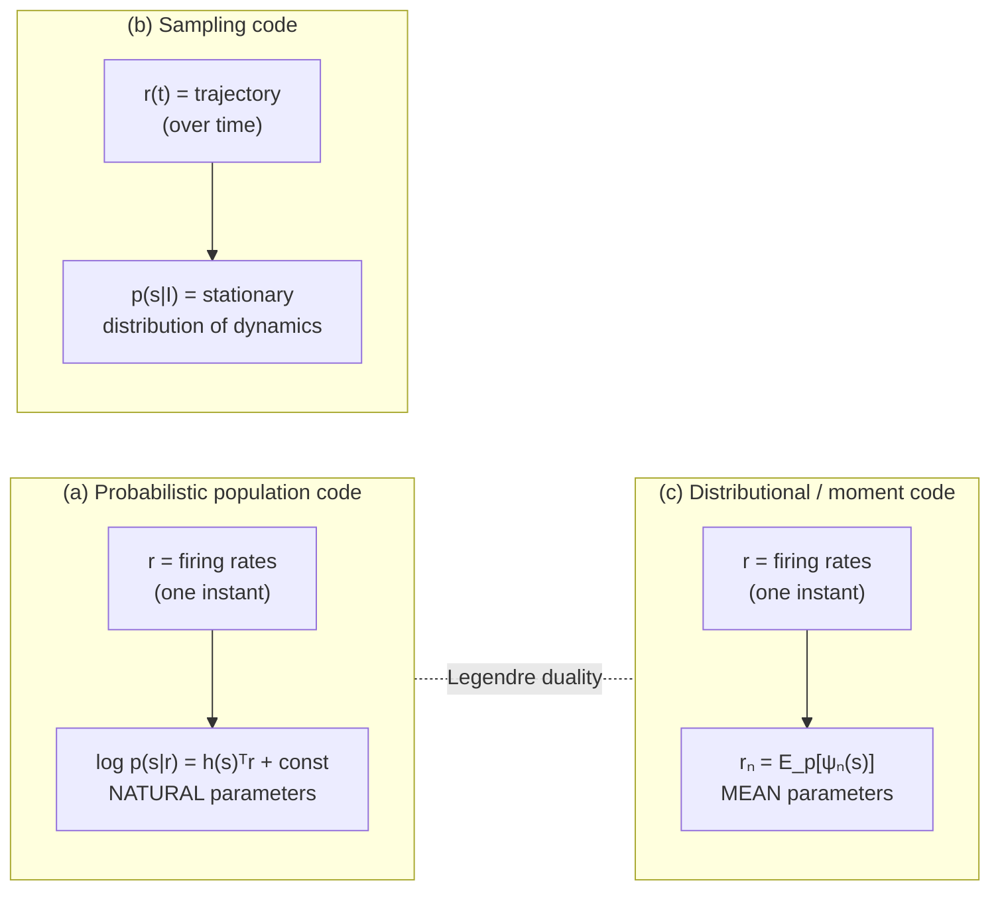
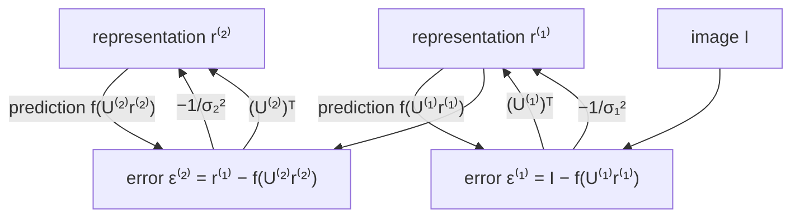

# Unit 04 — Probabilistic computation: circuits that represent and update beliefs

> **The conversion in one line:** *population activity → a probability distribution, and circuit dynamics → an inference algorithm* — with the corollary that neural **variability**, the thing we usually average away, may be the representation rather than the corruption of it.

## Orientation

Unit 03 asked what a circuit should encode. This unit asks something harder: what a circuit should encode *about its own uncertainty*. The moment you take seriously that sensory data are ambiguous — a retinal image is consistent with infinitely many scenes, a glomerular activation pattern with infinitely many odor mixtures — you are committed to the view that perception is inference, and then the interesting question is not *whether* the brain does Bayes but *in what coordinates*.

That last phrase is the whole unit. A probability distribution is an infinite-dimensional object; a population of $N$ neurons has $N$ numbers per instant. There are only a few structurally distinct ways to squeeze the former into the latter, and they are genuinely different scientific hypotheses with different experimental signatures. You can put the distribution in the **parameters** of the population activity (probabilistic population codes: the activity pattern *is* a set of natural parameters, and the log-posterior is linear in spike counts). You can put it in the **statistics of the fluctuations** (sampling codes: the trajectory of the network *visits* states with frequency proportional to their posterior probability). Or you can put it in a set of **moments** (distributional codes: each neuron reports the expectation of one basis function under the posterior). Mathematically the first and third are Legendre-dual to each other; the second is not a coordinate system at all but a dynamical process. Getting this taxonomy straight is worth more than any individual model.

The unit is organized so that the mathematics keeps recurring. You will meet the same energy function — Olshausen & Field's sparse-coding objective from Unit 03 — three times: as a MAP problem solved by a deterministic recurrent circuit, as a Boltzmann distribution sampled by the *same* circuit with noise added, and as a free-energy functional descended by predictive coding. The lesson is precisely the course thesis. **MAP inference and posterior sampling differ by the presence of noise, not by architecture. Two circuits with identical connectivity can implement different algorithms; two circuits with different connectivity can implement the same one.** Learning to see which is which is the craft.

---

## 1. The problem, stated properly

The world generates a stimulus $s$ from a prior $p(s)$ and the sensory apparatus produces data $I$ from a likelihood $p(I|s)$. The posterior is
$$p(s|I) = \frac{p(I|s)\,p(s)}{p(I)} .$$
A "probabilistic code" is a map $\mathcal E$ from data to neural activity, plus a decoding convention $\mathcal D$ such that $\mathcal D[\mathcal E(I)] \approx p(\cdot|I)$. Two hard constraints make this non-trivial:

1. **Dimensionality.** $p(\cdot|I)$ lives in an infinite-dimensional simplex; $r$ lives in $\mathbb R^N_{\ge0}$. Some compression is mandatory; the hypotheses differ in *which* compression.
2. **Composability.** Whatever the code is, downstream circuits must be able to *operate* on it — multiply likelihoods, marginalize nuisance variables, propagate through a hierarchy — using biologically available operations (weighted sums, pointwise nonlinearities, divisive gain control, noise). A representation you cannot compute with is not a representation.

Constraint 2 is what does the real work. It is why exponential families keep appearing: they are precisely the distributional families for which *multiplication becomes addition*.

---

## 2. Probabilistic population codes

### 2.1 The Poisson miracle

Take $N$ neurons with tuning curves $f_n(s)$, independent Poisson spiking over a window $T$. Then
$$p(\mathbf r|s) = \prod_n \frac{\big(Tf_n(s)\big)^{r_n}e^{-Tf_n(s)}}{r_n!} = \underbrace{\left[\prod_n\frac{T^{r_n}}{r_n!}\right]}_{\text{no }s} \exp\!\left(\sum_n r_n\log f_n(s) \;-\; T\sum_n f_n(s)\right).$$
If the tuning curves tile uniformly — $\sum_n f_n(s)=$ const, which holds for evenly spaced curves of any shape by Poisson summation, and is empirically approximately true for cortical populations — then the second term in the exponent is $s$-independent and drops into the normalizer. Therefore
$$\boxed{\;\log p(s|\mathbf r) = \mathbf h(s)^{\mathsf T}\mathbf r + \log p(s) + \text{const},\qquad h_n(s)=\log f_n(s).\;}$$

**The log-posterior is linear in the spike counts.** This is the entire idea. The population activity vector $\mathbf r$ is not an estimate of $s$; it is the vector of *natural parameters* of the posterior in the exponential family with sufficient statistics $\mathbf h(s)$.

The consequence Ma, Beck, Latham & Pouget (2006) drew out: if two populations encoding the same variable share the kernel $\mathbf h$, then
$$\log p(s|\mathbf r_1,\mathbf r_2) = \mathbf h(s)^{\mathsf T}(\mathbf r_1+\mathbf r_2)+\log p(s)+\text{const},$$
so **optimal cue combination is addition of population activities.** A downstream neuron that simply sums its two inputs performs exact Bayesian integration. No division, no normalization, no explicit representation of reliability anywhere. That is a startling claim and it is why this paper mattered.

### 2.2 Gaussian tuning: what "gain encodes certainty" means

Take $f_n(s)=g\exp\!\big(-(s-s_n)^2/2\sigma_{tc}^2\big)$, so $h_n(s)=\log g-(s-s_n)^2/2\sigma_{tc}^2$. Then with a flat prior,
$$\log p(s|\mathbf r) = -\frac{1}{2\sigma_{tc}^2}\sum_n r_n(s-s_n)^2 + \text{const} = -\frac{R}{2\sigma_{tc}^2}\big(s-\bar s\big)^2+\text{const},$$
where $R=\sum_n r_n$ and $\bar s = \frac{1}{R}\sum_n r_ns_n$ (complete the square). So the posterior is Gaussian,
$$s\,|\,\mathbf r \;\sim\; \mathcal N\!\left(\bar s,\;\frac{\sigma_{tc}^2}{R}\right).$$
The mean is the population vector; **the variance is inversely proportional to the total spike count.** Uncertainty is carried by the *amplitude* of the hill of activity, not by its width. Halve the contrast, halve the gain, double the posterior variance.

Cue combination is then automatic: with $\mathbf r_3=\mathbf r_1+\mathbf r_2$, $R_3=R_1+R_2$ and
$$\bar s_3 = \frac{R_1\bar s_1+R_2\bar s_2}{R_1+R_2},\qquad \frac{1}{\sigma_3^2}=\frac{1}{\sigma_1^2}+\frac{1}{\sigma_2^2},$$
which is exactly reliability-weighted averaging — the behavioural law confirmed for visual–haptic integration by Ernst & Banks (2002) and for many pairs since. A theory that gets a behavioural law out of "neurons add their inputs" has earned attention.

### 2.3 Beyond Poisson: the "Poisson-like" family

Real cortical variability is not Poisson, and is correlated. Ma et al. define the **Poisson-like family** as any $p(\mathbf r|s)=\phi(\mathbf r)\exp\big(\mathbf h(s)^{\mathsf T}\mathbf r - A(\mathbf h(s))\big)$, i.e. exponential family with *linear* sufficient statistics in $\mathbf r$. Two identities follow immediately and are worth deriving because they are the working tools of the field.

Since $\nabla_{\mathbf h}A = \mathbb E[\mathbf r|s] \equiv \mathbf f(s)$ and $\nabla^2_{\mathbf h}A=\operatorname{Cov}[\mathbf r|s]\equiv\Sigma(s)$:
$$\mathbf f'(s) = \nabla^2_{\mathbf h}A\cdot\mathbf h'(s) = \Sigma(s)\,\mathbf h'(s) \quad\Longrightarrow\quad \boxed{\mathbf h'(s)=\Sigma(s)^{-1}\mathbf f'(s)}$$
and, since $\partial_s\log p = \mathbf h'(s)^{\mathsf T}(\mathbf r-\mathbf f(s))$,
$$J(s)=\mathbb E\big[(\partial_s\log p)^2\big]=\mathbf h'^{\mathsf T}\Sigma\,\mathbf h' = \boxed{\mathbf f'(s)^{\mathsf T}\Sigma(s)^{-1}\mathbf f'(s)}$$
the standard linear-Fisher-information formula. The condition for a population to be Poisson-like is thus a **compatibility condition between tuning curves and noise covariance**: the mean and covariance must be related so that $\Sigma^{-1}\mathbf f'$ is a gradient. Independent Poisson satisfies it. So does a large class of correlated models. Populations that violate it can still be decoded, but not by a fixed linear operation on spike counts — the "adding populations = Bayes" theorem fails.

This is the point at which **differential correlations** enter (Moreno-Bote et al. 2014): noise of the form $\Sigma \supset \epsilon\,\mathbf f'\mathbf f'^{\mathsf T}$ is information-limiting, because it is indistinguishable from a change in $s$; it caps $J\le1/\epsilon$ no matter how many neurons you add. Any claim that a population "represents the posterior" must confront how much of its apparent uncertainty is this irreducible component.

### 2.4 What PPCs commit you to

- Uncertainty $\leftrightarrow$ **gain**. Predicted: amplitude of population activity should scale with cue reliability; degrade the stimulus and firing rates fall while tuning width is unchanged. Broadly observed for contrast in visual cortex.
- Inference is **instantaneous**: one population state, one posterior. No time is required to "build up" a distribution.
- Trial-to-trial variability is **noise in the ordinary sense** — it corrupts the represented posterior; it does not constitute it.
- Marginalization and other nonlinear operations require **quadratic nonlinearities plus divisive normalization** (Beck et al. 2011), which is a specific and testable circuit demand rather than a free lunch.

---

## 3. Sampling codes

### 3.1 The proposal

Hoyer & Hyvärinen (2003) proposed the alternative: instantaneous population activity is a **sample** from the posterior, $\mathbf a(t)\sim p(\mathbf a|I)$, and the posterior is represented by the *distribution of activity over time*. Trial-to-trial variability is then not noise at all. It is the signal.

This inverts the usual experimental logic in a way worth pausing on. Under PPC, you average across trials to recover the represented quantity and treat the scatter as measurement noise. Under sampling, the average across trials is the posterior *mean* — a lossy summary — and the scatter is the rest of the representation. Two labs analysing the same dataset with the same tools can reach opposite conclusions about what the circuit represents, purely from this choice.

### 3.2 The Langevin correspondence

Here is the derivation that makes this concrete, and it uses the energy function from Unit 03.

Let the generative model be the sparse-coding model: $I=\Phi\mathbf a+\text{noise}$, $\text{noise}\sim\mathcal N(0,\sigma_n^2I)$, and a factorial sparse prior $p(\mathbf a)\propto\prod_ie^{-\lambda S(a_i)}$. Then
$$p(\mathbf a|I)\propto e^{-E(\mathbf a)},\qquad E(\mathbf a)=\frac{1}{2\sigma_n^2}\|I-\Phi\mathbf a\|^2+\lambda\sum_iS(a_i).$$
Consider the stochastic dynamics
$$\tau\,d\mathbf a = -\nabla E(\mathbf a)\,dt + \sqrt{2\tau}\,d\mathbf W .$$
Its Fokker–Planck equation is
$$\partial_t\rho = \nabla\!\cdot\!\Big[\tfrac1\tau\rho\,\nabla E\Big] + \tfrac1\tau\nabla^2\rho = \nabla\!\cdot\!\Big[\tfrac1\tau\rho\big(\nabla E+\nabla\log\rho\big)\Big].$$
The stationary state has zero probability flux, $\nabla\log\rho=-\nabla E$, hence
$$\rho_\infty(\mathbf a)\;\propto\;e^{-E(\mathbf a)}\;=\;p(\mathbf a|I).$$
**The network samples the posterior.** Writing the drift out:
$$\tau\dot a_i = \underbrace{\frac{1}{\sigma_n^2}\phi_i^{\mathsf T}I}_{\text{feedforward}} - \underbrace{\frac{1}{\sigma_n^2}\sum_j(\phi_i^{\mathsf T}\phi_j)a_j}_{\text{recurrent, Gram matrix}} - \underbrace{\lambda S'(a_i)}_{\text{prior nonlinearity}} + \underbrace{\sqrt{2\tau}\,\xi_i(t)}_{\text{noise}} .$$

Compare this, line by line, with the deterministic LCA dynamics of Unit 03 §4.2. **They are the same circuit.** Feedforward filtering, lateral inhibition proportional to receptive-field overlap, a pointwise nonlinearity set by the prior. The only difference is the last term. Remove the noise and the network relaxes to the MAP estimate; add noise of exactly the right magnitude (fluctuation–dissipation: noise variance $2\tau$ against drift $1/\tau$) and it samples the full posterior.

This is as clean a statement of the course's thesis as you will find. *Connectivity does not determine the algorithm.* The same anatomy implements point estimation or Bayesian inference depending on a single scalar property of the noise. And it means that "is this circuit doing probabilistic inference?" is not a question about wiring diagrams. It is a question about the *calibration* of variability against gain — which is measurable, and which nobody measured for decades because variability was assumed to be a nuisance.

### 3.3 Sampling faster: momentum, and why oscillations might be a clock

Overdamped Langevin mixes slowly. For a Gaussian target with Hessian eigenvalues $\lambda_{\min}\le\cdots\le\lambda_{\max}$, each mode relaxes at rate $\lambda_k/\tau$, so the autocorrelation time of the slowest mode is $\tau/\lambda_{\min}$ and the number of independent samples per second scales as $1/\kappa$ with $\kappa=\lambda_{\max}/\lambda_{\min}$. For a perceptual posterior with a wide range of precisions, that is far too slow to support decisions on a 200 ms timescale.

The fix, known in the MCMC literature as Hamiltonian or underdamped Langevin dynamics, is to add momentum:
$$\dot{\mathbf a}=\mathbf q,\qquad \dot{\mathbf q}=-\nabla E(\mathbf a)-\gamma\mathbf q+\sqrt{2\gamma}\,\xi .$$
The stationary distribution is $\propto e^{-E(\mathbf a)-\|\mathbf q\|^2/2}$, so the $\mathbf a$-marginal is still exactly the posterior. But the mixing is different: for a mode of curvature $\lambda$, the characteristic roots are $\big(-\gamma\pm\sqrt{\gamma^2-4\lambda}\big)/2$, so with $\gamma=2\sqrt{\lambda_{\min}}$ every mode decays at rate $\ge\sqrt{\lambda_{\min}}$, and the number of independent samples per second scales as $1/\sqrt\kappa$. **A square-root speedup, bought with oscillations**: modes with $\lambda>\gamma^2/4$ are underdamped and *ring* at frequency $\approx\sqrt{\lambda}$.

Aitchison & Lengyel (2016) made the biological identification: the momentum variable is naturally carried by an inhibitory population, with the antisymmetric excitatory–inhibitory coupling playing the role of the symplectic structure, and the resulting network oscillates in the gamma range while sampling. Hennequin, Aitchison & Lengyel (2014) and Echeveste, Aitchison, Hennequin & Lengyel (2020) developed the same idea in networks whose dynamics were optimized directly for sampling, and recovered transient overshoots, gamma oscillations, and stimulus-dependent variability quenching — cortical phenomenology, out of an inference objective.

**This should get a locust person's attention.** The 20–30 Hz oscillation in the locust antennal lobe is generated by exactly the E/I architecture the theory calls for (PN–LN reciprocal coupling), and Kenyon cells downstream integrate over roughly one cycle, with feedback inhibition resetting them each cycle (Perez-Orive et al. 2002). The sampling reading of that circuit is: *each oscillation cycle delivers one approximately independent sample from the posterior over odor identity, and the KC layer reads out one sample per cycle.* The prediction is sharp — cycle-to-cycle variability in the PN population should not be i.i.d. noise but should have the covariance structure of the posterior, so that ambiguous mixtures produce *more* cycle-to-cycle variability along the direction connecting the competing interpretations. That is measurable with existing data. It is also, I should say plainly, speculation: the oscillation has other well-supported functions (temporal binding, coincidence-detection windows), and the sampling account is at present a hypothesis with the right shape rather than an established result.

### 3.4 Spiking implementations

Buesing, Bill, Nessler & Maass (2011) showed how to get sampling from *spikes* rather than rates. The construction: define a binary variable $z_k(t)=1$ if neuron $k$ fired within the last $\tau$ ms. Under a stochastic (escape-noise) spiking rule with instantaneous rate
$$\rho_k(t)=\frac{1}{\tau}\exp\big(u_k(t)\big),\qquad u_k=b_k+\sum_j W_{kj}z_j,$$
the process $\mathbf z(t)$ is a Markov chain whose stationary distribution is the Boltzmann distribution $p(\mathbf z)\propto\exp\big(\sum_kb_kz_k+\tfrac12\sum_{k\ne j}W_{kj}z_kz_j\big)$, provided $W$ is symmetric — this is *neural Gibbs sampling*, and the technical achievement is showing that the absolute refractory period does not break detailed balance if the state variable is defined as "fired within the last $\tau$". The exponential dependence of firing rate on membrane potential is not an approximation here; it is what makes the transition rates satisfy detailed balance for the Boltzmann target.

### 3.5 What sampling codes commit you to

- Uncertainty $\leftrightarrow$ **variability**. Ambiguous stimuli should produce *more* variable population responses, along the specific directions in which the posterior is broad.
- **Time matters.** A posterior takes multiple samples to express; decisions under time pressure should show sampling-related biases (primacy, order effects, sequential dependencies). Perceptual multistability becomes slow sampling from a multimodal posterior (Gershman, Vul & Tenenbaum 2012).
- **Variability should be quenched by stimulus onset** and by contrast, because the posterior narrows. Churchland et al. (2010) documented exactly this quenching across many cortical areas; Orbán, Berkes, Fiser & Lengyel (2016) showed a GSM-based sampling model quantitatively reproduces the contrast-dependence of Fano factors and noise correlations in V1, which the PPC picture does not naturally predict (Poisson variability makes Fano factor roughly constant).
- **Spontaneous activity is meaningful**: it is a sample from the prior. Which brings us to the most beautiful experiment in this literature.

---

## 4. Berkes, Orbán, Lengyel & Fiser (2011): the prior in the dark

The argument is three lines and it is worth memorizing.

1. Under sampling, evoked activity given image $I$ is distributed as the model's posterior: $p_{\text{ev}}(\mathbf r|I)=p_{\text{model}}(\mathbf r|I)$.
2. Average over the natural image ensemble the animal actually inhabits:
$$\bar p_{\text{ev}}(\mathbf r)=\int p_{\text{model}}(\mathbf r|I)\,p_{\text{nat}}(I)\,dI .$$
3. **If the internal model is well matched to the world**, $p_{\text{nat}}=p_{\text{model}}$, and the integral collapses by the sum rule:
$$\bar p_{\text{ev}}(\mathbf r)=\int p_{\text{model}}(\mathbf r|I)p_{\text{model}}(I)\,dI = p_{\text{model}}(\mathbf r) .$$
And $p_{\text{model}}(\mathbf r)$ — the marginal over $\mathbf r$ with no data — is precisely what the network samples when there is no input: **spontaneous activity**.

$$\boxed{\;p_{\text{spont}}(\mathbf r)\;=\;\big\langle p_{\text{ev}}(\mathbf r|I)\big\rangle_{p_{\text{nat}}(I)}\;}$$

Note what this prediction has going for it. It involves no free parameters. It is a statement about full multivariate distributions, not means. It makes a *developmental* prediction (the match should improve as the internal model is learned) and a *specificity* prediction (the match should hold for natural stimuli and fail for artificial ensembles that the animal's model was not adapted to). Berkes et al. recorded multi-unit activity in ferret V1 across development, binarized into population activity patterns, and measured $\mathrm{KL}\big[p_{\text{spont}}\|\bar p_{\text{ev}}\big]$. All three predictions held: the divergence decreased with age, converged to the level of the measurement noise floor in adults, and did so only for natural movies, not for drifting gratings or noise.

**Now the honest caveat**, because you should always ask what else could produce a positive result. The prediction is *necessary but not sufficient*. Any mechanism that enforces stationarity of population statistics — firing-rate homeostasis, synaptic scaling, a network operating near a fixed point whose fluctuations are input-independent — will make spontaneous and average-evoked distributions converge, without doing any inference at all. What rescues the experiment is the *stimulus specificity* (a homeostatic mechanism has no reason to match natural but not artificial ensembles) and the *developmental trajectory*. That is the general pattern: single predictions of normative theories are almost always confusable with generic mechanism; it is the *pattern of predictions across manipulations* that carries the evidence. Same lesson as Unit 03 §8.

---

## 5. Distributional (moment) codes, and the duality that organizes the field

The third option: let each neuron report the expectation of a fixed function under the posterior,
$$r_n \;=\; \mathbb E_{p(s|I)}\big[\psi_n(s)\big].$$
Zemel, Dayan & Pouget (1998) introduced this; Sahani & Dayan (2003) extended it to represent uncertainty and multiplicity simultaneously; the modern version is the **distributed distributional code** (DDC) of Vértes & Sahani, where the $\psi_n$ are random features and the code supports flexible downstream computation.

The structural fact that ties all three hypotheses together: for an exponential family
$$p(s;\theta)=\exp\big(\theta^{\mathsf T}\psi(s)-A(\theta)\big),$$
there are two canonical coordinate systems. The **natural parameters** $\theta$ and the **mean parameters** $\mu=\mathbb E[\psi(s)]=\nabla A(\theta)$. These are related by the Legendre–Fenchel transform: $\theta=\nabla A^*(\mu)$ where $A^*$ is the convex conjugate of the log-partition function, and $A^*(\mu)=-H(p_\mu)$ is (minus) the entropy.

$$\text{PPC} \;=\; \text{natural parameters}\qquad\longleftrightarrow\qquad \text{DDC}\;=\;\text{mean parameters}$$

That is not an analogy, it is the same duality that organizes variational inference (Wainwright & Jordan 2008): natural parameters make *multiplication of distributions* into addition (hence PPC's cue-combination theorem); mean parameters make *marginalization and expectation* into linear read-out (hence DDC's ease with expected-value computations). Neither is universally better; each makes a different operation cheap. If you want to know which coordinate system a brain area uses, ask which operation it needs to be cheap.

Sampling sits outside this dichotomy. It is not a parametrization at all — it is a *stochastic process whose ergodic average implements* whichever expectation you ask for, at the cost of time. That is exactly the classic Monte-Carlo-versus-variational trade: unbiased but slow versus fast but constrained.

---

## 6. Telling them apart

| Signature | PPC | Sampling | DDC |
|---|---|---|---|
| Where is uncertainty? | gain / amplitude | magnitude & structure of fluctuations | pattern across moment units |
| Fano factor vs. contrast | ~constant (Poisson-like) | **decreases** (posterior narrows) | depends on readout noise |
| Response to ambiguity | lower gain | **higher variability**, along posterior directions | shift in moment pattern |
| Time required | none (instantaneous) | multiple samples; autocorrelation time sets the cost | none |
| Temporal autocorrelation | reflects input dynamics only | reflects **posterior geometry** (slow along flat directions) | input dynamics only |
| Spontaneous activity | meaningless / baseline | **samples from the prior** | ambiguous |
| Cue combination | **addition** of populations | product of energies = sum of drift terms | nonlinear readout |
| Noise correlations | information-limiting nuisance | **equal to posterior covariance** | nuisance |

Three experiments that actually discriminate, rather than merely being consistent with somebody's favourite:

1. **Covariance structure versus posterior structure.** Sampling makes an exact quantitative claim: $\operatorname{Cov}[\mathbf r|I]=\operatorname{Cov}_{p(s|I)}[s]$ up to the encoding map. So *manipulate the posterior's shape* — e.g. present a stimulus whose ambiguity lies along a known one-dimensional direction — and check that the dominant eigenvector of the trial-to-trial covariance rotates with it. PPC predicts no such rotation.
2. **Variability quenching versus gain change.** Both hypotheses predict something happens when contrast increases. PPC: gain up, Fano flat. Sampling: gain up *and* Fano down, with a specific relation between the two set by the generative model. Orbán et al. (2016) is the template.
3. **Time-course of the represented uncertainty.** Sampling requires that the *estimate* of uncertainty from a short window be systematically worse than from a long one, and that early samples be biased toward the prior (the chain starts from the prior and relaxes to the posterior). PPC predicts uncertainty is available immediately. This is the cleanest signature and the least exploited.

---

## 7. Predictive coding

### 7.1 The generative model

Rao & Ballard (1999) built a hierarchical linear-Gaussian model. Level $l$ carries causes $\mathbf r^{(l)}$; each level predicts the one below:
$$\mathbf r^{(l-1)} = f\big(U^{(l)}\mathbf r^{(l)}\big) + \boldsymbol\epsilon^{(l)},\qquad \boldsymbol\epsilon^{(l)}\sim\mathcal N(0,\sigma_l^2 \mathbf I),$$
with $\mathbf r^{(0)}=I$ the image and a sparse prior $p(\mathbf r^{(l)})\propto e^{-g(\mathbf r^{(l)})}$ at each level. The negative log joint is
$$E \;=\; \sum_{l=1}^{L}\frac{1}{2\sigma_l^2}\big\|\mathbf r^{(l-1)}-f\big(U^{(l)}\mathbf r^{(l)}\big)\big\|^2 \;+\;\sum_l g\big(\mathbf r^{(l)}\big)\;+\;\sum_l h\big(U^{(l)}\big).$$

### 7.2 The update equations

Define the **prediction error** at level $l$:
$$\boldsymbol\epsilon^{(l)} \;\equiv\; \mathbf r^{(l-1)} - f\big(U^{(l)}\mathbf r^{(l)}\big).$$
$\mathbf r^{(l)}$ appears in exactly two terms of $E$ — in $\boldsymbol\epsilon^{(l)}$ (as the thing making the prediction) and in $\boldsymbol\epsilon^{(l+1)}$ (as the thing being predicted). Differentiating:
$$\tau\dot{\mathbf r}^{(l)} = \underbrace{\frac{1}{\sigma_l^2}\big(U^{(l)}\big)^{\mathsf T}\Big[f'\!\odot\boldsymbol\epsilon^{(l)}\Big]}_{\text{bottom-up: error from below}} \;-\; \underbrace{\frac{1}{\sigma_{l+1}^2}\boldsymbol\epsilon^{(l+1)}}_{\text{top-down: own error}} \;-\; \underbrace{g'\big(\mathbf r^{(l)}\big)}_{\text{prior}} ,$$
and learning is
$$\Delta U^{(l)} \;\propto\; \frac{1}{\sigma_l^2}\Big[f'\odot\boldsymbol\epsilon^{(l)}\Big]\big(\mathbf r^{(l)}\big)^{\mathsf T} - h'\big(U^{(l)}\big),$$
a Hebbian product of a presynaptic error signal and a postsynaptic representation.

The architectural reading writes itself: two populations per level, **representation units** $\mathbf r^{(l)}$ and **error units** $\boldsymbol\epsilon^{(l)}$; feedback carries predictions $f(U\mathbf r)$; feedforward carries errors; the same synapses $U^{(l)}$ are used forward (transposed) and backward. Extra-classical receptive field effects fall out: an endstopped response occurs because a long bar is *predictable* from the surround, so the error unit is silenced — Rao & Ballard's headline demonstration.

### 7.3 What is established, and what is not

**Reasonably established.**
- Cortical responses show *prediction-error-like* signatures: repetition suppression, mismatch negativity, omission responses, and in mouse V1 explicit visuomotor mismatch responses (Keller, Bonhoeffer & Hübener 2012) that scale with the discrepancy between predicted and actual visual flow.
- Feedback influences early sensory responses in a context-dependent way, and extra-classical suppression is real and quantitatively substantial.
- The *algorithm* — iterative refinement of a latent estimate by error signals — is a good description of a lot of cortical dynamics at the level of population trajectories.

**Not established, and frequently over-claimed.**
- **A distinct anatomical class of error units.** No one has identified a cell type whose response is the residual $\boldsymbol\epsilon$ and nothing else. Superficial-layer/deep-layer assignments are hypotheses supported by connectivity statistics, not by recordings of error-like responses segregated by layer.
- **Subtractive feedback.** The model needs feedback that *subtracts* a prediction. Anatomically, cortical feedback is largely excitatory and modulatory, targets apical dendrites, and is often facilitatory. Building subtraction from that requires a specific and unverified inhibitory microcircuit. Heeger (2017) develops an alternative in which feedback is not subtractive at all and shows it accounts for much of the same phenomenology — an important existence proof that the phenomena underdetermine the algorithm.
- **The weight transpose.** $U$ forward and $U^{\mathsf T}$ backward is the same weight-symmetry problem that afflicts backpropagation, and there is no evidence for it.
- **That "prediction error" responses imply predictive coding.** Almost any recurrent circuit with adaptation produces reduced responses to repeated stimuli. Walsh, McGovern, Clark & O'Connell (2020) review the neurophysiological evidence carefully and find that most of it is consistent with much weaker hypotheses.

Aitchison & Lengyel (2017) make the crucial distinction that everyone should adopt: **predictive coding is a claim at Marr's algorithmic level; Bayesian inference is a claim at the computational level.** You can accept the latter and reject the former. Evidence for "the brain does inference" is not evidence for "the brain does predictive coding," and conflating them has cost the field a decade of clarity.

---

## 8. Variational inference: the umbrella

Everything above is a special case of one variational problem. For an approximating family $q$,
$$\mathcal F[q] \;=\; \mathbb E_q\big[-\log p(I,s)\big] - H[q] \;=\; \mathrm{KL}\big[q(s)\,\|\,p(s|I)\big] - \log p(I) \;\ge\; -\log p(I).$$
Minimizing $\mathcal F$ over $q$ makes $q$ approximate the posterior and $-\mathcal F$ a lower bound on the log evidence.

**Predictive coding = free-energy descent with a degenerate $q$.** Take $q=\delta(s-\boldsymbol\mu)$. Then $\mathcal F=-\log p(I,\boldsymbol\mu)$ (dropping the divergent entropy), and
$$\dot{\boldsymbol\mu}\propto-\nabla_{\boldsymbol\mu}\mathcal F = \nabla_{\boldsymbol\mu}\log p(I,\boldsymbol\mu),$$
which for the hierarchical Gaussian model is exactly §7.2. So Rao–Ballard is **gradient ascent on the log joint**, i.e. MAP by relaxation, i.e. variational inference with the crudest possible posterior family.

**Precision from the Laplace approximation.** Take $q=\mathcal N(\boldsymbol\mu,\Sigma)$ and expand $\log p(I,s)$ to second order about $\boldsymbol\mu$, with $H=\nabla^2\log p(I,s)|_{\boldsymbol\mu}\prec0$:
$$\mathcal F \approx -\log p(I,\boldsymbol\mu) - \tfrac12\operatorname{tr}(\Sigma H) - \tfrac12\log\det\Sigma + \text{const}.$$
Stationarity in $\Sigma$: $-\tfrac12H-\tfrac12\Sigma^{-1}=0$, so
$$\boxed{\Sigma^{-1}=-H=-\nabla^2\log p(I,s)\big|_{\boldsymbol\mu}}$$
The **precision** of the variational posterior is the curvature of the energy landscape. In the hierarchical Gaussian model that curvature is built from the $1/\sigma_l^2$ terms, which is why "precision weighting" in the Friston formulation appears as a *gain* on error units — and why attention, in that framework, is precision modulation. This is a genuine and attractive unification (Friston 2005; Bogacz 2017 is the honest, readable derivation), but note that it also multiplies the free parameters: precisions are now learnable quantities that can absorb a great deal of unexplained variance.

**Sampling = gradient flow too, in a different geometry.** This is the mathematically prettiest fact in the unit. Jordan, Kinderlehrer & Otto (1998) showed that the Fokker–Planck equation
$$\partial_t\rho=\nabla\cdot(\rho\nabla E)+\nabla^2\rho$$
is precisely the **gradient flow of the free-energy functional** $\mathcal F[\rho]=\int\rho E+\int\rho\log\rho$ with respect to the Wasserstein-2 metric on the space of probability measures. So:

- variational inference = gradient descent of $\mathcal F$ on a **finite-dimensional parametric manifold** with the Fisher–Rao metric (natural gradient);
- Langevin sampling = gradient descent of *the same* $\mathcal F$ on the **full space of measures** with the Wasserstein metric.

Same functional. Different geometry, hence different discretization, hence different circuits. That is the sharpest available statement of what separates the sampling hypothesis from the parametric ones, and it also tells you that the two coincide in the limit where the true posterior happens to lie inside the variational family.

---

## 9. Message passing in circuits

### 9.1 Belief propagation

For a factor graph with pairwise potentials, the sum-product updates are
$$m_{i\to j}(x_j)\;\propto\;\sum_{x_i}\psi_{ij}(x_i,x_j)\,\phi_i(x_i)\!\!\prod_{k\in\mathcal N(i)\setminus j}\!\!m_{k\to i}(x_i),\qquad b_i(x_i)\propto\phi_i(x_i)\prod_{k\in\mathcal N(i)}m_{k\to i}(x_i).$$
In the log domain, products become sums — which is exactly the operation a PPC makes cheap. Represent each message as a population whose activity is the natural parameter vector of the message, and belief updating becomes **addition of population activities**, with the pairwise potential implemented as a fixed linear map between populations. Rao (2004) and Beck & Pouget (2007) built explicit recurrent networks doing exact inference in hidden Markov models this way; Steimer, Maass & Douglas (2009) did it with spikes; George & Hawkins (2009) and Litvak & Ullman (2009) proposed cortical-microcircuit mappings.

Two structural difficulties that are worth knowing because they are where the biology bites:

1. **The exclusion problem.** $m_{i\to j}$ must exclude $m_{j\to i}$ to avoid double-counting evidence. A neuron sending a message must therefore subtract off what it received from the target — i.e. the outgoing signal is target-specific. Real axons broadcast. Getting around this requires either target-specific inhibition or an approximation (send the belief, not the message), which turns exact BP into something like "loopy BP with self-feedback" and produces overconfidence.
2. **Loops.** Cortex is loopy. Loopy BP has no exactness guarantee; its fixed points are stationary points of the **Bethe free energy** (Yedidia, Freeman & Weiss 2005) — so even loopy message passing is, once again, a variational method. Everything in this unit is a variational method.

### 9.2 The Gaussian case, worked

Let $p(\mathbf x)\propto\exp\big(-\tfrac12\mathbf x^{\mathsf T}A\mathbf x+\mathbf b^{\mathsf T}\mathbf x\big)$ with $A\succ0$ the **precision** matrix. The posterior mean solves $A\boldsymbol\mu=\mathbf b$. Consider the linear recurrent network
$$\tau\dot{\boldsymbol\mu}=\mathbf b-A\boldsymbol\mu .$$
It converges (since $A\succ0$) to $\boldsymbol\mu=A^{-1}\mathbf b$: **a linear recurrent circuit whose connectivity is the negated precision matrix computes the posterior mean of a Gaussian graphical model.** Note carefully: the connectivity is $-A$, the *precision*, not the covariance. Zero connection between two neurons means *conditional* independence given the rest of the population, not marginal independence. Any attempt to read a functional connectivity matrix as a model of the world must decide which of these it is estimating, and the two can look completely different.

Gaussian loopy BP on the same model converges (under walk-summability; Malioutov, Johnson & Willsky 2006) to the **correct means** but generally **incorrect variances** — Weiss & Freeman (2001) proved the means are exact whenever BP converges. The variances are computed on the *computation tree* (the universal cover of the graph) rather than the graph, and are typically underestimates in attractive models. A circuit implementing loopy BP would therefore be *systematically overconfident while being unbiased* — which is a rather good description of human probabilistic judgement, and a testable signature.

---

## 10. Olfaction: inference as sparse demixing

### 10.1 The problem

The olfactory inference problem has a cleaner statement than the visual one. Let there be $N$ possible odorants with concentrations $\mathbf c\in\mathbb R^N_{\ge0}$, of which only $k\ll N$ are nonzero. Receptor/glomerular responses are
$$r_j \;\sim\; \text{Poisson}\Big(T\,\big[\textstyle\sum_i w_{ji}c_i + b_j\big]\Big),\qquad j=1,\dots,M,\quad M\ll N.$$
Perception of an odor scene is the posterior $p(\mathbf c\,|\,\mathbf r)$ under a sparse, non-negative prior. This is **sparse non-negative deconvolution**: a demixing problem, and — unlike vision — one where the generative model is close to literally true, because receptor activation really is approximately a (competitively saturating) sum over ligands.

Grabska-Barwińska, Barthelmé, Beck, Mainen, Pouget & Latham (2017) developed the full probabilistic treatment: a spike-and-slab prior on concentrations, a variational mean-field approximation, and a mapping onto bulb circuitry. Two structural predictions emerge that are worth more than the specific mapping. First, **explaining away is mandatory**: if odorant A accounts for the glomerular pattern, the posterior probability of odorant B must fall, which requires *inhibition between odor-representing units* whose strength reflects the overlap of their receptor profiles — the same Gram-matrix structure we met in sparse coding, now with a Bayesian rather than an optimization justification. Second, the posterior over the *presence* of an odorant and the posterior over its *concentration* are different objects with different dynamics, and a circuit must carry both; concentration-invariant identity coding is therefore not a nuisance to be normalized away but a marginalization to be computed.

### 10.2 Primal and dual: the same algorithm in two circuits

Here is the piece I most want you to take away, because it is the course thesis in its purest olfactory form.

Consider the noiseless, non-negative $\ell_1$ problem (the "basis pursuit" limit of the MAP problem above):
$$\textbf{(P)}\qquad \min_{\mathbf c\ge0}\;\mathbf 1^{\mathsf T}\mathbf c\quad\text{subject to}\quad W\mathbf c=\mathbf r .$$
Form the Lagrangian with multiplier $\boldsymbol\nu\in\mathbb R^M$:
$$L(\mathbf c,\boldsymbol\nu)=\mathbf 1^{\mathsf T}\mathbf c+\boldsymbol\nu^{\mathsf T}(\mathbf r-W\mathbf c)=\boldsymbol\nu^{\mathsf T}\mathbf r+\big(\mathbf 1-W^{\mathsf T}\boldsymbol\nu\big)^{\mathsf T}\mathbf c .$$
Minimizing over $\mathbf c\ge0$ gives $-\infty$ unless $W^{\mathsf T}\boldsymbol\nu\le\mathbf 1$ componentwise, so
$$\textbf{(D)}\qquad \max_{\boldsymbol\nu\in\mathbb R^M}\;\boldsymbol\nu^{\mathsf T}\mathbf r\quad\text{subject to}\quad \mathbf w_i^{\mathsf T}\boldsymbol\nu\le1\;\;\forall i=1,\dots,N,$$
where $\mathbf w_i$ is the $i$-th column of $W$ — the receptor-affinity profile of odorant $i$. Complementary slackness gives the punchline:
$$c_i>0\;\;\Longrightarrow\;\; \mathbf w_i^{\mathsf T}\boldsymbol\nu=1 .$$

Read the two programs as circuits.

- **(P) lives in $\mathbb R^N$.** You need one unit per candidate odorant — tens of thousands of them. That is the Kenyon cell layer.
- **(D) lives in $\mathbb R^M$.** You need one unit per receptor type — fifty of them. That is the antennal lobe.

And the dual has a beautiful mechanistic reading: the projection neurons carry $\boldsymbol\nu$, driven to increase $\boldsymbol\nu^{\mathsf T}\mathbf r$ (i.e. driven by the glomerular input), while each Kenyon cell $i$ computes $\mathbf w_i^{\mathsf T}\boldsymbol\nu$ and, when this hits threshold 1, feeds back inhibition that prevents the constraint from being violated. **Kenyon cell firing is the identification of an active constraint — that is, of an odorant present in the mixture — and the feedback loop through the giant inhibitory interneuron is the constraint-enforcement mechanism.** The sparse KC code is not an efficient-coding accident; it is what the *support* of the primal solution looks like. Tootoonian & Lengyel (2014) developed exactly this dual formulation for the insect olfactory system.

This is the equivalence-class point made concrete. Two circuits with wildly different dimensionality, cell types and connectivity — a 50-dimensional recurrent network and a 50,000-dimensional feedforward-plus-global-inhibition network — implement *the same algorithm*, in the precise technical sense that they are the primal and dual of one convex program and their solutions determine each other. If you had recorded from one and not the other you would have written a completely different paper. **Marr's algorithmic level is where primal and dual are identified; the implementation level is where they are distinguished.** Learn to ask, of any circuit: what is the dual, and would I recognize it if I recorded from it?

### 10.3 What would settle it

For the locust specifically, the discriminating experiment I would want:

- Present binary mixtures whose components have known, controlled overlap in PN space, at concentrations near the demixing threshold. Under a sampling account, the *cycle-to-cycle* PN population fluctuation should acquire structure aligned with the ambiguity direction (the A-versus-B axis), and the KC readout should fluctuate between the two interpretations across cycles rather than producing a stable blend.
- Under a PPC account, the population activity should encode a stable posterior with the mixture ambiguity expressed as a *reduced gain*, and KC activity should be a stable, graded superposition.
- Under a MAP/deterministic account (LCA/dual-ascent), the readout should be a single winner, stable across cycles, with a hard transition as a function of the mixture ratio — and critically, *no* dependence of variability on ambiguity.

These make different predictions about the same measurement — the covariance of the PN population across oscillation cycles, conditioned on mixture ambiguity — which is the definition of a discriminating experiment.

---

## Mathematical structure spotlight

**Exponential families and Legendre duality.** The natural/mean-parameter conjugacy $\mu=\nabla A(\theta)$, $\theta=\nabla A^*(\mu)$, $A^*=-H$, is the backbone of the whole unit: PPC is the $\theta$-chart, DDC is the $\mu$-chart, and the Fisher metric $\nabla^2A$ is the metric tensor connecting them. Cue combination is addition in $\theta$; marginalization is projection in $\mu$. If you want one algebraic fact to carry out of this unit, it is that the two leading hypotheses about neural probabilistic codes are conjugate charts on the same manifold.

**Two gradient flows of one functional.** $\mathcal F[\rho]=\mathbb E_\rho[E]+\mathbb E_\rho[\log\rho]$ is descended by variational inference along the Fisher–Rao geometry of a parametric family, and by Langevin dynamics along the Wasserstein-2 geometry of the full measure space (Jordan–Kinderlehrer–Otto). Sampling versus variational is a choice of *metric*, not of *objective*.

**Symplectic structure and E/I oscillation.** Underdamped Langevin is a Hamiltonian flow plus dissipation; the momentum variable's antisymmetric coupling to position is a symplectic form, and antisymmetric coupling in a neural circuit is exactly excitation–inhibition reciprocity. The $\sqrt\kappa$ mixing speedup is the reason a sampler would *want* to oscillate — a normative argument for a phenomenon usually treated as a mechanistic side-effect.

**Convex duality as an equivalence class of circuits.** Strong duality says the primal and dual programs have the same value and mutually determined solutions. Two circuits solving a primal/dual pair are, at the algorithmic level, the same circuit — which makes convex duality the sharpest formal instance of the quotient this course is about.

**Precision matrices and conditional independence.** A linear recurrent network's connectivity, read as a Gaussian graphical model, is a precision matrix; its zeros are conditional independencies. Confusing this with the covariance is the single most common error in interpreting functional connectivity.

> See [`../structures/README.md`](../structures/README.md) for the running index of mathematical structures this course leans on.

---

## What this buys you as an algorithmist

1. **A principled reading of variability.** You will never again automatically average across trials. The first question about any dataset becomes: *is the scatter noise, a representation, or a sample?* — and you now know three ways to test it.

2. **A taxonomy with teeth.** "The brain is Bayesian" is nearly content-free. "The population is a Poisson-like PPC" versus "the population samples the posterior" versus "the population reports moments" are different, testable, and mutually exclusive in specific measurable ways. Table in §6 is the field guide.

3. **The habit of asking what operation is cheap.** Natural parameters make multiplication cheap; mean parameters make expectation cheap; samples make arbitrary nonlinear functionals cheap but slow. Given a circuit's downstream demands, you can predict which coordinate system it should use — a genuinely normative constraint on representation, complementary to Unit 03's.

4. **Immunity to the predictive-coding conflation.** Computational-level Bayes and algorithmic-level predictive coding are different claims. You will demand evidence for the level being asserted.

5. **A concrete recipe for olfaction.** Odor perception is sparse non-negative demixing with explaining-away. That single sentence generates predictions about lateral inhibition structure, about concentration-invariance as marginalization, about why the KC code is sparse, and — via the dual — about why an insect can afford to solve a 50,000-dimensional problem with fifty projection neurons.

---

## Reading

### Core
- Ma, W. J., Beck, J. M., Latham, P. E. & Pouget, A. (2006). "Bayesian inference with probabilistic population codes." *Nature Neuroscience* 9(11), 1432–1438.
- Rao, R. P. N. & Ballard, D. H. (1999). "Predictive coding in the visual cortex: a functional interpretation of some extra-classical receptive-field effects." *Nature Neuroscience* 2(1), 79–87.
- Fiser, J., Berkes, P., Orbán, G. & Lengyel, M. (2010). "Statistically optimal perception and learning: from behavior to neural representations." *Trends in Cognitive Sciences* 14(3), 119–130.
- Berkes, P., Orbán, G., Lengyel, M. & Fiser, J. (2011). "Spontaneous cortical activity reveals hallmarks of an optimal internal model of the environment." *Science* 331(6013), 83–87.
- Orbán, G., Berkes, P., Fiser, J. & Lengyel, M. (2016). "Neural variability and sampling-based probabilistic representations in the visual cortex." *Neuron* 92(2), 530–543.
- Pouget, A., Beck, J. M., Ma, W. J. & Latham, P. E. (2013). "Probabilistic brains: knowns and unknowns." *Nature Neuroscience* 16(9), 1170–1178.

### Deeper
- Hoyer, P. O. & Hyvärinen, A. (2003). "Interpreting neural response variability as Monte Carlo sampling of the posterior." *Advances in Neural Information Processing Systems* 15, 293–300.
- Zemel, R. S., Dayan, P. & Pouget, A. (1998). "Probabilistic interpretation of population codes." *Neural Computation* 10(2), 403–430.
- Sahani, M. & Dayan, P. (2003). "Doubly distributional population codes: simultaneous representation of uncertainty and multiplicity." *Neural Computation* 15(10), 2255–2279.
- Beck, J. M. & Pouget, A. (2007). "Exact inferences in a neural implementation of a hidden Markov model." *Neural Computation* 19(5), 1344–1361.
- Buesing, L., Bill, J., Nessler, B. & Maass, W. (2011). "Neural dynamics as sampling: a model for stochastic computation in recurrent networks of spiking neurons." *PLoS Computational Biology* 7(11), e1002211.
- Beck, J. M., Latham, P. E. & Pouget, A. (2011). "Marginalization in neural circuits with divisive normalization." *Journal of Neuroscience* 31(43), 15310–15319.
- Moreno-Bote, R., Beck, J., Kanitscheider, I., Pitkow, X., Latham, P. & Pouget, A. (2014). "Information-limiting correlations." *Nature Neuroscience* 17(10), 1410–1417.
- Aitchison, L. & Lengyel, M. (2016). "The Hamiltonian brain: efficient probabilistic inference with excitatory-inhibitory neural circuit dynamics." *PLoS Computational Biology* 12(12), e1005186.
- Aitchison, L. & Lengyel, M. (2017). "With or without you: predictive coding and Bayesian inference in the brain." *Current Opinion in Neurobiology* 46, 219–227.
- Echeveste, R., Aitchison, L., Hennequin, G. & Lengyel, M. (2020). "Cortical-like dynamics in recurrent circuits optimized for sampling-based probabilistic inference." *Nature Neuroscience* 23(9), 1138–1149.
- Bogacz, R. (2017). "A tutorial on the free-energy framework for modelling perception and learning." *Journal of Mathematical Psychology* 76, 198–211.
- Wainwright, M. J. & Jordan, M. I. (2008). "Graphical models, exponential families, and variational inference." *Foundations and Trends in Machine Learning* 1(1–2), 1–305.
- Yedidia, J. S., Freeman, W. T. & Weiss, Y. (2005). "Constructing free-energy approximations and generalized belief propagation algorithms." *IEEE Transactions on Information Theory* 51(7), 2282–2312.
- Walsh, K. S., McGovern, D. P., Clark, A. & O'Connell, R. G. (2020). "Evaluating the neurophysiological evidence for predictive processing as a model of perception." *Annals of the New York Academy of Sciences* 1464(1), 242–268.
- Hennequin, G., Aitchison, L. & Lengyel, M. (2014). "Fast sampling-based inference in balanced neuronal networks." *Advances in Neural Information Processing Systems* 27.
- Vértes, E. & Sahani, M. (2018). "Flexible and accurate inference and learning for deep generative models." *Advances in Neural Information Processing Systems* 31.

### Historical
- Helmholtz, H. von (1867). *Handbuch der physiologischen Optik*. Voss, Leipzig. (Unconscious inference.)
- Jordan, R., Kinderlehrer, D. & Otto, F. (1998). "The variational formulation of the Fokker–Planck equation." *SIAM Journal on Mathematical Analysis* 29(1), 1–17.
- Weiss, Y. & Freeman, W. T. (2001). "Correctness of belief propagation in Gaussian graphical models of arbitrary topology." *Neural Computation* 13(10), 2173–2200.
- Ernst, M. O. & Banks, M. S. (2002). "Humans integrate visual and haptic information in a statistically optimal fashion." *Nature* 415, 429–433.
- Rao, R. P. N. (2004). "Bayesian computation in recurrent neural circuits." *Neural Computation* 16(1), 1–38.
- Friston, K. (2005). "A theory of cortical responses." *Philosophical Transactions of the Royal Society B* 360(1456), 815–836.
- Jazayeri, M. & Movshon, J. A. (2006). "Optimal representation of sensory information by neural populations." *Nature Neuroscience* 9(5), 690–696.
- Malioutov, D. M., Johnson, J. K. & Willsky, A. S. (2006). "Walk-sums and belief propagation in Gaussian graphical models." *Journal of Machine Learning Research* 7, 2031–2064.
- George, D. & Hawkins, J. (2009). "Towards a mathematical theory of cortical micro-circuits." *PLoS Computational Biology* 5(10), e1000532.
- Steimer, A., Maass, W. & Douglas, R. (2009). "Belief propagation in networks of spiking neurons." *Neural Computation* 21(9), 2502–2523.
- Churchland, M. M. et al. (2010). "Stimulus onset quenches neural variability: a widespread cortical phenomenon." *Nature Neuroscience* 13(3), 369–378.
- Keller, G. B., Bonhoeffer, T. & Hübener, M. (2012). "Sensorimotor mismatch signals in primary visual cortex of the behaving mouse." *Neuron* 74(5), 809–815.
- Gershman, S. J., Vul, E. & Tenenbaum, J. B. (2012). "Multistability and perceptual inference." *Neural Computation* 24(1), 1–24.
- Heeger, D. J. (2017). "Theory of cortical function." *PNAS* 114(8), 1773–1782.

**Olfaction**
- Hopfield, J. J. (1991). "Olfactory computation and object perception." *PNAS* 88(15), 6462–6466.
- Tootoonian, S. & Lengyel, M. (2014). "A Dual Algorithm for Olfactory Computation in the Locust Brain." *Advances in Neural Information Processing Systems* 27.
- Grabska-Barwińska, A., Barthelmé, S., Beck, J., Mainen, Z. F., Pouget, A. & Latham, P. E. (2017). "A probabilistic approach to demixing odors." *Nature Neuroscience* 20(1), 98–106.
- Tootoonian, S., Schaefer, A. T. & Latham, P. E. (2022). "Sparse connectivity for MAP inference in linear models using sister mitral cells." *PLoS Computational Biology* 18(1), e1009808.

---

## Exercises

**E4.1 (★★) PPC arithmetic.**
(a) For independent Poisson neurons with Gaussian tuning curves of common width $\sigma_{tc}$ and gain $g$, complete the square to obtain the posterior $\mathcal N(\bar s,\sigma_{tc}^2/R)$, being explicit about where the uniform-tiling assumption $\sum_nf_n(s)=$ const is used.
(b) Show that summing two independent populations implements exact reliability-weighted cue combination, and state precisely what must be true of the two populations' tuning curves for this to work.
(c) Suppose the tiling assumption fails: $\sum_n f_n(s)=c_0+c_1\cos(s)$ on the circle. Recompute the posterior and identify what the failure adds. Is it equivalent to a prior?

**E4.2 (★★) The Poisson-like family.**
For $p(\mathbf r|s)=\phi(\mathbf r)\exp\big(\mathbf h(s)^{\mathsf T}\mathbf r-A(\mathbf h(s))\big)$, derive $\mathbf h'(s)=\Sigma(s)^{-1}\mathbf f'(s)$ and $J(s)=\mathbf f'^{\mathsf T}\Sigma^{-1}\mathbf f'$. Then: a population has Gaussian tuning curves and covariance $\Sigma(s)=\Sigma_0+\epsilon\,\mathbf f'(s)\mathbf f'(s)^{\mathsf T}$ (differential correlations). Compute $J(s)$ using the Sherman–Morrison formula and show that $J\le1/\epsilon$ regardless of $N$. What does this imply for a downstream area trying to read out uncertainty from gain?

**E4.3 (★★) MAP and sampling from the same circuit.**
(a) Verify by direct substitution into the Fokker–Planck equation that $\rho_\infty\propto e^{-E}$ for $\tau d\mathbf a=-\nabla E\,dt+\sqrt{2\tau}d\mathbf W$, and identify where detailed balance is used.
(b) Now scale the noise: $\sqrt{2\tau/\beta}$. Show the stationary distribution is $\propto e^{-\beta E}$ and that $\beta\to\infty$ recovers MAP. Interpret $\beta$ physiologically — what single measurable quantity would tell you a circuit's $\beta$?
(c) Argue that for a *quadratic* $E$ (Gaussian posterior) the deterministic and stochastic networks have identical mean activity, so that any experiment based only on trial-averaged responses is blind to the distinction. Which second-order statistic breaks the tie, and what would you have to measure to compute it?

**E4.4 (★★★) Why a sampler would oscillate.**
Consider a Gaussian posterior with precision matrix $\Lambda$, eigenvalues $\lambda_1\le\cdots\le\lambda_n$, $\kappa=\lambda_n/\lambda_1$.
(a) For overdamped Langevin, compute the autocorrelation function of each eigenmode and show the effective number of independent samples per unit time is set by $\lambda_1$.
(b) For underdamped dynamics $\ddot a=-\lambda a-\gamma\dot a+\sqrt{2\gamma}\xi$ (unit mass), find the decay rate of each mode as a function of $\gamma$, show that the choice $\gamma=2\sqrt{\lambda_1}$ maximizes the *slowest* decay rate, and derive the $\sqrt\kappa$ versus $\kappa$ scaling.
(c) Show that at this optimal $\gamma$, modes with $\lambda>\lambda_1$ are underdamped and ring at $\omega\approx\sqrt{\lambda-\lambda_1}$. State the resulting experimental prediction relating **oscillation frequency** to **posterior precision**, and say how you would test it in an olfactory system where stimulus ambiguity can be titrated.

**E4.5 (★★) Rao–Ballard, linear case.**
Take a two-level model with $f=\mathrm{id}$: $I=U_1r_1+\epsilon_1$, $r_1=U_2r_2+\epsilon_2$, Gaussian priors on $r_2$.
(a) Write $E$, derive $\dot r_1,\dot r_2$, and identify the error units.
(b) Show that the fixed point of the $r_1$ dynamics is the exact Gaussian posterior mean for $r_1$ given $I$ and $r_2$, i.e. the network does exact inference in the linear-Gaussian case.
(c) The model requires $U_1$ forward and $U_1^{\mathsf T}$ backward. Suppose instead the backward weights are an independent random matrix $B$. What does the fixed point compute now? (This is the "feedback alignment" question; answer at least qualitatively, and identify the condition on $B$ under which the fixed point is still the correct posterior mean.)

**E4.6 (★★) Free energy, precision, and attention.**
(a) With $q=\mathcal N(\mu,\Sigma)$ and a Laplace expansion, derive $\Sigma^{-1}=-\nabla^2\log p(I,s)|_\mu$.
(b) For the linear hierarchical model of E4.5, compute $-\nabla^2\log p$ explicitly and show that the diagonal blocks contain $1/\sigma_l^2$ terms — so "precision weighting" is a gain on error units.
(c) A common claim is that attention = increasing the precision of a sensory channel. Derive what this predicts for (i) the gain of error units, (ii) the gain of representation units, and (iii) trial-to-trial variability in each. Are these three predictions independent, or does the model force a relation among them? (The answer matters: independent predictions are weak evidence, forced relations are strong evidence.)

**E4.7 (★★) Gaussian belief propagation and overconfidence.**
(a) Show $\tau\dot\mu=\mathbf b-A\mu$ converges to the exact posterior mean of $p(\mathbf x)\propto e^{-\frac12\mathbf x^{\mathsf T}A\mathbf x+\mathbf b^{\mathsf T}\mathbf x}$, and give the convergence rate.
(b) Take $A=(1+\rho)\mathbf I-\rho\mathbf J$ on three nodes in a triangle ($\mathbf J$ = all-ones). Find the eigenvalues, the range of $\rho$ for which $A\succ0$, and the exact marginal variances.
(c) Implement Gaussian loopy BP numerically on this graph and compare its marginal variances to the truth for $\rho\in(0,1/2)$. Confirm the means are exact. Explain the variance error using the computation-tree/walk-sum picture, and state the behavioural signature a brain running loopy BP would show.

**E4.8 (★★) The Berkes logic, and its limits.**
(a) Prove the identity $p_{\text{spont}}(\mathbf r)=\langle p_{\text{ev}}(\mathbf r|I)\rangle_{p_{\text{nat}}(I)}$ from the sampling hypothesis plus model-world matching, being explicit about every assumption.
(b) Construct a concrete non-inferential model — a recurrent network with firing-rate homeostasis, say — that satisfies the identity without representing any posterior. Show it passes the test.
(c) Given (b), state precisely which *additional* features of the Berkes et al. result carry the evidential weight, and design one further experiment that your model in (b) would fail.

**E4.9 (★★, numerical) Fano factors discriminate.**
Simulate two encoders of a 1-D stimulus with a Gaussian-scale-mixture generative model, at contrasts spanning 2 log units.
(i) *PPC*: Poisson spike counts with rates $g(\text{contrast})f_n(s)$.
(ii) *Sampler*: Langevin dynamics on the GSM posterior, with spike counts generated by an instantaneous Poisson process driven by the sampled latent (so variability = posterior variance + Poisson).
Compute mean rate, Fano factor, and pairwise noise correlations versus contrast for both. Show that the sampler produces Fano factors that *decrease* with contrast while the PPC's stay flat, and that the sampler's noise-correlation structure rotates with the posterior. Then ask the harder question: how large a dataset (neurons × trials) would you need to distinguish them at 95% confidence, given realistic Fano factor variability across cells?

**E4.10 (★★★, open-ended, research taste) A discriminating experiment in the locust.**
The locust antennal lobe oscillates at 20–30 Hz; Kenyon cells integrate over roughly a cycle and are reset by feedback inhibition. Design an experiment, using titrated binary odor mixtures, that would distinguish among three hypotheses about what the AL–MB circuit computes: **(a)** a MAP estimate via deterministic relaxation (LCA / dual ascent), **(b)** a probabilistic population code whose gain encodes certainty, **(c)** a sampler that emits one sample per oscillation cycle.
Your answer must specify: the stimulus manipulation and why it produces a posterior of known geometry; the exact statistic you would compute (be specific — not "variability" but which moment of which quantity conditioned on what); the predicted values under each hypothesis including the *sign* of every effect; at least one confound that could mimic the sampling signature and how you would rule it out; and what result would make you abandon the sampling hypothesis entirely. One page. Marks for identifying the experiment that is cheapest to run and still decisive.

---

## Solutions

**S4.1.**
(a) $\log p(\mathbf r|s)=\sum_nr_n\log f_n(s)-T\sum_nf_n(s)+\text{const}(\mathbf r)$. The tiling assumption kills the second term's $s$-dependence — *this is exactly where it is used*, and it is the only place. Then with $\log f_n(s)=\log g-(s-s_n)^2/2\sigma_{tc}^2$:
$$\sum_nr_n\log f_n(s)=R\log g-\frac{1}{2\sigma_{tc}^2}\sum_nr_n(s-s_n)^2 .$$
Expand: $\sum_nr_n(s-s_n)^2=Rs^2-2s\sum r_ns_n+\sum r_ns_n^2=R(s-\bar s)^2+\big(\sum r_ns_n^2-R\bar s^2\big)$, the bracket being $s$-independent. Hence $\log p(s|\mathbf r)=-\frac{R}{2\sigma_{tc}^2}(s-\bar s)^2+\text{const}$, i.e. $\mathcal N(\bar s,\sigma_{tc}^2/R)$ with a flat prior.
(b) $\log p(s|\mathbf r_1,\mathbf r_2)=\mathbf h_1(s)^{\mathsf T}\mathbf r_1+\mathbf h_2(s)^{\mathsf T}\mathbf r_2+\text{const}$. This equals $\mathbf h(s)^{\mathsf T}(\mathbf r_1+\mathbf r_2)$ only if $\mathbf h_1=\mathbf h_2=\mathbf h$, i.e. the two populations must have **identical tuning-curve kernels** (same preferred stimuli, same widths, in the same order), and both must be Poisson-like with the same $\phi$. Their *gains* may differ freely — that is what makes reliability weighting work. With Gaussian tuning, $R_3=R_1+R_2$ and $\bar s_3=(R_1\bar s_1+R_2\bar s_2)/R_3$, and $1/\sigma_3^2=R_3/\sigma_{tc}^2=1/\sigma_1^2+1/\sigma_2^2$. Exact reliability weighting.
(c) Now $\log p(s|\mathbf r)=\mathbf h(s)^{\mathsf T}\mathbf r-T(c_0+c_1\cos s)+\log p(s)$. The extra term is $\mathbf r$-independent, so it acts **exactly like a prior**: the code behaves as if the true prior were $p(s)e^{-Tc_1\cos s}$. This is a nice and underappreciated result: non-uniform tiling does not break the PPC, it silently biases it, and the bias grows linearly with integration time $T$ (because the tiling term is a rate, not a count). A population with over-representation of cardinal orientations therefore produces a systematic *repulsion* from cardinals if naively decoded as a flat-prior PPC — connect this to Unit 03 §6.5 and Wei & Stocker.

**S4.2.** From $A(\mathbf h)$ being the log-partition function of an exponential family in $\mathbf r$: $\nabla_{\mathbf h}A=\mathbb E[\mathbf r]=\mathbf f$, $\nabla^2_{\mathbf h}A=\operatorname{Cov}[\mathbf r]=\Sigma$. Chain rule: $\mathbf f'(s)=\frac{d}{ds}\nabla_{\mathbf h}A(\mathbf h(s))=\Sigma(s)\mathbf h'(s)$, hence $\mathbf h'=\Sigma^{-1}\mathbf f'$. Score: $\partial_s\log p=\mathbf h'^{\mathsf T}\mathbf r-\nabla A^{\mathsf T}\mathbf h'=\mathbf h'^{\mathsf T}(\mathbf r-\mathbf f)$, so $J=\mathbb E[\mathbf h'^{\mathsf T}(\mathbf r-\mathbf f)(\mathbf r-\mathbf f)^{\mathsf T}\mathbf h']=\mathbf h'^{\mathsf T}\Sigma\mathbf h'=\mathbf f'^{\mathsf T}\Sigma^{-1}\mathbf f'$.
Differential correlations: with $\Sigma=\Sigma_0+\epsilon\mathbf f'\mathbf f'^{\mathsf T}$, Sherman–Morrison gives
$$\Sigma^{-1}=\Sigma_0^{-1}-\frac{\epsilon\,\Sigma_0^{-1}\mathbf f'\mathbf f'^{\mathsf T}\Sigma_0^{-1}}{1+\epsilon\,\mathbf f'^{\mathsf T}\Sigma_0^{-1}\mathbf f'} .$$
Let $J_0=\mathbf f'^{\mathsf T}\Sigma_0^{-1}\mathbf f'$ (the information without differential correlations, which grows $\propto N$). Then
$$J=J_0-\frac{\epsilon J_0^2}{1+\epsilon J_0}=\frac{J_0}{1+\epsilon J_0}\;\xrightarrow[\;J_0\to\infty\;]{}\;\frac1\epsilon .$$
Adding neurons cannot beat $1/\epsilon$. Implication: the posterior variance available to a downstream area saturates at $\epsilon$, and since $\epsilon$ is a property of the *shared* noise rather than of the stimulus, **gain no longer tracks certainty once differential correlations dominate**. Any PPC claim must therefore be accompanied by a measurement of the differential-correlation magnitude; otherwise "gain encodes reliability" is untested at exactly the regime that matters.

**S4.3.**
(a) SDE $d\mathbf a=-\frac1\tau\nabla E\,dt+\sqrt{2/\tau}\,d\mathbf W$; drift $\mathbf A=-\nabla E/\tau$, diffusion $D=\frac12(2/\tau)=1/\tau$. FP: $\partial_t\rho=-\nabla\cdot(\mathbf A\rho)+D\nabla^2\rho=\nabla\cdot\big[\frac1\tau\rho\nabla E+\frac1\tau\nabla\rho\big]$. Substituting $\rho=Ce^{-E}$: $\nabla\rho=-\rho\nabla E$, so the bracket is $\frac1\tau\rho\nabla E-\frac1\tau\rho\nabla E=0$ identically. The *flux itself* vanishes, not just its divergence — that is detailed balance, and it holds because the drift is a gradient. If the drift had a divergence-free component (a non-symmetric recurrent matrix, say) the stationary distribution would still exist but would carry probability current and would not equal $e^{-E}$ in general.
(b) With noise $\sqrt{2/(\beta\tau)}$, $D=1/(\beta\tau)$, zero-flux gives $\nabla\log\rho=-\beta\nabla E$, so $\rho\propto e^{-\beta E}$. As $\beta\to\infty$ this concentrates on $\arg\min E$: MAP. $\beta$ is an inverse temperature; physiologically it is the ratio of the *drift gain* to the *noise variance*. The single measurable quantity: the **ratio of trial-to-trial variance to the curvature of the mean response** — equivalently, whether the network's fluctuation magnitude satisfies the fluctuation–dissipation relation with its own relaxation dynamics. Measure the response relaxation time constant after a perturbation and the spontaneous fluctuation power spectrum; a correctly calibrated sampler has $\beta=1$.
(c) For $E=\frac12(\mathbf a-\mathbf m)^{\mathsf T}\Lambda(\mathbf a-\mathbf m)$, the deterministic dynamics converge to $\mathbf m$ and the stochastic dynamics have stationary mean $\mathbf m$. Trial-averaged activity is identical. The tie is broken by the **covariance of the activity**, which is $0$ for the deterministic net and $\Lambda^{-1}$ (the posterior covariance) for the sampler; more practically, by the covariance's *dependence on the stimulus*, since $\Lambda$ depends on the input in any nonlinear generative model. To compute it you need simultaneous recordings from many neurons on many repeats of the *same* stimulus, and enough of them to estimate an $N\times N$ covariance — which is why this question only became answerable with large-scale recording.

**S4.4.**
(a) In the eigenbasis, $\tau\dot a_k=-\lambda_ka_k+\sqrt{2\tau}\xi_k$, an Ornstein–Uhlenbeck process with correlation time $t_k=\tau/\lambda_k$ and stationary variance $1/\lambda_k$. Autocorrelation $C_k(t)=\lambda_k^{-1}e^{-\lambda_k|t|/\tau}$. Over a window $T$, the effective number of independent samples of mode $k$ is $\approx T/(2t_k)=T\lambda_k/(2\tau)$; the *worst* mode has $\lambda_1$, so the sampler's effective sample rate is $\lambda_1/(2\tau)$, and relative to the fastest mode you lose a factor $\kappa$.
(b) $\ddot a=-\lambda a-\gamma\dot a+$noise has roots $\mu_\pm=\frac{-\gamma\pm\sqrt{\gamma^2-4\lambda}}{2}$. If $\gamma<2\sqrt\lambda$ (underdamped), both roots have real part $-\gamma/2$: decay rate $\gamma/2$, independent of $\lambda$. If $\gamma>2\sqrt\lambda$ (overdamped), the slow root is $\mu_+=\frac{-\gamma+\sqrt{\gamma^2-4\lambda}}{2}\approx-\lambda/\gamma$ for $\gamma\gg\sqrt\lambda$: decay rate $\lambda/\gamma$, which *decreases* with $\gamma$. So the slowest mode's rate is $\min\big(\gamma/2,\;\lambda_1/\gamma\big)$-ish; increasing $\gamma$ helps the underdamped modes and hurts the overdamped ones. The two branches cross at $\gamma=2\sqrt{\lambda_1}$, giving slowest rate $\sqrt{\lambda_1}$. Since the fastest achievable is bounded by the fastest mode, the effective condition number is $\lambda_n/\lambda_1$ under overdamped ($\propto\kappa$) versus $\sqrt{\lambda_n}/\sqrt{\lambda_1}=\sqrt\kappa$ under optimally damped. Square-root speedup.
(c) At $\gamma=2\sqrt{\lambda_1}$, a mode with $\lambda>\lambda_1$ has $\gamma^2-4\lambda=4(\lambda_1-\lambda)<0$, so $\mu_\pm=-\sqrt{\lambda_1}\pm i\sqrt{\lambda-\lambda_1}$: it rings at $\omega=\sqrt{\lambda-\lambda_1}$. **Prediction: the oscillation frequency of the population response scales as the square root of the posterior precision along the corresponding direction.** In olfaction: titrate a binary mixture from unambiguous (single odorant at high concentration — high precision along the identity axis) to maximally ambiguous (50/50 at threshold — low precision). The theory predicts the dominant oscillation frequency of the PN population should *decrease* with ambiguity, and specifically as $\sqrt{\text{precision}}$, with the effect confined to the population mode aligned with the ambiguity direction. Existing locust datasets with LFP and PN population recordings could test this; note that a competing account (recurrent gain change shifting an E/I network's resonance) predicts a similar direction, so you would need the *mode specificity* to discriminate.

**S4.5.**
(a) $E=\frac{1}{2\sigma_1^2}\|I-U_1r_1\|^2+\frac{1}{2\sigma_2^2}\|r_1-U_2r_2\|^2+\frac{1}{2\sigma_3^2}\|r_2\|^2$. Define $\epsilon_1=I-U_1r_1$, $\epsilon_2=r_1-U_2r_2$. Then
$$\tau\dot r_1=\frac{1}{\sigma_1^2}U_1^{\mathsf T}\epsilon_1-\frac{1}{\sigma_2^2}\epsilon_2,\qquad \tau\dot r_2=\frac{1}{\sigma_2^2}U_2^{\mathsf T}\epsilon_2-\frac{1}{\sigma_3^2}r_2 .$$
Error units are $\epsilon_1$ (at the input level) and $\epsilon_2$ (between levels); each representation unit receives $+U^{\mathsf T}\epsilon$ from below and $-\epsilon$ from its own level.
(b) Setting $\dot r_1=0$: $\frac{1}{\sigma_1^2}U_1^{\mathsf T}(I-U_1r_1)=\frac{1}{\sigma_2^2}(r_1-U_2r_2)$, i.e.
$$\Big(\tfrac{1}{\sigma_1^2}U_1^{\mathsf T}U_1+\tfrac{1}{\sigma_2^2}\mathbf I\Big)r_1=\tfrac{1}{\sigma_1^2}U_1^{\mathsf T}I+\tfrac{1}{\sigma_2^2}U_2r_2 .$$
This is precisely the Gaussian posterior mean for $r_1$ given likelihood $\mathcal N(U_1r_1,\sigma_1^2)$ and prior $\mathcal N(U_2r_2,\sigma_2^2)$ — precision-weighted combination of bottom-up evidence and top-down prediction. So the linear-Gaussian case is exact, and the *only* approximation in Rao–Ballard is the delta-function posterior family plus the nonlinearity $f$.
(c) With backward weights $B\ne U_1^{\mathsf T}$, the fixed point is $\big(\frac{1}{\sigma_1^2}BU_1+\frac{1}{\sigma_2^2}\mathbf I\big)r_1=\frac{1}{\sigma_1^2}BI+\frac{1}{\sigma_2^2}U_2r_2$. The network now inverts the *wrong* operator: it computes the posterior mean of a model whose likelihood precision is $BU_1$ rather than $U_1^{\mathsf T}U_1$. Two observations. (i) If $BU_1$ is symmetric positive definite the dynamics still converge, to a *biased but consistent* estimator — it is a preconditioned solve of a different normal-equation system. (ii) The fixed point is the correct posterior mean iff $B=U_1^{\mathsf T}M$ for some $M$ commuting appropriately, and exactly correct for all $I$ iff $B\propto U_1^{\mathsf T}$. Feedback alignment works in learning because $U_1$ itself adapts so that $U_1^{\mathsf T}$ comes to align with $B$ — the symmetry is *learned* rather than assumed, which is the only biologically plausible resolution currently on offer, and it makes the testable prediction that feedforward and feedback weights between a pair of areas should be *correlated but not identical*, with the correlation increasing over development.

**S4.6.**
(a) $\mathcal F=\mathbb E_q[-\log p(I,s)]-H[q]$. With $q=\mathcal N(\mu,\Sigma)$ and $\log p(I,s)\approx\log p(I,\mu)+\frac12(s-\mu)^{\mathsf T}H(s-\mu)$ (the linear term vanishes at the expansion point if we expand about the current $\mu$; keep it if not), $\mathbb E_q[\log p]=\log p(I,\mu)+\frac12\operatorname{tr}(\Sigma H)$, and $H[q]=\frac12\log\det(2\pi e\Sigma)$. So $\mathcal F=-\log p(I,\mu)-\frac12\operatorname{tr}(\Sigma H)-\frac12\log\det\Sigma+\text{const}$. Then $\partial\mathcal F/\partial\Sigma=-\frac12H-\frac12\Sigma^{-1}=0\Rightarrow\Sigma^{-1}=-H$.
(b) For the model of E4.5, $-\nabla^2\log p$ has blocks $\frac{1}{\sigma_1^2}U_1^{\mathsf T}U_1+\frac{1}{\sigma_2^2}\mathbf I$ (for $r_1$), $\frac{1}{\sigma_2^2}U_2^{\mathsf T}U_2+\frac{1}{\sigma_3^2}\mathbf I$ (for $r_2$), and off-diagonal $-\frac{1}{\sigma_2^2}U_2$. The $1/\sigma_l^2$ appear as multiplicative factors on the error terms, i.e. as **gains on error units**.
(c) Raising the precision $1/\sigma_1^2$ of a channel: (i) error-unit gain increases directly and proportionally; (ii) representation-unit responses increase, but *sublinearly* — from the fixed point in E4.5(b), $r_1\to(U_1^{\mathsf T}U_1+\sigma_1^2/\sigma_2^2)^{-1}(\ldots)$, which saturates as $\sigma_1^2\to0$, so representation gain increases and then plateaus while error gain keeps rising; (iii) posterior variance $\Sigma$ decreases, so under a sampling readout trial-to-trial variability of representation units should *decrease* while error-unit variability increases with their gain. These are **not independent**: the model forces a specific quantitative relation among the three (representation gain, error gain, and variance are all functions of the single scalar $\sigma_1^2$ given the weights). That is exactly what makes the precision account of attention testable — measure all three in the same experiment and check that one parameter fits all of them. Most attention studies measure only (ii), where the prediction is weakest.

**S4.7.**
(a) $\tau\dot\mu=\mathbf b-A\mu$ has solution $\mu(t)=A^{-1}\mathbf b+e^{-At/\tau}(\mu_0-A^{-1}\mathbf b)$, converging since $A\succ0$; the slowest rate is $\lambda_{\min}(A)/\tau$.
(b) $A=(1+\rho)\mathbf I-\rho\mathbf J$ with $\mathbf J$ the $3\times3$ all-ones matrix, whose eigenvalues are $3$ (eigenvector $\mathbf 1$) and $0$ (twice). So $A$ has eigenvalues $1+\rho-3\rho=1-2\rho$ (once) and $1+\rho$ (twice). $A\succ0\iff -1<\rho<1/2$. Then $A^{-1}=\frac{1}{1-2\rho}P_{\mathbf 1}+\frac{1}{1+\rho}(\mathbf I-P_{\mathbf 1})$ with $P_{\mathbf 1}=\mathbf J/3$, giving
$$\Sigma_{ii}=(A^{-1})_{ii}=\frac13\cdot\frac{1}{1-2\rho}+\frac23\cdot\frac{1}{1+\rho}.$$
For $\rho=0.4$: $\frac13\cdot5+\frac23\cdot0.714=1.667+0.476=2.143$.
(c) Numerically, loopy GaBP converges for $\rho$ in roughly the walk-summable range ($|\rho|$ small enough that $\varrho(|R|)<1$ where $R=\mathbf I-A$ normalized) and returns exact means, but variances below the truth (e.g. noticeably below $2.14$ at $\rho=0.4$). Explanation: BP on a loopy graph computes marginals of the **computation tree** — the infinite unrolling of the graph obtained by never immediately backtracking. The variance is a sum over self-return walks; on the computation tree, walks that wind repeatedly around the triangle and return to the root are represented differently from the true graph, and for attractive ($\rho>0$) models the true graph has *more* returning weight, so BP under-counts and underestimates variance. Behavioural signature: **unbiased point estimates with systematically overconfident uncertainty** — precisely the pattern in human probabilistic judgement (overprecision), and a much more specific prediction than "people are Bayesian."

**S4.8.**
(a) Assumptions, all needed: (i) neural activity $\mathbf r$ stands in a fixed, invertible correspondence with the model's latent variables; (ii) evoked activity is a sample from $p_{\text{model}}(\mathbf r|I)$ (sampling hypothesis, and the chain has mixed); (iii) spontaneous activity is a sample from $p_{\text{model}}(\mathbf r)$, i.e. "no input" is implemented as marginalizing out $I$ rather than as clamping it to a particular value; (iv) $p_{\text{model}}(I)=p_{\text{nat}}(I)$ over the ensemble used for averaging. Given these, $\langle p_{\text{model}}(\mathbf r|I)\rangle_{p_{\text{nat}}(I)}=\int p_{\text{model}}(\mathbf r|I)p_{\text{model}}(I)dI=p_{\text{model}}(\mathbf r)=p_{\text{spont}}(\mathbf r)$. Assumption (iii) is the sneaky one and deserves scrutiny: "eyes closed" is not obviously the same as "marginalize over the image prior."
(b) Counterexample: a recurrent network with a slow homeostatic mechanism that regulates each neuron's firing-rate distribution to a fixed target (e.g. synaptic scaling driven by a running estimate of mean rate, plus intrinsic excitability regulation of variance), operating in a regime where stimulus drive perturbs activity only weakly relative to the recurrent dynamics. Then by construction the long-run distribution of activity is the homeostatic target, both with and without stimuli; average evoked equals spontaneous, and the network performs no inference of any kind. It passes.
(c) The weight is carried by: (1) **stimulus specificity** — the match holds for natural movies and fails for gratings and noise; homeostasis has no mechanism to care what the stimulus ensemble is, whereas the sampling account requires exactly this dissociation. (2) **Developmental trajectory** — the match improves with age in a way that tracks visual experience, which is what "learning the model" predicts and homeostasis does not (homeostasis should be in place early and stay). (3) It is a match of full **multivariate** distributions, not marginals; a homeostatic mechanism regulating single-neuron statistics need not reproduce the joint.
A further experiment my model in (b) would fail: **rear animals in an altered visual environment** (e.g. restricted orientation content, or a virtual environment with known non-natural statistics), then test whether spontaneous activity comes to match the average evoked activity *for that altered ensemble* and mismatch the natural one. The sampling hypothesis predicts the internal model tracks the actual rearing environment; homeostasis predicts spontaneous activity converges to the same target regardless of rearing statistics. This is the ensemble-manipulation move from Unit 03 §8, and it is the single most informative unperformed experiment in this literature.

**S4.9.** Numerical. Expected results: (i) PPC Fano factor is $1$ by construction and flat in contrast; (ii) the sampler's spike-count variance is $\text{Var}[\text{Poisson}]+\text{Var}[\text{latent}]=\bar r+g^2\sigma_{\text{post}}^2$, so $F=1+g^2\sigma_{\text{post}}^2/\bar r$, and since the GSM posterior narrows with contrast while $\bar r$ grows, $F$ decreases monotonically toward $1$ — the observed pattern in V1; (iii) the sampler's noise correlation matrix is $\propto$ the posterior covariance mapped through the tuning curves, so it rotates as the stimulus changes the posterior's shape, whereas the PPC's correlations are stimulus-independent (zero, for independent Poisson).
Power analysis: the Fano factor estimated from $M$ trials has relative standard error $\approx\sqrt{2/M}$ for Poisson-ish counts, so detecting a 20% change in $F$ per cell at 95% confidence needs $M\gtrsim 2\cdot(1.96/0.2)^2\approx200$ trials per condition per cell; pooling $n$ cells reduces this by $\sqrt n$ *only if* the cell-to-cell scatter in $F$ is small relative to the effect, which it is not (measured $F$ ranges $0.5$–$2$ across cortical cells). The practical consequence is that Fano-factor comparisons must be *within-cell across contrast*, which is why the discriminating experiments in this literature are all within-cell designs. This is a good example of a case where the statistics dictate the experimental design more than the theory does.

**S4.10.** A model answer.
*Stimulus manipulation.* Use binary mixtures of two odorants A and B chosen to have partially overlapping but distinguishable PN population responses, presented at a fixed total concentration with mixture ratio $\alpha\in\{0,0.1,\dots,0.5,\dots,1\}$, and total concentration titrated to sit near the psychophysical discrimination threshold. Near $\alpha=0.5$ at threshold concentration, the posterior over "which odorant" is close to uniform over two modes; away from $0.5$, or at high concentration, it is unimodal and sharp. So the *geometry* of the posterior — bimodal with a known separating axis $\mathbf u_{AB}$ — is under experimental control, which is what makes the design work.
*Statistic.* Record PN populations with cycle-resolved resolution (LFP-locked binning). Define $\mathbf x_c$ = PN population vector on cycle $c$ of trial $t$. Compute (i) the *within-trial, across-cycle* covariance $C_{\text{cyc}}=\operatorname{Cov}_c[\mathbf x_c]$, and specifically its projection onto the ambiguity axis, $v_{AB}=\mathbf u_{AB}^{\mathsf T}C_{\text{cyc}}\mathbf u_{AB}$, normalized by the total variance $\operatorname{tr}C_{\text{cyc}}$; and (ii) the lag-1 across-cycle autocorrelation along $\mathbf u_{AB}$. Condition everything on $\alpha$ and concentration.
*Predictions, with signs.* (a) MAP/deterministic: $v_{AB}/\operatorname{tr}C_{\text{cyc}}$ is **independent of $\alpha$**; the trial settles into one interpretation and stays; across-*trial* variability may be high near $\alpha=0.5$ (bistability of the relaxation) but across-*cycle* variability within a trial is not. (b) PPC: gain (total PN activity) **decreases** near $\alpha=0.5$ (lower certainty), while $v_{AB}$ normalized is flat; the informative signature is the gain, not the covariance. (c) Sampling: $v_{AB}$ **increases** sharply near $\alpha=0.5$ and specifically along $\mathbf u_{AB}$ rather than isotropically; lag-1 autocorrelation along $\mathbf u_{AB}$ is positive but decays within a few cycles (mode-switching); and KC readout should show cycle-to-cycle *alternation* between the A-selective and B-selective KC sets rather than co-activation.
*Confound and its control.* The obvious confound: near-threshold mixtures produce weaker ORN drive, and weaker drive generically increases variability (Poisson-like, $F$ roughly constant means variance grows with mean, but *relative* variability grows as mean falls). This would raise $v_{AB}$ for reasons having nothing to do with sampling. Control: the sampling prediction is **anisotropic and axis-specific** — the variance increase must be concentrated along $\mathbf u_{AB}$, not spread over all directions. So compute the ratio $v_{AB}/v_{\perp}$ where $v_\perp$ is variance along an orthogonal, non-ambiguity direction matched for mean activity. Drive-related variability raises both; sampling raises only the former. Second control: hold total concentration fixed and vary only $\alpha$, so mean drive is approximately constant while ambiguity varies.
*What would kill it.* If, at matched mean drive, the across-cycle covariance is isotropic — no enhancement along the ambiguity axis at $\alpha=0.5$ — the sampling hypothesis in this circuit is dead, because the one thing sampling cannot avoid predicting is that fluctuations inherit the posterior's shape. Weaker outcomes (an enhancement in the right direction but of the wrong magnitude, or with the wrong autocorrelation) would send you back to the generative model rather than to the hypothesis.
*Cheapest decisive version.* You do not need the KC recordings. Cycle-resolved PN population data with a single ambiguity axis, two mixture ratios ($\alpha=0.5$ and $\alpha=0.15$) matched for total ORN drive, and the anisotropy ratio $v_{AB}/v_\perp$ as the single statistic. That is a small experiment, and it discriminates all three hypotheses on the sign of one number.
