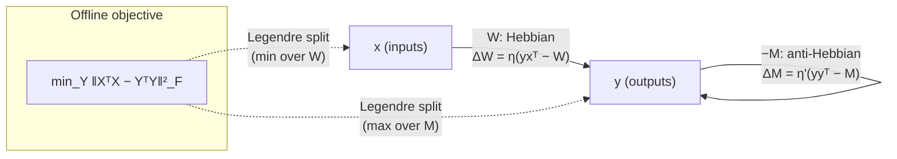

# Unit 05 — When the algorithm *is* the learning rule
{: .no_toc }

> **The conversion in one line:** *a local synaptic update rule → the objective function it descends, and the optimization algorithm it implements* — so that the circuit's computation is not what it does on a trial, but what it does *across* trials.

## Contents
{: .no_toc .text-delta }

1. TOC
{:toc}

---

## Orientation

Every method in this course so far has asked: given a circuit in a fixed configuration, what function of its input does it compute? That question has a hidden presupposition — that the parameters are parameters, and the state is the state. Plasticity dissolves the distinction. A synapse is a slow state variable. If you widen the window from a trial to a session, the "parameters" become the trajectory, and the trajectory is the computation.

This changes what "the algorithm" means. For a fixed circuit, the algorithm is an input–output map together with the sequence of intermediate quantities used to get there. For a plastic circuit, the algorithm is a **pair**: an objective $L(\theta)$ and an optimization scheme that descends it using only quantities physically available at each synapse. And now the equivalence class we are quotienting by is much richer, because *many different update rules descend the same objective*. Oja's rule, Sanger's rule, the subspace rule, similarity matching, and a well-tuned Hebbian rule with multiplicative normalization are five circuits and one algorithm. Conversely — and this is the failure mode to watch for — two rules with nearly identical dynamics can descend *different* objectives, and the difference only shows up in the stimulus regime nobody tested.

The single-trial computation of a Hebbian/anti-Hebbian network is embarrassingly boring: it is a linear map, possibly rectified. Nothing you would write a paper about. The across-trial computation is online principal subspace analysis with provable convergence. If you had recorded this circuit, characterized its receptive fields, and stopped, you would have found a linear filter and concluded that the circuit "filters." You would have missed the algorithm entirely, because the algorithm was in the derivative. This unit is about not missing it.

There is a second, harder theme underneath. Local rules are cheap and objective-agnostic; global rules are expensive and objective-directed. The *credit assignment problem* is the precise statement of the gap between them, and half of this unit is about the surprisingly large industry devoted to closing it. I will be scrupulous about what each proposal actually solves, because the literature is not.

---

## 1. Hebb is not yet an algorithm

Hebb (1949) gave a mechanism, not an objective: cells that fire together wire together. Write the simplest linear-neuron version, with $y = \mathbf{w}^{\mathsf T}\mathbf{x}$ and

$$\dot{\mathbf w} = \eta\, y\,\mathbf x .$$

Average over a stationary, zero-mean input ensemble with covariance $C = \mathbb E[\mathbf x\mathbf x^{\mathsf T}]$:

$$\dot{\mathbf w} = \eta\, \mathbb E[\mathbf x\mathbf x^{\mathsf T}]\mathbf w = \eta\, C\,\mathbf w \quad\Longrightarrow\quad \mathbf w(t) = e^{\eta C t}\,\mathbf w(0) = \sum_i e^{\eta\lambda_i t}\,(\mathbf e_i^{\mathsf T}\mathbf w(0))\,\mathbf e_i .$$

Two facts fall out. **Good news:** the direction $\mathbf w/\|\mathbf w\|$ converges to $\mathbf e_1$, the top eigenvector of $C$, at a rate set by the eigengap $\lambda_1-\lambda_2$. Raw Hebb already "wants" to do PCA. **Bad news:** the norm diverges like $e^{\eta\lambda_1 t}$. The rule has no fixed point, it is not descending anything, and as a dynamical system it is useless.

So the algorithmic content of Hebbian learning is not in the Hebbian term. It is in whatever stabilizes it. Different stabilizers are different algorithms, and this is a general lesson worth stating early:

> **In a plasticity rule, the growth term tells you the direction of the statistic being extracted; the constraint term tells you which optimization problem is being solved.**

---

## 2. Oja's rule: online PCA, derived

### 2.1 The rule from explicit normalization

Oja (1982) took the most obvious stabilizer — renormalize after each Hebbian step — and discovered that its first-order expansion is itself a legal local rule. Start from the discrete update with explicit projection onto the unit sphere:

$$\mathbf w_{t+1} = \frac{\mathbf w_t + \eta\, y_t\mathbf x_t}{\left\|\mathbf w_t + \eta\, y_t\mathbf x_t\right\|},\qquad y_t = \mathbf w_t^{\mathsf T}\mathbf x_t .$$

Assume $\|\mathbf w_t\|=1$ and expand the denominator in $\eta$:

$$\|\mathbf w_t+\eta y_t\mathbf x_t\|^2 = \underbrace{\mathbf w_t^{\mathsf T}\mathbf w_t}_{=1} + 2\eta\, y_t\,\underbrace{\mathbf w_t^{\mathsf T}\mathbf x_t}_{=\,y_t} + \eta^2 y_t^2\|\mathbf x_t\|^2 = 1 + 2\eta y_t^2 + O(\eta^2),$$

so $\|\mathbf w_t+\eta y_t \mathbf x_t\| = 1+\eta y_t^2 + O(\eta^2)$ and its reciprocal is $1-\eta y_t^2 + O(\eta^2)$. Therefore

$$\mathbf w_{t+1} = \big(\mathbf w_t + \eta y_t\mathbf x_t\big)\big(1-\eta y_t^2\big) + O(\eta^2) = \mathbf w_t + \eta\, y_t\big(\mathbf x_t - y_t\mathbf w_t\big) + O(\eta^2).$$

That is Oja's rule:

$$\boxed{\;\dot{\mathbf w} = \eta\, y\,(\mathbf x - y\,\mathbf w)\;}$$

The decay term $-\eta y^2\mathbf w$ is **not** a heuristic weight-decay bolted on for stability. It is, exactly and only, the first-order effect of enforcing $\|\mathbf w\|=1$. This is the constraint-normalization origin of the decay: *the Lagrange multiplier for the norm constraint, evaluated on the current sample, is $y^2$.* Biologically it says something specific and testable: the decay should be **heterosynaptic and postsynaptically driven** (proportional to $y^2$, shared across all synapses onto the cell), not homosynaptic (proportional to $w_j x_j$ per synapse). Those are different experiments.

### 2.2 Self-normalization is exact, not approximate

A pleasant surprise: the expanded rule enforces the constraint it was derived from, without ever renormalizing. Compute

$$\frac{d}{dt}\|\mathbf w\|^2 = 2\,\mathbf w^{\mathsf T}\dot{\mathbf w} = 2\eta\, y\big(\mathbf w^{\mathsf T}\mathbf x - y\|\mathbf w\|^2\big) = 2\eta\, y^2\big(1-\|\mathbf w\|^2\big).$$

The unit sphere is globally attracting (as long as $y\not\equiv 0$), *for any input distribution whatsoever* — no averaging, no stationarity assumption. The norm is a Lyapunov-like coordinate that the rule controls exactly. This is the kind of structural fact that survives the passage from equation to biology.

### 2.3 The averaged ODE and its fixed points

Under Robbins–Monro step sizes ($\sum_t\eta_t=\infty$, $\sum_t\eta_t^2<\infty$) the stochastic recursion is tracked by its averaged ODE (this is the ODE method of stochastic approximation; see [`../structures/README.md`](../structures/README.md)). Averaging $y(\mathbf x - y\mathbf w)$ over $\mathbf x$ with $y=\mathbf w^{\mathsf T}\mathbf x$:

$$\dot{\mathbf w} = \eta\Big(C\mathbf w - (\mathbf w^{\mathsf T}C\mathbf w)\,\mathbf w\Big) \;\equiv\; \eta\, f(\mathbf w).$$

**Fixed points.** $C\mathbf w = (\mathbf w^{\mathsf T}C\mathbf w)\mathbf w$ forces $\mathbf w$ to be an eigenvector, say $C\mathbf w=\lambda\mathbf w$. Then $\mathbf w^{\mathsf T}C\mathbf w=\lambda\|\mathbf w\|^2$, so $\lambda\mathbf w = \lambda\|\mathbf w\|^2\mathbf w$, giving $\|\mathbf w\|=1$ for any $\lambda\neq0$. The fixed points are precisely $\{\pm\mathbf e_i\}$.

**Stability.** Differentiate. Using $\partial_{\mathbf w}\big[(\mathbf w^{\mathsf T}C\mathbf w)\mathbf w\big] = (\mathbf w^{\mathsf T}C\mathbf w)I + 2\,\mathbf w\,(C\mathbf w)^{\mathsf T}$, the Jacobian of $f$ at $\mathbf w=\mathbf e_i$ is (the flow's Jacobian is $\eta J_i$; $\eta$ only sets the overall rate)

$$J_i = C - \lambda_i I - 2\lambda_i\,\mathbf e_i\mathbf e_i^{\mathsf T}.$$

Test it on the eigenbasis:

$$J_i\,\mathbf e_j = (\lambda_j-\lambda_i)\,\mathbf e_j \quad (j\neq i),\qquad J_i\,\mathbf e_i = (\lambda_i-\lambda_i-2\lambda_i)\,\mathbf e_i = -2\lambda_i\,\mathbf e_i .$$

The radial direction is always stable with rate $2\lambda_i$ — that is the norm control we just derived. The tangential directions are stable iff $\lambda_j<\lambda_i$ for all $j\neq i$, i.e. **iff $i=1$**. Every fixed point except the top eigenvector is a saddle, with unstable directions pointing toward the larger eigenvalues. Oja's rule is online PCA, and the convergence rate to $\mathbf e_1$ is set by the eigengap $\lambda_1-\lambda_2$.

### 2.4 The same rule from a different objective

Consider instead the linear-autoencoder reconstruction error $L(\mathbf w) = \tfrac12\mathbb E\|\mathbf x - y\mathbf w\|^2$. If you differentiate *holding $y$ fixed* (treating the code as an activity, not a function of the weights — which is exactly what a circuit does, since $y$ is computed by the fast dynamics before the slow dynamics see it):

$$-\partial_{\mathbf w}L\big|_{y\ \text{fixed}} = \mathbb E\big[y(\mathbf x - y\mathbf w)\big].$$

Oja's rule again. So the same update is simultaneously (i) constrained variance maximization and (ii) stochastic gradient descent on reconstruction error with the code held fixed. This is not a coincidence — it is the standard PCA duality (maximize projected variance $\equiv$ minimize residual) showing up at the level of the update. It also gives the decay term a second interpretation that will recur throughout this unit: **$y\mathbf w$ is a prediction of the input, and the synapse learns on the residual $\mathbf x - y\mathbf w$.** Hebbian learning on a prediction error. Hold that thought until Unit 06.

### 2.5 Multiple components: subspace vs. deflation

With $k$ outputs $\mathbf y = W\mathbf x$, $W\in\mathbb R^{k\times n}$, the naive generalization is **Oja's subspace rule** (Oja 1989):

$$\dot W = \eta\big(\mathbf y\mathbf x^{\mathsf T} - \mathbf y\mathbf y^{\mathsf T}W\big).$$

Its stable fixed points are $W = O\,U_k^{\mathsf T}$ with $O$ an arbitrary $k\times k$ orthogonal matrix and $U_k$ the top-$k$ eigenvectors. It recovers the **principal subspace**, not the principal components: the rule is invariant under rotations within the subspace, so there is nothing to break the degeneracy. In the language of Unit 03, the algorithm fixes a point on the Grassmannian $\mathrm{Gr}(k,n)$ and leaves a gauge freedom $O(k)$.

**Sanger's rule** (Generalized Hebbian Algorithm, Sanger 1989) breaks it by triangular truncation:

$$\dot W = \eta\Big(\mathbf y\mathbf x^{\mathsf T} - \mathrm{LT}\!\left[\mathbf y\mathbf y^{\mathsf T}\right]W\Big),\qquad \Delta w_{ij} = \eta\, y_i\Big(x_j - \sum_{k\le i} y_k w_{kj}\Big),$$

where $\mathrm{LT}[\cdot]$ keeps the lower triangle including the diagonal. Read the component form: neuron $i$ performs Oja's rule not on $\mathbf x$ but on $\mathbf x$ **minus the reconstruction supplied by neurons $1,\dots,i$**. That is Gram–Schmidt deflation implemented online. Neuron 1 sees the full input and converges to $\mathbf e_1$; neuron 2 sees $\mathbf x - y_1\mathbf w_1$, whose covariance is $C-\lambda_1\mathbf e_1\mathbf e_1^{\mathsf T}$, so it converges to $\mathbf e_2$; induct.

The price is a strict ordering, which is anatomically awkward: the deflation term $\sum_{k\le i}$ requires an asymmetric, ordered lateral network — neuron $i$ must know its index. This is the standard objection to GHA as biology, and it is the right objection. The next section shows how to get an *unordered, symmetric* lateral network out of a cleaner objective.

---

## 3. Anti-Hebbian learning is decorrelation

Földiák (1990) added lateral connections between output units and made them **anti**-Hebbian: strengthen inhibition between units that are co-active. Take

$$\mathbf y = Q\mathbf x + W\mathbf y \quad\Longrightarrow\quad \mathbf y = (I-W)^{-1}Q\,\mathbf x, \qquad \mathrm{diag}(W)=0,$$

with the lateral update

$$\Delta W_{il} = -\alpha\, y_i y_l \quad (i\neq l).$$

The fixed point of the *averaged* rule is immediate and is the whole point: $\mathbb E[y_iy_l]=0$ for all $i\neq l$. **The unique stationary condition of anti-Hebbian lateral plasticity is that the output covariance is diagonal.** No objective function needed to state it; the rule is a stochastic root-finder for the off-diagonal entries of $C_y$.

Write $M = I-W$ (so $M$ has unit diagonal and off-diagonals $-W_{il}$). Then

$$C_y = M^{-1}Q\,C\,Q^{\mathsf T}M^{-\mathsf T} \stackrel{!}{=} \Lambda \ \ \text{(diagonal)}.$$

Add any mechanism that equalizes output variances — Földiák used adaptive thresholds and a Hebbian gain on $Q$; homeostatic intrinsic plasticity does the job in real neurons — and you get $C_y = I$: **whitening**. Note the structure: decorrelation is a second-order objective and (Unit 03) fixes the encoder only up to $O(k)$. The lateral-inhibition architecture is a *gauge fixing device*: constraining $W$ to be symmetric with zero diagonal picks (essentially) the symmetric square root, i.e. the ZCA-like solution, while an ordered/triangular $W$ would pick the Cholesky-like one. Same algorithm, different circuit, different receptive fields. If you measure the receptive fields and they look center-surround rather than Fourier-like, you have learned about the gauge, not about the objective.

Anti-Hebbian plasticity is thus the canonical circuit primitive for redundancy reduction (Barlow 1961; Atick & Redlich 1992), and it is exactly what you should expect to find wherever a system must remove predictable structure. In insect olfaction this is the natural reading of antennal-lobe local interneurons and, at the next stage, of the giant GABAergic feedback neuron (APL in *Drosophila*, GGN in locust) that normalizes Kenyon-cell activity (Papadopoulou et al. 2011). Whether that circuit is *learning* a decorrelation or merely *implementing* a hard-wired one is an empirical question — and a good one.

---

## 4. Similarity matching: the derivation

This is the centerpiece of the unit. Pehlevan and Chklovskii's insight is that if you pick the right objective, the Hebbian feedforward weights and the anti-Hebbian lateral weights are not two mechanisms glued together — they are the two *auxiliary variables* that appear when you convert an offline objective into an online one. The circuit is not inspired by the algorithm; it is what the algorithm looks like when you write it down.

### 4.1 The offline objective

Let $X = [\mathbf x_1,\dots,\mathbf x_T]\in\mathbb R^{n\times T}$ and $Y=[\mathbf y_1,\dots,\mathbf y_T]\in\mathbb R^{k\times T}$ with $k<n$. **Similarity matching**: choose the outputs so that output similarities reproduce input similarities.

$$\min_{Y}\ \frac{1}{T^2}\left\|X^{\mathsf T}X - Y^{\mathsf T}Y\right\|_F^2 .$$

Notice what is *not* in this objective: any weight matrix. It is stated purely in terms of activities, and it is manifestly invariant under $Y\mapsto OY$ for orthogonal $O$. This is classical multidimensional scaling, and its solution is known: if $X = USV^{\mathsf T}$, then $X^{\mathsf T}X = VS^2V^{\mathsf T}$, and the best rank-$k$ approximation in Frobenius norm is $V_kS_k^2V_k^{\mathsf T}$ (Eckart–Young). Hence

$$Y^\star = O\,S_kV_k^{\mathsf T} = O\,U_k^{\mathsf T}X, \qquad O\in O(k).$$

The optimum is the projection onto the top-$k$ principal subspace — the PCA scores, at their natural scale, up to rotation.

So far this is offline: it needs all of $X$ at once, and worse, the objective is *quartic* in $Y$ and does not decompose over samples. There is no obvious way to stream it.

### 4.2 The variational trick: synapses as auxiliary variables

Expand and drop the $Y$-independent term:

$$\frac{1}{T^2}\left\|X^{\mathsf T}X-Y^{\mathsf T}Y\right\|_F^2 \;\simeq\; -\frac{2}{T^2}\operatorname{Tr}\!\big(YX^{\mathsf T}XY^{\mathsf T}\big) + \frac{1}{T^2}\operatorname{Tr}\!\big(YY^{\mathsf T}YY^{\mathsf T}\big).$$

Both terms are quadratic *forms in a matrix product*, and each admits a Legendre-type variational representation that splits the product. Introduce $W\in\mathbb R^{k\times n}$ and $M\in\mathbb R^{k\times k}$.

**Cross term.** Claim:

$$-\frac{2}{T^2}\operatorname{Tr}\big(YX^{\mathsf T}XY^{\mathsf T}\big) = \min_{W}\left[-\frac{4}{T}\operatorname{Tr}\big(WXY^{\mathsf T}\big) + 2\operatorname{Tr}\big(W^{\mathsf T}W\big)\right].$$

*Proof.* The bracket is a strictly convex quadratic in $W$. Since $\partial_W\operatorname{Tr}(WXY^{\mathsf T}) = YX^{\mathsf T}$, stationarity gives $-\tfrac4T YX^{\mathsf T} + 4W = 0$, i.e. $W^\star = \tfrac1T YX^{\mathsf T}$. Substituting, $\operatorname{Tr}(W^{\star\mathsf T}W^\star) = \tfrac1{T^2}\operatorname{Tr}(YX^{\mathsf T}XY^{\mathsf T})$ and the bracket evaluates to $-\tfrac4{T^2}\operatorname{Tr}(YX^{\mathsf T}XY^{\mathsf T}) + \tfrac2{T^2}\operatorname{Tr}(YX^{\mathsf T}XY^{\mathsf T})$, which is the left-hand side. $\square$

**Quartic term.** Claim:

$$\frac{1}{T^2}\operatorname{Tr}\big(YY^{\mathsf T}YY^{\mathsf T}\big) = \max_{M}\left[\frac{2}{T}\operatorname{Tr}\big(MYY^{\mathsf T}\big) - \operatorname{Tr}\big(M^{\mathsf T}M\big)\right],$$

with optimizer $M^\star = \tfrac1T YY^{\mathsf T}$, by the identical computation (now strictly concave, hence a max).

Substituting both and writing traces as sums over samples — using $\operatorname{Tr}(WXY^{\mathsf T}) = \sum_t \mathbf y_t^{\mathsf T}W\mathbf x_t$ and $\operatorname{Tr}(MYY^{\mathsf T}) = \sum_t \mathbf y_t^{\mathsf T}M\mathbf y_t$ — the objective becomes

$$\boxed{\;\min_{W}\ \max_{M}\ \left\{ 2\operatorname{Tr}(W^{\mathsf T}W) - \operatorname{Tr}(M^{\mathsf T}M) + \frac1T\sum_{t=1}^T \min_{\mathbf y_t}\Big[-4\,\mathbf y_t^{\mathsf T}W\mathbf x_t + 2\,\mathbf y_t^{\mathsf T}M\mathbf y_t\Big]\right\}\;}$$

Stare at this. The inner minimization over $\mathbf y_t$ has **decoupled across samples**. In the original objective every output was coupled to every other through $Y^{\mathsf T}Y$; after the substitution, the only coupling is through $W$ and $M$, which are $O(1)$-sized objects that do not grow with $T$.

> **The synapses are the sufficient statistics.** $W$ and $M$ are exactly the auxiliary variables that a Legendre transform introduces to decouple a non-decomposable objective, and they turn out to be the input–output and output–output correlation matrices. The circuit's weights are not "parameters of a model"; they are the compressed memory of the dataset that makes streaming possible.

(A caveat worth stating: exchanging $\min_{\mathbf y}$ with $\min_W\max_M$ is not free in general. The rigorous treatment is in Pehlevan, Sengupta & Chklovskii 2018, which also shows why the saddle is the right one.)

### 4.3 The neural dynamics

Fix $W,M$ and minimize over $\mathbf y$ for the current input $\mathbf x$:

$$\ell(\mathbf y) = -4\,\mathbf y^{\mathsf T}W\mathbf x + 2\,\mathbf y^{\mathsf T}M\mathbf y,\qquad \nabla_{\mathbf y}\ell = -4W\mathbf x + 4M\mathbf y ,$$

using $M=M^{\mathsf T}$ (which holds at the optimum, $M^\star=\tfrac1TYY^{\mathsf T}$). The minimizer is $\mathbf y^\star = M^{-1}W\mathbf x$. But a circuit does not invert matrices; it runs gradient flow, and gradient flow on $\ell$ *is* a recurrent neural network:

$$\tau\,\dot{\mathbf y} = -\nabla_{\mathbf y}\ell/4 = W\mathbf x - M\mathbf y .$$

Split $M = \mathrm{diag}(M) + \tilde M$:

$$\boxed{\;\tau\,\dot y_i = \underbrace{\sum_j W_{ij}x_j}_{\text{feedforward drive}} \;-\; \underbrace{M_{ii}\,y_i}_{\text{leak / self-inhibition}} \;-\; \underbrace{\sum_{l\neq i} M_{il}\,y_l}_{\text{lateral inhibition}}\;}$$

This is a completely ordinary linear recurrent circuit: feedforward excitation, lateral interactions, a leak. Nothing was assumed about it — it fell out of gradient descent on the decoupled objective.

### 4.4 The plasticity rules

Now take stochastic gradient steps in $W$ (descent) and $M$ (ascent, since the objective is a max in $M$), using the single-sample terms:

$$\frac{\partial}{\partial W}\Big[-4\mathbf y^{\mathsf T}W\mathbf x + 2\operatorname{Tr}(W^{\mathsf T}W)\Big] = -4\big(\mathbf y\mathbf x^{\mathsf T} - W\big),\qquad \frac{\partial}{\partial M}\Big[2\mathbf y^{\mathsf T}M\mathbf y - \operatorname{Tr}(M^{\mathsf T}M)\Big] = 2\big(\mathbf y\mathbf y^{\mathsf T}-M\big).$$

Hence

$$\boxed{\;\Delta W_{ij} = \eta\,\big(y_i x_j - W_{ij}\big),\qquad \Delta M_{il} = \frac{\eta}{\tau_M}\big(y_i y_l - M_{il}\big)\ \ (i\neq l).\;}$$

Read them.

- $\Delta W_{ij}\propto y_ix_j$: **Hebbian**, local (pre $\times$ post at that synapse), with a decay that makes $W$ a running estimate of $\mathbb E[\mathbf y\mathbf x^{\mathsf T}]$.
- $\Delta M_{il}\propto y_iy_l$: also a correlation of the two neurons the synapse connects — but $M$ enters the dynamics with a **minus sign**. Increasing $M_{il}$ when $y_i$ and $y_l$ are correlated *increases the inhibition between them*. Functionally this is **anti-Hebbian**.

The sign asymmetry between the two rules is not a modelling choice. It is the min–max structure: $W$ came from a Legendre *min*, $M$ from a Legendre *max*.

### 4.5 Verifying the fixed point

At convergence: $W=\mathbb E[\mathbf y\mathbf x^{\mathsf T}]$, $M = \mathbb E[\mathbf y\mathbf y^{\mathsf T}]$, and $\mathbf y = F\mathbf x$ with $F = M^{-1}W$. Self-consistency requires

$$F = \big(FCF^{\mathsf T}\big)^{-1}FC ,\qquad C=\mathbb E[\mathbf x\mathbf x^{\mathsf T}].$$

Try $F = AU_k^{\mathsf T}$ with $A$ invertible and $C=U\Lambda U^{\mathsf T}$. Then $FC = A\Lambda_kU_k^{\mathsf T}$ and $FCF^{\mathsf T} = A\Lambda_kA^{\mathsf T}$, so

$$\big(FCF^{\mathsf T}\big)^{-1}FC = A^{-\mathsf T}\Lambda_k^{-1}A^{-1}A\Lambda_kU_k^{\mathsf T} = A^{-\mathsf T}U_k^{\mathsf T}.$$

This equals $F=AU_k^{\mathsf T}$ iff $A^{-\mathsf T}=A$, i.e. $AA^{\mathsf T}=I$: **$A$ orthogonal**. So $F = OU_k^{\mathsf T}$, exactly matching the offline optimum $Y^\star=OU_k^{\mathsf T}X$. The online circuit finds the principal subspace, and the residual $O(k)$ gauge freedom is the same one the offline objective had. Everything is consistent.

### 4.6 Why this matters, and what it generalizes to

Three features make this the model derivation of the course.

1. **No weight transport, no separate error pathway, no two phases.** The learning signal for $W_{ij}$ is $y_ix_j$; both factors are physically present at that synapse. The "gradient" with respect to $\mathbf y$ is computed by the network's own relaxation dynamics, not by a shadow network. This is what "biologically plausible" should mean, and almost nothing else in this unit meets the bar.
2. **The objective is stated in activity space, not weight space.** That is why no transpose appears. Objectives written as $\|X^{\mathsf T}X-Y^{\mathsf T}Y\|^2$ never need to differentiate through a weight matrix, because there is no weight matrix in them.
3. **It is a template.** Change the constraint on $\mathbf y$ and you change the algorithm while keeping the circuit motif:
   - $\mathbf y\ge 0$ (rectifying neurons) $\Rightarrow$ online nonnegative matrix factorization; the network does clustering / sparse feature extraction (Pehlevan & Chklovskii 2014).
   - Constrain $\tfrac1TYY^{\mathsf T}=I$ $\Rightarrow$ **whitening** rather than PCA, with a different but still Hebbian/anti-Hebbian circuit (Pehlevan & Chklovskii 2015).
   - Weighted similarity matching, canonical correlation analysis, and slow feature analysis all admit analogous treatments.

The moral for a working neuroscientist: if you see feedforward Hebbian plus lateral anti-Hebbian, your default hypothesis should be *"this circuit is solving a matrix factorization online,"* and your job is to identify which one from the nonlinearity and the constraints — not from the wiring, because the wiring is the same in every case.

---

## 5. Credit assignment, stated precisely

Everything above was unsupervised: the objective was a functional of the input statistics, so every synapse could evaluate its own contribution locally. The moment the objective depends on a distal quantity — a reward, a behavioural error, an output-layer loss — locality breaks.

**The problem.** A system has parameters $\theta = \{\theta_1,\dots,\theta_P\}$ distributed across space and a scalar objective $L$ evaluated at a distal site and possibly a distal time. Credit assignment is the problem of computing, at each $\theta_i$, a quantity $g_i$ with $\mathbb E[\mathbf g]^{\mathsf T}\nabla_\theta L < 0$ — an ascent direction — **using only signals physically available at $\theta_i$.**

Three distinct obstacles hide inside "physically available." They are constantly conflated; keep them apart.

| Obstacle | Statement | What violates it |
|---|---|---|
| **Weight transport** | Backprop's backward pass multiplies by $(W^{l+1})^{\mathsf T}$. A physical feedback pathway has its own synapses $B^l$. | Requires each feedback synapse to instantaneously equal a distant, distinct forward synapse. |
| **Non-locality / multiplexing** | The error $\delta^l$ must be computed by a process structurally different from the forward pass (linear, scaled by $f'$), yet delivered to the same neurons. | A neuron must carry two signals without confusing them: activity and error. |
| **Update locking** | The forward pass must finish and be *held* until the backward signal arrives; and with delayed reward, the synapse must remember it acted at time $t$ when reward arrives at $T$. | No buffer for activations; no mechanism to bridge seconds. |

### 5.1 Eligibility traces are the score function

The temporal half has an exact, and rather beautiful, normative answer. Let a stochastic policy generate actions $a_{1:T}$ with density $p_\theta(a_{1:T})$ and let $R$ be a scalar received at $T$. Then

$$\nabla_\theta\,\mathbb E[R] = \mathbb E\big[R\,\nabla_\theta\log p_\theta(a_{1:T})\big] = \mathbb E\Big[(R-b)\sum_{t=1}^T\nabla_\theta\log \pi_\theta(a_t\mid s_t)\Big],$$

for any baseline $b$ independent of the actions (Williams 1992). The identity $\nabla_\theta\mathbb E = \mathbb E[\,\cdot\,\nabla_\theta\log p]$ is the *likelihood-ratio* or *score-function* trick, and its content here is precise:

> **The sum $\sum_t\nabla_\theta\log\pi_\theta(a_t|s_t)$ is the eligibility trace.** It is not a heuristic memory of recent activity; it is the accumulated score function, and it is exactly what must be stored for the reward-modulated product to be an unbiased gradient estimate.

A leaky trace, $\dot e_i = -e_i/\tau_e + \partial_{\theta_i}\log\pi$, implements a discounted version. The resulting **three-factor rule**

$$\Delta\theta_i = \eta\,\underbrace{(R-b)}_{\text{factor 3: neuromodulator}}\;\underbrace{e_i}_{\text{factors 1\&2: pre}\times\text{post, filtered}}$$

is the standard form (Frémaux & Gerstner 2016; Gerstner et al. 2018). For a spiking neuron with escape-noise firing intensity $\rho(t)=g(u(t))$ and $u(t)=\sum_j w_j\sum_f\varepsilon(t-t_j^f)$, the score function is

$$\frac{\partial}{\partial w_j}\log p(\text{spike train}) = \int \Big[S(t)-\rho(t)\Big]\frac{g'(u)}{g(u)}\,\sum_f\varepsilon(t-t_j^f)\,dt,$$

which is (postsynaptic spike minus expected rate) $\times$ (presynaptic trace) — precisely the anatomy of a three-factor Hebbian rule, with the "minus expected rate" supplying automatic variance reduction.

**The honest caveat.** This solves credit assignment in the sense of unbiasedness and destroys it in the sense of efficiency. The variance of the REINFORCE estimator grows with the number of parameters; the effective number of samples needed scales like $O(P)$ where backprop needs $O(1)$. Node perturbation (Fiete & Seung 2006) improves the constant by perturbing $N$ units instead of $P$ synapses, but the scaling problem is structural. **Any theory in which the brain learns deep representations by reward-modulated Hebbian learning alone owes you a variance calculation.**

---

## 6. Approximations to backprop, and what each one actually fixes

Set up the target. Forward: $\mathbf a^l = W^l\mathbf h^{l-1}$, $\mathbf h^l = f(\mathbf a^l)$. Backprop:

$$\boldsymbol\delta^L = \nabla_{\mathbf a^L}L,\qquad \boldsymbol\delta^l = \big[(W^{l+1})^{\mathsf T}\boldsymbol\delta^{l+1}\big]\odot f'(\mathbf a^l),\qquad \Delta W^l = -\eta\,\boldsymbol\delta^l(\mathbf h^{l-1})^{\mathsf T}.$$

The weight update is already local — it is a product of a presynaptic activity and a postsynaptic quantity. The entire difficulty is manufacturing $\boldsymbol\delta^l$.

### 6.1 Feedback alignment

Lillicrap, Cownden, Tweed & Akerman (2016) asked what happens if you simply *don't* transport the weights: replace $(W^{l+1})^{\mathsf T}$ by a **fixed random** matrix $B^{l+1}$ and never touch it. Empirically, it learns.

The mechanism is visible in the two-layer linear case. Let $\mathbf e = \mathbf y^\ast - W_2W_1\mathbf x$ and $L=\tfrac12\|\mathbf e\|^2$. True gradient descent on $W_1$ would use $\Delta W_1 \propto W_2^{\mathsf T}\mathbf e\mathbf x^{\mathsf T}$; feedback alignment uses $\Delta W_1 = \eta B\mathbf e\mathbf x^{\mathsf T}$. Compute the induced change in loss from the $W_1$ update alone:

$$\dot{\mathbf e} = -W_2\dot W_1\mathbf x = -\eta\,W_2B\,\mathbf e\,(\mathbf x^{\mathsf T}\mathbf x) \quad\Longrightarrow\quad \dot L = \mathbf e^{\mathsf T}\dot{\mathbf e} = -\eta\|\mathbf x\|^2\,\mathbf e^{\mathsf T}W_2B\,\mathbf e .$$

$$\boxed{\;\text{FA descends the loss iff } \tfrac12\big(W_2B + (W_2B)^{\mathsf T}\big)\succ0 \text{ on the error.}\;}$$

Compare true backprop, which gives $-\eta\|\mathbf x\|^2\mathbf e^{\mathsf T}W_2W_2^{\mathsf T}\mathbf e\le0$ automatically. FA needs an alignment condition — and the reason it holds is that the *forward* weights move toward it. $W_2$ learns by its own true gradient $\Delta W_2\propto \mathbf e\mathbf h_1^{\mathsf T}$, and $\mathbf h_1 = W_1\mathbf x$ where $W_1$ has been accumulating $B\mathbf e\mathbf x^{\mathsf T}$. So $\mathbf h_1$ lives in $\mathrm{range}(B)$ and $W_2$ accumulates outer products $\mathbf e(\cdots)^{\mathsf T}B^{\mathsf T}$, driving $W_2$ toward $B^{\mathsf T}$ up to a positive factor. Then $W_2B \approx cB^{\mathsf T}B\succeq0$ and the condition is satisfied. **The network learns to make the random feedback correct.** Lillicrap et al. prove the alignment for the linear case; empirically the angle between the FA update and the true gradient drops below $90^\circ$ within a few hundred steps and often reaches $30$–$50^\circ$.

- **Solves:** weight transport, completely. Nothing needs to know a distant weight.
- **Does not solve:** the existence of a separate error pathway (you still need $B$, and neurons must multiplex activity and error); update locking; and it degrades badly on hard tasks and on architectures with bottlenecks or weight sharing (Bartunov et al. 2018). Direct feedback alignment (Nøkland 2016) projects the output error straight to every layer, which is even more anatomically appealing and even more limited.

### 6.2 Target propagation

Bengio (2014) and Lee et al. (2015) attack the problem differently: instead of propagating *errors*, propagate *targets*. Learn approximate inverses $g^l\approx (f^l)^{-1}$ by a layerwise denoising-autoencoder loss, then set

$$\hat{\mathbf h}^{L} = \mathbf h^L - \eta\,\nabla_{\mathbf h^L}L,\qquad \hat{\mathbf h}^{l-1} = g^l(\hat{\mathbf h}^l),$$

and train each layer locally to hit its target: $\Delta W^l \propto -\nabla_{W^l}\|f^l(W^l\mathbf h^{l-1}) - \hat{\mathbf h}^l\|^2$.

**Difference target propagation** fixes the fact that $g^l$ is never an exact inverse:

$$\hat{\mathbf h}^{l-1} = \mathbf h^{l-1} + g^l(\hat{\mathbf h}^l) - g^l(\mathbf h^l).$$

If $g^l$ were exact the correction term would vanish and this reduces to plain TP; if $g^l$ is inexact but smooth, the bias cancels to first order. Linearizing, $\hat{\mathbf h}^{l-1}-\mathbf h^{l-1}\approx J_{g^l}(\hat{\mathbf h}^l - \mathbf h^l)$. So the structural statement is:

> **Backprop propagates errors by $J^{\mathsf T}$; target propagation propagates them by $J^{-1}$.**

These agree when $J$ is orthogonal and differ otherwise — and the $J^{-1}$ version is a Gauss–Newton-like rather than gradient-like direction (Meulemans et al. 2020), which is why TP sometimes converges faster and sometimes does something entirely different from gradient descent.

- **Solves:** weight transport (the backward weights are learned, and learned *locally* by autoencoding).
- **Does not solve:** update locking; requires layers to be (approximately) invertible, which is false for any layer that compresses; the inverse-learning phase is a second training problem with its own failure modes.

### 6.3 Predictive coding

Whittington & Bogacz (2017) take a hierarchical Gaussian generative model, $\mathbf x^l \sim \mathcal N(f(W^l\mathbf x^{l-1}),\Sigma^l)$, and minimize the free energy

$$F = \sum_l \tfrac12\,\boldsymbol\varepsilon^{l\mathsf T}(\Sigma^l)^{-1}\boldsymbol\varepsilon^l,\qquad \boldsymbol\varepsilon^l = \mathbf x^l - f(W^l\mathbf x^{l-1}).$$

Inference relaxes the activities:

$$\dot{\mathbf x}^l = -\frac{\partial F}{\partial \mathbf x^l} = -\boldsymbol\varepsilon^l + f'(W^{l+1}\mathbf x^l)\odot\big[(W^{l+1})^{\mathsf T}\boldsymbol\varepsilon^{l+1}\big],$$

and learning is Hebbian *on the error nodes*: $\Delta W^l\propto \boldsymbol\varepsilon^l f'(\cdot)(\mathbf x^{l-1})^{\mathsf T}$.

The result: with the output clamped to the target and under the **fixed-prediction assumption** (predictions $f(W^l\mathbf x^{l-1})$ held at their feedforward values during relaxation), the equilibrium errors satisfy $\boldsymbol\varepsilon^l \to \boldsymbol\delta^l$ exactly. Without that assumption the equivalence holds in the limit of small output perturbation. So predictive coding *is* backprop, in a specific limit, computed by relaxation instead of by a backward sweep.

- **Solves:** non-locality in a real sense — everything is a local Hebbian product between an error unit and an activity unit, and there is no separate "backward phase," just relaxation.
- **Does not solve:** weight transport. That $(W^{l+1})^{\mathsf T}$ is still there. Predictive coding needs either symmetric forward/backward synapses or a feedback-alignment patch, and papers that present it as solving "the" biological plausibility problem are eliding this.

### 6.4 Equilibrium propagation

Scellier & Bengio (2017) give the most elegant answer, and it is worth doing properly because the proof is a two-line application of the equality of mixed partials.

Let the network state $\mathbf s$ settle to a minimum of an energy $E(\theta,\mathbf s)$ (Hopfield-style). Define the augmented energy with a "nudging" parameter $\beta$:

$$F(\theta,\beta,\mathbf s) = E(\theta,\mathbf s) + \beta\,C(\mathbf s,\mathbf y^\ast),$$

and let $\mathbf s^\beta_\ast(\theta)$ be the minimizer. Define the value function $F^\ast(\theta,\beta) = F(\theta,\beta,\mathbf s^\beta_\ast)$. By the envelope theorem (the $\mathbf s$-gradient vanishes at the minimum):

$$\frac{\partial F^\ast}{\partial\theta} = \frac{\partial E}{\partial\theta}\Big|_{\mathbf s^\beta_\ast},\qquad \frac{\partial F^\ast}{\partial\beta} = C(\mathbf s^\beta_\ast).$$

Now equate mixed partials, $\partial^2F^\ast/\partial\beta\,\partial\theta = \partial^2F^\ast/\partial\theta\,\partial\beta$:

$$\boxed{\;\frac{\partial}{\partial\beta}\left[\frac{\partial E}{\partial\theta}\Big|_{\mathbf s^\beta_\ast}\right]_{\beta=0} = \frac{d}{d\theta}\,C\big(\mathbf s^0_\ast(\theta)\big)\;}$$

The right-hand side is *the thing we want* — the gradient of the cost with respect to the parameters, evaluated at the free (unclamped) equilibrium. The left-hand side is a finite difference between two equilibria:

$$\frac{dC}{d\theta} = \lim_{\beta\to0}\frac1\beta\left[\frac{\partial E}{\partial\theta}(\mathbf s^\beta_\ast) - \frac{\partial E}{\partial\theta}(\mathbf s^0_\ast)\right].$$

For a Hopfield energy $E = \tfrac12\sum_i s_i^2 - \tfrac12\sum_{i\neq j}W_{ij}\rho(s_i)\rho(s_j) - \sum_i b_i\rho(s_i)$ we have $\partial E/\partial W_{ij} = -\rho(s_i)\rho(s_j)$, so

$$\Delta W_{ij}\;\propto\;\frac1\beta\Big[\rho(s_i^\beta)\rho(s_j^\beta) - \rho(s_i^0)\rho(s_j^0)\Big].$$

**Contrastive Hebbian learning**, purely local, no error pathway at all — the error is carried by the *difference between two equilibrium states of the same network*. This is the intellectual descendant of the Boltzmann machine wake/sleep rule (Ackley, Hinton & Sejnowski 1985) and of Xie & Seung (2003), who proved the layered-network version.

- **Solves:** weight transport (no transpose appears — but only because symmetry $W_{ij}=W_{ji}$ was *assumed* in the energy, which merely relocates the problem), non-locality, and the need for a separate error channel.
- **Does not solve:** the two-phase requirement (the circuit must store $\rho(s_i^0)$ across the nudged phase — a synaptic memory over the settling time), the need for the network to reach equilibrium (slow), and the $\beta\to0$ limit (small nudges $\Rightarrow$ small signal $\Rightarrow$ noise sensitivity).

### 6.5 Scorecard

| | weight transport | separate error pathway | update locking | notes |
|---|---|---|---|---|
| Backprop | ✗ | ✗ | ✗ | the target |
| Feedback alignment | **✓** | ✗ | ✗ | scales poorly |
| Direct FA | **✓** | ✗ | partial | error broadcast |
| Target prop / DTP | **✓** | ✗ | ✗ | needs invertibility; $J^{-1}$ not $J^{\mathsf T}$ |
| Predictive coding | ✗ | **✓** | **✓** | exact backprop under fixed-prediction assumption |
| Equilibrium prop | **✓**(assumes symmetry) | **✓** | ✗ | two phases; needs settling |
| Three-factor / REINFORCE | **✓** | **✓** | **✓** | unbiased but variance $O(P)$ |
| Similarity matching (§4) | **✓** | **✓** | **✓** | but the objective is unsupervised |

The last row is the punchline of the unit. The only entry with no asterisks is the one where the objective was written in activity space to begin with. That is a hint about where to look in real brains.

---

## 7. STDP and its normative readings

Markram et al. (1997) and Bi & Poo (1998) established that at many synapses the sign and magnitude of plasticity depend on the millisecond-scale order of pre- and postsynaptic spikes:

$$\Delta w(\Delta t) = \begin{cases} A_+e^{-\Delta t/\tau_+}, & \Delta t = t_{\text{post}}-t_{\text{pre}} > 0\\[2pt] -A_-e^{\Delta t/\tau_-}, & \Delta t<0. \end{cases}$$

This is a *mechanism*. There are at least three respectable normative readings, and they make different predictions.

### 7.1 STDP as gradient ascent on a likelihood

Model the postsynaptic neuron as a GLM/SRM point process with conditional intensity $\rho(t) = g(u(t))$, $u(t) = \sum_j w_j\sum_f\varepsilon(t-t_j^f)$. The log-likelihood of an observed output spike train $S(t)=\sum_g\delta(t-t^g)$ over $[0,T]$ is

$$\log L = \int_0^T S(t)\log\rho(t)\,dt - \int_0^T\rho(t)\,dt .$$

Differentiate:

$$\frac{\partial\log L}{\partial w_j} = \int_0^T\Big[S(t) - \rho(t)\Big]\,\frac{g'(u(t))}{g(u(t))}\;\underbrace{\sum_f\varepsilon(t-t_j^f)}_{\text{presynaptic trace}}\,dt .$$

Read the structure. The presynaptic trace $\varepsilon(t-t_j)$ is causal and decays with the EPSP time constant: it is nonzero only *after* the presynaptic spike. Multiplied by a postsynaptic spike, it gives **potentiation for pre-before-post with a window of width $\tau_\varepsilon$** — the LTP arm, with the right shape and the right time constant, derived rather than assumed. The $-\rho(t)$ term gives depression proportional to expected firing, i.e. a homeostatic/BCM-like sliding threshold. The acausal LTD arm ($\Delta t<0$) is *not* predicted by this bare calculation; it requires either a constraint (Toyoizumi et al. 2005 obtain it from an information-maximization objective with a metabolic constraint) or a supervised target (Pfister et al. 2006 obtain a full biphasic window from gradient ascent on the likelihood of firing at a *specified* time, where the depression arm suppresses spikes that are too early).

So the normative reading is: **STDP is the score function of a point-process neuron.** Its temporal asymmetry is the causal structure of the EPSP, not a design choice.

### 7.2 STDP as temporal-difference learning

Rao & Sejnowski (2001) proposed a different reading: the neuron is predicting its own future depolarization, and the synapse performs TD(0) on that prediction. With $V(t)$ the membrane potential and a TD error $\delta(t) = V(t+\Delta t) - V(t)$, the update $\Delta w_j\propto \delta(t)\,x_j(t)$ produces a weight change proportional to the *temporal derivative* of the postsynaptic potential evaluated in the presynaptic window — and the derivative of an EPSP is positive on its rising phase and negative on its falling phase, generating a biphasic window with the correct sign structure: potentiation when the presynaptic input arrives before the postsynaptic depolarization peaks, depression when it arrives after.

This reading makes STDP a *prediction* rule rather than a *correlation* rule, and it exports the whole TD apparatus: the eligibility trace becomes TD($\lambda$), and the window width becomes the prediction horizon.

### 7.3 STDP as causal inference

The blunt version, which is more useful than it sounds. A synapse wants to know: *did my input contribute to my target's spike?* Pre-before-post is consistent with causation; post-before-pre is not. Formally, if you posit a generative model in which the post spike was caused either by this synapse or by "everything else," then the posterior probability that *this* synapse was responsible is monotone in the recency of the presynaptic spike, and the LTD arm implements the negative evidence: a presynaptic spike arriving *after* a postsynaptic spike is evidence *against* a causal role, since it demonstrably did not contribute.

This reading is the one that scales to behavioural timescales, where it becomes the distinction between forward and backward conditioning: forward pairing (CS before US) supports learning; backward pairing does not, and often produces inhibitory learning. That is STDP's logic run at 10$^3$ times the time constant — and, remarkably, that is exactly what is measured in the mushroom body (§8).

### 7.4 Rate-based limits and BCM

Averaging the pair-based STDP rule over Poisson pre/post spike trains at rates $\nu_{\text{pre}},\nu_{\text{post}}$ gives $\Delta w\propto(A_+\tau_+-A_-\tau_-)\nu_{\text{pre}}\nu_{\text{post}}$ — a plain Hebbian rule whose sign is fixed, with no threshold. The *triplet* rule (Pfister & Gerstner 2006), which adds a dependence on the previous postsynaptic spike, reduces in the same limit to

$$\Delta w \propto \nu_{\text{pre}}\,\nu_{\text{post}}\big(\nu_{\text{post}} - \theta\big),\qquad \theta \ \text{depending on the running average of }\nu_{\text{post}},$$

which is **BCM** (Bienenstock, Cooper & Munro 1982) with its sliding threshold. And BCM has its own normative reading: Intrator & Cooper (1992) showed that the BCM rule performs gradient ascent on a measure of the kurtosis of the projected input distribution — i.e. **projection pursuit**, the search for maximally non-Gaussian one-dimensional projections. So the chain is: triplet STDP $\to$ BCM $\to$ projection pursuit $\to$ (in the limit of many units with decorrelation) ICA. That chain is one of the better worked examples of climbing Marr's ladder from a biophysical measurement to a named statistical algorithm.

---

## 8. Spike timing in an olfactory readout: the Kenyon-cell classifier

Insect olfaction is the best system in which to take spike-timing normative claims seriously, because the code is sparse, the timing is oscillation-locked, and the plasticity has been measured *in vivo*.

**The architecture.** Projection neurons (∼50 in *Drosophila*, ∼830 in locust) diverge onto Kenyon cells (∼2000 and ∼50,000 respectively) with sparse, approximately random connectivity (∼6–8 PN inputs per KC in *Drosophila*). Global feedback inhibition (APL / GGN) plus high KC spike threshold enforces a sparse code: a few percent of KCs, a few spikes each, locked to the 20 Hz local field potential oscillation in locust. KCs converge onto a small number of mushroom-body output neurons (MBONs), and the KC→MBON synapse is the site of dopamine-gated plasticity.

**The algorithm.** Random expansion + winner-take-all sparsification + a single learned linear readout is a *kernel machine with a fixed, high-dimensional, sparse random feature map*. Dasgupta, Stevens & Navlakha (2017) made the further point that the sparsification step is a locality-sensitive hash: similar odors get overlapping KC sets, dissimilar odors get nearly disjoint ones. Litwin-Kumar et al. (2017) computed the optimal in-degree, showing that the observed ∼7 PN→KC connections roughly maximizes the dimension of the KC representation.

**Why sparseness sets capacity — do the calculation.** Let the KC code be $\mathbf k(\mathbf x)\in\{0,1\}^N$ with $\|\mathbf k\|_0 = s$ (coding level $\alpha = s/N$), and let the MBON compute $m = \mathbf w^{\mathsf T}\mathbf k$. Learning depresses the active synapses of a punished odor:

$$\Delta w_i = -\eta\,d(t)\,e_i(t),\qquad \dot e_i = -e_i/\tau_e + k_i,$$

with $d(t)$ the dopaminergic signal — a canonical three-factor rule with an eligibility trace. After learning odor $\mathbf k^{(1)}$, the readout for a *different* odor $\mathbf k^{(2)}$ is corrupted by the overlap. For independent random codes,

$$\mathbb E\big[\mathbf k^{(1)\mathsf T}\mathbf k^{(2)}\big] = N\alpha^2 = \frac{s^2}{N},\qquad \operatorname{Var} = N\alpha^2(1-\alpha^2)\approx \frac{s^2}{N}.$$

The signal for the learned odor is $\propto s$; the interference from $P$ stored memories has standard deviation $\propto\sqrt{P\,s^2/N}$. Requiring signal $\gg$ noise gives

$$s \;\gg\; \sqrt{P\,s^2/N} \quad\Longrightarrow\quad \boxed{\,P \lesssim N\,}$$

with the constant degrading as $\alpha$ grows; redoing it with the per-synapse signal-to-noise (each stored pattern touches only $s$ synapses, so a given synapse participates in $\sim P\alpha$ memories) gives the familiar $P\sim N/(s\,\text{-dependent factor})$ scalings. The structural claim survives all the bookkeeping: **sparseness buys capacity by buying near-orthogonality, and the coding level $\alpha$ is the algorithm's single most important hyperparameter.** This is a genuine algorithmic prediction that the circuit-level observation "5% of KCs fire" would never have given you on its own.

**The timing.** Two results make the spike-timing story concrete.

- Cassenaer & Laurent (2007) recorded KC→β-lobe-neuron synapses in locust and found STDP with the canonical asymmetric window — but with the crucial twist that the 20 Hz oscillation aligns pre- and postsynaptic spikes into a narrow phase window, so that the *phase* of a KC spike, not just its occurrence, determines the sign of plasticity. The oscillation is a clocking mechanism that converts a rate code into a timing code that STDP can read.
- Cassenaer & Laurent (2012) then showed that octopamine gates this STDP — the plasticity happens only when the neuromodulator is present. That is an explicit three-factor rule at a synapse where the two-factor part is a measured STDP window.
- In *Drosophila*, Handler et al. (2019) showed that KC→MBON plasticity is **bidirectionally timing-dependent** at the behavioural timescale: KC activity followed by dopamine gives depression, dopamine followed by KC activity gives potentiation, with the two arms mediated by distinct dopamine receptors (DopR1/DopR2) acting through distinct second-messenger pathways. This is the causal-inference reading of §7.3, implemented in molecules, at the seconds timescale, and it is exactly what distinguishes forward from backward conditioning behaviourally.

Put together: the mushroom body is a sparse random-feature classifier whose readout weights are trained by a three-factor rule with a timing-dependent sign, where the eligibility trace is implemented by the kinetics of a dopamine-receptor cascade and the "reward prediction error" is supplied by compartmentalized dopaminergic neurons. Every element of the abstract algorithm has a named molecular carrier. This is as close as the field currently gets to a complete circuits-to-algorithms account, and it is worth studying in that spirit.

---

## Mathematical structure spotlight

Cross-reference [`../structures/README.md`](../structures/README.md).

- **Stochastic approximation and the ODE method.** Every rule in this unit is a Robbins–Monro recursion. Its behaviour is analysed via the averaged ODE, and the Robbins–Monro conditions $\sum\eta_t=\infty,\ \sum\eta_t^2<\infty$ are the reason biological learning rates should decay. Watch for the assumptions: stationarity, and a separation of timescales between fast activity and slow weights.
- **Matrix manifolds.** Subspace rules live on the Grassmannian $\mathrm{Gr}(k,n)$; component rules live on the Stiefel manifold $V_k(\mathbb R^n)$. The difference between Oja's subspace rule and Sanger's rule is *precisely* whether the residual $O(k)$ gauge is fixed. The decay terms are the projections onto the tangent spaces.
- **Legendre/variational transforms.** §4's whole trick. Converting $\operatorname{Tr}(YA A^{\mathsf T}Y^{\mathsf T})$ into $\min_W[\cdots]$ is the same move as the Hubbard–Stratonovich transformation in statistical physics and as introducing dual variables in convex optimization. The auxiliary variable is always the thing that decouples an interaction — and here it is a synapse.
- **Envelope theorem and equality of mixed partials.** The entire correctness proof of equilibrium propagation. Worth internalizing: any time a quantity is defined as the argmin of something, the derivative of the value function ignores the argmin's own derivative, and second derivatives commute.
- **Score functions and the likelihood ratio identity.** Eligibility traces (§5.1) and STDP-as-gradient (§7.1) are the same identity applied at two timescales.
- **Random matrices.** The near-orthogonality of sparse random codes (§8) and the conditioning of random feature maps; recurs in Unit 06 for the granule-cell basis.

---

## What this buys you as an algorithmist

1. **A diagnostic reading of plasticity data.** Given a measured rule, ask: what is the growth term correlating, and what is the constraint term enforcing? Those two answers give you the statistic and the optimization problem, respectively. Heterosynaptic postsynaptically-driven decay means norm constraint; homosynaptic decay means weight decay/regularization; a sliding threshold means a moment condition. These are different algorithms.
2. **A reason to distrust "the circuit computes X."** If a circuit is plastic on the timescale of your experiment, its input–output map is a snapshot of a trajectory, and the trajectory is the object of interest. Fitting the map is fitting an initial condition.
3. **A sharp vocabulary for biological plausibility.** Never say "biologically plausible." Say which of {weight transport, error pathway multiplexing, update locking, variance scaling} the proposal addresses. The scorecard in §6.5 is a template you should be able to fill in for any new proposal within ten minutes of reading it.
4. **A design principle: write objectives in activity space.** The reason similarity matching gives a clean circuit and backprop does not is that its objective never mentions a weight. Whenever you want a normative theory to yield a plausible circuit, try to state it as a constraint on representational geometry rather than on parameters.
5. **A prior for insect olfaction specifically.** Feedforward Hebbian + lateral anti-Hebbian $\Rightarrow$ suspect online matrix factorization (which one depends on the nonlinearity). Sparse expansion + gated three-factor readout $\Rightarrow$ suspect a random-feature classifier with capacity set by the coding level. Both give you quantitative predictions before you record anything.

---

## Reading

### Core
- Oja, E. (1982). "Simplified neuron model as a principal component analyzer." *Journal of Mathematical Biology* 15:267–273.
- Sanger, T.D. (1989). "Optimal unsupervised learning in a single-layer linear feedforward neural network." *Neural Networks* 2:459–473.
- Földiák, P. (1990). "Forming sparse representations by local anti-Hebbian learning." *Biological Cybernetics* 64:165–170.
- Pehlevan, C., Hu, T. & Chklovskii, D.B. (2015). "A Hebbian/anti-Hebbian neural network for linear subspace learning: a derivation from multidimensional scaling of streaming data." *Neural Computation* 27:1461–1495.
- Lillicrap, T.P., Cownden, D., Tweed, D.B. & Akerman, C.J. (2016). "Random synaptic feedback weights support error backpropagation for deep learning." *Nature Communications* 7:13276.
- Scellier, B. & Bengio, Y. (2017). "Equilibrium propagation: bridging the gap between energy-based models and backpropagation." *Frontiers in Computational Neuroscience* 11:24.
- Whittington, J.C.R. & Bogacz, R. (2017). "An approximation of the error backpropagation algorithm in a predictive coding network with local Hebbian synaptic plasticity." *Neural Computation* 29:1229–1262.
- Frémaux, N. & Gerstner, W. (2016). "Neuromodulated spike-timing-dependent plasticity, and theory of three-factor learning rules." *Frontiers in Neural Circuits* 9:85.

### Deeper
- Oja, E. (1989). "Neural networks, principal components, and subspaces." *International Journal of Neural Systems* 1:61–68.
- Pehlevan, C., Sengupta, A.M. & Chklovskii, D.B. (2018). "Why do similarity matching objectives lead to Hebbian/anti-Hebbian networks?" *Neural Computation* 30:84–124.
- Pehlevan, C. & Chklovskii, D.B. (2019). "Neuroscience-inspired online unsupervised learning algorithms." *IEEE Signal Processing Magazine* 36(6):88–96.
- Pehlevan, C. & Chklovskii, D.B. (2015). "A normative theory of adaptive dimensionality reduction in neural networks." *Advances in Neural Information Processing Systems* 28.
- Lee, D.-H., Zhang, S., Fischer, A. & Bengio, Y. (2015). "Difference target propagation." *ECML PKDD*.
- Meulemans, A., Carzaniga, F.S., Suykens, J.A.K., Sacramento, J. & Grewe, B.F. (2020). "A theoretical framework for target propagation." *NeurIPS* 33.
- Bartunov, S., Santoro, A., Richards, B.A., Marris, L., Hinton, G.E. & Lillicrap, T. (2018). "Assessing the scalability of biologically-motivated deep learning algorithms and architectures." *NeurIPS* 31.
- Lillicrap, T.P., Santoro, A., Marris, L., Akerman, C.J. & Hinton, G. (2020). "Backpropagation and the brain." *Nature Reviews Neuroscience* 21:335–346.
- Sacramento, J., Ponte Costa, R., Bengio, Y. & Senn, W. (2018). "Dendritic cortical microcircuits approximate the backpropagation algorithm." *NeurIPS* 31.
- Guerguiev, J., Lillicrap, T.P. & Richards, B.A. (2017). "Towards deep learning with segregated dendrites." *eLife* 6:e22901.
- Pfister, J.-P., Toyoizumi, T., Barber, D. & Gerstner, W. (2006). "Optimal spike-timing-dependent plasticity for precise action potential firing in supervised learning." *Neural Computation* 18:1318–1348.
- Toyoizumi, T., Pfister, J.-P., Aihara, K. & Gerstner, W. (2005). "Generalized Bienenstock–Cooper–Munro rule for spiking neurons that maximizes information transmission." *PNAS* 102:5239–5244.
- Fiete, I.R. & Seung, H.S. (2006). "Gradient learning in spiking neural networks by dynamic perturbation of conductances." *Physical Review Letters* 97:048104.
- Bellec, G., Scherr, F., Subramoney, A., Hajek, E., Salaj, D., Legenstein, R. & Maass, W. (2020). "A solution to the learning dilemma for recurrent networks of spiking neurons." *Nature Communications* 11:3625.
- Litwin-Kumar, A., Harris, K.D., Axel, R., Sompolinsky, H. & Abbott, L.F. (2017). "Optimal degrees of synaptic connectivity." *Neuron* 93:1153–1164.
- Dasgupta, S., Stevens, C.F. & Navlakha, S. (2017). "A neural algorithm for fundamental computing problems." *Science* 358:793–796.
- Cassenaer, S. & Laurent, G. (2007). "Hebbian STDP in mushroom bodies facilitates the synchronous flow of olfactory information in locusts." *Nature* 448:709–713.
- Cassenaer, S. & Laurent, G. (2012). "Conditional modulation of spike-timing-dependent plasticity for olfactory learning." *Nature* 482:47–52.
- Handler, A., Graham, T.G.W., Cohn, R., Morantte, I., Siliciano, A.F., Zeng, J., Li, Y. & Ruta, V. (2019). "Distinct dopamine receptor pathways underlie the temporal sensitivity of associative learning." *Cell* 178:60–75.
- Hige, T., Aso, Y., Modi, M.N., Rubin, G.M. & Turner, G.C. (2015). "Heterosynaptic plasticity underlies aversive olfactory learning in *Drosophila*." *Neuron* 88:985–998.
- Cohn, R., Morantte, I. & Ruta, V. (2015). "Coordinated and compartmentalized neuromodulation shapes sensory processing in *Drosophila*." *Cell* 163:1742–1755.
- Papadopoulou, M., Cassenaer, S., Nowotny, T. & Laurent, G. (2011). "Normalization for sparse encoding of odors by a wide-field interneuron." *Science* 332:721–725.

### Historical
- Hebb, D.O. (1949). *The Organization of Behavior.* Wiley.
- Robbins, H. & Monro, S. (1951). "A stochastic approximation method." *Annals of Mathematical Statistics* 22:400–407.
- Bienenstock, E.L., Cooper, L.N. & Munro, P.W. (1982). "Theory for the development of neuron selectivity: orientation specificity and binocular interaction in visual cortex." *Journal of Neuroscience* 2:32–48.
- Ackley, D.H., Hinton, G.E. & Sejnowski, T.J. (1985). "A learning algorithm for Boltzmann machines." *Cognitive Science* 9:147–169.
- Intrator, N. & Cooper, L.N. (1992). "Objective function formulation of the BCM theory of visual cortical plasticity." *Neural Networks* 5:3–17.
- Williams, R.J. (1992). "Simple statistical gradient-following algorithms for connectionist reinforcement learning." *Machine Learning* 8:229–256.
- Atick, J.J. & Redlich, A.N. (1992). "What does the retina know about natural scenes?" *Neural Computation* 4:196–210.
- Markram, H., Lübke, J., Frotscher, M. & Sakmann, B. (1997). "Regulation of synaptic efficacy by coincidence of postsynaptic APs and EPSPs." *Science* 275:213–215.
- Bi, G.-Q. & Poo, M.-M. (1998). "Synaptic modifications in cultured hippocampal neurons: dependence on spike timing, synaptic strength, and postsynaptic cell type." *Journal of Neuroscience* 18:10464–10472.
- Song, S., Miller, K.D. & Abbott, L.F. (2000). "Competitive Hebbian learning through spike-timing-dependent synaptic plasticity." *Nature Neuroscience* 3:919–926.
- Rao, R.P.N. & Sejnowski, T.J. (2001). "Spike-timing-dependent Hebbian plasticity as temporal difference learning." *Neural Computation* 13:2221–2237.
- Xie, X. & Seung, H.S. (2003). "Equivalence of backpropagation and contrastive Hebbian learning in a layered network." *Neural Computation* 15:441–454.
- Pfister, J.-P. & Gerstner, W. (2006). "Triplets of spikes in a model of spike timing-dependent plasticity." *Journal of Neuroscience* 26:9673–9682.
- Pehlevan, C. & Chklovskii, D.B. (2014). "A Hebbian/anti-Hebbian network derived from online non-negative matrix factorization performs clustering and feature extraction." *52nd Allerton Conference on Communication, Control and Computing.* [verify exact title wording]

---

## Exercises
**E1 (★) — Exact norm control.** Show that Oja's rule satisfies $\frac{d}{dt}\|\mathbf w\|^2 = 2\eta y^2(1-\|\mathbf w\|^2)$ *without* averaging over the input distribution. What does this imply about the rule's robustness to non-stationary input? Then find the fixed-point norm of the modified rule $\dot{\mathbf w}=\eta y(\mathbf x - \gamma y\mathbf w)$ and interpret $\gamma$.

Solution

Directly: $\frac{d}{dt}\|\mathbf w\|^2 = 2\mathbf w^{\mathsf T}\dot{\mathbf w} = 2\eta y(\mathbf w^{\mathsf T}\mathbf x - y\|\mathbf w\|^2)$. Since $\mathbf w^{\mathsf T}\mathbf x = y$ identically, this is $2\eta y^2(1-\|\mathbf w\|^2)$. No expectation was taken: the identity holds sample by sample. Consequently the unit sphere attracts for *any* input sequence with $y\ne0$; the norm dynamics are decoupled from the input statistics entirely. This is a strong robustness property — non-stationary input can move the *direction* around (indeed it should, that's the point of online learning) but can never cause weight blow-up or collapse. Contrast with a rule whose stabilization depends on a stationary $C$: that rule silently fails during a distribution shift.

For $\dot{\mathbf w}=\eta y(\mathbf x-\gamma y\mathbf w)$: $\frac{d}{dt}\|\mathbf w\|^2 = 2\eta y^2(1-\gamma\|\mathbf w\|^2)$, so $\|\mathbf w\|\to\gamma^{-1/2}$. Thus $\gamma$ sets the operating norm, hence the output gain: $y = \mathbf w^{\mathsf T}\mathbf x$ with $\|\mathbf w\|=\gamma^{-1/2}$. Biologically $\gamma$ is a homeostatic set-point — the strength of the heterosynaptic depression relative to the potentiation — and it controls output dynamic range without affecting *which* direction is learned.

**E2 (★★) — Stability of Oja's fixed points.** Compute the Jacobian of the averaged Oja flow at $\mathbf w=\mathbf e_i$ and show that its eigenvalues are $\{-2\lambda_i\}\cup\{\lambda_j-\lambda_i\}_{j\ne i}$. Deduce that only $\pm\mathbf e_1$ is stable, and that the index of the saddle at $\mathbf e_i$ is $i-1$. What is the convergence rate to $\mathbf e_1$, and what happens when $\lambda_1=\lambda_2$?

Solution

$f(\mathbf w)=C\mathbf w-(\mathbf w^{\mathsf T}C\mathbf w)\mathbf w$. Using $\partial_{\mathbf w}(\mathbf w^{\mathsf T}C\mathbf w) = 2C\mathbf w$ and the product rule,
$$Df = C - (\mathbf w^{\mathsf T}C\mathbf w)I - 2\,\mathbf w(C\mathbf w)^{\mathsf T}.$$
At $\mathbf w=\mathbf e_i$: $\mathbf w^{\mathsf T}C\mathbf w=\lambda_i$ and $C\mathbf e_i=\lambda_i\mathbf e_i$, so $J_i = C-\lambda_iI-2\lambda_i\mathbf e_i\mathbf e_i^{\mathsf T}$. The eigenbasis of $C$ diagonalizes $J_i$: for $j\ne i$, $J_i\mathbf e_j=(\lambda_j-\lambda_i)\mathbf e_j$; for $j=i$, $J_i\mathbf e_i=-2\lambda_i\mathbf e_i$.

Stability requires all eigenvalues negative. $-2\lambda_i<0$ always (for $\lambda_i>0$). $\lambda_j-\lambda_i<0$ for all $j\neq i$ iff $\lambda_i$ is the strict maximum, i.e. $i=1$. At $\mathbf e_i$ the unstable directions are $\{\mathbf e_j:\lambda_j>\lambda_i\} = \{\mathbf e_1,\dots,\mathbf e_{i-1}\}$, so the Morse index is $i-1$: the fixed points form a Morse–Smale-like ladder with $\mathbf e_1$ the unique sink and $\mathbf e_n$ the source (within the sphere). Convergence rate to $\mathbf e_1$ is $\eta(\lambda_1-\lambda_2)$ — the eigengap, exactly as in the power method (which Oja's rule is, with normalization folded in and a stochastic gradient in place of the exact $C$).

If $\lambda_1=\lambda_2$ the corresponding eigenvalue of $J_1$ is zero: the flow has a degenerate direction and the linearization is inconclusive. In fact the whole circle in $\mathrm{span}(\mathbf e_1,\mathbf e_2)$ becomes a manifold of fixed points, neutrally stable, and the stochastic recursion performs a random walk (diffusion) around it with no restoring force. Practically: with a small eigengap, PCA is not identifiable and the weight vector will wander. This is not a defect of the rule; it is a property of the problem.

**E3 (★★) — Sanger by deflation.** For $k=2$, assume neuron 1 has converged to $\mathbf w_1=\mathbf e_1$. Write out neuron 2's Sanger update and show that it is exactly Oja's rule driven by the deflated input $\tilde{\mathbf x} = \mathbf x - (\mathbf e_1^{\mathsf T}\mathbf x)\mathbf e_1$, whose covariance is $C-\lambda_1\mathbf e_1\mathbf e_1^{\mathsf T}$. Then explain, in one paragraph, precisely which anatomical assumption the $\sum_{k\le i}$ makes, and why §4's circuit does not need it.

Solution

Sanger for $i=2$: $\Delta w_{2j}=\eta y_2(x_j - y_1w_{1j} - y_2w_{2j})$. With $\mathbf w_1=\mathbf e_1$ we have $y_1 = \mathbf e_1^{\mathsf T}\mathbf x$, so $x_j - y_1w_{1j} = \tilde x_j$ where $\tilde{\mathbf x}=\mathbf x - (\mathbf e_1^{\mathsf T}\mathbf x)\mathbf e_1 = (I-\mathbf e_1\mathbf e_1^{\mathsf T})\mathbf x$. Also $y_2=\mathbf w_2^{\mathsf T}\mathbf x = \mathbf w_2^{\mathsf T}\tilde{\mathbf x}$ once $\mathbf w_2\perp\mathbf e_1$ (which the flow enforces; check: the $\mathbf e_1$-component of $\Delta\mathbf w_2$ is $\eta y_2(\tilde x_1 - y_2 w_{21}) = -\eta y_2^2w_{21}$, which decays). Hence

$$\Delta\mathbf w_2 = \eta\,y_2(\tilde{\mathbf x}-y_2\mathbf w_2),$$

Oja's rule on $\tilde{\mathbf x}$. Its covariance is $(I-\mathbf e_1\mathbf e_1^{\mathsf T})C(I-\mathbf e_1\mathbf e_1^{\mathsf T}) = C-\lambda_1\mathbf e_1\mathbf e_1^{\mathsf T}$, whose top eigenvector is $\mathbf e_2$. By S2, $\mathbf w_2\to\pm\mathbf e_2$. Induction gives the rest.

The anatomical assumption: the term $\sum_{k\le i}y_kw_{kj}$ requires the synapse $(i,j)$ to have access to the *activities and weights of all lower-indexed neurons*, and to know its own index in a global ordering. That is two nonlocal requirements: a directional lateral network with a hard-wired topological order, and — worse — the presence of $w_{kj}$, another neuron's synaptic weight, inside neuron $i$'s update. §4's circuit needs neither, because the lateral variable $M_{il}$ is itself a synapse that learns its own value from $y_iy_l$; the symmetry of $M$ means the network is unordered, and the residual $O(k)$ gauge is simply not fixed — which is fine, because the *subspace* is the algorithmically meaningful object.

**E4 (★★) — Földiák's fixed point and the gauge.** With $\mathbf y = (I-W)^{-1}Q\mathbf x$, $\mathrm{diag}(W)=0$ and $\Delta W_{il}\propto -y_iy_l$: (a) show that the fixed point requires $C_y$ diagonal; (b) suppose in addition that $Q$ is fixed at $I$ and that a homeostatic mechanism forces $\mathrm{Var}(y_i)=1$. Show $C_y=I$ and solve for $M=I-W$ in terms of $C$. (c) If you additionally require $W$ symmetric, which square root of $C^{-1}$ do you get, and what does that predict about the shape of the resulting filters compared to the PCA solution?

Solution

(a) Averaging $\Delta W_{il}\propto -y_iy_l$ over the input, the flow stops iff $\mathbb E[y_iy_l]=(C_y)_{il}=0$ for all $i\ne l$. Since only off-diagonals are plastic ($\mathrm{diag}(W)=0$), the diagonal is untouched: the fixed point is exactly "output covariance diagonal." (Stability: perturbing $W_{il}$ upward increases inhibition between $i$ and $l$, reducing $\mathbb E[y_iy_l]$ — negative feedback, so it is stable, given $M$ stays invertible.)

(b) With $Q=I$, $\mathbf y=M^{-1}\mathbf x$ and $C_y=M^{-1}CM^{-\mathsf T}$. Requiring $C_y=I$ gives $C=MM^{\mathsf T}$: $M$ is *a* square root of the input covariance, and $M^{-1}$ is a whitening matrix. The rule constrains $M$ only through $MM^{\mathsf T}=C$, which as expected leaves an $O(n)$ gauge: $M\mapsto MO$.

(c) The constraint $\mathrm{diag}(M)=1$ plus symmetry ($W$ symmetric $\Rightarrow M$ symmetric) picks the *symmetric* solution $M=C^{1/2}$ (up to the diagonal-scaling bookkeeping that the homeostatic mechanism absorbs), so $M^{-1}=C^{-1/2}$: ZCA whitening. ZCA is the whitening transform closest to the identity in Frobenius norm, $\arg\min_{W:\,WCW^{\mathsf T}=I}\|W-I\|_F$. Consequence: its filters are *spatially localized* and center-surround-like, because the symmetric root of a translation-invariant kernel is itself translation-invariant and compact — whereas the PCA solution $M^{-1}=\Lambda^{-1/2}U^{\mathsf T}$ produces global, oscillatory, Fourier-like filters. Same algorithm (whitening), same second-order objective, wildly different receptive fields. If you measure the receptive fields you learn the gauge, not the objective — the point of Unit 03, now recovered from a plasticity rule.

**E5 (★★★) — Similarity matching, end to end.** (a) Verify both Legendre identities in §4.2, including that one is a min and the other a max. (b) Derive the neural dynamics and the two plasticity rules. (c) Verify the fixed-point condition $F=(FCF^{\mathsf T})^{-1}FC$ and show its solution set is $\{OU_k^{\mathsf T}: O\in O(k)\}$. (d) *Numerical:* implement the online algorithm in numpy for $n=20$, $k=3$, with $C$ having a $1/i$ eigenvalue spectrum. Plot the principal angle between $\mathrm{range}(W^{\mathsf T})$ and $\mathrm{range}(U_3)$ versus iteration, for $\tau_M\in\{0.1,1,10\}$. What goes wrong when $M$ learns too slowly, and why does the min–max structure predict it?

Solution

(a) *Cross term.* $h(W) = -\tfrac4T\operatorname{Tr}(WXY^{\mathsf T}) + 2\operatorname{Tr}(W^{\mathsf T}W)$ is strictly convex ($\nabla^2 = 4I\succ0$ on the vectorization), so its stationary point is the global min. $\nabla_W h = -\tfrac4T YX^{\mathsf T}+4W = 0\Rightarrow W^\star=\tfrac1T YX^{\mathsf T}$. Then $\operatorname{Tr}(W^\star XY^{\mathsf T}) = \tfrac1T\operatorname{Tr}(YX^{\mathsf T}XY^{\mathsf T})$ and $\operatorname{Tr}(W^{\star\mathsf T}W^\star) = \tfrac1{T^2}\operatorname{Tr}(YX^{\mathsf T}XY^{\mathsf T})$, giving $h(W^\star) = -\tfrac4{T^2}\Xi+\tfrac2{T^2}\Xi = -\tfrac2{T^2}\Xi$ with $\Xi=\operatorname{Tr}(YX^{\mathsf T}XY^{\mathsf T})$. ✓

*Quartic term.* $q(M)=\tfrac2T\operatorname{Tr}(MYY^{\mathsf T})-\operatorname{Tr}(M^{\mathsf T}M)$ is strictly concave, so stationarity gives the global max: $M^\star=\tfrac1TYY^{\mathsf T}$, $q(M^\star)=\tfrac2{T^2}\Theta-\tfrac1{T^2}\Theta = \tfrac1{T^2}\Theta$ with $\Theta=\operatorname{Tr}(YY^{\mathsf T}YY^{\mathsf T})$. ✓ The sign difference (min vs max) is exactly why one rule is Hebbian and the other anti-Hebbian.

(b) See §4.3–4.4. The key steps: $\operatorname{Tr}(WXY^{\mathsf T})=\sum_t\mathbf y_t^{\mathsf T}W\mathbf x_t$ decouples the sum; gradient flow in $\mathbf y$ gives $\tau\dot{\mathbf y}=W\mathbf x-M\mathbf y$; SGD in $W$ and SGA in $M$ give $\Delta W = \eta(\mathbf y\mathbf x^{\mathsf T}-W)$, $\Delta M=\tfrac{\eta}{\tau_M}(\mathbf y\mathbf y^{\mathsf T}-M)$.

(c) See §4.5. Uniqueness of the solution set: any $F$ of rank $k$ can be written $F = A V^{\mathsf T}$ with $V$ orthonormal $n\times k$ and $A$ invertible. The condition $F=(FCF^{\mathsf T})^{-1}FC$ becomes, after substituting and requiring it for all inputs, first that $\mathrm{range}(V)$ be $C$-invariant (else the right-hand side leaves the span), hence spanned by eigenvectors; and second, from the computation in §4.5, that $A$ be orthogonal. Stability of the min–max flow then selects the *top* $k$ eigenvectors (same saddle-ladder argument as S2, now on the Grassmannian).

(d) Numerically: initialize $W$ small random, $M=I$. For each sample, iterate $\mathbf y\leftarrow\mathbf y+\frac{dt}{\tau}(W\mathbf x-M\mathbf y)$ to convergence (or solve $M^{-1}W\mathbf x$ directly), then apply the two updates. Track $\theta_{\max} = \arccos\sigma_{\min}\!\left(U_3^{\mathsf T}\,\mathrm{orth}(W^{\mathsf T})\right)$.

Expected behaviour. With $\tau_M\ll1$ (fast $M$) the algorithm converges cleanly: $M$ tracks $\mathbb E[\mathbf y\mathbf y^{\mathsf T}]$ so the inner max is always solved, and the outer min in $W$ sees a well-behaved landscape. With $\tau_M\gg1$ (slow $M$) the dynamics can oscillate or diverge. The reason is structural, and worth stating carefully: this is a **min–max (saddle-point) problem**, and simultaneous gradient descent–ascent on a saddle is only guaranteed to converge when the ascent variable is fast enough to stay near its optimum — the standard two-timescale condition. If $M$ lags, $W$ descends a landscape whose curvature is wrong, and the trajectory spirals. This is the same phenomenon as instability in GAN training, and it makes a biological prediction: **lateral synapses should be faster than feedforward ones.** Notably, if $M$ becomes ill-conditioned the network dynamics $\tau\dot{\mathbf y}=W\mathbf x-M\mathbf y$ also slow down (its slowest mode is $\tau/\lambda_{\min}(M)$), so the failure is visible as a runaway network time constant, not just as a bad weight vector.

**E6 (★★) — Feedback alignment as a descent condition.** (a) Derive $\dot L = -\eta\|\mathbf x\|^2\mathbf e^{\mathsf T}W_2B\mathbf e$ for the two-layer linear network and state the exact condition for descent. (b) Construct an explicit $B$ and initial $W_2$ for which FA *increases* the loss on the first step. (c) *Numerical:* train a $10\to20\to10$ linear network on a random teacher with (i) backprop, (ii) FA. Plot the angle $\angle(\Delta W_1^{\text{FA}}, \Delta W_1^{\text{BP}})$ and the angle $\angle(W_2, B^{\mathsf T})$ versus iteration. Do they track each other?

Solution

(a) $\mathbf e = \mathbf y^\ast - W_2W_1\mathbf x$. Freezing $W_2$ and updating $W_1$ by $\dot W_1=\eta B\mathbf e\mathbf x^{\mathsf T}$:
$$\dot{\mathbf e} = -W_2\dot W_1\mathbf x = -\eta W_2B\mathbf e\,\mathbf x^{\mathsf T}\mathbf x = -\eta\|\mathbf x\|^2W_2B\mathbf e,$$
$$\dot L = \mathbf e^{\mathsf T}\dot{\mathbf e} = -\eta\|\mathbf x\|^2\,\mathbf e^{\mathsf T}W_2B\mathbf e = -\eta\|\mathbf x\|^2\,\mathbf e^{\mathsf T}\,\mathrm{Sym}(W_2B)\,\mathbf e,$$
using $\mathbf e^{\mathsf T}A\mathbf e = \mathbf e^{\mathsf T}\mathrm{Sym}(A)\mathbf e$. Descent iff $\mathrm{Sym}(W_2B)$ is positive definite on the current error direction. Backprop is the special case $B=W_2^{\mathsf T}$, giving $\mathrm{Sym}(W_2W_2^{\mathsf T})=W_2W_2^{\mathsf T}\succeq0$ automatically. **This is the precise sense in which FA is "backprop with a sign condition instead of an identity."**

(b) Take everything $1\times1$: $W_2 = 1$, $B=-1$. Then $W_2B=-1<0$ and the loss increases. In higher dimensions take $B=-W_2^{\mathsf T}$, or more subtly let $W_2$ be the $2\times2$ rotation by $90^\circ$ (rows $(0,1)$ and $(-1,0)$) and $B=I$: then $W_2B$ is antisymmetric, so $\mathrm{Sym}(W_2B)=0$ and the first-order loss change vanishes entirely. The point is that FA has no *a priori* guarantee; alignment is a learned property, and its transient failure at initialization is exactly what the "alignment phase" in the empirical curves is.

(c) You should see: the $W_2$–$B^{\mathsf T}$ angle decreasing from $\approx90^\circ$ toward $\approx0$–$60^\circ$ over the first few hundred steps, with the update angle $\angle(\Delta W_1^{\text{FA}},\Delta W_1^{\text{BP}})$ dropping below $90^\circ$ in lockstep and slightly *leading* it. The causal story is that alignment of the weights *causes* alignment of the updates: $\Delta W_1^{\text{BP}}\propto W_2^{\mathsf T}\mathbf e\mathbf x^{\mathsf T}$ and $\Delta W_1^{\text{FA}}\propto B\mathbf e\mathbf x^{\mathsf T}$, so their angle is controlled by $\angle(W_2^{\mathsf T}\mathbf e, B\mathbf e)$. If you rescale $B\mapsto cB$ for large $c$, alignment happens faster (bigger $W_1$ steps into $\mathrm{range}(B)$) but the network becomes unstable — a real tradeoff, and a reason FA is finicky.

**E7 (★★) — Equilibrium propagation.** Prove the EP theorem from the envelope theorem and the symmetry of second derivatives, stating the regularity conditions you need (in particular: what must be true of $\mathbf s^\beta_\ast(\theta)$?). Then: for the Hopfield energy given in §6.4, write the explicit two-phase update, and identify what physical quantity the synapse must store between phases and for how long.

Solution

Regularity: assume $\mathbf s^\beta_\ast(\theta)$ is a strict local minimum of $F(\theta,\beta,\cdot)$ that varies smoothly in $(\theta,\beta)$ — guaranteed by the implicit function theorem if $\partial^2_{\mathbf s}F$ is nonsingular (positive definite) at the fixed point. Also $E$ and $C$ must be $C^2$.

Define $F^\ast(\theta,\beta)=F(\theta,\beta,\mathbf s^\beta_\ast(\theta))$. Then
$$\frac{\partial F^\ast}{\partial\theta} = \frac{\partial F}{\partial\theta} + \underbrace{\frac{\partial F}{\partial\mathbf s}}_{=0}\frac{\partial\mathbf s_\ast}{\partial\theta} = \frac{\partial E}{\partial\theta}\Big|_{\mathbf s^\beta_\ast},\qquad \frac{\partial F^\ast}{\partial\beta} = \frac{\partial F}{\partial\beta} + \underbrace{\frac{\partial F}{\partial\mathbf s}}_{=0}\frac{\partial\mathbf s_\ast}{\partial\beta} = C(\mathbf s^\beta_\ast).$$
(That is the envelope theorem, twice.) By Clairaut/Schwarz, $\partial_\beta\partial_\theta F^\ast = \partial_\theta\partial_\beta F^\ast$, i.e.
$$\frac{\partial}{\partial\beta}\left[\frac{\partial E}{\partial\theta}(\mathbf s^\beta_\ast)\right] = \frac{\partial}{\partial\theta}\Big[C(\mathbf s^\beta_\ast(\theta))\Big].$$
Evaluate at $\beta=0$: the right-hand side is $dC/d\theta$ at the free equilibrium, which is the desired gradient. $\square$

Two-phase update for the Hopfield energy: (i) relax with $\beta=0$ to $\mathbf s^0_\ast$ and store $\rho(s_i^0)$ for every neuron; (ii) clamp/nudge the output with small $\beta$, relax to $\mathbf s^\beta_\ast$; (iii) update $\Delta W_{ij}=\frac{\eta}{\beta}[\rho(s_i^\beta)\rho(s_j^\beta)-\rho(s_i^0)\rho(s_j^0)]$.

What must be stored: each *neuron* (not each synapse) must retain $\rho(s_i^0)$ across the nudged phase — a single scalar per neuron, held for the duration of the second relaxation. That is much cheaper than storing an activation *history*, and it is the strongest argument in EP's favour. But it is not free: it requires a neuron-local memory whose time constant exceeds the settling time of the network and which is *not* corrupted by the neuron's own activity during phase (ii) — which is a nontrivial biophysical demand (a slow calcium or dendritic variable, say). And the sign structure requires the network to know which phase it is in, i.e. a global phase signal. Also note the $1/\beta$: as $\beta\to0$ the difference shrinks toward the noise floor, so there is a hard tradeoff between bias (large $\beta$) and variance (small $\beta$).

**E8 (★★) — STDP from a point process.** For a GLM neuron with $\rho = \exp(u)$, compute $\partial\log L/\partial w_j$ and show that the resulting learning window for a single pre-spike at $t_{\text{pre}}$ and single post-spike at $t_{\text{post}}$ is $\varepsilon(t_{\text{post}}-t_{\text{pre}})$ minus a term proportional to $\int\rho\,\varepsilon$. Sketch the window. Which arm of the empirical STDP curve does this fail to produce, and name two distinct additional ingredients that produce it.

Solution

With $\rho=\exp(u)$, $g'/g = 1$, so
$$\frac{\partial\log L}{\partial w_j} = \int\big[S(t)-\rho(t)\big]\varepsilon_j(t)\,dt,\qquad \varepsilon_j(t)=\sum_f\varepsilon(t-t_j^f).$$
For one pre-spike at $t_{\text{pre}}$ and one post-spike at $t_{\text{post}}$: the first term contributes $\varepsilon(t_{\text{post}}-t_{\text{pre}})$, which is zero for $t_{\text{post}}<t_{\text{pre}}$ (causality of the EPSP kernel) and rises then decays with the EPSP time course for $t_{\text{post}}>t_{\text{pre}}$. The second term contributes $-\int\rho(t)\varepsilon(t-t_{\text{pre}})dt$, which is negative, roughly independent of $t_{\text{post}}$, and proportional to the neuron's expected activity — a uniform depression that grows with mean firing rate.

Sketch: zero for $\Delta t<0$; a sharp rise to a positive peak at $\Delta t\approx$ EPSP peak; decay back toward a small negative offset. So the derivation produces the **LTP arm and a rate-dependent homeostatic depression, but no acausal LTD arm**. The missing piece requires one of:
1. **A constraint.** Toyoizumi et al. (2005) maximize $I(\mathbf x;\mathbf y)$ subject to a metabolic (KL-to-target-rate) penalty; the penalty's gradient supplies a depression term whose interaction with the presynaptic trace yields the $\Delta t<0$ arm.
2. **A supervised target.** Pfister et al. (2006) ask for high likelihood of firing *at a specified time and not otherwise*; suppressing premature spikes requires depressing inputs that arrive just after a spike has already occurred — a genuine acausal arm.
3. (Also acceptable) **Postsynaptic biophysics**: a spike-triggered refractory/afterhyperpolarization term, or voltage-dependence à la Clopath et al. (2010), which reproduces the LTD arm mechanistically without a normative story.

The moral: the LTP arm of STDP is *forced* by any likelihood-based account (it is the EPSP kernel), while the LTD arm is *not* — it is where the objective's constraints show up. Empirically, the LTD arm is also the more variable across synapse types, which is consistent.

**E9 (★★) — Kenyon-cell capacity.** Model $P$ random binary KC codes of length $N$ with exactly $s$ active units. (a) Compute mean and variance of the overlap $\mathbf k^{(a)\mathsf T}\mathbf k^{(b)}$. (b) A single MBON learns by depressing active synapses: $\mathbf w\mapsto\mathbf w - \eta\mathbf k^{(a)}$ for each punished odor. Derive the signal-to-noise ratio for discriminating a learned from an unlearned odor after $P$ memories, as a function of $N$, $s$, $P$. (c) Maximize over the coding level $\alpha=s/N$ at fixed $N$, holding the readout's spike-count budget fixed. (d) *Numerical:* simulate for $N=2000$ and confirm your scaling. Compare the optimum to the measured $\alpha\approx0.05$.

Solution

(a) Let $\mathbf k^{(a)},\mathbf k^{(b)}$ be independent uniform $s$-subsets of $[N]$, $\alpha=s/N$. Overlap $O=\sum_i k_i^{(a)}k_i^{(b)}$ is hypergeometric: $\mathbb E[O]=s^2/N=N\alpha^2$, and $\operatorname{Var}(O)=s\frac{s}{N}\frac{N-s}{N}\frac{N-s}{N-1}\approx N\alpha^2(1-\alpha)^2$. For $\alpha\ll1$, $\mathbb E[O]\approx\operatorname{Var}(O)\approx N\alpha^2$ (Poisson-like).

(b) After learning $P$ odors, $\mathbf w = \mathbf w_0-\eta\sum_{a=1}^P\mathbf k^{(a)}$. For a learned odor $\mathbf k^{(1)}$:
$$m_1 = \mathbf w_0^{\mathsf T}\mathbf k^{(1)} - \eta\Big(\underbrace{s}_{a=1}+\sum_{a\ge2}O_{1a}\Big),$$
for a novel odor $\mathbf k^{(0)}$: $m_0 = \mathbf w_0^{\mathsf T}\mathbf k^{(0)} - \eta\sum_{a\ge1}O_{0a}$. The *signal* is the difference of means, $\eta(s - N\alpha^2) = \eta s(1-\alpha)\approx\eta s$. The *noise* is the fluctuation of the interference sums: $P$ independent overlaps each of variance $\approx N\alpha^2$, so $\sigma\approx\eta\sqrt{PN\alpha^2}=\eta\alpha\sqrt{PN}$. Hence
$$\mathrm{SNR} \approx \frac{s}{\alpha\sqrt{PN}} = \frac{N\alpha}{\alpha\sqrt{PN}} = \sqrt{\frac{N}{P}}.$$
Requiring $\mathrm{SNR}\gtrsim\kappa$ gives $P\lesssim N/\kappa^2$: **capacity is proportional to the number of Kenyon cells**, and — in this idealization — independent of the coding level. That independence is a useful shock, and it tells you the real constraints must come from somewhere else.

(c) They do. Reintroduce them one at a time.
- *Fixed spike budget.* If total KC spikes per odor is capped at $s$ (metabolic constraint), then $N$ is free but $s$ is not, and the discriminability of *similar* odors matters: two odors at input distance $d$ produce KC codes whose overlap decreases with $N$ (better separation) but whose reliability decreases as $s$ shrinks (fewer active cells $\Rightarrow$ larger relative Poisson noise, $\propto1/\sqrt s$). Optimizing $\mathrm{SNR}\times$(separation) yields an interior optimum in $\alpha$.
- *Noise in the KC code.* If each active KC drops out with probability $p$, the signal becomes $\eta s(1-p)$ and an extra variance $\eta^2sp(1-p)$ appears, penalizing small $s$.
- *Nonzero input correlation.* Real odors are not independent; the overlap between codes of *correlated* odors scales like $N\alpha^{2}\cdot(1+\text{corr terms})$ that grow with $\alpha$, so large $\alpha$ destroys separability of similar odors.

Any of these makes the optimum interior, and the classic result (see Litwin-Kumar et al. 2017 for the careful version, which optimizes the *dimension* of the KC representation over the PN→KC in-degree rather than over $\alpha$ directly) puts it in the few-percent range — consistent with the measured $\alpha\approx0.05$. The lesson is methodological: a scaling law with no interior optimum means you have left out the constraint that actually sets the parameter.

(d) Simulation: generate $P$ random $s$-hot vectors, apply the depression rule, and estimate $d' = (\mathbb E[m_0]-\mathbb E[m_1])/\sqrt{\tfrac12(\sigma_0^2+\sigma_1^2)}$ over many draws. You should recover $d'\propto\sqrt{N/P}$ across two decades of $P$, and confirm the $\alpha$-independence in the noiseless idealization — then watch the interior optimum appear as soon as you add dropout.

**E10 (★★★) — Open-ended.** The antennal lobe has feedforward excitation from ORNs to PNs and dense lateral inhibition from local interneurons. Suppose someone claims it is running online whitening via a Hebbian/anti-Hebbian similarity-matching algorithm. (a) Write down the three most specific quantitative predictions this makes that a hard-wired (non-plastic) normalization circuit does *not* make. (b) Design the experiment. You may rear flies in arbitrary odor environments and record from PNs. What exactly would you measure, and what result would falsify the claim? (c) The hardest part: distinguish "the lateral weights adapt to the odor environment" from "the lateral weights are fixed but the gain adapts." Both produce a decorrelated output. What breaks the tie?

Solution

(a) Three predictions that separate plasticity from hard wiring:
1. **Environment dependence of the lateral weight matrix.** Rear flies in an environment whose odor statistics have a specific, imposed correlation structure $C_{\text{env}}$. A similarity-matching circuit predicts the lateral weights converge to $M\propto \mathbb E[\mathbf y\mathbf y^{\mathsf T}]$ *for that environment*, so the PN→PN effective interaction should be predictable from $C_{\text{env}}$ — quantitatively, and with the specific functional form $M = (\text{whitening or PCA solution for } C_{\text{env}})$. A hard-wired circuit predicts no dependence.
2. **Decorrelation transfers, but only within the trained subspace.** If the circuit has learned $M$ for $C_{\text{env}}$, then novel odors that lie in directions poorly represented in $C_{\text{env}}$ should be *under*-decorrelated: the residual output correlation should be predictable from the mismatch between the test stimulus covariance and the training covariance. Hard wiring predicts a fixed decorrelation performance independent of rearing.
3. **A timescale and a trajectory.** Plasticity predicts a measurable convergence time with the characteristic $1/(\eta\lambda_i)$ mode structure — fast decorrelation along high-variance directions, slow along low-variance ones. A switch of environment should produce a stereotyped, ordered relearning sequence. Hard wiring predicts an instantaneous (or purely gain-mediated) change.

(b) Experiment. Rear three cohorts in odor environments with deliberately different second-order structure (e.g. two odors always co-presented; two odors never co-presented; independent). Record PN populations with a common test panel spanning many directions in odor space, including directions orthogonal to the rearing environment. Measure (i) the PN–PN noise and signal correlation matrices, (ii) responses to the test panel, and fit the effective lateral interaction. Falsification: if $M$ is statistically indistinguishable across cohorts while decorrelation performance is equal, the plasticity claim is dead. Falsification of the *specific* algorithm (as opposed to plasticity in general): if $M$ changes but not toward the predicted $\mathbb E[\mathbf y\mathbf y^{\mathsf T}]$ — for instance if it tracks the *input* covariance $C$ rather than the output covariance, which is a different (and less self-consistent) rule.

(c) The hard part. A pure gain change is a *diagonal, rank-structured* modification: $\mathbf y = D(I-W)^{-1}\mathbf x$ with $W$ fixed and $D$ diagonal (or, for divisive normalization, $D$ depending on $\|\mathbf x\|$). Learned lateral weights change $W$ itself. Three tiebreakers:
1. **Count degrees of freedom.** A gain model has $n$ parameters; a weight model has $O(n^2)$. Drive the system with $\gg n$ well-chosen stimuli and ask whether the residual after the best-fitting gain model is structured. This is just a nested-model test, and it is the right first move.
2. **Break the diagonal.** Construct two environments with the *same* marginal variances per glomerulus but different correlations. Gain adaptation cannot distinguish them; lateral-weight learning must. This is the clean experiment, and it is designable: hold each odor's total drive fixed and manipulate only co-occurrence.
3. **Exploit the timescale mismatch.** Divisive normalization is fast (tens of ms, stimulus-locked); synaptic learning is slow (hours–days). Present a novel correlation structure and look for a slow drift *after* the fast normalization has settled. If the decorrelation improves over hours with the environment held fixed, gain adaptation cannot explain it.

A fourth, more speculative move worth stating because it is the sort of thing this course is for: a learned-$W$ circuit and a gain circuit have different *failure modes under lesion*. Silencing a subset of local interneurons in a learned-$W$ circuit should produce a *structured* loss of decorrelation, specifically along the eigen-directions those interneurons were carrying, and the structure should be predictable from the rearing environment. In a gain circuit, the loss should be unstructured. Predicting the pattern of a lesion's effect from a normative model, and then testing it, is the highest form of evidence available here.

