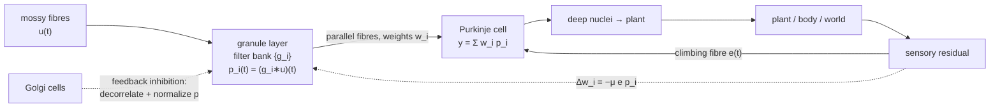

# Unit 06 — Control, filtering, and internal models

> **The conversion in one line:** *a recurrent circuit driven by a subtractive error signal → a recursive Bayesian estimator wrapped in a feedback controller* — and, in the cerebellum-like case, *a granule-cell expansion plus a climbing-fibre error → the LMS adaptive filter, verbatim.*

## Orientation

You already know this material. That is the pedagogical bet of this unit. If you have ever implemented a Kalman filter, tuned an LMS equalizer, worried about eigenvalue spread in an adaptive noise canceller, or argued about whether the secondary path estimate was good enough for filtered-X, then you have already done the mathematics that the cerebellum, the electrosensory lobe, and the sensorimotor system appear to be doing. The task of this unit is not to teach you adaptive filter theory. It is to make the identification precise enough that the standard EE facts start generating neuroscience predictions — because they do, and sharply.

Here is why control and estimation occupy a special place in the circuits-to-algorithms programme. Most normative theories in neuroscience are *descriptive optima*: here is an objective, here is the optimum, does the data look like it? Estimation and control theory instead give you **structural decompositions**. The Kalman filter is not a formula; it is a claim that any optimal estimator of a linear-Gaussian system factors into exactly three parts — a model-based prediction, an innovation, and an uncertainty-dependent gain — and that these parts are separately identifiable. That is an enormously stronger constraint than "the output resembles the posterior mean." It says: *if this circuit is a Kalman filter, then there is a subpopulation carrying $\hat x$, a subpopulation carrying $z - H\hat x$, and a modulatory signal proportional to $P H^{\mathsf T}R^{-1}$, and here is how each must change when you manipulate sensory noise.* You can go and look.

The unit has two halves that meet in the middle. The first half is Bayesian: the Kalman filter, LQG, the separation principle, and Todorov & Jordan's argument that motor variability is not noise to be explained away but the *signature* of an optimal feedback controller. The second half is adaptive-filter-theoretic: Fujita's cerebellum, Widrow–Hoff, the eigenvalue-spread problem, and the beautiful fact that predictive cancellation in electric fish is a working adaptive noise canceller with a climbing fibre for an error microphone. The middle, where they meet, is the *innovation*: the same subtraction that makes the Kalman filter optimal makes the negative image possible.

---

## 1. State estimation and the Kalman filter

### 1.1 The problem

$$\mathbf x_{t+1} = A\mathbf x_t + B\mathbf u_t + \mathbf w_t,\qquad \mathbf w_t\sim\mathcal N(0,Q),$$
$$\mathbf z_t = H\mathbf x_t + \mathbf v_t,\qquad \mathbf v_t\sim\mathcal N(0,R),$$

with $\mathbf w,\mathbf v$ independent and white. We want $p(\mathbf x_t\mid \mathbf z_{1:t})$, recursively — i.e. with $O(1)$ memory, which is the only kind of estimator a circuit could run.

### 1.2 Derivation via the information form

Because everything is linear-Gaussian, the posterior stays Gaussian and we need only track $(\hat{\mathbf x},P)$. Suppose the prior at time $t$ is $\mathcal N(\hat{\mathbf x}_{t|t-1}, P_{t|t-1})$; write $\hat{\mathbf x}\equiv\hat{\mathbf x}_{t|t-1}$, $P\equiv P_{t|t-1}$. Bayes:

$$-2\log p(\mathbf x\mid\mathbf z_{1:t}) = (\mathbf x-\hat{\mathbf x})^{\mathsf T}P^{-1}(\mathbf x-\hat{\mathbf x}) + (\mathbf z_t - H\mathbf x)^{\mathsf T}R^{-1}(\mathbf z_t-H\mathbf x) + \text{const}.$$

Collect quadratic and linear terms in $\mathbf x$:

$$\boxed{\;P_{t|t}^{-1} = P^{-1}+H^{\mathsf T}R^{-1}H,\qquad P_{t|t}^{-1}\hat{\mathbf x}_{t|t} = P^{-1}\hat{\mathbf x} + H^{\mathsf T}R^{-1}\mathbf z_t.\;}$$

This is the *information form*, and it is the form to remember, because it says something clean: **precisions add, and precision-weighted means add.** Two independent sources of evidence about $\mathbf x$ combine by summing their natural parameters. Keep this in mind for §1.5.

### 1.3 From information form to gain form (Woodbury)

The information form requires inverting an $n\times n$ matrix; the gain form requires inverting only an $m\times m$ one, and — more importantly — has an interpretable circuit reading. By the Woodbury identity,

$$P_{t|t} = \big(P^{-1}+H^{\mathsf T}R^{-1}H\big)^{-1} = P - PH^{\mathsf T}\big(HPH^{\mathsf T}+R\big)^{-1}HP = (I-KH)P,\qquad K \equiv PH^{\mathsf T}\big(HPH^{\mathsf T}+R\big)^{-1}.$$

For the mean, we need two identities. First, $P_{t|t}P^{-1} = (I-KH)$, immediate from the above. Second, the claim $P_{t|t}H^{\mathsf T}R^{-1} = K$. Proof: from the definition of $K$,

$$K\big(HPH^{\mathsf T}+R\big) = PH^{\mathsf T}\ \Longrightarrow\ KR = PH^{\mathsf T}-KHPH^{\mathsf T} = (I-KH)PH^{\mathsf T} = P_{t|t}H^{\mathsf T},$$

so $P_{t|t}H^{\mathsf T}R^{-1}=K$. $\square$ Therefore

$$\hat{\mathbf x}_{t|t} = (I-KH)\hat{\mathbf x} + K\mathbf z_t = \hat{\mathbf x}_{t|t-1} + K\big(\mathbf z_t - H\hat{\mathbf x}_{t|t-1}\big).$$

Together with the prediction step $\hat{\mathbf x}_{t+1|t} = A\hat{\mathbf x}_{t|t}+B\mathbf u_t$, $P_{t+1|t}=AP_{t|t}A^{\mathsf T}+Q$, that is the whole filter. In continuous time (Kalman–Bucy):

$$\dot{\hat{\mathbf x}} = \underbrace{A\hat{\mathbf x} + B\mathbf u}_{\text{internal model}} + \underbrace{K(t)}_{\text{gain}}\big(\underbrace{\mathbf z - H\hat{\mathbf x}}_{\text{innovation}}\big),\qquad K = PH^{\mathsf T}R^{-1},$$
$$\dot P = AP+PA^{\mathsf T}+Q-PH^{\mathsf T}R^{-1}HP\qquad\text{(Riccati)}.$$

### 1.4 The circuit reading, term by term

This is the payoff. Each term is a *different kind of thing* anatomically, and they are separately manipulable.

| Term | What it is | Candidate circuit element |
|---|---|---|
| $A\hat{\mathbf x}$ | forward model of the world's dynamics | **recurrent connectivity**; the network's own eigenstructure is the internal model of $A$ |
| $B\mathbf u$ | effect of one's own actions | **efference copy / corollary discharge** |
| $H\hat{\mathbf x}$ | predicted sensory input | **top-down / feedback projection** onto sensory neurons |
| $\mathbf z - H\hat{\mathbf x}$ | innovation | **error neurons**: subtraction of prediction from afference |
| $K$ | precision ratio | **multiplicative gain on the error pathway** |
| $P$ | posterior covariance | a slow state variable; ties $K$ to recent statistics |

Three consequences worth stating loudly.

**(i) The innovation is the predictive-coding residual.** The optimal estimator does not propagate the observation forward; it propagates what the observation added. A circuit that implements a Kalman filter *must* contain a subtraction of a top-down prediction from a bottom-up afferent, i.e. it must look like predictive coding. Conversely, when you see sensory cancellation, "Kalman filter" should be on your hypothesis list.

**(ii) The Kalman gain is exactly what a normalization circuit computes.** Consider the scalar cue-combination case: $K = \sigma_{\text{prior}}^2/(\sigma_{\text{prior}}^2+\sigma_{\text{obs}}^2)$ — a ratio of a term to a sum of terms. That is the functional form of divisive normalization, $r_i = g_i/(\sigma+\sum_jg_j)$, and it is not a loose analogy: a two-input normalization circuit with input gains equal to precisions computes the Kalman weights exactly. This upgrades divisive normalization from "a canonical computation" to "the canonical implementation of Bayesian weighting," and it makes a prediction: **the gain of the error pathway should decrease when sensory reliability decreases**, on the timescale over which reliability is estimated.

**(iii) The closed-loop time constants are uncertainty-dependent.** Substituting the update into the prediction step gives $\hat{\mathbf x}_{t+1|t} = A(I-KH)\hat{\mathbf x}_{t|t-1}+AK\mathbf z_t+B\mathbf u_t$. The effective recurrent matrix is $A(I-KH)$, so as $K$ grows (reliable sensing) the network relies less on its recurrence and its memory shortens; as $K\to0$ (unreliable sensing) the network's dynamics approach the open-loop internal model $A$ and its integration time lengthens. **Measured neural time constants should lengthen when the stimulus becomes uninformative.** That is a real, falsifiable, and repeatedly observed prediction.

A structural caveat that matters for experiment design: in the classical linear-Gaussian setting $P_t$ obeys a Riccati recursion that does not depend on the data, so the gain schedule could in principle be hard-wired or pre-computed. Data-dependence of the gain only arises when $R$ or $Q$ is itself unknown or non-stationary — which, for any real sensory system, it always is. So the *interesting* version of the hypothesis is adaptive-gain Kalman filtering, and the experiment is to manipulate sensory noise online.

### 1.5 Probabilistic population codes: where the gain is literally the precision

The cleanest neural realization of "precisions add" is the linear probabilistic population code (Ma, Beck, Latham & Pouget 2006). Suppose a population's responses $\mathbf r$ to a stimulus $s$ belong to the "Poisson-like" exponential family

$$p(\mathbf r\mid s) = \phi(\mathbf r)\exp\big(\mathbf h(s)^{\mathsf T}\mathbf r\big),$$

which holds for independent Poisson neurons with $h_i(s)=\log f_i(s)$. Then by Bayes with a flat prior, $p(s\mid\mathbf r)\propto\exp(\mathbf h(s)^{\mathsf T}\mathbf r)$: **the spike counts are the natural parameters of the posterior.** Two independent populations give $p(s\mid\mathbf r_1,\mathbf r_2)\propto\exp\big(\mathbf h(s)^{\mathsf T}(\mathbf r_1+\mathbf r_2)\big)$ — optimal cue combination is *addition of firing rates*.

For Gaussian tuning curves $f_i(s)\propto\exp(-(s-s_i)^2/2\sigma_{tc}^2)$ with gain $g$, one computes $\mathbf h(s)^{\mathsf T}\mathbf r$ to be a quadratic in $s$ with curvature proportional to $\sum_ir_i$. Hence the posterior is Gaussian with

$$\text{precision}\ \propto\ \text{total spike count}.$$

Gain *is* precision. This is why the Kalman gain, which is a precision ratio, becomes a firing-rate ratio, which a normalization circuit computes for free. Deneve, Duhamel & Pouget (2007) built exactly this: a recurrent basis-function network with divisive normalization that implements Kalman filtering for sensorimotor integration, with the recurrent weights encoding $A$ and the normalization computing $K$.

The behavioural evidence that humans do weight by precision is by now overwhelming: Ernst & Banks (2002) for visual–haptic combination, Körding & Wolpert (2004) for prior–likelihood combination in a sensorimotor task with an experimenter-controlled prior.

---

## 2. Optimal feedback control

### 2.1 LQR: derivation

Take $\mathbf x_{t+1}=A\mathbf x_t+B\mathbf u_t+\mathbf w_t$ and the cost

$$J = \mathbb E\left[\mathbf x_N^{\mathsf T}Q_f\mathbf x_N + \sum_{t=0}^{N-1}\big(\mathbf x_t^{\mathsf T}Q\mathbf x_t + \mathbf u_t^{\mathsf T}R_u\mathbf u_t\big)\right].$$

Guess $V_t(\mathbf x)=\mathbf x^{\mathsf T}S_t\mathbf x+c_t$ and verify by backward induction. Bellman:

$$V_t(\mathbf x) = \min_{\mathbf u}\Big[\mathbf x^{\mathsf T}Q\mathbf x + \mathbf u^{\mathsf T}R_u\mathbf u + \mathbb E\,V_{t+1}(A\mathbf x+B\mathbf u+\mathbf w)\Big].$$

Since $\mathbb E[\mathbf w]=0$, the noise contributes only the additive constant $\operatorname{Tr}(S_{t+1}Q)$, so

$$V_t(\mathbf x) = \min_{\mathbf u}\Big[\mathbf x^{\mathsf T}Q\mathbf x+\mathbf u^{\mathsf T}R_u\mathbf u+(A\mathbf x+B\mathbf u)^{\mathsf T}S_{t+1}(A\mathbf x+B\mathbf u)\Big] + \operatorname{Tr}(S_{t+1}Q).$$

The bracket is a convex quadratic in $\mathbf u$; setting the gradient to zero,

$$2R_u\mathbf u+2B^{\mathsf T}S_{t+1}(A\mathbf x+B\mathbf u)=0\ \Longrightarrow\ \boxed{\ \mathbf u_t^\star=-L_t\mathbf x_t,\quad L_t=\big(R_u+B^{\mathsf T}S_{t+1}B\big)^{-1}B^{\mathsf T}S_{t+1}A.\ }$$

Substituting back (complete the square) gives the discrete Riccati recursion

$$S_t = Q + A^{\mathsf T}S_{t+1}A - A^{\mathsf T}S_{t+1}B\big(R_u+B^{\mathsf T}S_{t+1}B\big)^{-1}B^{\mathsf T}S_{t+1}A,\qquad S_N=Q_f,$$

and $c_t = c_{t+1}+\operatorname{Tr}(S_{t+1}Q)$. Note the noise affects the *cost* but not the *policy*: this is certainty equivalence in its simplest form, and it is the first hint that it is fragile — it depended on $\mathbf w$ being additive and zero-mean.

An equivalent form of the Riccati recursion, obtained by Woodbury on the bracket, will be needed in §2.3:

$$S_t = Q + A^{\mathsf T}\big(S_{t+1}^{-1}+BR_u^{-1}B^{\mathsf T}\big)^{-1}A = Q+A^{\mathsf T}\big(I+S_{t+1}BR_u^{-1}B^{\mathsf T}\big)^{-1}S_{t+1}A.$$

### 2.2 Why estimation and control separate

With partial observation, the optimal policy is $\mathbf u_t=-L_t\hat{\mathbf x}_{t|t}$ with the *same* $L_t$ and $\hat{\mathbf x}$ from the Kalman filter. This is the separation theorem, and the proof is short enough to internalize.

**Step 1: the estimation error does not depend on the control.** Write $\mathbf e_t = \mathbf x_t-\hat{\mathbf x}_{t|t}$. Then

$$\mathbf e_{t+1} = \big(A\mathbf x_t+B\mathbf u_t+\mathbf w_t\big) - \Big[A\hat{\mathbf x}_{t|t}+B\mathbf u_t + K_{t+1}\big(\mathbf z_{t+1}-H(A\hat{\mathbf x}_{t|t}+B\mathbf u_t)\big)\Big].$$

The $B\mathbf u_t$ terms cancel identically, and substituting $\mathbf z_{t+1}=H(A\mathbf x_t+B\mathbf u_t+\mathbf w_t)+\mathbf v_{t+1}$ the remaining $B\mathbf u_t$ inside also cancels, leaving

$$\mathbf e_{t+1} = (I-K_{t+1}H)\big(A\mathbf e_t+\mathbf w_t\big) - K_{t+1}\mathbf v_{t+1}.$$

**No $\mathbf u$.** The error process is autonomous. (This is special to linear dynamics with additive, control-independent noise — remember that.)

**Step 2: the cost splits.** $\mathbf x_t^{\mathsf T}Q\mathbf x_t = (\hat{\mathbf x}_t+\mathbf e_t)^{\mathsf T}Q(\hat{\mathbf x}_t+\mathbf e_t) = \hat{\mathbf x}_t^{\mathsf T}Q\hat{\mathbf x}_t + 2\hat{\mathbf x}_t^{\mathsf T}Q\mathbf e_t + \mathbf e_t^{\mathsf T}Q\mathbf e_t$. By the orthogonality principle, $\mathbf e_t\perp$ everything measurable with respect to $\mathbf z_{1:t}$, and $\hat{\mathbf x}_t$ is such a thing; hence $\mathbb E[\hat{\mathbf x}_t^{\mathsf T}Q\mathbf e_t]=0$. Therefore

$$J = \underbrace{\mathbb E\Big[\hat{\mathbf x}_N^{\mathsf T}Q_f\hat{\mathbf x}_N+\sum_t\big(\hat{\mathbf x}_t^{\mathsf T}Q\hat{\mathbf x}_t+\mathbf u_t^{\mathsf T}R_u\mathbf u_t\big)\Big]}_{\text{depends on }\mathbf u} + \underbrace{\sum_t\operatorname{Tr}(QP_t)}_{\text{independent of }\mathbf u}.$$

**Step 3: the estimate obeys a nice linear system.** $\hat{\mathbf x}_{t+1|t+1} = A\hat{\mathbf x}_{t|t}+B\mathbf u_t+K_{t+1}\boldsymbol\nu_{t+1}$ where $\boldsymbol\nu$ is the innovation, which is *white* with known covariance and independent of $\mathbf u$ (Exercise E2). So the $\mathbf u$-dependent part of $J$ is an LQR problem in the state $\hat{\mathbf x}$ with additive white noise — whose solution, by §2.1, is $\mathbf u_t=-L_t\hat{\mathbf x}_t$ with the same $L$. $\square$

So the LQG controller is: Kalman filter, then LQR on the estimate. Two boxes, designed independently.

> **But separation is not a fact about brains. It is a fact about additive noise.** Harris & Wolpert (1998) established that motor noise is *signal-dependent*: the variance of the force produced scales with the mean force, so $\operatorname{Cov}(\text{noise}) = \sum_k C_k\mathbf u\mathbf u^{\mathsf T}C_k^{\mathsf T}$. Step 1 above then fails — the estimation error covariance depends on the control, so the filter cannot be designed without knowing the controller, and vice versa. Todorov (2005) derives the correct coupled recursions, which must be solved by iterating filter and controller to a joint fixed point. This is a genuine, and underappreciated, structural difference between motor neuroscience and textbook LQG, and it is where several of the interesting predictions come from.

### 2.3 The minimal intervention principle

Todorov & Jordan (2002) asked what an optimal feedback controller does with a *redundant* plant — one with more degrees of freedom than the task requires. The answer, which they named the **minimal intervention principle**: correct deviations only insofar as they affect the cost. Do not correct task-irrelevant deviations, because correcting them costs control effort (and, with signal-dependent noise, injects more noise) for no benefit.

This can be made exact. Let the cost be purely terminal and task-restricted: $Q_t=0$ for $t<N$ and $Q_f = C^{\mathsf T}C$ where $C$ maps state to task variables. Then $S_N = C^{\mathsf T}C$, and by the alternative Riccati form of §2.1 with $Q=0$,

$$S_t = A^{\mathsf T}\big(I+S_{t+1}BR_u^{-1}B^{\mathsf T}\big)^{-1}S_{t+1}A.$$

Since $(I+S_{t+1}BR_u^{-1}B^{\mathsf T})^{-1}$ is invertible, and assuming $A$ invertible,

$$S_t\mathbf x = 0 \iff S_{t+1}A\mathbf x = 0 \iff A\mathbf x\in\ker S_{t+1},\qquad\text{i.e.}\qquad \boxed{\ \ker S_t = A^{-1}\ker S_{t+1} = A^{-(N-t)}\ker\big(C^{\mathsf T}C\big).\ }$$

And since $L_t = (R_u+B^{\mathsf T}S_{t+1}B)^{-1}B^{\mathsf T}S_{t+1}A$, we get $L_t\mathbf x = 0$ whenever $A\mathbf x\in\ker S_{t+1}$. **The feedback gain has a null space, and that null space is exactly the set of state deviations that will flow into the task-irrelevant subspace by the end of the movement.** That set is the *uncontrolled manifold*, given here a dynamical definition rather than a kinematic one.

Consequences, in order of testability:

1. **Anisotropic variability.** Noise accumulates unopposed in $\ker L_t$ and is suppressed in its complement. Trial-to-trial variance should be large in task-irrelevant directions and small in task-relevant ones — precisely the uncontrolled-manifold result of Scholz & Schöner (1999), and the reason it appears everywhere from shooting to standing to speech.
2. **Task-dependent noise structure.** Change the task (change $C$) and the variance ellipsoid must rotate, *with the same plant and the same noise sources*. This is the discriminating prediction against every "desired trajectory + servo" model, because a servo has an isotropic (or at least task-independent) correction policy: it tracks a trajectory, so it corrects everything.
3. **Corrections are not error-nulling.** An optimal controller responding to a perturbation does not return the state to the pre-perturbation trajectory; it goes to whatever point on the goal manifold is cheapest. Observed corrections should therefore be *goal-directed, not trajectory-directed* — again a clean discrimination, and the basis of a large experimental literature on rapid feedback responses.
4. **Redundancy is exploited, not eliminated.** The classical "degrees of freedom problem" — how does the brain choose among infinitely many solutions? — partly dissolves: it does not choose. It leaves the redundant dimensions uncontrolled and lets them wander.

With signal-dependent noise added, the same machinery also delivers the smooth bell-shaped velocity profiles of reaching (minimum-variance model, Harris & Wolpert 1998), because large controls now cost variance and so are spread out in time. Getting kinematics for free from a noise model is a good example of what a genuinely normative theory buys you.

---

## 3. Forward models, efference copy, and cancellation

### 3.1 The idea, and its two jobs

An internal *forward* model maps (state, motor command) $\to$ (predicted next state, predicted sensory consequence). It is the $A\hat{\mathbf x}+B\mathbf u$ and $H\hat{\mathbf x}$ of §1, and it does two things that are worth separating because circuits may implement them separately:

- **Estimation.** Sensory feedback is delayed (30–150 ms in vertebrates) and noisy. A forward model lets you estimate the *current* state from a delayed measurement plus a known command — a Smith predictor, in EE terms.
- **Cancellation.** Predicted reafference can be subtracted from the afferent stream, so the sensory system reports only the unpredicted part. This is exactly the innovation, and it is where the coding argument of Unit 03 meets the estimation argument of this unit: subtracting a prediction is *both* the optimal-estimation operation and the redundancy-reducing operation.

The reafference principle is old — von Holst & Mittelstaedt (1950) and Sperry (1950) independently proposed corollary discharge to explain why the world does not appear to move when you move your eyes. Crapse & Sommer (2008) survey the modern versions across phyla. The behavioural signature is *sensory attenuation*: self-generated stimuli feel weaker, which is why you cannot tickle yourself (Blakemore, Wolpert & Frith 1998), and the attenuation is graded by the predictability of the stimulus given the command.

### 3.2 Wolpert, Ghahramani & Jordan (1995)

The experiment that made the internal-model story quantitative. Subjects moved their arm in the dark and reported the perceived position of their hand after movements of varying duration and direction. If the brain used only sensory feedback, the estimate's variance would be constant; if it used only a forward model integrating the motor command, variance would grow monotonically with time (integrated noise); if it optimally combined the two — a Kalman filter — variance would grow initially and then be arrested as proprioceptive evidence accumulated.

The measured variance showed exactly the non-monotonic profile of the combined model, with the bias also matching a filter whose internal model of the arm's dynamics is slightly wrong. This is a nice example of a *structural* rather than *pointwise* fit: the shape of the variance-versus-time curve is the signature of the filter, and no single-source model produces it.

The natural extension is that there is not one internal model but many, selected or blended by a responsibility signal. MOSAIC (Wolpert & Kawato 1998) makes each module a paired forward/inverse model, with the forward model's prediction error determining its responsibility $\lambda_k \propto \exp(-\|\mathbf z-\hat{\mathbf z}_k\|^2/2\sigma^2)$ and the inverse models' outputs blended by $\lambda$. An EE will recognize this immediately as an **interacting multiple model (IMM) filter** from target tracking, and the recognition is useful: everything known about IMM filters — mode-switching lag, the cost of over-fine model banks, the need for a Markov transition prior on the modes — transfers directly as a set of predictions about motor adaptation to switching contexts.

---

## 4. The cerebellum is an adaptive filter

### 4.1 The correspondence

Marr (1969) and Albus (1971) proposed that the granule-cell layer performs an expansion recoding of mossy-fibre input and that climbing fibres teach the Purkinje cell which patterns to respond to. Fujita (1982) made the crucial move of treating the granule layer as producing a *temporal* basis and the Purkinje cell as an *adaptive linear combiner*, at which point the whole thing becomes Widrow–Hoff. Dean, Porrill, Ekerot & Jörntell (2010) is the modern statement.

Here is the dictionary. Do not skim it; every row is load-bearing.

| Cerebellum | Adaptive filter |
|---|---|
| mossy fibre input $\mathbf u(t)$ | reference input |
| granule cells, $\sim10^{11}$, 4 MF inputs each | **filter bank**: $p_i(t)=(g_i * \mathbf u)(t)$, a set of regressors / tapped-delay-line-plus-shaping |
| Golgi cell feedback inhibition | gain control and decorrelation of the regressors |
| parallel fibre $\to$ Purkinje weights $w_i$ | adaptive filter coefficients |
| Purkinje cell output $y(t)=\sum_iw_ip_i(t)$ | **adaptive linear combiner** output |
| climbing fibre $e(t)$ | error signal (the "desired minus actual" teaching input) |
| LTD at PF–PC on PF/CF coincidence | $\Delta w_i \propto -e(t)\,p_i(t)$: **LMS / Widrow–Hoff** |
| deep nuclei | output stage / plant interface |

The learning rule at the parallel-fibre–Purkinje synapse is: coincidence of parallel-fibre activity with a climbing-fibre complex spike produces long-term depression. Written out, with $e$ the climbing-fibre rate deviation from baseline:

$$\Delta w_i = -\mu\,e(t)\,p_i(t).$$

That is *exactly* the Widrow–Hoff LMS update, $\mathbf w(n+1)=\mathbf w(n)+\mu\,\varepsilon(n)\mathbf p(n)$, up to the sign that fixes the polarity of the Purkinje cell's (inhibitory) effect on its target. Nothing has been approximated. The cerebellar microcircuit, taken at face value, is a least-mean-squares adaptive filter with $\sim10^5$ taps per Purkinje cell.

### 4.2 Convergence, and the eigenvalue-spread problem

You know this analysis; the point is what it predicts. Let $\mathbf p(n)$ be the regressor vector, $R=\mathbb E[\mathbf p\mathbf p^{\mathsf T}]$ its correlation matrix, $d(n)$ the desired response, $\mathbf w_o = R^{-1}\mathbb E[d\,\mathbf p]$ the Wiener solution, and $\mathbf v=\mathbf w-\mathbf w_o$ the weight error. Under the standard independence assumption,

$$\mathbb E[\mathbf v(n+1)] = (I-\mu R)\,\mathbb E[\mathbf v(n)] \quad\Longrightarrow\quad \mathbb E[v_i'(n)] = (1-\mu\lambda_i)^n\,\mathbb E[v_i'(0)]$$

in the eigenbasis of $R$. Hence:

- **Stability:** $0<\mu<2/\lambda_{\max}$.
- **Mode time constants:** $\tau_i \approx 1/(\mu\lambda_i)$ samples.
- **The bind:** stability is limited by $\lambda_{\max}$, speed by $\lambda_{\min}$. The slowest mode therefore satisfies

$$\tau_{\max} = \frac{1}{\mu\lambda_{\min}} > \frac{\lambda_{\max}}{2\lambda_{\min}} = \frac{\chi(R)}{2},$$

where $\chi(R)=\lambda_{\max}/\lambda_{\min}$ is the **eigenvalue spread** (condition number). Convergence takes at least $\chi/2$ samples no matter how you tune $\mu$.

- **Misadjustment:** at steady state the gradient noise inflates the MSE above the Wiener minimum by the fraction $\mathcal M \approx \mu\operatorname{Tr}(R)/2$. So $\mu$ trades speed against asymptotic accuracy — you cannot have both, and the exchange rate is set by $\operatorname{Tr}(R)$, the total input power.

### 4.3 What this predicts about granule-cell basis design

Now run the EE facts backwards. LMS's performance is governed entirely by $R = \mathbb E[\mathbf p\mathbf p^{\mathsf T}]$, the correlation matrix of the *regressors* — which, in the cerebellum, is the correlation matrix of granule cell activity. The algorithm therefore imposes design requirements on the granule layer, and they are specific.

**(1) Decorrelate.** $\chi(R)=1$ iff $R\propto I$, i.e. iff granule cells are uncorrelated with equal variance. Every departure from that multiplies the worst-case learning time. **Prediction: there should be a mechanism actively decorrelating granule cells, and it should be inhibitory and local.** There is: Golgi cell feedback inhibition. This is the same anti-Hebbian decorrelation motif as Unit 05 §3, arriving here for a completely different reason — not to reduce redundancy for coding efficiency, but to condition a regression problem. That two independent normative arguments converge on the same circuit motif is worth pausing on; it is also a warning that observing decorrelation does not by itself identify the objective.

**(2) Equalize variances.** Decorrelation alone gives $R$ diagonal but not isotropic. Granule cell gain control (Golgi inhibition again, plus intrinsic homeostasis) should equalize response variances across the population. Note that this is a *stronger* claim than "the code is sparse": sparseness with heterogeneous variances still gives large $\chi$.

**(3) Normalize the learning rate.** Standard LMS's stability bound depends on input power; NLMS uses $\mu_n = \tilde\mu/\|\mathbf p(n)\|^2$, which is stable for $0<\tilde\mu<2$ regardless of input scale. The biological analogue is a plasticity rule whose magnitude is divided by total parallel-fibre activity — i.e. **heterosynaptic normalization at the Purkinje cell**. This predicts that the amount of LTD induced at a given synapse by a given PF/CF pairing should *decrease* when other parallel fibres are simultaneously active. That is a bench experiment.

**(4) Expand, and expand randomly.** The granule layer's enormous expansion ratio does two things. It makes the basis rich enough to span the required $d(t)$ — the fundamental limitation of any linear adaptive filter is that it can only cancel what its basis spans (see §5.2). And random sparse projections have well-conditioned Gram matrices: for an $N\times T$ random matrix with aspect ratio $c=N/T$, the Marchenko–Pastur law puts the spectrum of the sample correlation matrix in $[(1-\sqrt c)^2,(1+\sqrt c)^2]$, so $\chi\approx\big((1+\sqrt c)/(1-\sqrt c)\big)^2$. **Expansion improves conditioning as long as you have enough independent samples** — and degrades it catastrophically when $c\to1$, i.e. when the number of granule cells approaches the number of effectively independent input patterns. This gives a quantitative reason for the granule layer's size that is orthogonal to the usual pattern-separation argument.

**(5) Tile the relevant timescales.** The basis must span the temporal structure of the signal to be cancelled. If the plant has significant power out to $f_{\max}$, the granule basis must contain filters with matching time constants; conversely, temporal frequencies not represented in the basis will show up as *irreducible residual error*. This is a directly testable claim about the diversity of granule-cell temporal responses, and it is the claim that Kennedy et al. (2014) verified in electric fish (§5.3).

### 4.4 The distal error problem and decorrelation control

Now the subtlety that turns this from an analogy into research. Textbook LMS assumes you have access to $\varepsilon = d - y$, the error *in the same coordinates as the filter output*. The climbing fibre does not carry that. It carries a **sensory** error, downstream of the plant (the muscles, the limb, the world), and typically low-dimensional, slow, and nearly binary (complex spikes fire at ~1 Hz).

If the plant between the filter output and the error measurement is $B$, then naive LMS is descending the wrong gradient — the correct one requires the plant Jacobian, which is the "distal error problem" and, in adaptive filtering, the reason for the **filtered-X** modification (you filter the reference signal through an estimate of the secondary path before correlating it with the error).

Porrill, Dean & Stone (2004) showed that the cerebellum's *recurrent* architecture finesses this. Their **decorrelation control** framing: the learning rule $\Delta w_i \propto -e\,p_i$ has as its fixed point $\mathbb E[e\,p_i]=0$ for all $i$ — the error is decorrelated from every regressor — and this fixed point is the right one *regardless of $B$*, as long as the algorithm converges to it. The question is not correctness but stability, and the stability condition is exactly the classical one.

**Derive it.** Consider a single frequency $\omega$ spanned by two granule cells, $p_1=\cos\omega t$, $p_2=\sin\omega t$. Write the filter output as a phasor: $c(t)=w_1\cos\omega t+w_2\sin\omega t=\mathrm{Re}\{\mathcal We^{j\omega t}\}$ with $\mathcal W = w_1-jw_2$. After the plant, the contribution to the error is $\mathrm{Re}\{B(j\omega)\mathcal We^{j\omega t}\}$, and with a disturbance $\mathrm{Re}\{\mathcal De^{j\omega t}\}$ the total error is $e(t) = \mathrm{Re}\{\mathcal Ze^{j\omega t}\}$, $\mathcal Z = \mathcal D + B\mathcal W$.

The averaged learning rule needs $\langle e\cos\omega t\rangle = \tfrac12\mathrm{Re}\{\mathcal Z\}$ and $\langle e\sin\omega t\rangle = -\tfrac12\mathrm{Im}\{\mathcal Z\}$ (from $\mathrm{Re}\{\mathcal Ze^{j\omega t}\}=\mathrm{Re}\mathcal Z\cos\omega t-\mathrm{Im}\mathcal Z\sin\omega t$). So $\dot w_1 = -\tfrac\mu2\mathrm{Re}\mathcal Z$ and $\dot w_2=+\tfrac\mu2\mathrm{Im}\mathcal Z$, hence

$$\dot{\mathcal W} = \dot w_1 - j\dot w_2 = -\tfrac\mu2\big(\mathrm{Re}\mathcal Z + j\,\mathrm{Im}\mathcal Z\big) = -\frac\mu2\big(\mathcal D + B(j\omega)\mathcal W\big).$$

$$\boxed{\ \dot{\mathcal W} = -\tfrac{\mu}{2}B(j\omega)\,\mathcal W - \tfrac{\mu}{2}\mathcal D\ \Longrightarrow\ \text{stable} \iff \mathrm{Re}\{B(j\omega)\}>0 \iff |\angle B(j\omega)|<90^\circ.\ }$$

When it is stable, $\mathcal W\to-\mathcal D/B(j\omega)$ and the error is cancelled exactly at that frequency. This is the **strictly-positive-real (SPR) condition**, the same one that governs filtered-X LMS without a secondary-path filter, adaptive noise cancelling with an unmodelled path, and MRAC.

The consequences are excellent neuroscience:

- **The sign of the climbing-fibre error must be matched to the sign of the plant.** A miswired CF (or a plant whose gain inverts, e.g. reversing prisms, or a limb with reversed mechanics) produces divergent learning, not slow learning. This is a strong, sharp prediction, and it is why reversal learning in the VOR is genuinely hard rather than merely slow.
- **The granule basis should be restricted to the band where $|\angle B|<90^\circ$**, or the CF pathway must supply the missing phase advance. Since $\angle B$ accumulates lag with plant order and with delay ($e^{-j\omega T}$ contributes $-\omega T$), this bounds the usable bandwidth by $\omega_{\max} < \pi/(2T)$ for a pure delay $T$. Given the tens of milliseconds of sensorimotor delay, this puts the ceiling in the low tens of Hz — remarkably close to the bandwidth over which cerebellar learning actually operates.
- **Anywhere the phase condition is violated, you should see either no learning or instability, not degraded learning.** The failure mode is qualitative, and it is diagnosable.

> This is the moment the EE identification stops being cute and starts paying: an eighty-year-old stability condition from adaptive control predicts a bandwidth limit on cerebellar learning, from the sensorimotor delay alone.

---

## 5. Predictive cancellation in electric fish

### 5.1 Why this system

Mormyrid electric fish emit an electric organ discharge (EOD) and sense distortions of the resulting field. Every discharge produces a massive, stereotyped, self-generated input that would swamp the tiny signals of interest. The animal must cancel it. And unlike almost any other system, you know the command (the EOD motor command is a discrete, precisely timed event), you know the reafference, you can record the plastic synapses, and you can manipulate the mapping between them arbitrarily.

### 5.2 Bell's result and the negative image

Bell (1981) showed that the electrosensory lobe (ELL) — a cerebellum-like structure with granule cells, parallel fibres, and Purkinje-like principal cells — builds a **negative image** of the predicted reafferent input. Pair the EOD command with an artificial sensory stimulus for a few minutes, then remove the stimulus, and the cell responds with an *inverted* copy of the stimulus, precisely time-locked to the command. The circuit has learned the expected input and now subtracts it.

Bell, Han, Sugawara & Grant (1997) then measured the plasticity rule at the parallel-fibre synapses onto ELL principal cells and found **anti-Hebbian STDP**: pairing a parallel-fibre EPSP with a postsynaptic broad spike produces depression when the EPSP *precedes* the spike, and potentiation otherwise — the mirror image of the hippocampal/cortical window. Anti-Hebbian is exactly right: the rule must *reduce* the response to predictable input.

**Derive the negative image; it is three lines of least squares.** Let $r(t)$ be the reafferent input time-locked to the command ($t$ measured from the command), let $\{p_i(t)\}$ be the granule-cell temporal basis (also command-locked), and let the principal cell's output be

$$y(t) = r(t) + \sum_i w_i p_i(t).$$

The anti-Hebbian rule, averaged over trials, is $\Delta w_i \propto -\int y(t)p_i(t)\,dt$. Its fixed point is $\int y\,p_i = 0$ for all $i$, i.e.

$$\sum_j w_j\underbrace{\int p_ip_j}_{G_{ij}} = -\underbrace{\int r\,p_i}_{b_i} \quad\Longrightarrow\quad \mathbf w = -G^{-1}\mathbf b \quad\Longrightarrow\quad \sum_iw_ip_i = -\,\Pi_{\mathrm{span}\{p_i\}}\,r.$$

**The negative image is exactly minus the orthogonal projection of the reafference onto the span of the granule-cell basis.** Immediate corollaries, all testable:

- Cancellation is perfect if and only if $r\in\mathrm{span}\{p_i\}$. Otherwise the residual is $r-\Pi r$, the component of the reafference the basis cannot represent.
- Therefore: **manipulate the reafference to have temporal structure outside the basis, and you should observe a specific, predictable residual** — not a uniform degradation.
- The rate of learning of each basis component is set by the eigenvalues of $G$, so §4.2's eigenvalue-spread analysis applies verbatim: components along small eigenvalues of $G$ learn slowest.

### 5.3 The temporal basis, measured

Kennedy et al. (2014) recorded the granule cells of the mormyrid ELL and showed directly that they provide a **temporal basis** for the command: different granule cells respond at different delays after the EOD command, with different durations, tiling the interval over which cancellation must occur. Combining such delay-tiling elements with the anti-Hebbian rule lets the circuit construct negative images of essentially arbitrary temporal shape — which is precisely the "filter bank" row of §4.1's dictionary, verified with electrodes.

This is, to my knowledge, the most complete circuit-to-algorithm identification in systems neuroscience: the basis is measured, the plasticity rule is measured, the error signal is identified, the algorithm (LMS in a fixed basis) is derived, and the prediction (negative image = projection onto the basis) is confirmed quantitatively.

The same architecture appears in the mammalian dorsal cochlear nucleus, where a cerebellum-like circuit cancels responses to self-generated sounds (Singla, Dempsey, Warren, Enikolopov & Sawtell 2017), and a functionally analogous motor-to-auditory prediction operates in mouse auditory cortex (Schneider, Nelson & Mooney 2014). Bell, Han & Sawtell (2008) is the comparative review.

### 5.4 The Widrow reading

Set the pieces side by side with Widrow's adaptive noise canceller (Widrow et al. 1975):

| Adaptive noise canceller | Electric fish |
|---|---|
| primary input: signal + correlated noise | electroreceptor afferents: prey signal + reafference |
| reference input: correlated with the noise only | EOD corollary discharge (mossy fibres) |
| adaptive filter | granule basis $\times$ plastic PF weights |
| filter output: replica of the noise | negative image |
| **system output = error** | ELL principal cell output |
| LMS driven by the error | anti-Hebbian plasticity driven by the cell's own output |

Notice the last row, which is the most interesting structural fact. In Widrow's canceller the error *is* the output: the thing you listen to is the thing that drives learning. The ELL is the same: the principal cell's own broad spikes serve as the postsynaptic factor in the plasticity rule, so the circuit needs no separate teaching pathway at all. The error signal is the output signal. This is the cleanest possible answer to "where does the teaching signal come from" — it does not come from anywhere; it is what remains.

And note what falls out: since the noise canceller's output is provably the minimum-MSE estimate of the *uncorrelated* component, the ELL is not merely subtracting; it is performing optimal linear separation of exafference from reafference, with the granule basis defining the hypothesis class.

---

## Mathematical structure spotlight

Cross-reference [`../structures/README.md`](../structures/README.md).

- **Riccati equations and their symplectic structure.** The estimation Riccati $\dot P = AP+PA^{\mathsf T}+Q-PH^{\mathsf T}R^{-1}HP$ and the control Riccati are the same equation under the duality $(A,H,Q,R)\leftrightarrow(A^{\mathsf T},B^{\mathsf T},Q,R_u)$ with time reversed. Both linearize to a Hamiltonian system, and their solutions are the stable invariant subspaces of a $2n\times2n$ Hamiltonian matrix. **Estimation and control are adjoint problems**, which is the deepest reason the LQG controller factors.
- **The orthogonality principle / projection in Hilbert space.** The Kalman filter is orthogonal projection of $\mathbf x_t$ onto the closed linear span of $\{\mathbf z_1,\dots,\mathbf z_t\}$ in $L^2$. Every "cross terms vanish" step in this unit — the separation proof, the whiteness of innovations, the negative image as $-\Pi r$ — is the same theorem. The Wiener–Hopf equations are the same theorem in the stationary continuous-time case.
- **Envelope theorem / dynamic programming.** As in Unit 05 §6.4, but here in its native habitat.
- **Passivity and positive-realness.** The SPR condition $\mathrm{Re}\,B(j\omega)>0$ of §4.4 is a passivity statement, and passivity is the general reason adaptive systems in feedback loops converge. This is the structure to reach for whenever a learning rule sits inside a loop it does not model.
- **Condition number and random matrices.** Eigenvalue spread governs LMS; Marchenko–Pastur governs the spread of random feature matrices; the two together explain why an expansion layer helps a downstream learner. Recurs from Unit 05 §8.
- **Exponential families and natural parameters.** PPCs: adding spike counts adds natural parameters, which multiplies likelihoods. The same structure behind the information form of the Kalman filter.

---

## What this buys you as an algorithmist

1. **A three-way decomposition to look for.** If you suspect a circuit is estimating, do not fit a posterior. Look for the three parts separately: recurrent dynamics (the internal model), a subtractive error (the innovation), and a modulatory gain (the Kalman gain). Each has its own manipulation — perturb the dynamics, perturb the prediction, perturb the reliability — and a real filter must respond to each in the predicted way.
2. **A specific prediction for normalization circuits.** Divisive normalization computes ratios of the form (this evidence)/(all evidence). That is the Kalman weight. If you see normalization on an error pathway, the hypothesis "this is a precision-weighting circuit" is cheap to state and cheap to test: manipulate the noise, watch the gain.
3. **Variability as data, not nuisance.** The minimal intervention principle turns trial-to-trial variability structure into the primary signature of the controller. Task-dependence of the variance ellipsoid, with the plant and noise held fixed, discriminates optimal feedback control from trajectory-tracking in one experiment.
4. **Adaptive filter theory as a prediction engine.** Everything in Haykin transfers. Eigenvalue spread predicts what the granule layer must do to its own correlations. NLMS predicts heterosynaptic normalization of plasticity. The SPR condition predicts a bandwidth ceiling on cerebellar learning set by sensorimotor delay, and predicts that sign-reversed feedback causes divergence rather than slow learning. Misadjustment predicts a speed/precision tradeoff in motor adaptation with a specific functional form. Use it.
5. **A warning about separation.** The tidy factorization of LQG into "estimate, then control" is a theorem about additive noise. Motor noise is multiplicative. Any argument that identifies an anatomical estimator and an anatomical controller because "they must separate" is leaning on a theorem that does not hold in the relevant regime.
6. **For olfaction specifically.** Sniffing, antennal movement, and locomotion all generate predictable, self-caused changes in the odor input, and every one of them is a candidate for reafferent cancellation with a known efference copy. If insect olfaction contains a cerebellum-like adaptive filter, the mushroom body is the obvious candidate — random expansion basis (Kenyon cells), plastic readout weights (KC$\to$MBON), and a modulatory error signal (dopaminergic neurons) that occupies exactly the climbing fibre's structural position. Unit 05 §8 and this unit's §4.1 are two readings of the same anatomy: a classifier and an adaptive filter are the same circuit with different error signals.

---

## Reading

### Core
- Kalman, R.E. (1960). "A new approach to linear filtering and prediction problems." *Journal of Basic Engineering* 82:35–45.
- Todorov, E. & Jordan, M.I. (2002). "Optimal feedback control as a theory of motor coordination." *Nature Neuroscience* 5:1226–1235.
- Wolpert, D.M., Ghahramani, Z. & Jordan, M.I. (1995). "An internal model for sensorimotor integration." *Science* 269:1880–1882.
- Fujita, M. (1982). "Adaptive filter model of the cerebellum." *Biological Cybernetics* 45:195–206.
- Dean, P., Porrill, J., Ekerot, C.-F. & Jörntell, H. (2010). "The cerebellar microcircuit as an adaptive filter: experimental and computational evidence." *Nature Reviews Neuroscience* 11:30–43.
- Bell, C.C. (1981). "An efference copy which is modified by reafferent input." *Science* 214:450–453.
- Bell, C.C., Han, V.Z., Sugawara, Y. & Grant, K. (1997). "Synaptic plasticity in a cerebellum-like structure depends on temporal order." *Nature* 387:278–281.
- Widrow, B., Glover, J.R., McCool, J.M. et al. (1975). "Adaptive noise cancelling: principles and applications." *Proceedings of the IEEE* 63:1692–1716.

### Deeper
- Kalman, R.E. & Bucy, R.S. (1961). "New results in linear filtering and prediction theory." *Journal of Basic Engineering* 83:95–108.
- Todorov, E. (2005). "Stochastic optimal control and estimation methods adapted to the noise characteristics of the sensorimotor system." *Neural Computation* 17:1084–1108.
- Todorov, E. (2004). "Optimality principles in sensorimotor control." *Nature Neuroscience* 7:907–915.
- Harris, C.M. & Wolpert, D.M. (1998). "Signal-dependent noise determines motor planning." *Nature* 394:780–784.
- Scholz, J.P. & Schöner, G. (1999). "The uncontrolled manifold concept: identifying control variables for a functional task." *Experimental Brain Research* 126:289–306.
- Porrill, J., Dean, P. & Stone, J.V. (2004). "Recurrent cerebellar architecture solves the motor-error problem." *Proceedings of the Royal Society B* 271:789–796.
- Kennedy, A., Wayne, G., Kaiser, P., Bell, C.C. & Sawtell, N.B. (2014). "A temporal basis for predicting the sensory consequences of motor commands in an electric fish." *Nature Neuroscience* 17:416–422.
- Bell, C.C., Han, V. & Sawtell, N.B. (2008). "Cerebellum-like structures and their implications for cerebellar function." *Annual Review of Neuroscience* 31:1–24.
- Singla, S., Dempsey, C., Warren, R., Enikolopov, A.G. & Sawtell, N.B. (2017). "A cerebellum-like circuit in the auditory system cancels responses to self-generated sounds." *Nature Neuroscience* 20:943–950.
- Schneider, D.M., Nelson, A. & Mooney, R. (2014). "A synaptic and circuit basis for corollary discharge in the auditory cortex." *Nature* 513:189–194.
- Ma, W.J., Beck, J.M., Latham, P.E. & Pouget, A. (2006). "Bayesian inference with probabilistic population codes." *Nature Neuroscience* 9:1432–1438.
- Deneve, S., Duhamel, J.-R. & Pouget, A. (2007). "Optimal sensorimotor integration in recurrent cortical networks: a neural implementation of Kalman filters." *Journal of Neuroscience* 27. [verify page numbers]
- Wolpert, D.M. & Kawato, M. (1998). "Multiple paired forward and inverse models for motor control." *Neural Networks* 11:1317–1329.
- Shadmehr, R. & Krakauer, J.W. (2008). "A computational neuroanatomy for motor control." *Experimental Brain Research* 185:359–381.
- Raymond, J.L. & Medina, J.F. (2018). "Computational principles of supervised learning in the cerebellum." *Annual Review of Neuroscience* 41:233–253.
- Medina, J.F. & Lisberger, S.G. (2008). "Links from complex spikes to local plasticity and motor learning in the cerebellum of awake-behaving monkeys." *Nature Neuroscience* 11:1185–1192.
- Herzfeld, D.J., Kojima, Y., Soetedjo, R. & Shadmehr, R. (2015). "Encoding of action by the Purkinje cells of the cerebellum." *Nature* 526:439–442.
- Crapse, T.B. & Sommer, M.A. (2008). "Corollary discharge across the animal kingdom." *Nature Reviews Neuroscience* 9:587–600.
- Haykin, S. *Adaptive Filter Theory.* Pearson. (Chapters on LMS, convergence, misadjustment, and filtered-X.)
- Anderson, B.D.O. & Moore, J.B. (1979). *Optimal Filtering.* Prentice-Hall.
- Bertsekas, D.P. *Dynamic Programming and Optimal Control.* Athena Scientific.

### Historical
- von Holst, E. & Mittelstaedt, H. (1950). "Das Reafferenzprinzip." *Naturwissenschaften* 37:464–476.
- Sperry, R.W. (1950). "Neural basis of the spontaneous optokinetic response produced by visual inversion." *Journal of Comparative and Physiological Psychology* 43:482–489.
- Widrow, B. & Hoff, M.E. (1960). "Adaptive switching circuits." *IRE WESCON Convention Record* 4:96–104.
- Marr, D. (1969). "A theory of cerebellar cortex." *Journal of Physiology* 202:437–470.
- Albus, J.S. (1971). "A theory of cerebellar function." *Mathematical Biosciences* 10:25–61.
- Ito, M. (1972). "Neural design of the cerebellar motor control system." *Brain Research* 40:81–84.
- Blakemore, S.-J., Wolpert, D.M. & Frith, C.D. (1998). "Central cancellation of self-produced tickle sensation." *Nature Neuroscience* 1:635–640.
- Ernst, M.O. & Banks, M.S. (2002). "Humans integrate visual and haptic information in a statistically optimal fashion." *Nature* 415:429–433.
- Körding, K.P. & Wolpert, D.M. (2004). "Bayesian integration in sensorimotor learning." *Nature* 427:244–247.

---

## Exercises
**E1 (★) — Woodbury, both ways.** Derive the gain form of the Kalman update from the information form, including the identity $P_{t|t}H^{\mathsf T}R^{-1}=K$. Then go the other way: starting from $P_{t|t}=(I-KH)P$, recover $P_{t|t}^{-1}=P^{-1}+H^{\mathsf T}R^{-1}H$. Which form would a circuit prefer, and why does the answer depend on whether $H$ is tall or wide?

Solution

*Forward.* $P_{t|t}=(P^{-1}+H^{\mathsf T}R^{-1}H)^{-1}$. Woodbury with $A=P^{-1}$, $U=H^{\mathsf T}$, $C=R^{-1}$, $V=H$:
$$(P^{-1}+H^{\mathsf T}R^{-1}H)^{-1}=P-PH^{\mathsf T}(R+HPH^{\mathsf T})^{-1}HP = (I-KH)P.$$
The gain identity is proved in §1.3: $K(HPH^{\mathsf T}+R)=PH^{\mathsf T}\Rightarrow KR=(I-KH)PH^{\mathsf T}=P_{t|t}H^{\mathsf T}\Rightarrow P_{t|t}H^{\mathsf T}R^{-1}=K$. Then $\hat{\mathbf x}_{t|t}=P_{t|t}(P^{-1}\hat{\mathbf x}+H^{\mathsf T}R^{-1}\mathbf z)=(I-KH)\hat{\mathbf x}+K\mathbf z=\hat{\mathbf x}+K(\mathbf z-H\hat{\mathbf x})$.

*Backward.* Write $S = HPH^{\mathsf T}+R$, so $P_{t|t} = P - PH^{\mathsf T}S^{-1}HP$. Multiply out directly:
$$\big(P^{-1}+H^{\mathsf T}R^{-1}H\big)\big(P-PH^{\mathsf T}S^{-1}HP\big) = I - H^{\mathsf T}S^{-1}HP + H^{\mathsf T}R^{-1}HP - H^{\mathsf T}R^{-1}HPH^{\mathsf T}S^{-1}HP$$
$$= I + H^{\mathsf T}\Big[-S^{-1}+R^{-1}-R^{-1}\big(HPH^{\mathsf T}\big)S^{-1}\Big]HP = I + H^{\mathsf T}\Big[-S^{-1}+R^{-1}\big(S-HPH^{\mathsf T}\big)S^{-1}\Big]HP.$$
Since $S-HPH^{\mathsf T}=R$, the bracket is $-S^{-1}+R^{-1}RS^{-1}=0$, and the product is $I$. Hence $P_{t|t}^{-1}=P^{-1}+H^{\mathsf T}R^{-1}H$. $\square$ (The two forms are Woodbury duals; this computation *is* the proof of Woodbury in this special case.)

*Which form would a circuit prefer?* The information form adds precisions — an additive, commutative, order-independent operation over an arbitrary number of cues, which is exactly what population codes do naturally (Unit 06 §1.5: adding firing rates adds natural parameters). It requires an $n\times n$ inversion only if you want an explicit mean, which a circuit that keeps everything in natural-parameter coordinates never needs. The gain form requires an $m\times m$ inversion. So: **if $H$ is wide (few observations, many states, $m\ll n$), the gain form is cheap; if $H$ is tall (many observations, few states, $m\gg n$) the information form is cheap.** Sensory systems are overwhelmingly in the second regime — tens of thousands of receptors, a low-dimensional latent — which is a real argument for expecting brains to operate in natural parameters, i.e. to represent precision-weighted quantities rather than means and covariances separately.

**E2 (★★) — Innovations are white.** Show that $\boldsymbol\nu_t = \mathbf z_t - H\hat{\mathbf x}_{t|t-1}$ satisfies $\mathbb E[\boldsymbol\nu_t]=0$, $\operatorname{Cov}(\boldsymbol\nu_t)=HP_{t|t-1}H^{\mathsf T}+R$, and $\mathbb E[\boldsymbol\nu_t\boldsymbol\nu_s^{\mathsf T}]=0$ for $s\ne t$. Then argue that the Kalman filter is the optimal *whitening filter* for the observation sequence, and connect this to the decorrelation objectives of Unit 05. What experimental signature would "the circuit outputs innovations" have that "the circuit outputs observations" would not?

Solution

$\boldsymbol\nu_t = \mathbf z_t-H\hat{\mathbf x}_{t|t-1} = H(\mathbf x_t-\hat{\mathbf x}_{t|t-1})+\mathbf v_t = H\mathbf e_{t|t-1}+\mathbf v_t$. Unbiasedness of the filter gives $\mathbb E[\boldsymbol\nu_t]=0$. Independence of $\mathbf v_t$ from $\mathbf e_{t|t-1}$ (which depends only on past noises) gives $\operatorname{Cov}(\boldsymbol\nu_t)=HP_{t|t-1}H^{\mathsf T}+R$.

Whiteness: $\boldsymbol\nu_s$ for $s<t$ is a measurable function of $\mathbf z_{1:s}\subseteq\mathbf z_{1:t-1}$. By the tower property,
$$\mathbb E[\boldsymbol\nu_t\boldsymbol\nu_s^{\mathsf T}] = \mathbb E\big[\mathbb E[\boldsymbol\nu_t\mid\mathbf z_{1:t-1}]\,\boldsymbol\nu_s^{\mathsf T}\big] = \mathbb E[0\cdot\boldsymbol\nu_s^{\mathsf T}]=0,$$
since $\mathbb E[\mathbf z_t\mid\mathbf z_{1:t-1}]=H\hat{\mathbf x}_{t|t-1}$ by definition of the predictor. $\square$

So the map $\{\mathbf z_t\}\mapsto\{\boldsymbol\nu_t\}$ is causal, causally invertible (you can reconstruct $\mathbf z$ from $\boldsymbol\nu$ by running the filter), and produces a white sequence: it is the **innovations representation**, i.e. a whitening filter. This is the same object as Unit 05's decorrelation, with two differences worth stating: (i) it is *temporal* rather than spatial whitening, and (ii) it is *model-based* — it whitens by removing predictable structure using a known generative model, rather than by adapting to observed correlations. A circuit could do either; which one it does is an empirical question with different lesion signatures.

Experimental signature: a circuit that outputs innovations should show **adaptation to predictability, not just to intensity**. Present a stimulus sequence with strong temporal correlation and the responses should shrink to the *unpredictable* component while a shuffled sequence with identical marginal statistics produces large responses. Additionally, the output autocorrelation should be flat, and the response to an omitted-but-expected stimulus should be a deflection of the *opposite* sign — the classic omission response, which is a signature no observation-reporting circuit produces.

**E3 (★★) — LQR by completing the square.** Carry out the backward induction in full, including the constant term $c_t$, and verify the Riccati recursion. Then show that if $Q\succeq0$ and $(A,B)$ is stabilizable, $S_t$ converges as $N-t\to\infty$ to the stabilizing solution of the algebraic Riccati equation. Finally: state the duality map that turns the control Riccati into the estimation Riccati.

Solution

Induction hypothesis $V_{t+1}(\mathbf x)=\mathbf x^{\mathsf T}S_{t+1}\mathbf x+c_{t+1}$. Then
$$\mathbb E V_{t+1}(A\mathbf x+B\mathbf u+\mathbf w) = (A\mathbf x+B\mathbf u)^{\mathsf T}S_{t+1}(A\mathbf x+B\mathbf u)+\operatorname{Tr}(S_{t+1}Q)+c_{t+1}.$$
The $\mathbf u$-dependent part is $\mathbf u^{\mathsf T}(R_u+B^{\mathsf T}S_{t+1}B)\mathbf u + 2\mathbf u^{\mathsf T}B^{\mathsf T}S_{t+1}A\mathbf x$. Write $M=R_u+B^{\mathsf T}S_{t+1}B\succ0$ and $N=B^{\mathsf T}S_{t+1}A$. Completing the square:
$$\mathbf u^{\mathsf T}M\mathbf u+2\mathbf u^{\mathsf T}N\mathbf x = (\mathbf u+M^{-1}N\mathbf x)^{\mathsf T}M(\mathbf u+M^{-1}N\mathbf x) - \mathbf x^{\mathsf T}N^{\mathsf T}M^{-1}N\mathbf x.$$
Minimum at $\mathbf u=-M^{-1}N\mathbf x=-L_t\mathbf x$, value $-\mathbf x^{\mathsf T}N^{\mathsf T}M^{-1}N\mathbf x$. Adding the $\mathbf u$-free terms $\mathbf x^{\mathsf T}(Q+A^{\mathsf T}S_{t+1}A)\mathbf x$ gives $S_t=Q+A^{\mathsf T}S_{t+1}A-N^{\mathsf T}M^{-1}N$ and $c_t=c_{t+1}+\operatorname{Tr}(S_{t+1}Q)$, closing the induction with $S_N=Q_f,\ c_N=0$.

Convergence: the map $S\mapsto \mathcal R(S)$ is monotone ($S\preceq S'\Rightarrow\mathcal R(S)\preceq\mathcal R(S')$) and, under stabilizability of $(A,B)$ and detectability of $(A,Q^{1/2})$, bounded above (a stabilizing control gives finite infinite-horizon cost). A monotone bounded sequence of positive semidefinite matrices converges, and the limit satisfies the ARE; detectability selects the stabilizing solution.

Duality: the control recursion in backward time with $(A,B,Q,R_u)$ maps to the estimation recursion in forward time under
$$A\to A^{\mathsf T},\quad B\to H^{\mathsf T},\quad Q\to Q_{\text{proc}},\quad R_u\to R,\quad S_t\to P_{t|t-1},\quad L_t^{\mathsf T}\to K_t.$$
Both are the same Riccati flow, whose solutions are the stable/unstable invariant subspaces of the Hamiltonian matrix $\begin{bmatrix}A & -BR_u^{-1}B^{\mathsf T}\\ -Q & -A^{\mathsf T}\end{bmatrix}$.

**E4 (★★) — Separation, and its failure.** (a) Prove the separation theorem following §2.2, being explicit about where the orthogonality principle is used. (b) Now let the noise be signal-dependent: $\mathbf w_t = \sum_k \epsilon_{t,k}C_k\mathbf u_t$ with $\epsilon\sim\mathcal N(0,1)$ i.i.d. Show that Step 1 fails — that $\mathbb E[\mathbf e_t\mathbf e_t^{\mathsf T}]$ now depends on the control law. (c) Redo the LQR derivation with this noise and show that the optimal gain becomes $L_t = \big(R_u+B^{\mathsf T}S_{t+1}B+\sum_kC_k^{\mathsf T}S_{t+1}C_k\big)^{-1}B^{\mathsf T}S_{t+1}A$. Interpret the extra term. Why does this alone (before any estimation) predict smoother movements?

Solution

(a) See §2.2. The orthogonality principle is used exactly once, in Step 2: $\mathbb E[\hat{\mathbf x}_t^{\mathsf T}Q\mathbf e_t]=0$ because $\mathbf e_t$ is orthogonal to the linear span of the observations and $\hat{\mathbf x}_t$ lies in that span. Everything else is algebra.

(b) With $\mathbf w_t=\sum_k\epsilon_{t,k}C_k\mathbf u_t$, the error recursion still has the $B\mathbf u$ terms cancelling, giving $\mathbf e_{t+1}=(I-K_{t+1}H)(A\mathbf e_t+\mathbf w_t)-K_{t+1}\mathbf v_{t+1}$ — but now $\operatorname{Cov}(\mathbf w_t)=\sum_kC_k\mathbf u_t\mathbf u_t^{\mathsf T}C_k^{\mathsf T}$ *depends on the control*, so
$$P_{t+1}=(I-KH)\Big(AP_tA^{\mathsf T}+\textstyle\sum_kC_k\mathbf u_t\mathbf u_t^{\mathsf T}C_k^{\mathsf T}\Big)(I-KH)^{\mathsf T}+KRK^{\mathsf T}$$
depends on $\mathbf u_{0:t}$. Step 2's "control-independent constant" $\sum_t\operatorname{Tr}(QP_t)$ is no longer constant, so the cost does not split and the filter cannot be designed first. Todorov (2005) shows the optimal filter and controller must be found by iterating: given $L$, solve the filter recursion; given $K$, solve the control recursion; repeat.

(c) In the Bellman step, the noise term now contributes $\mathbb E[\mathbf w^{\mathsf T}S_{t+1}\mathbf w]=\sum_k\mathbf u^{\mathsf T}C_k^{\mathsf T}S_{t+1}C_k\mathbf u$, which is $\mathbf u$-dependent and quadratic. It therefore joins $M$:
$$M = R_u+B^{\mathsf T}S_{t+1}B+\sum_kC_k^{\mathsf T}S_{t+1}C_k,\qquad L_t=M^{-1}B^{\mathsf T}S_{t+1}A.$$
Interpretation: the extra term is an **endogenous control cost that scales with the future cost-to-go**. Even with $R_u=0$, large controls are penalized because they inject noise that will itself be expensive to correct. Certainty equivalence is broken: the policy now depends on the noise magnitude.

Why smoother movements: to move a fixed distance you must supply a fixed impulse $\int u\,dt$. The variance injected is $\propto\int u^2\,dt$, which for fixed impulse over duration $T$ is minimized by spreading $u$ out — by Cauchy–Schwarz, $\int u^2 \ge (\int u)^2/T$, with equality for constant $u$. Combined with a terminal accuracy cost and the smoothing of the plant, this yields the characteristic bell-shaped velocity profile of the minimum-variance model (Harris & Wolpert 1998), *with no smoothness cost postulated anywhere.* Kinematics from a noise model.

**E5 (★★) — Minimal intervention, exactly.** (a) Prove $\ker S_t = A^{-1}\ker S_{t+1}$ for the terminal-cost-only problem with $A$ invertible, and hence $\ker L_t \supseteq A^{-1}\ker S_{t+1}$. (b) *Numerical:* take a 2-link planar arm linearized about a posture, with the task "get the fingertip to a target $x$-coordinate" (so $C$ is $1\times n$). Compute $L_t$ over a 500 ms horizon with additive noise, simulate 500 trials, and plot the trial-to-trial covariance ellipse of the joint angles at movement end. Verify that its long axis lies along the uncontrolled manifold. (c) Now change only $C$ (task = $y$-coordinate instead) and show the ellipse rotates. Explain why no trajectory-tracking controller with a fixed reference can produce this.

Solution

(a) With $Q=0$ for $t<N$, $S_t = A^{\mathsf T}(I+S_{t+1}BR_u^{-1}B^{\mathsf T})^{-1}S_{t+1}A$. The middle factor is invertible (it is $I$ plus a product of PSD matrices; its eigenvalues are $\ge1$ after similarity to $I+R_u^{-1/2}B^{\mathsf T}S B R_u^{-1/2}$-type forms). With $A$ invertible, $A^{\mathsf T}$ is injective, so
$$S_t\mathbf x=0\iff S_{t+1}A\mathbf x=0\iff \mathbf x\in A^{-1}\ker S_{t+1}.$$
Iterating from $S_N=C^{\mathsf T}C$ gives $\ker S_t=A^{-(N-t)}\ker(C^{\mathsf T}C) = A^{-(N-t)}\ker C$. And $L_t=M^{-1}B^{\mathsf T}S_{t+1}A$, so $L_t\mathbf x=0$ whenever $A\mathbf x\in\ker S_{t+1}$, i.e. $\mathbf x\in A^{-1}\ker S_{t+1}=\ker S_t$. The gain literally does not see deviations that will end up task-irrelevant.

(b)/(c) Numerical sketch. Linearize the 2-link arm about a posture: state $\mathbf x=(\theta_1,\theta_2,\dot\theta_1,\dot\theta_2)$, $\mathbf u$ joint torques. Task matrix $C = \partial x_{\text{tip}}/\partial\boldsymbol\theta$ (the first row of the endpoint Jacobian, padded with zeros for the velocities). Run the Riccati backward, simulate forward with additive process noise and $\mathbf u_t=-L_t\mathbf x_t$, and collect final joint angles over trials.

What you will see: the covariance ellipse of $(\theta_1,\theta_2)$ at movement end is elongated along the direction $\mathbf n$ with $C\mathbf n=0$ — the set of joint configurations that put the fingertip at the same $x$. That is the uncontrolled manifold, and the variance ratio (UCM / orthogonal) grows with the horizon and with the ratio of process noise to control cost. Swapping $C$ to the $y$-row rotates $\ker C$ and the ellipse rotates with it, *with identical plant, identical noise, identical control cost*.

Why a trajectory-tracking controller cannot do this: such a controller is defined by a reference $\boldsymbol\theta^\ast(t)$ and a fixed feedback law $\mathbf u=-L(\boldsymbol\theta-\boldsymbol\theta^\ast)$ with $L$ derived from the *plant*, not from the task. Its closed-loop noise response is $\operatorname{Cov} = $ solution of a Lyapunov equation involving only $A-BL$ and the noise covariance. Nothing in that expression knows about $C$. To reproduce the rotation you would have to re-derive $L$ per task, at which point you have conceded the point: you are doing optimal feedback control.

**E6 (★★) — Eigenvalue spread in a granule basis.** (a) Derive the LMS mean-weight recursion, the stability bound, the mode time constants, and the bound $\tau_{\max}>\chi/2$. (b) *Numerical:* build two granule bases for the same $d(t)$: (i) $N=50$ leaky integrators with time constants log-spaced over a decade, driven by a common input — highly correlated; (ii) the same basis after Gram–Schmidt (a stand-in for Golgi decorrelation). Compute $\chi(R)$ for each, run LMS with $\mu$ at 10% of the stability bound, and plot MSE versus iteration. Quantify the speedup. (c) Now add NLMS and show it fixes the *scale* problem but not the *conditioning* problem. What does that imply about the division of labour between homeostatic gain control and Golgi decorrelation?

Solution

(a) Weight error $\mathbf v=\mathbf w-\mathbf w_o$ with $\mathbf w_o=R^{-1}\mathbf r_{dp}$. LMS: $\mathbf w(n+1)=\mathbf w(n)+\mu\varepsilon(n)\mathbf p(n)$, $\varepsilon = d-\mathbf w^{\mathsf T}\mathbf p$. Substituting $d = \mathbf w_o^{\mathsf T}\mathbf p+\varepsilon_o$ with $\varepsilon_o$ orthogonal to $\mathbf p$:
$$\mathbf v(n+1) = \mathbf v(n)-\mu\mathbf p\mathbf p^{\mathsf T}\mathbf v(n)+\mu\varepsilon_o\mathbf p.$$
Taking expectations under the independence assumption ($\mathbf p(n)$ independent of $\mathbf v(n)$) and $\mathbb E[\varepsilon_o\mathbf p]=0$: $\mathbb E[\mathbf v(n+1)]=(I-\mu R)\mathbb E[\mathbf v(n)]$. Rotating to $R$'s eigenbasis decouples the modes: $(1-\mu\lambda_i)^n$. Stability requires $|1-\mu\lambda_i|<1$ for all $i$, i.e. $0<\mu<2/\lambda_{\max}$. Time constants $\tau_i=-1/\ln|1-\mu\lambda_i|\approx1/(\mu\lambda_i)$. The slowest is $\tau_{\max}=1/(\mu\lambda_{\min})$, and imposing $\mu<2/\lambda_{\max}$ gives $\tau_{\max}>\lambda_{\max}/(2\lambda_{\min})=\chi/2$. $\square$

(b) Expected result. Basis (i): leaky integrators driven by a common input are massively correlated; $R$ will have one or two dominant eigenvalues and a long tail, giving $\chi$ of order $10^3$–$10^5$ depending on the time-constant spacing and the input spectrum. LMS then takes $10^3$–$10^5$ iterations for the slowest mode while the fastest converges in tens. Basis (ii): after orthonormalization $\chi=1$ by construction, and all modes converge in $\sim1/\mu$ iterations. Speedup $\approx\chi/2$ — orders of magnitude, not percent. This is the quantitative content of "Golgi decorrelation is not a detail."

(c) NLMS normalizes by $\|\mathbf p(n)\|^2$, which makes the stability bound scale-free ($0<\tilde\mu<2$) and immunizes against nonstationary input power. But it is a *scalar* normalization: it rescales all modes equally and leaves $\chi(R)$ untouched. So NLMS fixes the tuning problem, not the conditioning problem.

The division of labour this implies is clean and testable: **homeostatic/heterosynaptic gain control at the Purkinje cell is the NLMS step (it sets a safe, scale-invariant learning rate), while Golgi-mediated decorrelation of the granule population is the conditioning step (it sets how many steps are needed).** They are separately necessary and separately manipulable. Knock out Golgi feedback and you should see learning that is stable but pathologically slow along some stimulus directions and normal along others — an anisotropic learning deficit, which is a much more specific prediction than "impaired learning."

**E7 (★★★) — The SPR condition.** (a) Reproduce the phasor derivation of §4.4 and obtain $\dot{\mathcal W}=-\tfrac\mu2(\mathcal D+B\mathcal W)$. (b) Extend to a plant with pure delay, $B(j\omega)=b\,e^{-j\omega T}$, and find the maximum frequency at which learning is stable. For $T=60$ ms, what is $f_{\max}$? (c) Show that filtered-X — correlating the error with $\hat B$-filtered regressors instead of raw regressors — replaces the condition by $\mathrm{Re}\{B\hat B^*\}>0$, i.e. a $\pm90^\circ$ tolerance on the *secondary path estimate*, and explain what anatomical structure would implement $\hat B$. (d) *Research-taste:* what would you expect to see, physiologically, in an animal whose plant phase has been experimentally pushed past $90^\circ$ (e.g. by an added feedback delay)?

Solution

(a) See §4.4.

(b) With $B(j\omega)=b\,e^{-j\omega T}$, $b>0$: $\mathrm{Re}\{B\}=b\cos\omega T>0\iff \omega T<\pi/2$, so
$$f_{\max}=\frac{1}{4T}.$$
For $T=60$ ms, $f_{\max}\approx4.2$ Hz. For $T=20$ ms, $\approx12.5$ Hz. This is a startlingly tight bound, and it is the right order of magnitude for the bandwidth of cerebellar-dependent adaptation (VOR gain adaptation, eyeblink timing, reaching adaptation all operate well below 10 Hz). It also predicts that a system needing higher bandwidth must either shorten its delay or supply phase compensation — which is what part (c) is about.

(c) Filtered-X: correlate the error with $\tilde p_i = (\hat B * p_i)$ instead of $p_i$. Redoing the phasor calculation, the regressor phasor acquires the factor $\hat B(j\omega)$, so $\dot{\mathcal W}=-\tfrac\mu2\hat B^*(\mathcal D+B\mathcal W)$ and stability requires $\mathrm{Re}\{B\hat B^*\}>0$, i.e. $|\angle B-\angle\hat B|<90^\circ$. The estimate need not be accurate — it needs to be within a quadrant. This is the standard and rather forgiving robustness result of filtered-X LMS.

Anatomically, $\hat B$ is a *forward model of the plant applied to the teaching pathway*. Candidates: (i) the temporal filtering imposed on the climbing-fibre signal by the inferior olive and its own dynamics (the olive's subthreshold oscillation and electrical coupling impose a characteristic delay/phase); (ii) the delays and filtering in the granule-cell basis itself — a basis that already contains the right lags is doing filtered-X implicitly, which is an elegant reading of why the basis must be *temporal* rather than merely *diverse*; (iii) a recurrent nucleo-olivary loop. Prediction: the *phase* of the granule basis relative to the plant should be tuned, and disrupting the timing of the CF pathway (rather than its magnitude) should destabilize rather than merely slow learning.

(d) With plant phase pushed past $90^\circ$ in the band the basis occupies, the mean weight dynamics have an unstable pole. Physiologically you should see: growing rather than shrinking Purkinje-cell modulation at that frequency; oscillatory motor output at approximately that frequency, growing over trials; and — importantly — *the error growing over training*, which is qualitatively different from failure-to-learn. If instead the animal simply fails to improve, that suggests either that the basis is not spanning that band or that a gating mechanism suppresses learning when the error is anti-correlated with the prediction, which would itself be a discovery. Either outcome is informative, which is what makes it a good experiment.

**E8 (★★) — The negative image is a projection.** (a) Derive $\sum_iw_ip_i=-\Pi_{\mathrm{span}\{p\}}r$ from the anti-Hebbian fixed point. (b) *Numerical:* let $r(t)$ be a difference of two Gaussians on $[0,200]$ ms, and let the basis be $N$ Gaussian bumps of width $\sigma$ tiling the interval. Compute the residual $\|r-\Pi r\|$ as a function of $N$ and $\sigma$. Find the regime where the residual is dominated by *basis coarseness* versus by *basis incompleteness at the edges*. (c) Design the experiment that distinguishes these two failure modes in a fish, and say what you would measure.

Solution

(a) Averaged rule $\dot w_i \propto -\int y(t)p_i(t)dt$ with $y=r+\sum_jw_jp_j$. Setting $\dot{\mathbf w}=0$: $\int rp_i + \sum_j w_j\int p_ip_j=0$, i.e. $G\mathbf w=-\mathbf b$, $\mathbf w=-G^{-1}\mathbf b$. Then
$$\sum_iw_ip_i = -\sum_i (G^{-1}\mathbf b)_i\,p_i = -\Pi r,$$
recognizing $\Pi = P(P^{\mathsf T}P)^{-1}P^{\mathsf T}$ (with $P$ the matrix whose columns are the sampled $p_i$) as the orthogonal projector onto $\mathrm{span}\{p_i\}$. The residual output is $y = r-\Pi r = \Pi^\perp r$: **the circuit outputs the component of the reafference its basis cannot explain.** Convergence to this fixed point is the LMS story of S6 with $R\to G$; note the anti-Hebbian sign is what makes it stable (Hebbian would make $G$ enter with the wrong sign and diverge).

(b) Numerical expectations. With $N$ Gaussian bumps of width $\sigma$ tiling $[0,200]$ ms at spacing $\Delta=200/N$:
- If $\sigma\gtrsim\Delta$ the basis is smooth and overcomplete-ish; $\|r-\Pi r\|$ is dominated by the basis's inability to represent structure faster than $\sigma$ — a **low-pass** residual. Increasing $N$ at fixed $\sigma$ helps very little; decreasing $\sigma$ helps a lot. Note that as $\sigma\to\Delta$ the Gram matrix $G$ becomes ill-conditioned (neighbouring bumps nearly parallel) and learning slows dramatically even though the asymptotic residual is small — the two failure modes trade off.
- If $\sigma\ll\Delta$ the bumps do not overlap and the projection is a piecewise-constant sampling; the residual has energy at the *gaps*, and near $t=0$ and $t=200$ ms where the tiling runs out (edge incompleteness).
Distinguish them by the residual's spectrum and its time course: coarseness gives a residual concentrated at high temporal frequency and spread over the whole interval; incompleteness gives a residual concentrated at the edges of the interval with the same spectrum as $r$ itself.

(c) Experiment. Deliver artificial reafferent stimuli, time-locked to the EOD command, of systematically varied temporal shape: (i) a sequence of increasingly narrow pulses (probes coarseness) and (ii) pulses at increasing delays after the command (probes coverage). Measure the asymptotic residual response of ELL principal cells after cancellation has plateaued. Coarseness predicts a residual that grows monotonically as the pulse narrows, with a corner at the granule-cell basis width; incompleteness predicts a residual that is near zero within some delay window and jumps to near-full response outside it. The two make different predictions about *learning rate* too: coarseness-limited cancellation should be fast (well-spanned directions) with a persistent floor; incompleteness-limited cancellation should show near-zero learning outside the covered window. Kennedy et al. (2014) is essentially this experiment.

**E9 (★★) — Kalman gain from a normalization circuit.** Consider two populations with Poisson-like variability encoding the same scalar $s$ with gains $g_1,g_2$. (a) Show that the optimal combination weights are $g_i/(g_1+g_2)$ and that these are the Kalman weights with $\sigma_i^2\propto1/g_i$. (b) Show that a divisive normalization circuit $r_i = g_i\,\hat s_i/(\sigma_0+g_1+g_2)$ computes the weighted mean exactly when $\sigma_0=0$, and characterize the bias introduced by $\sigma_0>0$. (c) Predict the behavioural signature of $\sigma_0>0$ in a cue-combination experiment, and say at what reliability levels it would be detectable.

Solution

(a) With Poisson-like variability, population $i$ yields a Gaussian likelihood with precision $\propto g_i$ (§1.5), so the posterior mean is $\hat s = (g_1\hat s_1+g_2\hat s_2)/(g_1+g_2)$ with weights $g_i/(g_1+g_2)$. Writing $\sigma_i^2 = \kappa/g_i$, the weight is $g_1/(g_1+g_2) = \sigma_2^2/(\sigma_1^2+\sigma_2^2) = \sigma_1^{-2}/(\sigma_1^{-2}+\sigma_2^{-2})$, which is the scalar Kalman gain with "prior" 1 and "observation" 2.

(b) A divisive circuit computing $r = (g_1\hat s_1+g_2\hat s_2)/(\sigma_0+g_1+g_2)$ returns the optimal estimate exactly when $\sigma_0=0$. For $\sigma_0>0$ it returns $\hat s\cdot\frac{g_1+g_2}{\sigma_0+g_1+g_2}$: the estimate is **shrunk toward zero** by a factor $<1$ that depends on total input drive. In estimation terms this is an implicit zero-mean prior with precision $\propto\sigma_0$ — the semi-saturation constant *is* a prior. The relative weighting of the two cues is unaffected; only the overall magnitude is biased.

(c) Behavioural signature: at low total reliability (both cues weak, $g_1+g_2\sim\sigma_0$), estimates should be systematically biased toward the centre of the response range, with the bias vanishing as stimulus strength increases. This is a *central tendency* / regression-to-the-mean effect, and it is ubiquitous in psychophysics. Detectability: the bias is $\sigma_0/(\sigma_0+g_1+g_2)$, so you need to push total drive down to within an order of magnitude of $\sigma_0$; in practice, near-threshold stimuli. The clean test is that the bias should be predictable from the *sum* of reliabilities while the cue weights remain predictable from their *ratio* — two dissociable predictions from one circuit parameter.

**E10 (★★★) — Open-ended.** Insects sniff: they beat their antennae, they walk, they fly, and each of these makes predictable changes to the odor plume arriving at the receptors. (a) Write down the state-space model you would use for "odor concentration at the antenna" with self-motion as the control input. What is $A$? What is $H$? Where does the efference copy enter? (b) The antennal lobe receives strong centrifugal input and there are known modulatory pathways from the motor system. What would you record, and what would you manipulate, to test whether the antennal lobe cancels self-generated input? (c) The hardest part: the mushroom body has the anatomy of a cerebellum-like adaptive filter (random expansion basis, plastic readout, modulatory error signal) but is universally described as a classifier. Are these the same algorithm? Write down the objective each one descends, identify precisely what differs, and design the experiment that tells them apart.

Solution

(a) A workable model. State $\mathbf x_t$ = the odor concentration vector at the antenna in receptor-channel space, or better, the latent (source identity, source distance/bearing, plume phase) that generates it. For the simplest useful version, let $\mathbf x$ be the local concentration field sampled at the antenna, with
$$\mathbf x_{t+1} = A\mathbf x_t + B\mathbf u_t+\mathbf w_t,\qquad \mathbf z_t=H\mathbf x_t+\mathbf v_t.$$
- $A$: the plume's own temporal correlation structure — intermittent, heavy-tailed, with correlation times of tens to hundreds of ms. This is the internal model of odor dynamics, and it is *not* Gaussian, which is the first honest caveat.
- $B\mathbf u$: the effect of self-motion. Antennal beating modulates the sampling of the boundary layer, producing a strong periodic component at the beat frequency; walking/flying translates the antenna through a spatial gradient, producing $\nabla c\cdot \mathbf v$; wing beating generates airflow that changes the effective sampling rate. All three are predictable from an efference copy.
- $H$: receptor transduction, including adaptation. Nonlinear and dynamic; a linearized version is the honest starting point.
- Efference copy enters as $\mathbf u$ in the prediction step and, in the cancellation reading, as the input to a basis that constructs $\hat{\mathbf z}=H\hat{\mathbf x}$ for subtraction.

(b) Recording and manipulation. Record PNs (or ORNs, to localize the stage) with simultaneous high-speed monitoring of antennal position and locomotion, in a preparation where you can present a *constant* odor concentration. Predictions if cancellation is happening: the PN response to a constant odor should be modulated by self-motion far *less* than the receptor input is — i.e. the reafferent modulation should be attenuated between ORN and PN. Manipulations: (i) open the loop by moving the antenna passively at the same kinematics — cancellation predicts the passive response is *larger* than the active one (the classic active/passive comparison, and the single most convincing experiment in this literature); (ii) alter the mapping by adding an artificial, learnable coupling between antennal position and odor concentration — cancellation with plasticity predicts the new reafference is gradually suppressed and that removing it produces a *negative image* (an inverted after-response), exactly as in Bell (1981). The negative image is the killer result: it cannot be produced by any purely subtractive hard-wired mechanism, because it requires the learned prediction to persist after the input is removed.

(c) Classifier versus adaptive filter. Write both objectives with the same notation: KC basis $\mathbf k(t)$, readout weights $\mathbf w$, output $m(t)=\mathbf w^{\mathsf T}\mathbf k(t)$, modulatory signal $e(t)$.
- *Classifier:* $L=\mathbb E[\ell(m,\text{valence})]$ where the target is an externally supplied label (punishment). The error signal is **exogenous** — it comes from the US pathway and carries no information the readout could have generated itself. Learning is driven by surprise about *reinforcement*.
- *Adaptive filter:* $L=\mathbb E[(s(t)-m(t))^2]$ where $s$ is a sensory or self-generated signal the circuit is trying to predict and cancel. The error signal is **endogenous** — it is the residual of the circuit's own output, as in §5.4, and its statistics are determined by how well the basis spans $s$.

They are the same *machinery* — LMS in a fixed random basis — descending different objectives, and the structural difference is the provenance of the third factor. So the discriminating experiments concern the error signal, not the weights:
1. **Does the error signal shrink as learning proceeds?** An adaptive filter's error signal is the residual and must decrease toward the unspannable component. A classifier's error signal is the reinforcement, which the experimenter controls and which need not decrease. (Complication: dopaminergic neurons in the mushroom body do show prediction-error-like dynamics, i.e. the reinforcement signal is itself the *residual* of a prediction. That makes the two harder to separate, and is precisely why the question is interesting.)
2. **Is there a negative image?** Train, then remove the predicted input, and look for an inverted after-response in MBONs time-locked to the predictor. Adaptive filters produce this necessarily; classifiers do not.
3. **Does cancellation performance depend on the temporal span of the KC basis?** The adaptive-filter reading predicts the residual is $\Pi^\perp s$ — so manipulating the temporal structure of the signal to be cancelled should produce a *predictable* residual computed from the measured KC basis. The classifier reading makes no such prediction.
4. **Is the modulatory signal driven by the circuit's own output?** Anatomically: is there a MBON$\to$DAN feedback loop of the sign required to make the DAN carry $s-m$? There is known MBON–DAN recurrence in *Drosophila*, and its sign structure is the crux. If the loop implements $e = s-m$, the mushroom body is an adaptive filter that happens to be trained on reinforcement; if it does not, it is a classifier.

My own view, offered as a hypothesis rather than a conclusion: these are not competing accounts but the same algorithm at two levels of the error hierarchy, and the productive question is not "which is it" but "what is $s$?" — i.e. what quantity is the mushroom body predicting. An animal that predicts reinforcement and an animal that predicts its own reafference are running the same filter with different inputs to the error channel. That is exactly the kind of statement this course exists to make precise.

